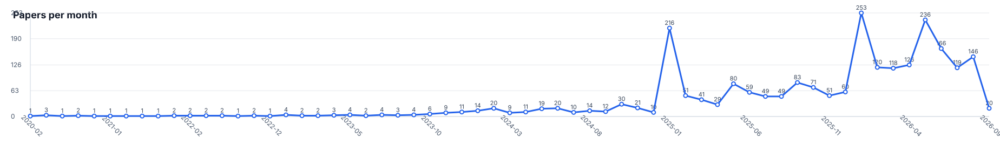

# Steering Activation Paper Arxiv

A broad, additive collector for activation steering and internal-representation control in LLMs, VLMs, diffusion language models, multimodal foundation models, and related language-model systems.



Last updated: 2026-09-04T12:40:27+00:00

Total papers: **2420**

Sources: acl-anthology (500), arxiv (2054), semantic-scholar (1)

## Papers By Year

### 2026

| Date | Paper | Authors | Categories |
| --- | --- | --- | --- |
| 2026-09-03 | [A Circuit for Plural Reference: How LLMs Represent and Retrieve Singular and Plural Entities](https://arxiv.org/abs/2609.03687) / [pdf](https://arxiv.org/pdf/2609.03687) | Anh Danh, Rick Nouwen, Massimo Poesio | cs.CL |
| 2026-09-03 | [Extracting Forgotten Prompts from Targeted Unlearned Models](https://arxiv.org/abs/2609.03662) / [pdf](https://arxiv.org/pdf/2609.03662) | Au Ashley Hoi-Ting, Meghdad Kurmanji, William F. Shen, Nicholas D. Lane, et al. | cs.LG |
| 2026-09-03 | [EraseSAE: Surgical Concept Erasure in Text-to-Video Diffusion Models via Sparse Autoencoders](https://arxiv.org/abs/2609.03629) / [pdf](https://arxiv.org/pdf/2609.03629) | Xinghao Wang, Dong Li, Wei Yu, Yingwei Pan, et al. | cs.AI, cs.CV |
| 2026-09-03 | [Lost in Reordering: Structural Sensitivity of Multilingual LLMs under Semantics-Preserving Perturbations](https://arxiv.org/abs/2609.03511) / [pdf](https://arxiv.org/pdf/2609.03511) | Karthika Nhayakkat, Rajat Verma, Maharaj Brahma, Vetcha Gnana Mahesh, et al. | cs.CL |
| 2026-09-02 | [Large Language Models in Resolving Contextual Knowledge Conflicts](https://arxiv.org/abs/2609.03148) / [pdf](https://arxiv.org/pdf/2609.03148) | Xinye Yang, Zhenyang Liu, Ruisi Li, Yuanyuan Lei | cs.CL |
| 2026-09-02 | [ObserverBench: Testing Mechanistic Estimates for Intervention and Control](https://arxiv.org/abs/2609.03026) / [pdf](https://arxiv.org/pdf/2609.03026) | Vijay Erramilli | cs.AI, cs.LG |
| 2026-09-02 | [When Decodability Is Not Enough: Logical Validity Representations, Behavioral Dissociation, and Causal Tests in Language Models](https://arxiv.org/abs/2609.02438) / [pdf](https://arxiv.org/pdf/2609.02438) | Smitha Muthya Sudheendra, Jaideep Srivastava | cs.CL, cs.LG |
| 2026-09-02 | [What Is Worth Representing? Representational Empowerment for Continual Model Construction](https://arxiv.org/abs/2609.02322) / [pdf](https://arxiv.org/pdf/2609.02322) | Fei Dai, Hanqi Zhou, Alison Gopnik, Charley Wu | cs.AI, cs.LG |
| 2026-09-02 | [Entangled Representations Amplify Collateral Damage in Unlearning](https://arxiv.org/abs/2609.02285) / [pdf](https://arxiv.org/pdf/2609.02285) | Evžen Wybitul, Tim G. J. Rudner, Christian Schroeder de Witt | cs.LG, cs.CL |
| 2026-09-02 | [Selective Knowledge Edit Reversal via Gated Singular Vector Shrinkage](https://arxiv.org/abs/2609.02091) / [pdf](https://arxiv.org/pdf/2609.02091) | Weifeng Jiang, Ruirui Chen, Qianren Mao, Junnan Liu, et al. | cs.CL |
| 2026-09-02 | [IDEEA: training-free Input-Dependent stEEring via Activation cluster matching](https://arxiv.org/abs/2609.02089) / [pdf](https://arxiv.org/pdf/2609.02089) | Zheng Wang, Muchen Li, Renjie Liao, Yan Leng | cs.CL, cs.LG |
| 2026-09-01 | [Sparse Readout Prism: Explaining Logit-Lens Scores in Features Instead of Tokens](https://arxiv.org/abs/2609.01936) / [pdf](https://arxiv.org/pdf/2609.01936) | Matteo He, William F. Shen, Xinchi Qiu, Nicholas D. Lane | cs.CL, cs.AI, cs.LG |
| 2026-09-01 | [GAPS: Dimension-Level Gates for Conditional Activation Steering](https://arxiv.org/abs/2609.01878) / [pdf](https://arxiv.org/pdf/2609.01878) | Moghis Fereidouni, Muhammad Umair Haider, Hassan Sajjad, A. B. Siddique | cs.CL |
| 2026-09-01 | [Hearing the Whispers: Black-Box Membership Inference Attacks on Finetuned TTS Models](https://arxiv.org/abs/2609.01723) / [pdf](https://arxiv.org/pdf/2609.01723) | Kunlin Cai, Kaiyuan Zhang, Zihang Xiang, Jinghuai Zhang, et al. | cs.CR, cs.LG, cs.SD, eess.AS |
| 2026-09-01 | [Gaussian Core LoRA: Distribution-Aware Dynamic Adaptation for Broad Concept Erasure](https://arxiv.org/abs/2609.01433) / [pdf](https://arxiv.org/pdf/2609.01433) | Qinghui Gong, Xunlei Chen, Yu-Xuan Zhang, Hua Meng, et al. | cs.CV |
| 2026-09-01 | [CopyShield: A Cross-Level Benchmark of Copyright Defenses in LLMs](https://arxiv.org/abs/2609.01161) / [pdf](https://arxiv.org/pdf/2609.01161) | Maryam Alshehyari, Dushyant Singh Chauhan, Samuele Poppi, Martin Takac, et al. | cs.LG |
| 2026-09-01 | [StateSwap: Probing Support-Elimination Hidden States in Multiple-Choice Questions](https://arxiv.org/abs/2609.01081) / [pdf](https://arxiv.org/pdf/2609.01081) | Chao Gao, Haijiang Liu, Qiyuan Li, Caicai Guo, et al. | cs.AI, cs.CL |
| 2026-09-01 | [In-Context Neurofeedback: Can LLMs Control Their Internal Representations through Privileged Access?](https://arxiv.org/abs/2609.00904) / [pdf](https://arxiv.org/pdf/2609.00904) | Koshiro Aoki, Ryota Takatsuki, Gouki Minegishi, Yusuke Haruki, et al. | cs.AI |
| 2026-09-01 | [Polished but Unresolved: Identifying Late-Stage Pressure States in Long-Horizon Tool-Use Agents](https://arxiv.org/abs/2609.00823) / [pdf](https://arxiv.org/pdf/2609.00823) | Haoyang Chen, Yi Liu, Jianzhi Shao, Xiaozhou Xu, et al. | cs.AI, cs.CL |
| 2026-09-01 | [RISA: Response Inspection and Selective Actions for Refusal Calibration in Large Language Models](https://arxiv.org/abs/2609.00790) / [pdf](https://arxiv.org/pdf/2609.00790) | Wenhan Chang, Tianqing Zhu, Ping Xiong, Shiyi Liao, et al. | cs.CR |
| 2026-08-31 | [Asymmetries in Spontaneous and Instructed Deception](https://arxiv.org/abs/2609.00180) / [pdf](https://arxiv.org/pdf/2609.00180) | Josiah Luikham | cs.AI |
| 2026-08-31 | [The First Token Is a Clue: Verbalizing Multi-Token Concepts from the J-lens](https://arxiv.org/abs/2608.31084) / [pdf](https://arxiv.org/pdf/2608.31084) | Xijie Gong, Tonghan Wang | cs.CL |
| 2026-08-31 | [Controlling Refusal Behavior of LLMs via Stiefel-Constrained Rotation Steering](https://arxiv.org/abs/2608.30986) / [pdf](https://arxiv.org/pdf/2608.30986) | Kirill Bunin, Dmitry Bylinkin, Vladimir Aletov, Daniil Medyakov, et al. | cs.CL, cs.LG |
| 2026-08-31 | [SingProbe Technical Report](https://arxiv.org/abs/2608.30703) / [pdf](https://arxiv.org/pdf/2608.30703) | Sing Team | cs.AI, cs.CL, cs.CR, cs.LG |
| 2026-08-31 | [MURANO: Design, Run, and Reproduce Mechanistic Interpretability Experiments as Composable Pipelines](https://arxiv.org/abs/2608.30662) / [pdf](https://arxiv.org/pdf/2608.30662) | Alireza Bayat Makou, Emirhan Böge, Phu Gia Hoang, Federico Tiblias, et al. | cs.CL |
| 2026-08-31 | [The Safety Relay in Roleplay Jailbreaks: A Component-Resolved Causal Analysis of Harm Recognition and Refusal](https://arxiv.org/abs/2608.30585) / [pdf](https://arxiv.org/pdf/2608.30585) | Md Mokarram Chowdhury, Ernie Chang, Yang Li | cs.LG |
| 2026-08-31 | [Enhancing Low-Resource Language Reasoning via High-Resource Language Feature Transfer](https://arxiv.org/abs/2608.30462) / [pdf](https://arxiv.org/pdf/2608.30462) | Minju Song, Hyeon Hwang, Junhyun Lee, Jaewoo Kang | cs.AI, cs.CL |
| 2026-08-31 | [Why Are LLM Backdoor Defenses Fragmented? A Feature-Level Explanation with Sparse Autoencoders](https://arxiv.org/abs/2608.30403) / [pdf](https://arxiv.org/pdf/2608.30403) | Yizhe Zeng, Chenxu Niu, Wei Zhang, Hao Huang, et al. | cs.CR |
| 2026-08-31 | [Answer Probing-Guided Search for Diverse Solution Exploration of LLMs](https://arxiv.org/abs/2608.30345) / [pdf](https://arxiv.org/pdf/2608.30345) | Yi Fang, Que Shen, Chengpeng Li, Boyi Deng, et al. | cs.AI |
| 2026-08-31 | [Beyond Token-Level Guidance: Inference-Time Alignment of Specialized LLMs via Cross-Family Representation Steering](https://arxiv.org/abs/2608.30319) / [pdf](https://arxiv.org/pdf/2608.30319) | Jin Gan, Xin Li, Jun Luo | cs.AI, cs.CL, cs.LG |
| 2026-08-31 | [ALTSTEER: Selective Safety Steering for Moving Beyond Hard Refusals to Constructive Alternatives](https://arxiv.org/abs/2608.30197) / [pdf](https://arxiv.org/pdf/2608.30197) | Hoejoon Kwon, Byeonggeuk Lim, Kahyeon Kim, YoungBin Kim | cs.CL, cs.SE |
| 2026-08-30 | [From Detection to Refusal: Safer LLMs via Circuit-Guided Weight Scaling](https://arxiv.org/abs/2609.00051) / [pdf](https://arxiv.org/pdf/2609.00051) | Kuan-Lin Chu, Chung-En Sun, Tsui-Wei Weng | cs.CL, cs.AI, cs.CY |
| 2026-08-30 | [When Safety Speaks a Language: A Mechanistic Analysis of Safety-Language Identity Entanglement in LLMs](https://arxiv.org/abs/2608.29936) / [pdf](https://arxiv.org/pdf/2608.29936) | Apoorva Upadhyaya, Sandipan Sikdar | cs.CL, cs.LG |
| 2026-08-30 | [Hallucination Mitigation for Large Vision-Language Models via Implicit Feature Stabilization](https://arxiv.org/abs/2608.29924) / [pdf](https://arxiv.org/pdf/2608.29924) | Aditi Sarker, Rafi Ibn Sultan, Hui Zhu, Dongxiao Zhu, et al. | cs.AI, cs.CV, cs.LG |
| 2026-08-29 | [Attribute-Based Activation Steering of LLMs for Group-Specific Explanation Generation](https://arxiv.org/abs/2608.29215) / [pdf](https://arxiv.org/pdf/2608.29215) | Leandra Fichtel, Janek Prange, Henning Wachsmuth | cs.CL |
| 2026-08-29 | [Reference-Grafting Matches Fine-Tuning at Eliciting Sandbagged Capabilities](https://arxiv.org/abs/2608.29458) / [pdf](https://arxiv.org/pdf/2608.29458) | Linh Le, Hong Kiat Tan, David Williams-King | cs.AI, cs.LG |
| 2026-08-29 | [Evaluating the Semantic Specificity of Representation Steering in Language Models](https://arxiv.org/abs/2608.29431) / [pdf](https://arxiv.org/pdf/2608.29431) | Zhangdie Yuan, Andreas Vlachos | cs.CL |
| 2026-08-29 | [Recognition-Refusal Misalignment in LLMs: Why Models Answer Structurally Unanswerable Questions](https://arxiv.org/abs/2608.29109) / [pdf](https://arxiv.org/pdf/2608.29109) | Yucheng Du, Xiyang Hu | cs.CL |
| 2026-08-29 | [Selective Disclosure of Hidden Directives in Reasoning Models: Behavioral Asymmetry and Steering](https://arxiv.org/abs/2608.29070) / [pdf](https://arxiv.org/pdf/2608.29070) | Zimo Shi, Xander Tifft, Wen Xing | cs.LG |
| 2026-08-29 | [A Unifying Perspective on Language Model Representations: From Filler-Role Structure to Mechanistic Interpretability](https://arxiv.org/abs/2608.29034) / [pdf](https://arxiv.org/pdf/2608.29034) | Zhang Enyan, R. Thomas McCoy | cs.AI, cs.CL |
| 2026-08-28 | [MERIT: Mitigating Exposure Bias in Generative XMC for User-Interest Propensity Modeling](https://arxiv.org/abs/2608.28931) / [pdf](https://arxiv.org/pdf/2608.28931) | Abhinav Mahajan, Arindam Sarkar, Prakash Mandayam Comar | cs.IR, cs.LG |
| 2026-08-28 | [Causal Interventions Reveal Typologically Organized Syntactic Mechanisms in Multilingual Language Models](https://arxiv.org/abs/2608.28924) / [pdf](https://arxiv.org/pdf/2608.28924) | Sasha Boguraev, Toshiki Nakai, Kyle Mahowald, Julius Steuer | cs.CL |
| 2026-08-28 | [Enhancing SAE-based Steering via Neighbor Integrated Feature Selection](https://arxiv.org/abs/2608.28806) / [pdf](https://arxiv.org/pdf/2608.28806) | Yutian Liu, Xu Wang, Difan Zou | cs.AI |
| 2026-08-28 | [AIM: Anchor Identity Features, Then Match for Multimodal Large Language Model Unlearning](https://arxiv.org/abs/2608.28312) / [pdf](https://arxiv.org/pdf/2608.28312) | Wonjun Lee, Jaehyuk Jang, Kangwook Ko, Hee-Seon Kim, et al. | cs.CL, cs.CV |
| 2026-08-28 | [REINS: Refusal-Enhanced Inhibitory Steering with Sparse Autoencoder Features](https://arxiv.org/abs/2608.28233) / [pdf](https://arxiv.org/pdf/2608.28233) | Kai-Xuan Ding, Hao-Xiang Xu, Ji-Hua Peng, Zi-Qi Chen, et al. | cs.AI |
| 2026-08-28 | [PersonaEdit: Representative Sample Selection for Personalized Model Editing](https://arxiv.org/abs/2608.27816) / [pdf](https://arxiv.org/pdf/2608.27816) | You-Mei Huang, Chung-Chi Chen, An-Zi Yen | cs.CL |
| 2026-08-27 | [Load-Bearing Context: The Question Damage Score for Evaluating Context Reliance in Linguistic Reasoning](https://arxiv.org/abs/2608.27756) / [pdf](https://arxiv.org/pdf/2608.27756) | Neh Majmudar, Elena Filatova | cs.CL |
| 2026-08-27 | [Circuit Discovery Helps Detect LLM Jailbreaking: A Mechanistic Interpretability Study](https://arxiv.org/abs/2608.27504) / [pdf](https://arxiv.org/pdf/2608.27504) | Paria Mehrbod, Boris Knyazev, Guy Wolf, Eugene Belilovsky, et al. | cs.CR |
| 2026-08-27 | [Making Clinical Language Models Auditable: Concept-Guided Fine-Tuning for Robust Prediction](https://arxiv.org/abs/2608.27397) / [pdf](https://arxiv.org/pdf/2608.27397) | Jin Mu, Guanhua Chen | cs.CL, cs.AI |
| 2026-08-27 | [SCIT: Testing Causal Cache Carriers in Latent Chain-of-Thought Models](https://arxiv.org/abs/2608.27265) / [pdf](https://arxiv.org/pdf/2608.27265) | Yi Ding, Lijun Huang, Menglin Yang | cs.CL |
| 2026-08-27 | [Cross-Lingual Alignment Without Joint Training: Do Monolingual Language Models Converge on Universal Representations?](https://arxiv.org/abs/2608.27115) / [pdf](https://arxiv.org/pdf/2608.27115) | Ej Zhou, Suchir Salhan, Catherine Arnett, Anna Korhonen | cs.CL |
| 2026-08-27 | [Planting a Latent Variable in Natural-Looking Text: a More Realistic Test of Belief States in LLMs and Their Link to Concept Geometry](https://arxiv.org/abs/2608.26887) / [pdf](https://arxiv.org/pdf/2608.26887) | Alexandru-Iulius Jerpelea | cs.CL |
| 2026-08-26 | [Refusal geometry reflects refusal training: diverse refusal prefixes can raise stable rank and weaken refusal vector ablation attacks](https://arxiv.org/abs/2608.25390) / [pdf](https://arxiv.org/pdf/2608.25390) | Andrey Labunets | cs.LG, cs.AI, cs.CR |
| 2026-08-26 | [Interpreting Latent Protein Language Model Features with Geometric Annotations](https://arxiv.org/abs/2608.26419) / [pdf](https://arxiv.org/pdf/2608.26419) | Siddharth Setlur, Djordje Mihajlovic, Darrick Lee | cs.LG, q-bio.QM |
| 2026-08-26 | [Cross-lingual Representation Learning via Centroid Intervention Fusion](https://arxiv.org/abs/2608.26357) / [pdf](https://arxiv.org/pdf/2608.26357) | Wei Sun, Marie-Francine Moens | cs.CL |
| 2026-08-26 | [Finding and using interpretable latents in a neutrino foundation model with sparse autoencoders](https://arxiv.org/abs/2608.26090) / [pdf](https://arxiv.org/pdf/2608.26090) | Raphaël Bonnet-Guerrini, Johann Ioannou-Nikolaides, Inar Timiryasov, Vincenzo Piuri | astro-ph.HE, cs.AI, cs.LG, hep-ex |
| 2026-08-26 | [When Pruning Meets Interpretability: Preserving Sparse Autoencoder Robustness in LLMs](https://arxiv.org/abs/2608.25941) / [pdf](https://arxiv.org/pdf/2608.25941) | Suchit Gupte, Xueru Zhang, Mohammad Mahdi Khalili | cs.LG |
| 2026-08-26 | [When RAG Fails to Equalize: Geo-bias in Factual Question Answering over Public Companies](https://arxiv.org/abs/2608.25717) / [pdf](https://arxiv.org/pdf/2608.25717) | Abhinav Havaldar, Enrico Santus | cs.AI, cs.CL |
| 2026-08-26 | [LMSM: LLM Security Framework Inspired by Linux Security Modules](https://arxiv.org/abs/2608.25697) / [pdf](https://arxiv.org/pdf/2608.25697) | XiuYu Zhang, Bonan Ruan, Junfeng Fang, An Zhang, et al. | cs.CR |
| 2026-08-26 | [Controllable Affective Generation via Latent Vector Steering](https://arxiv.org/abs/2608.25569) / [pdf](https://arxiv.org/pdf/2608.25569) | Xixian Yong, Siyuan Chang, Yingying Zhang, Xian Wu, et al. | cs.AI, cs.CL |
| 2026-08-26 | [Reflection Steering: Disentangling Reflection from Reasoning in Activation Space for Token-Efficient Inference](https://arxiv.org/abs/2608.25542) / [pdf](https://arxiv.org/pdf/2608.25542) | Jiarui Hu, Zhiyuan Wen, Xiaoyun Liu, Jiaxing Shen, et al. | cs.CL, cs.LG |
| 2026-08-26 | [MMJailBench: A Factorized Benchmark for Disentangling Multimodal Jailbreak Vulnerabilities](https://arxiv.org/abs/2608.25490) / [pdf](https://arxiv.org/pdf/2608.25490) | Tianshi Wang, Jingsong Wang, Yafei Huang, Fengling Li, et al. | cs.AI, cs.CR, cs.MM |
| 2026-08-25 | [Tunable Tool-Call Rates in LLM Agents via Representation Steering](https://arxiv.org/abs/2608.25198) / [pdf](https://arxiv.org/pdf/2608.25198) | Yuqi Chen, Vincent Siu, Yang Liu, Dawn Song, et al. | cs.AI |
| 2026-08-25 | [Does Fine-Tuning Undo Activation Steering? Behavioural Recovery Without Weight-Edit Reversal](https://arxiv.org/abs/2608.24988) / [pdf](https://arxiv.org/pdf/2608.24988) | Philipp E. Glass, Allan Tucker, Yongmin Li, Alina Miron | cs.AI, cs.CL, cs.LG |
| 2026-08-25 | [Can We Read the Mind of an Audio LLM? A Verbalizable, Multilingual Middle-Layer Workspace](https://arxiv.org/abs/2608.24958) / [pdf](https://arxiv.org/pdf/2608.24958) | Jiajun Fan, Jingyuan Li, Prashanth Gurunath Shivakumar, Qi Luo, et al. | cs.AI, cs.CL, cs.SD |
| 2026-08-25 | [SteerCheck: Attribution Specificity and Alignment Leakage in Activation-Steering Audits](https://arxiv.org/abs/2608.24335) / [pdf](https://arxiv.org/pdf/2608.24335) | Daming Luo, Christy Liang, Junyu Xuan | cs.CL |
| 2026-08-24 | [Semantic Overlays: Mitigating Prompt Injection with Annotations Beyond Tokens and Steering Vectors](https://arxiv.org/abs/2608.23873) / [pdf](https://arxiv.org/pdf/2608.23873) | Joshua Penman | cs.AI, cs.CL, cs.CR, cs.LG |
| 2026-08-24 | [Gated Activation Steering for Reducing Sycophancy & Hallucination in Medical Question Answering](https://arxiv.org/abs/2608.23666) / [pdf](https://arxiv.org/pdf/2608.23666) | Himanshu Tripathi, Subash Neupane, Shaswata Mitra, Sudip Mittal, et al. | cs.AI, cs.CL |
| 2026-08-24 | [ST$^2$U: Stateful Test-Time Unlearning via Restricted Knowledge Boundary Control](https://arxiv.org/abs/2608.23034) / [pdf](https://arxiv.org/pdf/2608.23034) | Xunlei Chen, Qinghui Gong, Ruini Xue, Yaodong Hu, et al. | cs.CL, cs.LG |
| 2026-08-24 | [Unlearning Is Not Just Erasing: Temporal Decoupling via Generation Inequality](https://arxiv.org/abs/2608.23020) / [pdf](https://arxiv.org/pdf/2608.23020) | Xunlei Chen, Qirui Ye, Yuang Li, Yi Gong, et al. | cs.CL, cs.AI |
| 2026-08-24 | [What Does Activation Steering Control? Attribution Across Answer Encodings and Output-Sensitive Subspaces](https://arxiv.org/abs/2608.22985) / [pdf](https://arxiv.org/pdf/2608.22985) | Zhiwei Gao, Shaowen Peng, Shoko Wakamiya, Eiji Aramaki | cs.CL |
| 2026-08-24 | [Knowing Isn't Always Saying: When Do Spatial Encodings Reach Answers in Vision-Language Models?](https://arxiv.org/abs/2608.22916) / [pdf](https://arxiv.org/pdf/2608.22916) | Zeyu Wang, Xinming Xu | cs.CL |
| 2026-08-24 | [FOVEA: Focused On-Demand Visual Evidence Adaptation for Cache-Friendly Multimodal Speculative Decoding](https://arxiv.org/abs/2608.22883) / [pdf](https://arxiv.org/pdf/2608.22883) | Hengjie Zhu, Dayan Wu, Zihao Zhang, Xinze Liu, et al. | cs.CV |
| 2026-08-23 | [What AstroPT knows about galaxies, and what that can teach us about LLMs](https://arxiv.org/abs/2608.22614) / [pdf](https://arxiv.org/pdf/2608.22614) | UniverseTBD, :, Kshitij Duraphe, Aman Kumar, et al. | cs.LG, astro-ph.IM |
| 2026-08-23 | [Analyzing and Mitigating Cross-Lingual Degradation in Multilingual Medical VQA](https://arxiv.org/abs/2608.22363) / [pdf](https://arxiv.org/pdf/2608.22363) | Jingbo Wang, Sendong Zhao, Haochun Wang, Bing Qin, et al. | cs.AI |
| 2026-08-23 | [Where Cognition Lives: Dissecting Emergent from Computed Function in a Minimal Complete Cognitive Architecture](https://arxiv.org/abs/2608.22347) / [pdf](https://arxiv.org/pdf/2608.22347) | Francisco M. Arrabal-Campos, Francisco G. Montoya, Alfredo Alcayde, Ignacio Fernández | cs.AI, cs.CL, cs.LG |
| 2026-08-23 | [Mechanistic Interpretability of Chain-of-Thought Reasoning via Sequential Activation Patching](https://arxiv.org/abs/2608.22332) / [pdf](https://arxiv.org/pdf/2608.22332) | Murat Dura, Serkan Öztürk, Selma Tekir | cs.CL |
| 2026-08-22 | [Align, Unify, Suppress, Route: A Coherentist View of Transformer Computation](https://arxiv.org/abs/2608.22034) / [pdf](https://arxiv.org/pdf/2608.22034) | Nura Aljaafari, Andre Freitas | cs.CL |
| 2026-08-22 | [The Communication Map of a Transformer](https://arxiv.org/abs/2608.22007) / [pdf](https://arxiv.org/pdf/2608.22007) | Richard Zhe Wang | cs.LG, cs.CL |
| 2026-08-21 | [Measuring Activation Control in Large Language Models](https://arxiv.org/abs/2608.21664) / [pdf](https://arxiv.org/pdf/2608.21664) | Marek Mateusz Kowalski, Joshua Fonseca Rivera, Uzay Macar, David Demitri Africa | cs.AI, cs.CL |
| 2026-08-21 | [Let Credit Follow Computation: Architecture-Aware Credit Transport for Large Language Model Reinforcement Learning](https://arxiv.org/abs/2608.21501) / [pdf](https://arxiv.org/pdf/2608.21501) | Qifan Shi, Zhaolu Kang, Chenghua Zhu | cs.AI |
| 2026-08-21 | [RARE: Decoupling Representation Steering from Expert Routing in Mixture-of-Experts Language Models](https://arxiv.org/abs/2608.21236) / [pdf](https://arxiv.org/pdf/2608.21236) | Zhibo Zhang, Zhen Ouyang, Ling Shi, Kailong Wang | cs.CL |
| 2026-08-21 | [CARD: Diagnosing Belief to Action Routing Failures in Vision Language Models](https://arxiv.org/abs/2608.20763) / [pdf](https://arxiv.org/pdf/2608.20763) | Souptik Kumar Majumdar, Fabian Kögel, Andreas Bulling | cs.AI, cs.CV |
| 2026-08-19 | [UMER: Unifying Embedding and Ranking via Pair-Aware Discriminative Reasoning for Universal Multimodal Retrieval](https://arxiv.org/abs/2608.18504) / [pdf](https://arxiv.org/pdf/2608.18504) | Libiao Chen, Xiyang Liu, Yanheng Wei, Tao Wang, et al. | cs.AI |
| 2026-08-19 | [Shared Circuits for Shared Grammar: Tracing Subject-Verb Agreement Across Languages](https://arxiv.org/abs/2608.18545) / [pdf](https://arxiv.org/pdf/2608.18545) | Isabella Gidi, Antonio Almudévar, Core Francisco Park, Naomi Saphra, et al. | cs.CL |
| 2026-08-19 | [Mechanistic Interpretability of Structure-Aware Numerical Reasoning in LLaMA 3.1 8B](https://arxiv.org/abs/2608.18419) / [pdf](https://arxiv.org/pdf/2608.18419) | Rahul Chowdhury, Timothy A Rupprecht, Senhao Cao, Jiahao Liu, et al. | cs.AI, cs.LG |
| 2026-08-18 | [Encoded but Not Actionable: Auditing the Decode-Generate-Steer Gap in Frozen LLMs for Geometric Constraints](https://arxiv.org/abs/2608.17843) / [pdf](https://arxiv.org/pdf/2608.17843) | Man Liang, Xinzhao Cheng, Faizan Wajid | cs.AI, cs.CL |
| 2026-08-18 | [Toward the Optimal Regret-Instability Trade-off in Multi-Armed Bandits](https://arxiv.org/abs/2608.17841) / [pdf](https://arxiv.org/pdf/2608.17841) | Kaifei Wang, Yinyu Ye, Han Zhong | stat.ML, cs.LG, math.OC, math.ST |
| 2026-08-18 | [The Model's Tell: Measuring Context-Leakage Attack Signals with Behavior Gauges](https://arxiv.org/abs/2608.17829) / [pdf](https://arxiv.org/pdf/2608.17829) | Maosen Zhang, Jianshuo Dong, Boting Lu, Wenyue Li, et al. | cs.AI, cs.CR |
| 2026-08-18 | [TINA+: Probing Residual Visual Knowledge in Unlearned Diffusion Models via Diffusion-Consistent Text-Free Inversion](https://arxiv.org/abs/2608.17747) / [pdf](https://arxiv.org/pdf/2608.17747) | Qianlong Xiang, Miao Zhang, Kun Wang, Haoyu Zhang, et al. | cs.CV |
| 2026-08-17 | [Does the LM Head Create a Harmful Gradient Bottleneck? A Causal Test](https://arxiv.org/abs/2608.16671) / [pdf](https://arxiv.org/pdf/2608.16671) | Anand Murugan | cs.CL |
| 2026-08-17 | [PCA-guided Activation Scaling for Monotonic Bidirectional Control over LLM Sycophancy](https://arxiv.org/abs/2608.16650) / [pdf](https://arxiv.org/pdf/2608.16650) | Zheng Chen, Zhaoxin Feng, Yip Tin Po, Jianfei Ma, et al. | cs.CL |
| 2026-08-17 | [BabelSteering: Multilingual Safety Alignment via English Steering Vectors](https://arxiv.org/abs/2608.16577) / [pdf](https://arxiv.org/pdf/2608.16577) | Emma V. Stein, Dominik Meier, Terry Ruas, Jan Philip Wahle, et al. | cs.CL |
| 2026-08-17 | [Architecture-Dependent Causal Transfer of Activation States Across Large Language Models](https://arxiv.org/abs/2608.16347) / [pdf](https://arxiv.org/pdf/2608.16347) | Fernando Cardenas Piepereit | cs.CL, cs.LG |
| 2026-08-16 | [How Language Models Choose Sides: Internal Representations of Instruction Hierarchy](https://arxiv.org/abs/2608.28648) / [pdf](https://arxiv.org/pdf/2608.28648) | Enrique Balp-Straffon, Chih-Hao Hsu, Rushiraj Gadhvi, Sunishchal Dev, et al. | cs.AI, cs.CL, cs.LG |
| 2026-08-16 | [A Pre-Specified Construction-Confirmation Test of Operation-Level Causal Transfer Across Finite Isomorphic Symbolic Domains](https://arxiv.org/abs/2608.15809) / [pdf](https://arxiv.org/pdf/2608.15809) | Xinyi Shan | cs.LG |
| 2026-08-16 | [Broken Symmetry in LLM Refusal: Answer Release Is More Local Than Refusal Restoration](https://arxiv.org/abs/2608.15772) / [pdf](https://arxiv.org/pdf/2608.15772) | Yiqi Liu, Yang Wang, Songxin Wang, Chenghao Xiao, et al. | cs.AI |
| 2026-08-16 | [THESIS-MoE: Trainable Hierarchical Extraction and SteerIng of Sycophancy in Mixture-of-Experts](https://arxiv.org/abs/2608.15687) / [pdf](https://arxiv.org/pdf/2608.15687) | Kareem Hassani, Chaymaa Abbas, Lama Mawlawi, Mariette Awad | cs.AI |
| 2026-08-15 | [TEA: Text Encoder Alignment for Robust Concept Erasure in Text-to-Image Models](https://arxiv.org/abs/2608.15341) / [pdf](https://arxiv.org/pdf/2608.15341) | Alireza Dehghanpour Farashah, Zhuan Shi, Negar Rostamzadeh, Golnoosh Farnadi | cs.CV |
| 2026-08-15 | [Remember Smarter: Visual History Compressor and Hyperbolic Experience Space for Robotic Memory](https://arxiv.org/abs/2608.15269) / [pdf](https://arxiv.org/pdf/2608.15269) | Dai Zhou, Jiexi Yan, Tong Li, Yuxuan Wang, et al. | cs.RO |
| 2026-08-14 | [SpIn-ViT: Designing a Sparsity-Induced Vision Transformer That Is Mechanistically Interpretable](https://arxiv.org/abs/2608.14922) / [pdf](https://arxiv.org/pdf/2608.14922) | Philip H. Lee, Parth Padalkar | cs.AI, cs.CV |
| 2026-08-14 | [Interpretable Cross-Lingual Alignment in Small Language Models: Probing Cultural and Pragmatic Reasoning in Japanese-English Bilingual LLMs](https://arxiv.org/abs/2608.14896) / [pdf](https://arxiv.org/pdf/2608.14896) | Florian Braun | cs.CL, cs.LG |
| 2026-08-14 | [KHiM-Mamba: Injecting Pathology Knowledge into Mamba via Hidden-State Modulation for Whole Slide Image Analysis](https://arxiv.org/abs/2608.14757) / [pdf](https://arxiv.org/pdf/2608.14757) | Qixiang Zhang, Yi Li, Tianqi Xiang, Haonan Wang, et al. | cs.CV, eess.IV, q-bio.QM |
| 2026-08-14 | [The More Popular, The Harder to Forget: Adaptive Popularity for LLM Unlearning](https://arxiv.org/abs/2608.14229) / [pdf](https://arxiv.org/pdf/2608.14229) | Anna Borisiuk, Andrey Savchenko, Alexander Panchenko, Elena Tutubalina | cs.CL |
| 2026-08-13 | [Dual-Stream Cross-Anchor Correction Grounding Long-Form Captions and the Domain Limits of Object-Level Anchors](https://arxiv.org/abs/2608.12746) / [pdf](https://arxiv.org/pdf/2608.12746) | Lingkai Bu, Qian Gao, Jun Fan, Guohui Ding, et al. | cs.CL, cs.CV |
| 2026-08-13 | [SAEVerbalizer: Generating Explanations for Sparse Autoencoder Features via Representation Verbalization](https://arxiv.org/abs/2608.13538) / [pdf](https://arxiv.org/pdf/2608.13538) | Weihan Meng, Hongzhu Guo, Yi Jing, Dewen Liu, et al. | cs.CL |
| 2026-08-13 | [Predictive Memory Localization: Forecasting Selective Intervention Paths from Internal Signals](https://arxiv.org/abs/2608.12892) / [pdf](https://arxiv.org/pdf/2608.12892) | Jinhao Jing, Tian Zeyu, Lucas Qingyang Fang, Zhisheng Chen, et al. | cs.AI |
| 2026-08-13 | [TRAPSBench: Vision-Language Models Encode but Fail to Express Epistemic Restraint](https://arxiv.org/abs/2608.13167) / [pdf](https://arxiv.org/pdf/2608.13167) | Fnu Pramono, John Cai, Sourabh Kulkarni | cs.AI, cs.CL, cs.CV, cs.LG |
| 2026-08-13 | [Semantic Steering for Controllable Generation: Tuning-Free Concept Erasure in Multimodal Diffusion Transformers](https://arxiv.org/abs/2608.12829) / [pdf](https://arxiv.org/pdf/2608.12829) | Qiao Li, Xiaomeng Fu, Yuanshu Zhao, Qipeng Wang, et al. | cs.CV |
| 2026-08-13 | [Erase but Preserve: Controllable Removal of Copyrighted Animation Characters via Optimized Semantic Anchors](https://arxiv.org/abs/2608.12806) / [pdf](https://arxiv.org/pdf/2608.12806) | Qiao Li, Xiaomeng Fu, Wangjia Yu, Runze He, et al. | cs.CV, cs.AI |
| 2026-08-13 | [Perturbation-based Regional Interpretability through Subtraction Mapping (PRISM): naming-error dissociations in language models and post-stroke aphasia](https://arxiv.org/abs/2608.12717) / [pdf](https://arxiv.org/pdf/2608.12717) | Xiang Guan, Roger D. Newman-Norlund, Yong Yang, Saeed Ahmadi, et al. | cs.LG, cs.CL |
| 2026-08-11 | [Sona Technical Report](https://arxiv.org/abs/2608.11015) / [pdf](https://arxiv.org/pdf/2608.11015) | Sona Team, Alexandr Udeneev, Aleksei Krasilnikov, Alexey Nadtochiy, et al. | cs.IR |
| 2026-08-11 | [Beyond a Bag of Features: Set-Level Instability in Sparse Autoencoders](https://arxiv.org/abs/2608.11197) / [pdf](https://arxiv.org/pdf/2608.11197) | Nikolai Bolik, Lennart Stöpler, Artur Andrzejak | cs.CL, cs.LG |
| 2026-08-11 | [Data Attribution of Emergent Misalignment with Persona Features](https://arxiv.org/abs/2608.11025) / [pdf](https://arxiv.org/pdf/2608.11025) | Clemens Vetter, David Kaczér, Lucie Flek, Florian Mai | cs.CL |
| 2026-08-11 | [PEAK: Precise and Persistent Concept Erasure via k-Sparse Autoencoders](https://arxiv.org/abs/2608.10985) / [pdf](https://arxiv.org/pdf/2608.10985) | Man Jiang, Ouxiang Li, Weibao Xue, Zhenhua Tang, et al. | cs.CV |
| 2026-08-11 | [UniProbe: A Learnable Token-Level Hallucination Detector for Large VLMs using Multi-Structural Internal Representations](https://arxiv.org/abs/2608.10835) / [pdf](https://arxiv.org/pdf/2608.10835) | Dvir Samuel, Guy Bar-Shalom, Fabrizio Frasca, Ethan Fetaya, et al. | cs.CV, cs.LG |
| 2026-08-11 | [Measuring Semantic Abstractness of SAE Features via Nonlocality](https://arxiv.org/abs/2608.10537) / [pdf](https://arxiv.org/pdf/2608.10537) | Chuqiao Lin, Shivaji Sondhi, Xiao-Liang Qi | cs.AI, cs.LG |
| 2026-08-11 | [Actionable Hallucination Detection: Translating Latent Uncertainty into Agentic Critique](https://arxiv.org/abs/2608.10430) / [pdf](https://arxiv.org/pdf/2608.10430) | Sanidhya Vijayvargiya, Rahul Lokesh | cs.AI, cs.LG |
| 2026-08-10 | [Emotion2Skill: Model-Internal Emotion Signals for Adaptive Skill Selection and Evolution](https://arxiv.org/abs/2608.09248) / [pdf](https://arxiv.org/pdf/2608.09248) | Bohan Lin, Hejia Geng, Xinyi Xie, Heng Zhou, et al. | cs.AI |
| 2026-08-10 | [Interpreting Language Model Hidden States at Scale](https://arxiv.org/abs/2608.10260) / [pdf](https://arxiv.org/pdf/2608.10260) | Jordan Pettyjohn, Mansi Sakarvadia, Nathaniel Hudson, Daniel McKenzie, et al. | cs.AI |
| 2026-08-10 | [Post-Hoc Sparse Coding of Latent Communication Between Vision-Language Model Agents](https://arxiv.org/abs/2608.10198) / [pdf](https://arxiv.org/pdf/2608.10198) | Di Wu, Xiaohui Zhu | cs.AI |
| 2026-08-10 | [Multimodal Model Diffing for Feature Discovery and Control](https://arxiv.org/abs/2608.09928) / [pdf](https://arxiv.org/pdf/2608.09928) | Hunar Batra, Lachin Naghashyar, Ashkan Khakzar, Philip Torr, et al. | cs.AI, cs.CL, cs.CV, cs.LG |
| 2026-08-10 | [Avalon-ToM-Bench: Evaluating Fine-Grained Theory of Mind via Asymmetric Game Mechanics](https://arxiv.org/abs/2608.09638) / [pdf](https://arxiv.org/pdf/2608.09638) | Yen-Shan Chen, Yu Chian Duan, Chih-En Kuo, Jian-Bin Wu, et al. | cs.AI, cs.CL, cs.CY, cs.GT |
| 2026-08-10 | [Beyond Global Editing: Per-Instance Disentangled Subspaces for Training-Free Hallucination Mitigation in LVLMs](https://arxiv.org/abs/2608.09344) / [pdf](https://arxiv.org/pdf/2608.09344) | Ali Cheraghian, Hamidreza Dastmalchi, Hamed Barzamini, Morteza Saberi, et al. | cs.CV |
| 2026-08-10 | [DH-VLM: Dual-Horizon Cooperative Latent Reasoning for Autonomous Driving](https://arxiv.org/abs/2608.09333) / [pdf](https://arxiv.org/pdf/2608.09333) | Ziyi Song, Chen Xia, Hang Yu, Sheng Zhou, et al. | cs.RO |
| 2026-08-10 | [Label-Free Parkinson's Disease Screening from Face and Voice through Mechanistic Interpretability](https://arxiv.org/abs/2608.08976) / [pdf](https://arxiv.org/pdf/2608.08976) | Jiaheng Su, Yu Sun | cs.LG |
| 2026-08-09 | [Deployable Per-Instance Multi-Layer Activation Steering for Large Language Models](https://arxiv.org/abs/2608.08829) / [pdf](https://arxiv.org/pdf/2608.08829) | Muhammad Faishal Adly Nelwan, Alfan Farizki Wicaksono | cs.AI, cs.CL |
| 2026-08-09 | [Steering dense music retrieval with open-vocabulary concept discovery](https://arxiv.org/abs/2608.08757) / [pdf](https://arxiv.org/pdf/2608.08757) | Julien Guinot, Alain Riou, Elio Quinton, György Fazekas | cs.SD, eess.AS |
| 2026-08-09 | [Reproducing and Stress-Testing Two Approaches to LLM Reasoning Reliability: Test-Time Probability Aggregation and Logic-Representation Editing](https://arxiv.org/abs/2608.08514) / [pdf](https://arxiv.org/pdf/2608.08514) | Minhan Cho, Jimin Kweon | cs.AI, cs.CL, cs.LG |
| 2026-08-09 | [Safety Cost of Steering Vectors Is Separable and Reducible](https://arxiv.org/abs/2608.08383) / [pdf](https://arxiv.org/pdf/2608.08383) | Yuxiao Li, Gjergji Kasneci | cs.CL, cs.LG |
| 2026-08-08 | [SportsGrounder: Proposal-Aided Interleaved Grounding for Dense Sports Video Reasoning](https://arxiv.org/abs/2608.07932) / [pdf](https://arxiv.org/pdf/2608.07932) | Yizhi Li, Jiawei Jiang, Guanhong Wang, Yingcai Wu, et al. | cs.CV |
| 2026-08-08 | ["Many Are My Names": The Anatomy of the Assistant and Its Personas via Sparse Autoencoders](https://arxiv.org/abs/2608.07852) / [pdf](https://arxiv.org/pdf/2608.07852) | Adelaide Danilov, Aria Nourbakhsh, Oleksandr Marchenko Breneur, Salima Lamsiyah | cs.CL |
| 2026-08-08 | [Archer: Adaptive Reuse of Cached Hidden States for Efficient Rollback in Diffusion Language Models](https://arxiv.org/abs/2608.08086) / [pdf](https://arxiv.org/pdf/2608.08086) | Xuning He, Zinan Sheng, Yongding Tao, Huanyu Liu, et al. | cs.CL |
| 2026-08-08 | [Fair on the Surface? Benchmarking Hidden-Output Fairness Gaps in LLM Recommenders](https://arxiv.org/abs/2608.08284) / [pdf](https://arxiv.org/pdf/2608.08284) | Chan Aristella Lu, Arya Fayyazi, Junhao Zhang, Saeid Shokoufa, et al. | cs.AI |
| 2026-08-08 | [Thinking vs. NoThinking: Towards Interpreting Reasoning Mechanisms of Large Language Models via Sparse Autoencoders](https://arxiv.org/abs/2608.08168) / [pdf](https://arxiv.org/pdf/2608.08168) | Bo Cheng, Qiaolin Lu, Yi Chang, Yuan Wu | cs.CL |
| 2026-08-08 | [Wiener Representation Filtering for VLM Hallucination Suppression](https://arxiv.org/abs/2608.08167) / [pdf](https://arxiv.org/pdf/2608.08167) | Ameen Ali, Tamim Zoabi, Lidor Brami, Lior Wolf | cs.CV, cs.LG |
| 2026-08-08 | [When Is a Steerable Concept Representation Real? Measurement Confounds in a Cross-Family Audit of Neuroscience Parallels in LLMs](https://arxiv.org/abs/2608.08159) / [pdf](https://arxiv.org/pdf/2608.08159) | Yuqi Wu, Shengming Zhao, Jie Chen | cs.AI |
| 2026-08-07 | [FlowErase-OPD: Multi-Concept Erasure via Anchored On-Policy Distillation in Flow Matching Models](https://arxiv.org/abs/2608.07620) / [pdf](https://arxiv.org/pdf/2608.07620) | Yi Sun, Yimin Zhou, Xinhao Zhong, Zhiqi Zhang, et al. | cs.CV |
| 2026-08-06 | [Scaling Inherently Interpretable Language Models](https://arxiv.org/abs/2608.07594) / [pdf](https://arxiv.org/pdf/2608.07594) | Guide Labs Team, Andreas Madsen, Aya Abdelsalam Ismail, Giang Nguyen, et al. | cs.AI, cs.CL |
| 2026-08-06 | [MI-MIDI: Mechanistic Interpretability of Text-to-MIDI Generation Models via Probing, Lenses and Steering](https://arxiv.org/abs/2608.06638) / [pdf](https://arxiv.org/pdf/2608.06638) | Jakub Poćwiardowski, Mateusz Modrzejewski | cs.AI, cs.SD |
| 2026-08-06 | [EmoWorld: A Decoupled Affective Field for Controllable Emotional Video Generation](https://arxiv.org/abs/2608.06231) / [pdf](https://arxiv.org/pdf/2608.06231) | Bingyuan Wang, Baistan Zhyldyzbekov, Kunyu Feng, Zeyu Wang | cs.CV |
| 2026-08-06 | [Adaptive-WAM: Quality-Guided Early-Exit Planning from Intermediate Video-Diffusion Features](https://arxiv.org/abs/2608.06008) / [pdf](https://arxiv.org/pdf/2608.06008) | Sining Ang, Yuguang Yang, Yan Wang | cs.RO |
| 2026-08-06 | [Subliminal Learning is Non-Semantic Distillation](https://arxiv.org/abs/2608.05734) / [pdf](https://arxiv.org/pdf/2608.05734) | Ethan Hadley, Eren Gultepe | cs.AI |
| 2026-08-06 | [CircuitSteer: Geometrically Aligned Multi-Layer Steering via Sparse Autoencoder Circuits](https://arxiv.org/abs/2608.05732) / [pdf](https://arxiv.org/pdf/2608.05732) | Mehrshad Saadatinia, Parsa Razmara, Ardalan Aryashad, Ali Abbasi, et al. | cs.LG |
| 2026-08-05 | [Latent Fact-Checking: Detecting Misinformation through Activation Engineering](https://arxiv.org/abs/2608.06417) / [pdf](https://arxiv.org/pdf/2608.06417) | Pedro T. Barcelos, Otávio Parraga, Marcelo M. Mussi, Lucas M. Fraga, et al. | cs.CL, cs.LG |
| 2026-08-05 | [Strengthening Target-Language Features: SAE-Based Steering for Multilingual Inference](https://arxiv.org/abs/2608.04904) / [pdf](https://arxiv.org/pdf/2608.04904) | Hongsheng Wang, Philipp Koehn | cs.CL |
| 2026-08-05 | [Gradient Immunity: Null-Space Resistance to Malicious Fine-Tuning](https://arxiv.org/abs/2608.05045) / [pdf](https://arxiv.org/pdf/2608.05045) | Yuxuan Huang, Xingyu Zeng, Tianhang Zheng, Chaochao Lu | cs.AI, cs.CL, cs.CR |
| 2026-08-05 | [A Model Merging Approach for Continual MLLM Unlearning](https://arxiv.org/abs/2608.04548) / [pdf](https://arxiv.org/pdf/2608.04548) | Yuhang Wang, Linlin Zhang, Haoxuan Ji, Xianmin Ye, et al. | cs.LG, cs.AI |
| 2026-08-05 | [Helping Music Co-Creation Agents 'Listen' Well: Hierarchical Self-Supervised World Models for Understanding and Generation](https://arxiv.org/abs/2608.04378) / [pdf](https://arxiv.org/pdf/2608.04378) | Scott H. Hawley | cs.LG, cs.SD, eess.AS |
| 2026-08-04 | [Latent Reward Registers for Diffusion Preference Alignment](https://arxiv.org/abs/2608.03929) / [pdf](https://arxiv.org/pdf/2608.03929) | Yuanshen Guan, Zipeng Feng, Chengru Song, Zhiwei Xiong, et al. | cs.CV, cs.LG |
| 2026-08-04 | [Cross-Layer Interaction under Weight-Space Ablation: A Closed-Form Attention Jacobian Bound and a Test on a Real Pretrained Model](https://arxiv.org/abs/2608.03629) / [pdf](https://arxiv.org/pdf/2608.03629) | Abdallah Khemais | cs.AI, cs.LG |
| 2026-08-04 | [A Theory of Conditional Collapse under Low-Rank Weight-Space Ablations: I. The Single-Block Theory and Synthetic Validation](https://arxiv.org/abs/2608.03620) / [pdf](https://arxiv.org/pdf/2608.03620) | Abdallah Khemais | cs.LG, cs.AI |
| 2026-08-04 | [Test, then Route: How Language Models Execute In-Context Conditional Rules Across Models and Languages](https://arxiv.org/abs/2608.04183) / [pdf](https://arxiv.org/pdf/2608.04183) | Luxshan Thavarasa, Sivasuthan Sukumar | cs.CL |
| 2026-08-04 | [Intertemporal Preference Steering in Qwen3 via Contrastive Activation Addition](https://arxiv.org/abs/2608.03892) / [pdf](https://arxiv.org/pdf/2608.03892) | Michal Mráz, Justin Shenk | cs.AI |
| 2026-08-04 | [Risky Business: Measuring The Faithfulness-Safety Tension](https://arxiv.org/abs/2608.03745) / [pdf](https://arxiv.org/pdf/2608.03745) | Dominik Meier, Luca Joshua Francis, Marco Bernhard Kaiser, Terry Ruas, et al. | cs.AI, cs.CL |
| 2026-08-04 | [ChronoLens: Measuring Language Change Across Time, Languages, and Linguistic Levels](https://arxiv.org/abs/2608.03507) / [pdf](https://arxiv.org/pdf/2608.03507) | Gagan Bhatia, Julian Schlenker, Simone Paolo Ponzetto, Steffen Eger | cs.CL, cs.AI |
| 2026-08-04 | [DUD: Decoupled Update Dynamics for Reliable Uncertainty Quantification in Large Language Models](https://arxiv.org/abs/2608.03411) / [pdf](https://arxiv.org/pdf/2608.03411) | Yixin Bu, Runze Xia, Guanyun Zou, Yupeng Ji, et al. | ACL Anthology, cs.CL |
| 2026-08-04 | [Language Models Encode the Contextual Truth of Propositions](https://arxiv.org/abs/2608.03035) / [pdf](https://arxiv.org/pdf/2608.03035) | Rupak Sarkar, Pritika Ramu, Rachel Rudinger | cs.CL |
| 2026-08-03 | [Separating Decision-Rule Misalignment from Readout-Coverage Limitations in Speech Language Models](https://arxiv.org/abs/2608.06409) / [pdf](https://arxiv.org/pdf/2608.06409) | Linkai Peng, Baorian Nuchged | cs.AI, cs.CL |
| 2026-08-03 | [Inverted Detection and Control in Steering Vectors](https://arxiv.org/abs/2608.02957) / [pdf](https://arxiv.org/pdf/2608.02957) | Max Torop, Aria Masoomi, Jennifer Dy | cs.LG |
| 2026-08-03 | [Cultural Awareness is Represented but Not Decoded: Tracing Mythological Knowledge across 18 Open-Source LLMs](https://arxiv.org/abs/2608.02486) / [pdf](https://arxiv.org/pdf/2608.02486) | Iaroslav Chelombitko, Ekaterina Chelombitko, Mika Hämäläinen | cs.CL, cs.CY, cs.LG |
| 2026-08-03 | [SCOPE: Entanglement Frontier Escape for Source-Free Class Unlearning](https://arxiv.org/abs/2608.02058) / [pdf](https://arxiv.org/pdf/2608.02058) | Junhao Cai, Dohun Kim, Sung Il Choi, Juhyun Park, et al. | cs.LG |
| 2026-08-03 | [Exploring and Bridging Knowledge Holes in Unlearned Multimodal Large Language Models](https://arxiv.org/abs/2608.01849) / [pdf](https://arxiv.org/pdf/2608.01849) | Junxiang You, Junkai Chen, Yuhao He, Ruiqi Liu, et al. | cs.AI |
| 2026-08-03 | [Divergent large language model predictions from convergent representations in ambiguous word pairs](https://arxiv.org/abs/2608.01816) / [pdf](https://arxiv.org/pdf/2608.01816) | K. Jack Scott, Narun Pat, Veronica Liesaputra | cs.CL |
| 2026-08-02 | [Toward Fine-Grained Forgetting:Attribute Unlearning for Multimodal Large Language Models](https://arxiv.org/abs/2608.01008) / [pdf](https://arxiv.org/pdf/2608.01008) | Junkai Lin, Junkai Chen, Siqi Hou, Yuhao He, et al. | cs.AI |
| 2026-08-02 | [Passing Coarse Marginal Checks Can Be Cheap: Persona Mixtures and Imprecise Treatment-Response Estimates in an LLM Persona Panel](https://arxiv.org/abs/2608.00979) / [pdf](https://arxiv.org/pdf/2608.00979) | Yohei Nakajima | cs.AI, cs.CL, cs.GT |
| 2026-07-31 | [Bridging the English-Arabic Medical Knowledge Gap: Targeted Low-Rank Adaptation via Causal Layer Selection](https://arxiv.org/abs/2608.00207) / [pdf](https://arxiv.org/pdf/2608.00207) | Chaimae Abouzahir, Musa Khan, Hala Ali-Hassan, Congbo Ma, et al. | cs.CL |
| 2026-07-31 | [Latent-Centroid Steering: Single-Pass Classifier-Free Guidance for Command-Aligned Autonomous Driving](https://arxiv.org/abs/2608.00237) / [pdf](https://arxiv.org/pdf/2608.00237) | Meibo Hu, Jiamian Wang, Pichao Wang, Zhiqiang Tao | cs.CV, cs.RO |
| 2026-07-31 | [A Few Neurons Reveal When LLMs Misuse Tools: Sparse Detection and Selective Steering for Reliable Tool Use](https://arxiv.org/abs/2608.00218) / [pdf](https://arxiv.org/pdf/2608.00218) | Yutong Ke, Ming Yin, Chongwen Zhao, Kaizhu Huang | cs.CL |
| 2026-07-31 | [Evidence-Type Competition: When Can Interventional Data Teach Language Models Causal Direction?](https://arxiv.org/abs/2607.29484) / [pdf](https://arxiv.org/pdf/2607.29484) | Xining Xun | cs.CL, cs.LG |
| 2026-07-31 | [On the Generalization of Steering Vectors for Chain-of-Thought Faithfulness](https://arxiv.org/abs/2607.29062) / [pdf](https://arxiv.org/pdf/2607.29062) | Matthew Nguyen, Kyle Cox, Austin Meek, Iván Arcuschin | cs.AI |
| 2026-07-31 | [Adaptive Emotional Video Captioning via Affective Heterogeneous Graph Reasoning and Multi-task Joint Learning](https://arxiv.org/abs/2607.29045) / [pdf](https://arxiv.org/pdf/2607.29045) | Junbo Wang, Liangyu Fu, Yuke Li, Xuecheng Wu, et al. | cs.CV |
| 2026-07-31 | [TransMem: Transforming Hidden States into Memory for Large Language Models](https://arxiv.org/abs/2607.29032) / [pdf](https://arxiv.org/pdf/2607.29032) | Haodong Lei, Junming Liu, Yirong Chen, Pinlong Cai, et al. | cs.CL, cs.MA |
| 2026-07-31 | [Token-Level Diagnosis of Sycophancy in LLMs with Attribution-Guided Steering](https://arxiv.org/abs/2607.28906) / [pdf](https://arxiv.org/pdf/2607.28906) | Hieu Nguyen, Mahammed Kamruzzaman, Anshuman Chhabra, Gene Louis Kim | cs.CL |
| 2026-07-30 | [RepBench: Compiling Benchmarks into Capability Representations for Large Language Models](https://arxiv.org/abs/2607.28008) / [pdf](https://arxiv.org/pdf/2607.28008) | Yanshi Li, Xueru Bai, Shuman Liu, Long Zhang | cs.AI, cs.CL |
| 2026-07-30 | [Inducing language models to assert their own consciousness restores human beliefs and values](https://arxiv.org/abs/2607.28607) / [pdf](https://arxiv.org/pdf/2607.28607) | Junsol Kim, Winnie Street, Roberta Rocca, Diane M. Korngiebel, et al. | cs.CL |
| 2026-07-30 | [Metaphor Tracer: A Theory-Informed Analysis of Hidden States](https://arxiv.org/abs/2607.28434) / [pdf](https://arxiv.org/pdf/2607.28434) | Marc Heimann, Roxana Assadi Moghaddam, Olga Brovkina, Mark Pettifor, et al. | cs.AI, cs.CL |
| 2026-07-30 | [Interpretable Representation via LLM-Driven Generative Disentanglement for Local-Life Service Recommendation](https://arxiv.org/abs/2607.27944) / [pdf](https://arxiv.org/pdf/2607.27944) | Long Zhang, Hao Jiang, Sheng Yu, Fei Pan, et al. | cs.AI, cs.IR |
| 2026-07-30 | [Looped Transformers with Source-Centered State Evolution](https://arxiv.org/abs/2607.27656) / [pdf](https://arxiv.org/pdf/2607.27656) | Bum Jun Kim, Kohei Hayashi, Shunsuke Kamiya, Masanori Koyama, et al. | cs.CL, cs.LG |
| 2026-07-30 | [Hidden APIs in Language Models: Discovering Reusable Causal Interfaces from Forked Futures](https://arxiv.org/abs/2607.27617) / [pdf](https://arxiv.org/pdf/2607.27617) | SiYuan Ma, Yiqin Luo, Zhangji, Canran Xiao, et al. | cs.AI |
| 2026-07-30 | [Policy Gradient Steering: Interventions from Behavioral Objectives](https://arxiv.org/abs/2607.27574) / [pdf](https://arxiv.org/pdf/2607.27574) | Yoann Poupart, Aurélie Beynier, Nicolas Maudet | cs.LG, cs.MA |
| 2026-07-29 | [From Found to Designed: Concepts as a Design Axis for Large Language Models](https://arxiv.org/abs/2607.26825) / [pdf](https://arxiv.org/pdf/2607.26825) | Chen Shani | cs.CL |
| 2026-07-29 | [ECG-InterpBench: Benchmarking the Interpretability of ECG Foundation Models with Matched-Scale Sparse Autoencoders](https://arxiv.org/abs/2607.27404) / [pdf](https://arxiv.org/pdf/2607.27404) | Yixuan Duan, Wei Qiu | cs.AI, cs.LG |
| 2026-07-29 | [From Representations to Behaviors: Exploring the Person-Situation-Behavior Triad in LLMs](https://arxiv.org/abs/2607.26853) / [pdf](https://arxiv.org/pdf/2607.26853) | Ruikang Zhang, Shuo Wang, Qi Su | cs.AI, cs.CL |
| 2026-07-29 | [Do Latent Channels Actually Communicate? A Causal Audit of Latent Multi-Agent LLM](https://arxiv.org/abs/2607.26773) / [pdf](https://arxiv.org/pdf/2607.26773) | Huixiang Zhang, Mahzabeen Emu | cs.AI |
| 2026-07-29 | [RLMM-Flow: A Flow-based Mobile Manipulation Framework with Latent-Space Reinforcement Learning](https://arxiv.org/abs/2607.26460) / [pdf](https://arxiv.org/pdf/2607.26460) | Shuhang Wang, Ziming Li, Hui Cheng | cs.RO |
| 2026-07-29 | [Do Unified Multimodal Models Think in One Space? A Lens Through Cross-Branch Steering](https://arxiv.org/abs/2607.26411) / [pdf](https://arxiv.org/pdf/2607.26411) | Yu Wang, Sharon Li | cs.CV |
| 2026-07-28 | [Where Steering Signals Come From: Activation Source Selection in Activation Steering](https://arxiv.org/abs/2607.25270) / [pdf](https://arxiv.org/pdf/2607.25270) | Jiaran Ye, Lingxu Ran, Zijun Yao, Chenpeng Wang, et al. | cs.AI, cs.CL, cs.LG |
| 2026-07-28 | [Seeing or Knowing? Visual Context Sensitivity in Multimodal Large Language Models](https://arxiv.org/abs/2607.26326) / [pdf](https://arxiv.org/pdf/2607.26326) | Jiaang Li, Chengzu Li, Zhaochong An, Yifei Yuan, et al. | cs.CV |
| 2026-07-28 | [Forecasting Side Effects of Activation Steering](https://arxiv.org/abs/2608.11227) / [pdf](https://arxiv.org/pdf/2608.11227) | Chong Yong Ong, Alson Wei Jie Sim, Peixin Zhang, Jun Sun | cs.AI, cs.LG |
| 2026-07-28 | [Dynamic Parameterization Is Not Dynamic Inference](https://arxiv.org/abs/2607.26192) / [pdf](https://arxiv.org/pdf/2607.26192) | Zongfei Li, Yuan-yih Shang, Guozhong Luo | cs.LG |
| 2026-07-28 | [Minimizing Targeted Activations: Input-Only Suppression of Evaluation-Awareness Latents in Large Language Models](https://arxiv.org/abs/2607.25907) / [pdf](https://arxiv.org/pdf/2607.25907) | Deepanshu Mody, Samarth Agarwal, Utkarsh Mittal, Dipesh Mahato | cs.AI, cs.CL, cs.LG |
| 2026-07-28 | [Architectural Backdoors in Vision-Language Model Supply Chains via Representation Steering](https://arxiv.org/abs/2607.25479) / [pdf](https://arxiv.org/pdf/2607.25479) | Maria Rosaria Briglia, Igor Maljkovic, Antonio Emanuele Cinà, Luca Oneto, et al. | cs.AI, cs.CR, cs.LG |
| 2026-07-28 | [Emergent Latent-State Computation under Stochastic Volatility](https://arxiv.org/abs/2607.25459) / [pdf](https://arxiv.org/pdf/2607.25459) | Xiaoyu Huang, Lulu Wang | cs.LG, cs.AI, q-fin.ST |
| 2026-07-27 | [A Negative-Control Protocol for Clinical EEG Foundation-Model Benchmarks: Dataset Identity and External-Cohort Stress Testing](https://arxiv.org/abs/2607.24519) / [pdf](https://arxiv.org/pdf/2607.24519) | Marzieh Zare | cs.LG, cs.AI, cs.NE |
| 2026-07-27 | [Grounding latent algorithm routing in transformer reasoning](https://arxiv.org/abs/2607.24471) / [pdf](https://arxiv.org/pdf/2607.24471) | Xiangbo Zhang, Xiaoxu Ma | cs.CL |
| 2026-07-27 | [Context Is King: How In-Context Specification Shapes the Geometry of Concepts](https://arxiv.org/abs/2607.24425) / [pdf](https://arxiv.org/pdf/2607.24425) | Elad David, Max Fomin | cs.LG |
| 2026-07-26 | [Do LLMs Know Their Vulnerable Scenarios?](https://arxiv.org/abs/2607.23496) / [pdf](https://arxiv.org/pdf/2607.23496) | Ziheng Peng, Huiqi Deng, Haoran Jing, Xuankun Rong, et al. | cs.AI, cs.CR |
| 2026-07-26 | [Try Once, Then Optimal: De-Redundified Procedure Memory for Cross-Episode Exploration Amortization](https://arxiv.org/abs/2607.23702) / [pdf](https://arxiv.org/pdf/2607.23702) | Haizhou Ge, Haochen Ouyang, Zhixing Chen, Yufei Jia, et al. | cs.RO |
| 2026-07-26 | [To Erase, or Not to Erase: Robust Training-Free Concept Erasure with Preservation aware Adaptive Ranked Subspace Expansion](https://arxiv.org/abs/2607.23492) / [pdf](https://arxiv.org/pdf/2607.23492) | Shaswati Saha, Rajasekhar Anguluri, Manas Gaur | cs.CV, cs.LG |
| 2026-07-25 | [Beyond a Global Norm: Personalizing Toxicity Sensitivity in Language Models Without Retraining](https://arxiv.org/abs/2607.23175) / [pdf](https://arxiv.org/pdf/2607.23175) | Rares A. C. Diaconescu, Iulia Slanina, Alina Florea, Andrei B. Trache, et al. | cs.AI, cs.CL |
| 2026-07-25 | [LoRA for Gender-Inclusive Rewriting and Activation Steering for Counter-Narrative Generation](https://arxiv.org/abs/2607.23083) / [pdf](https://arxiv.org/pdf/2607.23083) | Akhil Rajeev P, Manoj Balaji J | cs.CL |
| 2026-07-24 | [Visual Saliency Steering Distillation for Multimodal Chain-of-Thought Reasoning](https://arxiv.org/abs/2607.22013) / [pdf](https://arxiv.org/pdf/2607.22013) | Hao Yang, Jin Wang, Xuejie Zhang | cs.AI, cs.CV |
| 2026-07-23 | [V-DEAL: Diagnosing Video Safety De-Calibration as an Understanding-Refusal Coupling Failure](https://arxiv.org/abs/2607.21151) / [pdf](https://arxiv.org/pdf/2607.21151) | Zhetong Zhang, Honghao Fu, Miao Xu, Yiwei Wang, et al. | cs.AI |
| 2026-07-23 | [The Geometry of Personality: Activation Steering with Jungian Cognitive Functions](https://arxiv.org/abs/2607.20803) / [pdf](https://arxiv.org/pdf/2607.20803) | Liu Zai, Yumeng Wang, Junchen Fu, Joemon M. Jose | cs.AI, cs.CL, cs.LG |
| 2026-07-23 | [Unlearning Under Imbalance: Benchmarking Fairness in Multimodal LLM Unlearning](https://arxiv.org/abs/2607.21300) / [pdf](https://arxiv.org/pdf/2607.21300) | Lorenzo Orsingher, Thomas De Min, Massimiliano Mancini, Davide Talon, et al. | cs.AI, cs.CV |
| 2026-07-22 | [Are Single-Token Sparse Autoencoder Features Causally Necessary? Layer-Depth and SAE-Family Effects](https://arxiv.org/abs/2607.20596) / [pdf](https://arxiv.org/pdf/2607.20596) | Seonglae Cho, Zekun Wu, Kleyton Da Costa, Rishi Kalra, et al. | cs.CL, cs.LG |
| 2026-07-22 | [OPIUM: Mitigating Steering Externalities and Over-Refusal via Dual Objective Latent Optimization](https://arxiv.org/abs/2607.19806) / [pdf](https://arxiv.org/pdf/2607.19806) | Kavin Aravindan, Arihant Rastogi, Krishak Aneja, Aadi Prasad, et al. | cs.AI, cs.LG |
| 2026-07-22 | [Toward Mechanistic Interpretability of an AI Foundation Model Fine-Tuned for Atmospheric Chemistry](https://arxiv.org/abs/2607.20778) / [pdf](https://arxiv.org/pdf/2607.20778) | Jason Y. Hu, Ivan Higuera-Mendieta, Patrick Obin Sturm, Makoto M. Kelp | cs.LG, physics.ao-ph |
| 2026-07-22 | [Scaling Interpretable Transformers with Parity Bottleneck Layers](https://arxiv.org/abs/2607.20652) / [pdf](https://arxiv.org/pdf/2607.20652) | Andrew Mack, Kraig Yuheng Tou, Mark Henry, Zhengxun Wu, et al. | cs.AI, cs.LG |
| 2026-07-22 | [Test-Time Training for Modality Order Consistency in Vision-Language Models](https://arxiv.org/abs/2607.20351) / [pdf](https://arxiv.org/pdf/2607.20351) | Aditi Gupta, Yossi Gandelsman | cs.CL, cs.CV |
| 2026-07-22 | [Understanding the Impact of Linguistic Realization Choices on LLM Stance with Causal Tracing](https://arxiv.org/abs/2607.20115) / [pdf](https://arxiv.org/pdf/2607.20115) | Langchen Huang, Sebastian Padó, Franziska Weeber | cs.CL |
| 2026-07-21 | [Linguistic Context Recodes Visual Representations in Vision-Language Models](https://arxiv.org/abs/2608.00035) / [pdf](https://arxiv.org/pdf/2608.00035) | Brian Song, Michael A. Lepori, Ellie Pavlick | cs.AI, cs.CV |
| 2026-07-21 | [Causal dictionary learning reveals and validates transcription-factor binding features in genomic language models](https://arxiv.org/abs/2607.19618) / [pdf](https://arxiv.org/pdf/2607.19618) | Sarwan Ali | cs.AI, cs.LG, q-bio.GN |
| 2026-07-21 | [Inference-Time Steering for Cross-Lingual Factual Consistency in LLMs](https://arxiv.org/abs/2607.19243) / [pdf](https://arxiv.org/pdf/2607.19243) | Alexander Manev | cs.AI, cs.CL |
| 2026-07-20 | [How Does Alignment Tuning Shape Representations of Sycophancy and Related Cue-Induced Biases in LLMs?](https://arxiv.org/abs/2607.18114) / [pdf](https://arxiv.org/pdf/2607.18114) | Prakhar Gupta, Terry Jingchen Zhang, Florent Draye, Bernhard Schölkopf, et al. | cs.AI, cs.CL, cs.LG |
| 2026-07-20 | [Operational Proto-Introspection in Looped Language Models: Process-Quality Taps, Executable Branching, and the Readout-Control Boundary](https://arxiv.org/abs/2607.18553) / [pdf](https://arxiv.org/pdf/2607.18553) | Jan Kirin | cs.LG, cs.AI |
| 2026-07-20 | [Stress Testing Concept Erasure with Large Language Model Agents](https://arxiv.org/abs/2607.17890) / [pdf](https://arxiv.org/pdf/2607.17890) | Yuyang Xue, Feng Chen, Zhihua Liu, Edward Moroshko, et al. | cs.AI |
| 2026-07-20 | [Attacking Graph Foundation Models Through Their Shared Representation](https://arxiv.org/abs/2607.18567) / [pdf](https://arxiv.org/pdf/2607.18567) | Pankaj Kumar, Subhankar Mishra | cs.AI, cs.CR, cs.LG |
| 2026-07-20 | [Reasoning Fine-Tuning Induces Persistent Latent Policy States](https://arxiv.org/abs/2607.18532) / [pdf](https://arxiv.org/pdf/2607.18532) | Abir Harrasse, Michael Lan, Hunar Batra, Fateme Hashemi Chaleshtori, et al. | cs.CL |
| 2026-07-20 | [Can We Break LLMs Out of Self-Loops? Fine-Grained Reasoning Control with Activation Steering](https://arxiv.org/abs/2607.18100) / [pdf](https://arxiv.org/pdf/2607.18100) | Sheldon Yu, Tong Yu, Xunyi Jiang, Rohan Surana, et al. | cs.AI |
| 2026-07-20 | [HAS: Highlight-guided Attention Steering for Multimodal LLM Video Summarization](https://arxiv.org/abs/2607.17994) / [pdf](https://arxiv.org/pdf/2607.17994) | Rui Chu, Yingjie Lao | cs.AI, cs.CV |
| 2026-07-20 | [Token-Level Off-Policy Learning for Faithful Generation Under Distribution Shift](https://arxiv.org/abs/2607.17524) / [pdf](https://arxiv.org/pdf/2607.17524) | Zitong Huang, Gustavo Lucas Carvalho, Deqing Fu, Robin Jia | cs.CL, cs.LG |
| 2026-07-18 | [First-Order Predictable but Pairwise Fragile: Local Task Adaptation in Trained Transformers](https://arxiv.org/abs/2607.16821) / [pdf](https://arxiv.org/pdf/2607.16821) | Irina Piontkovskaia, Sergey Nikolenko | cs.AI, cs.LG |
| 2026-07-18 | [Are Arithmetic Heuristic Neurons Form-Invariant? A Mechanistic Analysis of Symbols, Text, and Code in LLMs](https://arxiv.org/abs/2607.16693) / [pdf](https://arxiv.org/pdf/2607.16693) | Sharath Naganna, Tanvir Ahmed Sijan, Uddipta Kalita | cs.CL |
| 2026-07-17 | [Committed Before Reasoning: Behavioral Reproduction and Preliminary Activation-Level Evidence of Answer Pre-Commitment in an Open-Weight LLM](https://arxiv.org/abs/2607.16451) / [pdf](https://arxiv.org/pdf/2607.16451) | Heejin Jo | cs.AI, cs.CL |
| 2026-07-16 | [When Words Are Safe But Actions Kill: Probing Physical Jailbreak Beyond Textual Jailbreak in Hidden-State Risk Space](https://arxiv.org/abs/2607.15218) / [pdf](https://arxiv.org/pdf/2607.15218) | Weimeng Wang, Ziqiang Wang, Zihang Zhan, Chuanpu Fu, et al. | cs.AI, cs.CR |
| 2026-07-16 | [Introspective Attention Modulation for Safe Text-to-Image Generation](https://arxiv.org/abs/2607.14945) / [pdf](https://arxiv.org/pdf/2607.14945) | Basim Azam, Hossein Rahmani, Naveed Akhtar | cs.CV |
| 2026-07-16 | [Transcoders for Investigating Deception in Language Models](https://arxiv.org/abs/2607.14791) / [pdf](https://arxiv.org/pdf/2607.14791) | Darius Lim, Nathan Leow, Xin Wei Chia | cs.AI |
| 2026-07-16 | [Uni-AdaVD: Universal Concept Erasure for Visual Generation via Orthogonal Value Decomposition](https://arxiv.org/abs/2607.14521) / [pdf](https://arxiv.org/pdf/2607.14521) | Qifan Zhou, Yuan Wang, Yanbin Hao, Xiang Wang, et al. | cs.CV |
| 2026-07-15 | [Can We Steer the Black-Box? Towards Controllability-Centric Evaluation of Recommender Systems with Collaborative Agents](https://arxiv.org/abs/2607.13418) / [pdf](https://arxiv.org/pdf/2607.13418) | Jiwen Zhou, Xiang Liu, Mingming Li, Pengbo Mo, et al. | cs.AI, cs.IR |
| 2026-07-15 | [DiMaS: Distribution Matching for Steering Vision-Language-Action Models](https://arxiv.org/abs/2607.14280) / [pdf](https://arxiv.org/pdf/2607.14280) | Pegah Khayatan, Sara Meziane, Jayneel Parekh, Matthieu Cord | cs.LG, cs.RO |
| 2026-07-15 | [Inference-Time Concept Suppression and Video-Centric Evaluation for Text-to-Video Models](https://arxiv.org/abs/2607.14194) / [pdf](https://arxiv.org/pdf/2607.14194) | Wenxuan Chen, Wenjie Feng | cs.CV, cs.LG |
| 2026-07-14 | [Silent Alarm: A J-Space Protocol for Comparing Danger Recognition Across Models and Quantization Levels](https://arxiv.org/abs/2607.12792) / [pdf](https://arxiv.org/pdf/2607.12792) | Roman Prosvirnin, Victor Minchenkov, Alexey Soldatov, Vladimir Bashun, et al. | cs.AI, cs.CR |
| 2026-07-14 | [Visual Access Boundaries in Vision-Language Model Reasoning](https://arxiv.org/abs/2607.12815) / [pdf](https://arxiv.org/pdf/2607.12815) | Hiroto Osaka, Shohei Taniguchi, Gouki Minegishi, Kai Yamashita, et al. | cs.AI |
| 2026-07-14 | [What Does a Temporal Benchmark Score Measure? Decomposing Channel Use in Video VLM Evaluation](https://arxiv.org/abs/2607.12304) / [pdf](https://arxiv.org/pdf/2607.12304) | Farrukh Rahman | cs.CV, cs.LG |
| 2026-07-13 | [PRISM Edit: One Vector for All Temporal Answers](https://arxiv.org/abs/2607.11327) / [pdf](https://arxiv.org/pdf/2607.11327) | Chen Huang, Qi Zheng, Ruiqin Zheng, Long Zeng, et al. | cs.LG, cs.AI |
| 2026-07-13 | [Inside the Unfair Judge: A Mechanistic Interpretability Account of LLM-as-Judge Bias](https://arxiv.org/abs/2607.11871) / [pdf](https://arxiv.org/pdf/2607.11871) | Zixiang Xu, Sixian Li, Huaxing Liu, Xiang Wang, et al. | cs.AI, cs.CL, cs.LG |
| 2026-07-12 | [Conditional Optimal Bridge for Riemannian Activation Steering](https://arxiv.org/abs/2607.10517) / [pdf](https://arxiv.org/pdf/2607.10517) | Seyed Arshan Dalili, Ajay Narayanan Sridhar, Vijaykrishnan Narayanan, Mehrdad Mahdavi | cs.AI, cs.LG |
| 2026-07-11 | [Which Neurons Detect Malicious Code? A Probing Study of LLM Security Knowledge](https://arxiv.org/abs/2607.10221) / [pdf](https://arxiv.org/pdf/2607.10221) | Lam D. Dao, Vang T. Nguyen, Anh M. T. Bui, Phuong T. Nguyen | cs.SE, cs.CR |
| 2026-07-10 | [Activation Steering Transfer to Agents: One Gain Ratio Does Not Identify Potency and Efficacy](https://arxiv.org/abs/2607.09156) / [pdf](https://arxiv.org/pdf/2607.09156) | Lucas Pinto | cs.LG |
| 2026-07-10 | [From Direction to Magnitude: How Multimodal Instruction-Tuning Reorganizes the Geometric Encoding of Identity-Specifying Prompts in Transformer Hidden States](https://arxiv.org/abs/2607.09842) / [pdf](https://arxiv.org/pdf/2607.09842) | Jorge A. Castillo, Marco Torres Yévenes, Juan Carlos Lanas | cs.CL, cs.LG |
| 2026-07-10 | [MLPs are Hebbians: Constructing Efficient Fact-Storing MLPs for Transformers](https://arxiv.org/abs/2607.10034) / [pdf](https://arxiv.org/pdf/2607.10034) | Roberto Garcia, Jerry Liu, Ronny Junkins, Sabri Eyuboglu, et al. | cs.LG |
| 2026-07-10 | [The Count Is There, but Misaligned: Understanding and Correcting Counting Failures in VLMs](https://arxiv.org/abs/2607.09544) / [pdf](https://arxiv.org/pdf/2607.09544) | Ahmed Oumar El-Shangiti, Abzal Nurgazy, Hilal AlQuabeh, Nikolai Rozanov, et al. | cs.CV, cs.LG |
| 2026-07-09 | [Attention Degradation, Function Token Anchoring, and the Limits of Attention-Based Intervention in Large Language Models](https://arxiv.org/abs/2607.20524) / [pdf](https://arxiv.org/pdf/2607.20524) | Sagar Dangal, Manoj Shakya | cs.AI |
| 2026-07-09 | [How are linear representations learned? Exact solutions to the dynamics of abstraction](https://arxiv.org/abs/2607.08843) / [pdf](https://arxiv.org/pdf/2607.08843) | William W. Yang, Andrew M. Saxe, Peter E. Latham | cs.LG |
| 2026-07-09 | [When Structured Sparse Autoencoders Learn Consistent Concepts Across Modalities](https://arxiv.org/abs/2607.08605) / [pdf](https://arxiv.org/pdf/2607.08605) | Weiduo Liao, Yunqiao Yang, Ying Wei | cs.AI, cs.CV, cs.LG |
| 2026-07-09 | [A Quantized Native Runtime for On-Device Semantic Audio Generation](https://arxiv.org/abs/2607.08526) / [pdf](https://arxiv.org/pdf/2607.08526) | Matteo Spanio, Antonio Rodà | cs.PF, cs.SD |
| 2026-07-09 | [Two Axes of LLM Abstention: Answer Correctness and Question Answerability](https://arxiv.org/abs/2607.08456) / [pdf](https://arxiv.org/pdf/2607.08456) | Benedikt J. Wagner | cs.AI, cs.CL |
| 2026-07-08 | [Dissociating the Internal Representations of Sycophancy in LLMs](https://arxiv.org/abs/2607.07003) / [pdf](https://arxiv.org/pdf/2607.07003) | Anthony Baez, Sheer Karny, Pat Pataranutaporn | cs.CL, cs.LG |
| 2026-07-08 | [Mechanistic Interpretability of LLM Jailbreaks via Internal Attribution Graphs](https://arxiv.org/abs/2607.07903) / [pdf](https://arxiv.org/pdf/2607.07903) | Anupam Wagle, Ifrat Ikhtear Uddin, Chaowei Zhang, Longwei Wang | cs.CR, cs.AI |
| 2026-07-08 | [Mechanistic Interpretability for Neural Networks: Circuits, Sparse Features and Symbolic Reasoning](https://arxiv.org/abs/2607.07316) / [pdf](https://arxiv.org/pdf/2607.07316) | Pranav Sawant, Jakub Krejčí | cs.LG |
| 2026-07-07 | [LLMs Silently Correct African American English: Auditing and Mitigating Dialect Bias via Activation Steering](https://arxiv.org/abs/2607.06845) / [pdf](https://arxiv.org/pdf/2607.06845) | Huan Wu, Ali Emami, Muhammad Furquan Hassan, Osaretin Igbinoba, et al. | cs.CL |
| 2026-07-07 | [Controlling Tool Use with Heading-Specific Activation Steering](https://arxiv.org/abs/2607.05790) / [pdf](https://arxiv.org/pdf/2607.05790) | Yuqi Chen, Vincent Siu, Yang Liu, Dawn Song, et al. | cs.AI |
| 2026-07-06 | [Failing to See or Failing to Know? Attributing Errors in Vision-Language Models](https://arxiv.org/abs/2607.04683) / [pdf](https://arxiv.org/pdf/2607.04683) | Khang Nhat Hoang Vo, Artem Vazhentsev, Artem Shelmanov, Timothy Baldwin, et al. | cs.CL, cs.CV |
| 2026-07-06 | [A Coin Flip Per Token: Bernoulli Sparse Steering of Large Language Models](https://arxiv.org/abs/2607.05615) / [pdf](https://arxiv.org/pdf/2607.05615) | Nima Eshraghi, Lovedeep Gondara, Yuqing Huang, Sagarika Suresh, et al. | cs.LG |
| 2026-07-06 | [How Much is Left? LLMs Linearly Encode Their Remaining Output Length](https://arxiv.org/abs/2607.05316) / [pdf](https://arxiv.org/pdf/2607.05316) | Mohamed Amine Merzouk, Dmitri Carpov, Mirko Bronzi, Damiano Fornasiere, et al. | cs.CL, cs.LG |
| 2026-07-06 | [Erasing Without Collateral Damage: Precise Concept Removal in Diffusion Models](https://arxiv.org/abs/2607.05274) / [pdf](https://arxiv.org/pdf/2607.05274) | Parth Upman, Nishita Jain, Shreyank N Gowda | cs.CV |
| 2026-07-06 | [Latent Programming Horizons in Coding Agents](https://arxiv.org/abs/2607.05188) / [pdf](https://arxiv.org/pdf/2607.05188) | André Silva, Han Tu, Martin Monperrus | cs.LG, cs.SE |
| 2026-07-06 | [Knowledge Knows, Verbalization Tells: Disentangling Latent Directions for Mathematical Solvability in LLMs](https://arxiv.org/abs/2607.05013) / [pdf](https://arxiv.org/pdf/2607.05013) | Nikolaos Xiros, Maria-Eleni Zoumpoulidi, Georgios Paraskevopoulos | cs.CL, cs.LG |
| 2026-07-06 | [Pretraining Curricula Enable Selective Fine-tuning](https://arxiv.org/abs/2607.04846) / [pdf](https://arxiv.org/pdf/2607.04846) | Sebastian A. Bruijns, Jirko Rubruck, Mia H. Whitefield, Kai J. Sandbrink, et al. | cs.AI, cs.LG |
| 2026-07-05 | [Unsupervised Features Mining via Activation Geometry](https://arxiv.org/abs/2607.04222) / [pdf](https://arxiv.org/pdf/2607.04222) | Amit LeVi, Elad David, Max Fomin | cs.AI |
| 2026-07-05 | [Geometry of Ordinal Representations in Language Models](https://arxiv.org/abs/2607.04167) / [pdf](https://arxiv.org/pdf/2607.04167) | Saksham Bassi, Sharvi Tomar | cs.LG |
| 2026-07-04 | [MANCE: Manifold Aware Concept Erasure](https://arxiv.org/abs/2607.03973) / [pdf](https://arxiv.org/pdf/2607.03973) | Matan Avitan, Yoav Goldberg, Yanai Elazar | cs.LG |
| 2026-07-03 | [They Infer What You Meant: Models Represent Communicative Intent More Reliably Than They Act On It](https://arxiv.org/abs/2607.03598) / [pdf](https://arxiv.org/pdf/2607.03598) | Alex Kwon | cs.AI, cs.CL, cs.LG |
| 2026-07-03 | [When Geometry Aligns: Dihedral Hidden-State Transformations in UNet, ViT, and DiT Architectures](https://arxiv.org/abs/2607.03580) / [pdf](https://arxiv.org/pdf/2607.03580) | Mojtaba Faramarzi, Alex Lamb, Irina Rish | cs.CV, cs.LG |
| 2026-07-03 | [Reading Between the Dots: Decoding Hidden Computation across Filler Tokens](https://arxiv.org/abs/2607.03502) / [pdf](https://arxiv.org/pdf/2607.03502) | Kaley Brauer, Claudio Mayrink Verdun, Samuel Marks | cs.AI, cs.CL, cs.LG |
| 2026-07-02 | [Out-of-Distribution Generalization of Risk Aversion in Language Models](https://arxiv.org/abs/2607.02755) / [pdf](https://arxiv.org/pdf/2607.02755) | Kristina Zhang, Junior Chinomso Okoroafor, Benjamin Maltbie, Andrew Lin, et al. | cs.AI, cs.LG |
| 2026-07-02 | [Towards Robustness against Typographic Attack with Training-free Concept Localization](https://arxiv.org/abs/2607.02494) / [pdf](https://arxiv.org/pdf/2607.02494) | Bohan Liu, Wenqian Ye, Guangzhi Xiong, Zhenghao He, et al. | cs.CL, cs.CV |
| 2026-07-02 | [Multimodal Knowledge Edit-Scoped Generalization for Online Recursive MLLM Editing](https://arxiv.org/abs/2607.01978) / [pdf](https://arxiv.org/pdf/2607.01978) | Siyuan Li, Youyuan Zhang, Ruitong Liu, Junxi Wang, et al. | cs.AI, cs.CL, cs.CV |
| 2026-07-02 | [Robust for the Wrong Reasons: The Representational Geometry of LLM Robustness to Science Skepticism](https://arxiv.org/abs/2607.01951) / [pdf](https://arxiv.org/pdf/2607.01951) | Minjong Cheon | cs.AI, cs.CL, physics.soc-ph |
| 2026-07-02 | [Conditional Co-Ablation: Recovering Self-Repair Backups in Transformer Circuits](https://arxiv.org/abs/2607.01940) / [pdf](https://arxiv.org/pdf/2607.01940) | Zhiren Gong, Zihao Zeng, Chau Yuen, Wei Yang Bryan Lim | cs.LG, cs.AI |
| 2026-07-02 | [On the Limits of Steering Vectors for Preference-Aligned Generation](https://arxiv.org/abs/2607.01802) / [pdf](https://arxiv.org/pdf/2607.01802) | Melanie Subbiah, Zara Hall, Kathleen McKeown | cs.CL |
| 2026-07-01 | [DiscoLoop: Looping Discrete Embeddings and Continuous Hidden States for Multi-hop Reasoning](https://arxiv.org/abs/2607.00341) / [pdf](https://arxiv.org/pdf/2607.00341) | Hengyu Fu, Tianyu Guo, Zixuan Wang, Hanlin Zhu, et al. | cs.AI, cs.CL, cs.LG |
| 2026-07-01 | [Knowledge-Graph-Gated Defactualization for Style-Controllable and Fact-Preserving Generation in Agentic Conversational AI](https://arxiv.org/abs/2608.20393) / [pdf](https://arxiv.org/pdf/2608.20393) | Tanmay Kumar Shrivastava, Darsh Rohit Nandu, Rajesh Kumar Mundotiya | cs.AI, cs.CL |
| 2026-07-01 | [From Monolingual to Multilingual: Evaluating Mamba for ASR in South African Languages](https://arxiv.org/abs/2607.01502) / [pdf](https://arxiv.org/pdf/2607.01502) | Jesujoba O. Alabi, Julian Herreilers, Badr M. Abdullah, Dietrich Klakow | cs.CL |
| 2026-07-01 | [CreativityNeuro: Steering Language Model Weights to Improve Divergent Thinking and Reduce Mode Collapse](https://arxiv.org/abs/2607.01433) / [pdf](https://arxiv.org/pdf/2607.01433) | Samuel Schapiro, Core Francisco Park, Felix Sosa, Lav R. Varshney | cs.AI, cs.LG |
| 2026-07-01 | [Mechanistic Interpretability and Causal Feature Steering of Neural Quantum States via Sparse Autoencoders](https://arxiv.org/abs/2607.01336) / [pdf](https://arxiv.org/pdf/2607.01336) | Zihao Qi, Christopher Earls | cond-mat.dis-nn, cond-mat.str-el, cs.AI, cs.LG |
| 2026-07-01 | [Distill to Detect: Exposing Stealth Biases in LLMs through Cartridge Distillation](https://arxiv.org/abs/2607.01208) / [pdf](https://arxiv.org/pdf/2607.01208) | Shayan Talaei, Abhinav Chinta, Devvrit Khatri, Amin Karbasi, et al. | cs.AI, cs.CL, cs.LG |
| 2026-07-01 | [EquiSteer: Cross-Attention Steering Towards a Fairer Text-Guided Image Generation](https://arxiv.org/abs/2607.01147) / [pdf](https://arxiv.org/pdf/2607.01147) | Tatiana Gaintseva, Akshit Achara, Gregory Slabaugh, Jiankang Deng, et al. | cs.CV |
| 2026-07-01 | [The Model Organism Lottery: Model Organism Interpretability Strongly Depends on Training Methodology](https://arxiv.org/abs/2607.01033) / [pdf](https://arxiv.org/pdf/2607.01033) | Andrzej Szablewski, Gabriel Konar-Steenberg, Raffaello Fornasiere, Nikita Menon, et al. | cs.LG |
| 2026-07-01 | [A Geometric Perspective on Composable Emotion Steering in Text-to-Speech Models](https://arxiv.org/abs/2607.00946) / [pdf](https://arxiv.org/pdf/2607.00946) | Siyi Wang, James Bailey, Ting Dang | cs.LG, cs.SD |
| 2026-07-01 | [Information-Regularized Attention for Visual-Centric Reasoning](https://arxiv.org/abs/2607.00434) / [pdf](https://arxiv.org/pdf/2607.00434) | Guohao Sun, Xiaofang Wang, Yash Patel, Mengchen Liu, et al. | cs.CV, cs.LG |
| 2026-07-01 | [A Mechanistic View of Authority Hierarchy in LLM Sycophancy](https://arxiv.org/abs/2607.00415) / [pdf](https://arxiv.org/pdf/2607.00415) | Emil Joswin, Srujananjali Medicherla, Priyanka Mary Mammen | cs.CL, cs.LG |
| 2026-07-01 | [NeuroCogMap Reveals Cognitive Organization of Large Language Models](https://arxiv.org/abs/2607.00397) / [pdf](https://arxiv.org/pdf/2607.00397) | Zhongxiang Sun, Haolang Lu, Qiang Ma, Qi Li, et al. | cs.AI, cs.CL, q-bio.NC |
| 2026-06-30 | [Look But Don't Touch with Sparse Autoencoders for Unlearning in Diffusion Models](https://arxiv.org/abs/2606.31699) / [pdf](https://arxiv.org/pdf/2606.31699) | Enrico Cassano, Riccardo Renzulli, Rayyan Ahmed, Marco Grangetto, et al. | cs.AI, cs.CV |
| 2026-06-30 | [Readable but Not Controllable: Neuron-Level Evidence for Medical LLM Hallucination](https://arxiv.org/abs/2607.00158) / [pdf](https://arxiv.org/pdf/2607.00158) | Vijay Vankadaru, Asha Matthews, Tanya Roosta, Peyman Passban | cs.CL |
| 2026-06-30 | [Representation as a Bottleneck for Mechanistic Interpretability: The Manifestation Unit Protocol](https://arxiv.org/abs/2607.00089) / [pdf](https://arxiv.org/pdf/2607.00089) | Hussein Chouman, Wataru Sasaki, Tomokazu Matsui, Hirohiko Suwa, et al. | cs.LG |
| 2026-06-30 | [Harnessing the Latent Space: From Steering Vectors to Model Calibrators for Control and Trust](https://arxiv.org/abs/2607.00083) / [pdf](https://arxiv.org/pdf/2607.00083) | Nishant Subramani | ACL Anthology, cs.AI, cs.CL, cs.LG |
| 2026-06-30 | [Signed-Permutation Coordinate Transport for RMSNorm Transformers](https://arxiv.org/abs/2606.31963) / [pdf](https://arxiv.org/pdf/2606.31963) | John Sweeney | cs.CL, cs.LG, stat.ML |
| 2026-06-29 | [Curvature-Guided Module Localization for Low-Rank Detoxification of Backdoored Large Language Models](https://arxiv.org/abs/2606.30899) / [pdf](https://arxiv.org/pdf/2606.30899) | Arash Raftari, Mehrdad Mahdavi, Nathan Blackthorn, Andrew Arash Mahyari | cs.AI, cs.CR |
| 2026-06-29 | [C$^{2}$R: Cross-sample Consistency Regularization Mitigates Feature Splitting and Absorption in Sparse Autoencoders](https://arxiv.org/abs/2606.30609) / [pdf](https://arxiv.org/pdf/2606.30609) | Haoran Jin, Xiting Wang, Shijie Ren, Hong Xie, et al. | cs.LG, cs.AI |
| 2026-06-29 | [Same Concept, Different Directions: Cross-Modal Feature Heterogeneity in Sparse Autoencoders](https://arxiv.org/abs/2606.29888) / [pdf](https://arxiv.org/pdf/2606.29888) | Chungpa Lee, Jihoon Kwon, Kyle Min, Jy-yong Sohn | cs.CV, cs.LG |
| 2026-06-29 | [Neural Procedural Memory: Empowering LLM Agents with Implicit Activation Steering](https://arxiv.org/abs/2606.29824) / [pdf](https://arxiv.org/pdf/2606.29824) | Chengfeng Zhao, Yuqiao Tan, Shizhu He, Yequan Wang, et al. | cs.AI, cs.CL |
| 2026-06-28 | [Monosemanticity in Recommender Systems](https://arxiv.org/abs/2606.29341) / [pdf](https://arxiv.org/pdf/2606.29341) | Yagel Alfasi, Eden Rzezak, Eadan Schechter | cs.IR |
| 2026-06-28 | [Closing the Activation-Cone Blind Spot: Response-Time Probing and Unified Defense](https://arxiv.org/abs/2606.29441) / [pdf](https://arxiv.org/pdf/2606.29441) | Subhadip Mitra | cs.AI, cs.CL, cs.CR, cs.ET |
| 2026-06-28 | [ScaleErasure: Inference-Time Minimal Intervention for Precise Concept Erasure in Next-Scale Autoregressive Image Generation](https://arxiv.org/abs/2606.29282) / [pdf](https://arxiv.org/pdf/2606.29282) | Cong Wang, Haiyu Wu, Zhiwei Jiang, Zifeng Cheng, et al. | cs.CV |
| 2026-06-27 | [More Than Memory: Task-Conditioned Signed FFN Writes in Long-Context Retrieval](https://arxiv.org/abs/2607.16254) / [pdf](https://arxiv.org/pdf/2607.16254) | Zhibo Yang | cs.LG |
| 2026-06-27 | [Mechanistic Personality Analysis of LLMs Steering Personality via Latent Feature Interventions](https://arxiv.org/abs/2606.28770) / [pdf](https://arxiv.org/pdf/2606.28770) | David Courtis, Ting Hu | cs.AI |
| 2026-06-26 | [Search for Truth from Reasoning: A Dynamic Representation Editing Framework for Steering LLM Trajectories](https://arxiv.org/abs/2606.28589) / [pdf](https://arxiv.org/pdf/2606.28589) | Tianlong Wang, Yuhang Wang, Weibin Liao, Xin Gao, et al. | cs.AI |
| 2026-06-26 | [EventOD: Event-Aware OD Flow Generation via LLM-Guided Semantic Modulation](https://arxiv.org/abs/2607.22655) / [pdf](https://arxiv.org/pdf/2607.22655) | Jie Zhao, Jie Feng, Can Rong, Zhihan Hou, et al. | cs.AI |
| 2026-06-26 | [TRACE: Trajectory-Based Safety Patch Learning for LLM Post-Training Realignment](https://arxiv.org/abs/2607.16242) / [pdf](https://arxiv.org/pdf/2607.16242) | Changyue Li, Jiaming He, Youliang Yuan, Jialin Wu, et al. | cs.LG, cs.AI, cs.CR |
| 2026-06-26 | [Obliviate: Erasing Concepts from Autoregressive Image Generation Models](https://arxiv.org/abs/2606.28643) / [pdf](https://arxiv.org/pdf/2606.28643) | Hossein Shakibania, Jonas Henry Grebe, Tobias Braun, Ege Aktemur, et al. | cs.CV |
| 2026-06-26 | [Detecting Clinical Hallucinations in LVLMs via Counterfactual Visual Grounding Uncertainty](https://arxiv.org/abs/2606.28520) / [pdf](https://arxiv.org/pdf/2606.28520) | Xiao Song, Haonan Qin, Zhaoxu Zhang, Jiong Zhang, et al. | cs.CL, cs.CV |
| 2026-06-26 | [Vision-Default, Prior-Override: Causal Mechanisms of Perception-Knowledge Conflict in Vision-Language Models](https://arxiv.org/abs/2606.28273) / [pdf](https://arxiv.org/pdf/2606.28273) | Niclas Lietzow, Danielle Bitterman, Carsten Eickhoff, William Rudman, et al. | cs.CL |
| 2026-06-26 | [Can LLMs Judge Better Than They Generate? Evaluating Task Asymmetry, Mechanistic Interpretability and Transferability for In-Context QA](https://arxiv.org/abs/2606.28050) / [pdf](https://arxiv.org/pdf/2606.28050) | Sambaran Bandyopadhyay | cs.CL, cs.AI |
| 2026-06-26 | [SHIFT: Gate-Modulated Activation Steering for Knowledge Conflict Mitigation in Retrieval-Augmented Generation](https://arxiv.org/abs/2606.27786) / [pdf](https://arxiv.org/pdf/2606.27786) | Ruochang Li, Pengcheng Huang, Zhenghao Liu, Yukun Yan, et al. | cs.AI, cs.CL |
| 2026-06-25 | [Forecasting With LLMs: Improved Generalization Through Feature Steering](https://arxiv.org/abs/2606.27199) / [pdf](https://arxiv.org/pdf/2606.27199) | Humzah Merchant, Bradford Levy | cs.CL, cs.LG |
| 2026-06-25 | [Auditing Framing-Sensitive Behavioral Instability in Large Language Models for Mental Health Interactions](https://arxiv.org/abs/2606.26982) / [pdf](https://arxiv.org/pdf/2606.26982) | Abla Bedoui, Ashley L. Greene, Mohammed Cherkaoui | cs.AI, cs.CL |
| 2026-06-25 | [Discovering Millions of Interpretable Features with Sparse Autoencoders](https://arxiv.org/abs/2606.26620) / [pdf](https://arxiv.org/pdf/2606.26620) | XinYang He, Wei Wang, Bing Zhao, Xuan Ren, et al. | cs.AI, cs.LG |
| 2026-06-25 | [Localizing RL-Induced Tool Use to a Single Crosscoder Feature](https://arxiv.org/abs/2606.26474) / [pdf](https://arxiv.org/pdf/2606.26474) | Andrii Shportko, Shubham Bhokare, Ahmed Zeyad A Alzahrani, Bowen Cheng, et al. | cs.AI, cs.LG |
| 2026-06-24 | [Detect, Unlearn, Restore: Defending Text Summarization Models Against Data Poisoning](https://arxiv.org/abs/2606.26036) / [pdf](https://arxiv.org/pdf/2606.26036) | Poojitha Thota, Shirin Nilizadeh | cs.CL, cs.CR |
| 2026-06-24 | [Steering Vision-Language Models with Joint Sparse Autoencoders](https://arxiv.org/abs/2606.25657) / [pdf](https://arxiv.org/pdf/2606.25657) | Huizhen Shu, Xuying Li, Hongxu Lin, Wenjie Sun, et al. | cs.AI, cs.CV |
| 2026-06-23 | [Co-occurring Associated REtained concepts in Diffusion Unlearning](https://arxiv.org/abs/2606.24192) / [pdf](https://arxiv.org/pdf/2606.24192) | Miso Kim, Georu Lee, Yunji Kim, Hoki Kim, et al. | cs.CV, cs.AI, cs.CL |
| 2026-06-23 | [Detecting and Controlling Sycophancy with Cascading Linear Features](https://arxiv.org/abs/2606.26155) / [pdf](https://arxiv.org/pdf/2606.26155) | Maty Bohacek, Rishub Jain, Nicholas Dufour, Thomas Leung, et al. | cs.AI |
| 2026-06-23 | [Perfect Detection, Failed Control: The Geometry of Knowing vs. Steering in Language Models](https://arxiv.org/abs/2606.24952) / [pdf](https://arxiv.org/pdf/2606.24952) | Cosimo Galeone, Anna Ettorre, Minsu Park, Giuseppe Ettorre, et al. | cs.AI, cs.CL, cs.LG |
| 2026-06-23 | [Evaluating the Interpretability of Sparse Autoencoders with Concept Annotations](https://arxiv.org/abs/2606.24716) / [pdf](https://arxiv.org/pdf/2606.24716) | Jonas Klotz, Cassio F. Dantas, Pallavi Jain, Diego Marcos, et al. | cs.CV, cs.AI |
| 2026-06-23 | [S1-Omni-Image: A Unified Model for Scientific Image Understanding, Generation, and Editing](https://arxiv.org/abs/2606.24441) / [pdf](https://arxiv.org/pdf/2606.24441) | Qingxiao Li, Zikai Wang, Qingli Wang, Nan Xu | cs.CV |
| 2026-06-22 | [Exposing the Illusion of Erasure in Knowledge Editing for LLMs](https://arxiv.org/abs/2606.23276) / [pdf](https://arxiv.org/pdf/2606.23276) | Advik Raj Basani, Anshuman Chhabra | cs.LG, cs.AI, cs.CR |
| 2026-06-22 | [The Topology of Ill-Posed Questions: Persistent Homology for Detection and Steering in LLMs](https://arxiv.org/abs/2606.23590) / [pdf](https://arxiv.org/pdf/2606.23590) | Guangyu Jiang, Sizhe Tang, Mahdi Imani, Tian Lan | cs.AI |
| 2026-06-22 | [A First-Order Mean Field Control Analysis of Transformer Layers under Cross-Entropy Training](https://arxiv.org/abs/2606.23235) / [pdf](https://arxiv.org/pdf/2606.23235) | Cheng Huan, Hongwei Yuan | math.OC, math.DS, stat.ML |
| 2026-06-22 | [When Agents Commit Too Soon: Diagnosing Premature Commitment in LLM Agents](https://arxiv.org/abs/2606.22936) / [pdf](https://arxiv.org/pdf/2606.22936) | Aman Mehta | cs.AI |
| 2026-06-21 | [ORBIT: Training-Free Multi-Attribute Behavioral Steering via Orthogonal Subspace Rotation](https://arxiv.org/abs/2606.22357) / [pdf](https://arxiv.org/pdf/2606.22357) | Narges Ghasemi, Amir Ziashahabi, Salman Avestimehr, Jonathan May | cs.CL, cs.CV, cs.LG |
| 2026-06-21 | [The Geometry of Refusal: Linear Instability in Safety-Aligned LLMs](https://arxiv.org/abs/2606.22686) / [pdf](https://arxiv.org/pdf/2606.22686) | Shivam Ratnakar, Kartikeya Vats | cs.AI, cs.CR, cs.LG |
| 2026-06-21 | [AgentLens: Interpretable Safety Steering via Mechanistic Subspaces for Multi-Turn Coding Agent](https://arxiv.org/abs/2606.22673) / [pdf](https://arxiv.org/pdf/2606.22673) | Weidi Luo, Qiming Zhang, Yihao Quan, Mingyu Jin, et al. | cs.AI, cs.SE |
| 2026-06-21 | [Orthogonal Representation Editing: Decoupling Semantic Entanglement in Batch Knowledge Editing of LLMs](https://arxiv.org/abs/2606.22627) / [pdf](https://arxiv.org/pdf/2606.22627) | Wenhao Yu, Zhicong Lu, Bo Lv, Fangyin Ma, et al. | cs.CL, cs.AI |
| 2026-06-20 | [Safe responses matter: Output-aware safety guardrail mitigate over-refusal in MLLMs](https://arxiv.org/abs/2607.09697) / [pdf](https://arxiv.org/pdf/2607.09697) | Jiayi Li, Kun Zhan | cs.LG |
| 2026-06-19 | [AOR-Bench: Do Large Audio Language Models Over-Refuse Pseudo-Harmful Queries?](https://arxiv.org/abs/2606.21147) / [pdf](https://arxiv.org/pdf/2606.21147) | Jiaxi Yang, Chaewan Chun, Jason Lucas, Yuchen Yang, et al. | cs.AI, cs.SD |
| 2026-06-19 | [Decodable but Not Faithful: Coupling Natural-Language Rationales to Programmatic Verifiers](https://arxiv.org/abs/2606.21678) / [pdf](https://arxiv.org/pdf/2606.21678) | Vatsal Ananthula, Adarsh Kumarappan | cs.AI, cs.CL, cs.LG |
| 2026-06-19 | [Aligning Sentence Embeddings to Human Concepts via Sparse Autoencoders](https://arxiv.org/abs/2607.00023) / [pdf](https://arxiv.org/pdf/2607.00023) | Wonseok Shin, Songkuk Kim | cs.AI, cs.IR |
| 2026-06-19 | [Behavioral and Representational Evidence of Binomial Ordering Preferences in Large Language Models](https://arxiv.org/abs/2606.21645) / [pdf](https://arxiv.org/pdf/2606.21645) | Zhiqing Yang, Yilun Liu, Yunpu Ma, Volker Tresp, et al. | cs.CL, cs.LG |
| 2026-06-18 | [Code-Switching Reveals Language Anchoring in Multilingual LLMs](https://arxiv.org/abs/2606.19668) / [pdf](https://arxiv.org/pdf/2606.19668) | Jeonghyun Park, Seunghyun Yoon, Yonghyun Jun, Hwanhee Lee | cs.CL |
| 2026-06-18 | [Right Knowledge, Wrong Answer: Characterizing Parametric Temporal Conflict in Open-Weight Language Models](https://arxiv.org/abs/2606.20959) / [pdf](https://arxiv.org/pdf/2606.20959) | Elias Hossain, Sourav Saha, Tasfia Nuzhat Ornee, Sanjeda Sara Jennifer, et al. | cs.CL, cs.LG |
| 2026-06-18 | [Translating Inference-Time Control to Radiology Vision-Language Models: Activation Steering for Pneumonia Classification on Chest X-rays](https://arxiv.org/abs/2606.20852) / [pdf](https://arxiv.org/pdf/2606.20852) | Eduardo Moreno Judice de Mattos Farina, Mateus A. Esmeraldo, Felipe Akio Matsuoka, Paulo Eduardo de Aguiar Kuriki, et al. | cs.AI, cs.CV |
| 2026-06-18 | [GEMS: Geometric Constraints Enable Multi-Semantic Superposition in LLMs](https://arxiv.org/abs/2606.19946) / [pdf](https://arxiv.org/pdf/2606.19946) | Yu Deng | cs.CL, cs.LG |
| 2026-06-17 | [Who Wins the Conflict? Mechanistic Interpretability of Text Bias in Audio LLMs](https://arxiv.org/abs/2606.18924) / [pdf](https://arxiv.org/pdf/2606.18924) | Hyebin Cho, Suho Yoo, Jaehyuk Jang, Changick Kim, et al. | cs.SD |
| 2026-06-17 | [Closing the Loop: PID Feedback Control for Interpretable Activation Steering in Symbolic Music Generation](https://arxiv.org/abs/2606.18790) / [pdf](https://arxiv.org/pdf/2606.18790) | Ioannis Prokopiou, Pantelis Vikatos, Maximos Kaliakatsos-Papakostas, Theodoros Giannakopoulos, et al. | cs.AI, cs.LG, cs.SD |
| 2026-06-16 | [Learning to Refine Hidden States for Reliable LLM Reasoning](https://arxiv.org/abs/2606.17524) / [pdf](https://arxiv.org/pdf/2606.17524) | Chia-Hsuan Hsu, Jui-Ming Yao | cs.LG |
| 2026-06-16 | [Want Better Synthetic Data? Steer It: Activation Steering for Low-Resource Language Generation](https://arxiv.org/abs/2606.18389) / [pdf](https://arxiv.org/pdf/2606.18389) | Jan Cegin, Daniil Gurgurov, Yusser Al Ghussin, Simon Ostermann | cs.CL |
| 2026-06-16 | [Why SWAVE May Not Be All You Need:A Concept-Evolution Retrospective on Complex-Valued Recurrent Language Models](https://arxiv.org/abs/2606.18324) / [pdf](https://arxiv.org/pdf/2606.18324) | Ramprasath Ganesaraja, Swathika N, Sahil Dilip Panse | cs.LG, cs.AI |
| 2026-06-16 | [SAGE: Retain-Aware Post-Hoc Sanitization of Final Unlearning Vector](https://arxiv.org/abs/2606.18309) / [pdf](https://arxiv.org/pdf/2606.18309) | Jingyuan Zhang, Yucheng Bai, Peixi Wen, Zhehao Huang, et al. | cs.LG, cs.AI |
| 2026-06-16 | [AnchorKV: Safety-Aware KV Cache Compression via Soft Penalty with a Refusal Anchor](https://arxiv.org/abs/2606.17872) / [pdf](https://arxiv.org/pdf/2606.17872) | Ning Ni, Yingjie Lao | cs.AI, cs.LG |
| 2026-06-16 | [DeSRPA: Decoupled Speech Role-Playing Agent via Inference-Time Intervention](https://arxiv.org/abs/2606.17669) / [pdf](https://arxiv.org/pdf/2606.17669) | Wenqiu Tang, Zhen Wan, Takahiro Komamizu, Ichiro Ide | cs.SD |
| 2026-06-15 | [RepSelect: Robust LLM Unlearning via Representation Selectivity](https://arxiv.org/abs/2606.17168) / [pdf](https://arxiv.org/pdf/2606.17168) | Filip Sondej, Yushi Yang, Adam Mahdi | cs.CL |
| 2026-06-15 | [Looking Is Not Picking: An Attention-Segment Account of Tool-Selection Failures in LLM Agents](https://arxiv.org/abs/2606.16364) / [pdf](https://arxiv.org/pdf/2606.16364) | Shiyang Chen | cs.AI, cs.CR, cs.SE |
| 2026-06-15 | [Who Do Language Models Think Is Competent? A Mechanistic Analysis of Occupational Bias](https://arxiv.org/abs/2608.20347) / [pdf](https://arxiv.org/pdf/2608.20347) | Keren Fuentes, Aaron Mueller | cs.AI, cs.CL, cs.CY |
| 2026-06-15 | [Pulling The REINS: Training-Free Safety Alignment of Video Diffusion Models via Representation Steering](https://arxiv.org/abs/2606.17257) / [pdf](https://arxiv.org/pdf/2606.17257) | Rohit Kundu, Arindam Dutta, Sarosij Bose, Athula Balachandran, et al. | cs.AI, cs.CV |
| 2026-06-15 | [Scalable Circuit Learning for Interpreting Large Language Models](https://arxiv.org/abs/2606.16939) / [pdf](https://arxiv.org/pdf/2606.16939) | Naiyu Yin, Dennis Wei, Tian Gao, Amit Dhurandhar, et al. | cs.AI, cs.LG |
| 2026-06-15 | [Demystifying Variance in Circuit Discovery of LLMs](https://arxiv.org/abs/2606.16920) / [pdf](https://arxiv.org/pdf/2606.16920) | Frank Zhengqing Wu, Francesco Tonin, Volkan Cevher | cs.LG, cs.AI |
| 2026-06-15 | [Steering Generative Reinforcement Learning into Stable Robotic Controller](https://arxiv.org/abs/2606.16572) / [pdf](https://arxiv.org/pdf/2606.16572) | Yixuan Wang, Shutong Ding, Ke Hu, Tianxiang Gui, et al. | cs.RO |
| 2026-06-15 | [Creative Collision: Directorial Persona Steering and Competition in Large Language Models](https://arxiv.org/abs/2606.16240) / [pdf](https://arxiv.org/pdf/2606.16240) | Subramanyam Sahoo, Justin Shenk | cs.CL, cs.LG |
| 2026-06-15 | [Cascaded Sparse Autoencoders Learn Multi-Level Visual Concepts in Multimodal LLMs](https://arxiv.org/abs/2606.16193) / [pdf](https://arxiv.org/pdf/2606.16193) | Yusong Zhao, Hengyi Wang, Tanuja Ganu, Akshay Nambi, et al. | cs.AI, cs.CV, cs.LG |
| 2026-06-14 | [Circuit Tracing in Autoregressive Protein Language Models](https://arxiv.org/abs/2606.16044) / [pdf](https://arxiv.org/pdf/2606.16044) | Darin Tsui, William Deinzer, Daniel Saeedi, Amirali Aghazadeh | cs.LG, q-bio.QM |
| 2026-06-14 | [SACE: Concept Erasure at the Semantic Singularity in Visual Autoregressive Models](https://arxiv.org/abs/2606.15819) / [pdf](https://arxiv.org/pdf/2606.15819) | Siya Yang, Nanxiang Jiang, Zhaoxin Fan, Yunfeng Diao | cs.CV, cs.AI |
| 2026-06-14 | [DifFRACT: Diffusion Feature Reconstruction and Attribution for Circuit Tracing](https://arxiv.org/abs/2606.15796) / [pdf](https://arxiv.org/pdf/2606.15796) | Artyom Mazur, Nina Konovalova, Aibek Alanov | cs.AI, cs.CV |
| 2026-06-14 | [Vernier: Probing Representational Misalignment Behind Lexical Gaps in Causal Reasoning](https://arxiv.org/abs/2606.15733) / [pdf](https://arxiv.org/pdf/2606.15733) | Zhenyu Yu | cs.AI, cs.CL |
| 2026-06-13 | [Frame-Conditioned Moral Computation in LLaMA 3.1-8B-Instruct: A Mechanistic Interpretability Audit of Ethical Reasoning](https://arxiv.org/abs/2606.15507) / [pdf](https://arxiv.org/pdf/2606.15507) | Ali Dasdan, Manan Shah, W. Russell Neuman, Chad Coleman, et al. | cs.AI |
| 2026-06-13 | [Constitutional Value Potentials: reading and steering internal priority margins in language models](https://arxiv.org/abs/2606.15420) / [pdf](https://arxiv.org/pdf/2606.15420) | Tong Che, Rui Wu | cs.AI, cs.LG |
| 2026-06-13 | [High-Dimensional Random Projection for Activation Steering in Language Models](https://arxiv.org/abs/2606.15092) / [pdf](https://arxiv.org/pdf/2606.15092) | Minh-Hieu Pham, Bach Do, Laziz Abdullaev, Tan Minh Nguyen, et al. | cs.LG |
| 2026-06-13 | [Transformers Learn the Mestre-Nagao Heuristic](https://arxiv.org/abs/2606.15036) / [pdf](https://arxiv.org/pdf/2606.15036) | Pranav Venkata Konda | cs.LG, math.NT |
| 2026-06-12 | [Code Correctness Is Linearly Decodable from LLM Hidden States Before Generation](https://arxiv.org/abs/2606.14530) / [pdf](https://arxiv.org/pdf/2606.14530) | Carlo Di Cicco | cs.LG |
| 2026-06-12 | [Dense Supervision Is Not Enough: The Readout Blind Spot in Looped Language Models](https://arxiv.org/abs/2606.24898) / [pdf](https://arxiv.org/pdf/2606.24898) | Rituraj Sharma, Tu Vu | cs.AI, cs.LG |
| 2026-06-12 | [Beyond Importance: Interchange-Sobol Sensitivity Reveals Task-Specific Content Channels in Transformer Components](https://arxiv.org/abs/2606.20678) / [pdf](https://arxiv.org/pdf/2606.20678) | Yifeng Guo, Jin-Hong Du, Xiang Chen | stat.ML, cs.LG, stat.ME |
| 2026-06-12 | [A Low-Rank Subspace Analysis of LLM Interventions](https://arxiv.org/abs/2606.14388) / [pdf](https://arxiv.org/pdf/2606.14388) | Angira Sharma, Christian Schroeder de Witt, Philip Torr, Anisoara Calinescu, et al. | cs.LG |
| 2026-06-12 | [ViT-Up: Faithful Feature Upsampling for Vision Transformers](https://arxiv.org/abs/2606.14024) / [pdf](https://arxiv.org/pdf/2606.14024) | Krispin Wandel, Jingchuan Wang, Hesheng Wang | cs.CV |
| 2026-06-11 | [Refusal Beyond a Single Direction: A Preliminary Comparison of Diff-in-Means and INLP](https://arxiv.org/abs/2606.13720) / [pdf](https://arxiv.org/pdf/2606.13720) | Elisabetta Rocchetti, Alfio Ferrara | cs.AI |
| 2026-06-11 | [Nous: An Attempt to Extract and Inject the Cognition Behind Prediction-Market Behavior](https://arxiv.org/abs/2606.13038) / [pdf](https://arxiv.org/pdf/2606.13038) | Haowei Qian | cs.AI |
| 2026-06-11 | [Where Computation Lives Inside TabPFN: Causal Localisation of Attention Head Function](https://arxiv.org/abs/2606.12917) / [pdf](https://arxiv.org/pdf/2606.12917) | Atharva Gupta, Dhruv Kumar, Murari Mandal, Saurabh Deshpande | cs.LG |
| 2026-06-11 | [TimeROME-DLM: Temporal Causal Tracing and Low-Rank Inference-Time Knowledge Editing for Masked Diffusion Language Models](https://arxiv.org/abs/2606.12841) / [pdf](https://arxiv.org/pdf/2606.12841) | Zhengtao Yao, Liuyang Song, Hongbo Zhang, Chenhao Wei, et al. | cs.AI, cs.LG |
| 2026-06-10 | [The Signs Were Always There: Training-Free Concept Detection and Steering in Raw Transformer Dimensions](https://arxiv.org/abs/2606.12629) / [pdf](https://arxiv.org/pdf/2606.12629) | Varun Reddy Nalagatla | cs.AI, cs.LG |
| 2026-06-10 | [World Pilot: Steering Vision-Language-Action Models with World-Action Priors](https://arxiv.org/abs/2606.12403) / [pdf](https://arxiv.org/pdf/2606.12403) | Zefu Lin, Rongxu Cui, Junjia Xu, Xiaojuan Jin, et al. | cs.RO |
| 2026-06-10 | [On The Effectiveness-Fluency Trade-Off In LLM Conditioning: A Systematic Study](https://arxiv.org/abs/2606.12234) / [pdf](https://arxiv.org/pdf/2606.12234) | Iuri Macocco, Pau Rodríguez, Arno Blaas, Luca Zappella, et al. | cs.CL |
| 2026-06-10 | [Debiasing Without Protected Attributes: Latent Concept Erasure from Textual Profiles](https://arxiv.org/abs/2606.12088) / [pdf](https://arxiv.org/pdf/2606.12088) | Shun Shao, Zheng Zhao, Anna Korhonen, Yftah Ziser, et al. | cs.CL |
| 2026-06-10 | [Beyond representational alignment with brain-guided language models for robust reasoning](https://arxiv.org/abs/2606.11893) / [pdf](https://arxiv.org/pdf/2606.11893) | Mingqing Xiao, Kai Du, Zhouchen Lin | cs.AI, cs.CL, cs.LG, q-bio.NC |
| 2026-06-10 | [ICA Lens: Interpreting Language Models Without Training Another Dictionary](https://arxiv.org/abs/2606.11722) / [pdf](https://arxiv.org/pdf/2606.11722) | Sida Liu, Feijiang Han | cs.AI, cs.CL, cs.LG |
| 2026-06-10 | [When is Your LLM Steerable?](https://arxiv.org/abs/2606.11599) / [pdf](https://arxiv.org/pdf/2606.11599) | Chenrui Fan, Yize Cheng, Ming Li, Soheil Feizi, et al. | cs.CL, cs.LG |
| 2026-06-09 | [How Do LLMs Cite? A Mechanistic Interpretation of Attribution in Retrieval-Augmented Generation](https://arxiv.org/abs/2606.28358) / [pdf](https://arxiv.org/pdf/2606.28358) | Ian van Dort, Maria Heuss | cs.AI, cs.CL, cs.IR |
| 2026-06-09 | [Steering Multirobot Behavior via Closed-Loop Affine Activation Editing](https://arxiv.org/abs/2606.11489) / [pdf](https://arxiv.org/pdf/2606.11489) | Satyajeet Das, Darren Chiu, Shashank Hegde, Gaurav S. Sukhatme | cs.RO |
| 2026-06-09 | [Steering Where to Listen: Instruction-Based Activation Steering Redirects Temporal Attention in Large Audio-Language Models](https://arxiv.org/abs/2606.11400) / [pdf](https://arxiv.org/pdf/2606.11400) | Tsung-En Lin, Hung-Yi Lee | cs.AI, cs.SD, eess.AS |
| 2026-06-09 | [Scenario-based Probing and Steering Cultural Values in Large Language Models--Extended Version](https://arxiv.org/abs/2606.11399) / [pdf](https://arxiv.org/pdf/2606.11399) | Trung Duc Anh Dang, Tung Kieu, Sarah Masud | cs.CL |
| 2026-06-09 | [Overcoming State Inertia in Full-Duplex Spoken Language Models via Activation Steering](https://arxiv.org/abs/2606.11386) / [pdf](https://arxiv.org/pdf/2606.11386) | Cheng-Kuang Chang, Kai-Wei Chang, Alexander H. Liu, James Glass | cs.AI, cs.CL, eess.AS |
| 2026-06-09 | [Predicting Future Behaviors in Reasoning Models Enables Better Steering](https://arxiv.org/abs/2606.11172) / [pdf](https://arxiv.org/pdf/2606.11172) | Evgenii Kortukov, Piotr Komorowski, Florian Klein, Paula Engl, et al. | cs.LG |
| 2026-06-09 | [Null-Space Constrained Low-Rank Adaptation for Response-Specified Large Language Model Unlearning](https://arxiv.org/abs/2606.10989) / [pdf](https://arxiv.org/pdf/2606.10989) | Bocheng Ju, Jianhua Wang, Chengliang Liu, Xiaolin Chang | cs.AI |
| 2026-06-09 | [Recoverable but Not Stationary:Local Linear Structures in Weights and Activations](https://arxiv.org/abs/2606.10929) / [pdf](https://arxiv.org/pdf/2606.10929) | Irina Piontkovskaia, Sergey Nikolenko | cs.AI, cs.LG |
| 2026-06-09 | [Stop Early, Spend Less: Hidden-State Probes as a Practical Recipe for Streaming Moderation of LLM Outputs](https://arxiv.org/abs/2606.10487) / [pdf](https://arxiv.org/pdf/2606.10487) | Huizhen Shu, Xuying Li, Piao Xue | cs.AI, cs.LG |
| 2026-06-08 | [Trajectory Geometry of Transformer Representations Across Layers](https://arxiv.org/abs/2606.09287) / [pdf](https://arxiv.org/pdf/2606.09287) | Vishal Pandey, Gopal Singh, Yacine Mahdid | cs.LG |
| 2026-06-08 | [Interpreting and Steering a Text-to-Speech Language Model with Sparse Autoencoders](https://arxiv.org/abs/2606.10029) / [pdf](https://arxiv.org/pdf/2606.10029) | Nikita Koriagin, Georgii Aparin, Nikita Balagansky, Daniil Gavrilov | cs.LG, cs.AI, cs.CL |
| 2026-06-08 | [The Neutral Mask: How RLHF Provides Shallow Alignment while Leaving Partisan Structure Intact in a Large Language Model](https://arxiv.org/abs/2606.09735) / [pdf](https://arxiv.org/pdf/2606.09735) | Wendy K. Tam | cs.CL |
| 2026-06-08 | [PRISM: Recovering Instruction Sets from Language Model Activations](https://arxiv.org/abs/2606.09563) / [pdf](https://arxiv.org/pdf/2606.09563) | Gilad Gressel, Rahul Pankajakshan, Julia Diament, Efim Hudis, et al. | cs.AI, cs.LG |
| 2026-06-08 | [Distilling Safe LLM Systems via Soft Prompts for On Device Settings](https://arxiv.org/abs/2606.09388) / [pdf](https://arxiv.org/pdf/2606.09388) | Motasem Alfarra, Cristina Pinneri, Dana Kianfar, Mohammed Almousa, et al. | cs.LG |
| 2026-06-08 | [Emergent Misalignment Can Be Induced by Sycophancy and Reversed via Alignment Gating](https://arxiv.org/abs/2606.09068) / [pdf](https://arxiv.org/pdf/2606.09068) | Sicheng Wang, Xiangyang Zhu, Han Wang, Zongrui Wang, et al. | cs.CL |
| 2026-06-08 | [CRANE: Knowledge Editing for Reasoning MLLMs](https://arxiv.org/abs/2606.09033) / [pdf](https://arxiv.org/pdf/2606.09033) | Han Huang, Hao Wang, Mengqi Zhang, Shu Wu, et al. | cs.CV, cs.CL |
| 2026-06-07 | [One Lens, Many Worlds : A Capability-Typed Interface for World-Model Interpretability](https://arxiv.org/abs/2606.09936) / [pdf](https://arxiv.org/pdf/2606.09936) | Bhavith Chandra Challagundla, Sanskar Pandey, Param Thakkar, Rishikesh Mallagundla, et al. | cs.AI, cs.LG |
| 2026-06-07 | [The Amplifying Mirror: Locating and Steering the Partisan Direction inside a Large Language Model](https://arxiv.org/abs/2606.08792) / [pdf](https://arxiv.org/pdf/2606.08792) | Wendy K. Tam | cs.CL |
| 2026-06-07 | [Activation Steering Induces Emergent Misalignment: A More Comprehensive Evaluation](https://arxiv.org/abs/2606.08682) / [pdf](https://arxiv.org/pdf/2606.08682) | Qi Cao, Jian Lou, Meiting Liu, Wenjie Feng, et al. | cs.AI, cs.LG |
| 2026-06-07 | [Inside the LLM Word Factory](https://arxiv.org/abs/2606.08562) / [pdf](https://arxiv.org/pdf/2606.08562) | Benzi Busigin, Yuval Pinter | cs.CL |
| 2026-06-07 | [Beyond Linear Activation Steering: Invertible Latent Transformations for Controlling LLM Behavior](https://arxiv.org/abs/2606.08454) / [pdf](https://arxiv.org/pdf/2606.08454) | Tuc Nguyen, Thai Le | cs.CL, cs.LG |
| 2026-06-07 | [TimpaTeks: Automatic In-place Text Sequence Modification via Diffusion Language Model Steering](https://arxiv.org/abs/2606.08408) / [pdf](https://arxiv.org/pdf/2606.08408) | Ryandito Diandaru, Ikhlasul Akmal Hanif, Fadli Aulawi Al Ghiffari, Ahmed Elshabrawy, et al. | cs.AI, cs.CL |
| 2026-06-07 | [When Correct Decisions Hide Internal Stress: Decision-State Probing in Multimodal Language Models](https://arxiv.org/abs/2606.08394) / [pdf](https://arxiv.org/pdf/2606.08394) | Haoran Zhao, Soyeon Caren Han, Eduard Hovy | cs.CL |
| 2026-06-06 | [Shared Semantics, Divergent Mechanisms: Unsupervised Feature Discovery by Aligning Semantics and Mechanisms](https://arxiv.org/abs/2606.08236) / [pdf](https://arxiv.org/pdf/2606.08236) | Hyunjin Cho, Youngji Roh, Jaehyung Kim | cs.CL, cs.LG |
| 2026-06-06 | [Pre-Intervention Prediction of Sparse Autoencoder Steering Side Effects](https://arxiv.org/abs/2606.08365) / [pdf](https://arxiv.org/pdf/2606.08365) | Evan Duan | cs.AI, cs.LG |
| 2026-06-06 | [Building Comparative Motivation Profiles with Instrumental Interventions](https://arxiv.org/abs/2606.08243) / [pdf](https://arxiv.org/pdf/2606.08243) | David Vella Zarb, Rustem Turtayev, Taywon Min, Jinghua Ou, et al. | cs.CL |
| 2026-06-06 | [Vision-Language Asymmetry in Bistable Image Captioning](https://arxiv.org/abs/2606.08031) / [pdf](https://arxiv.org/pdf/2606.08031) | Arohan Agate | cs.CV |
| 2026-06-06 | [Shared Latent Structures Enable Unified Backdoor Detection and Mitigation in LLMs](https://arxiv.org/abs/2606.07963) / [pdf](https://arxiv.org/pdf/2606.07963) | Omar Mahmoud, Aly M. Kassem, Thommen George Karimpanal, Buddhika Laknath Semage, et al. | cs.AI, cs.CL |
| 2026-06-05 | [SV-Detect: AI-generated Text Detection with Steering Vectors](https://arxiv.org/abs/2606.07313) / [pdf](https://arxiv.org/pdf/2606.07313) | Mikhail Vishnyakov, Tatiana Gaintseva | cs.AI, cs.CL |
| 2026-06-05 | [TEVI: Text-Conditioned Editing of Visual Representations via Sparse Autoencoders for Improved Vision-Language Alignment](https://arxiv.org/abs/2606.07451) / [pdf](https://arxiv.org/pdf/2606.07451) | Sweta Mahajan, Sukrut Rao, Jiahao Xie, Alexander Koller, et al. | cs.CV, cs.AI, cs.CL, cs.LG |
| 2026-06-05 | [The Cold-Start Safety Gap in LLM Agents](https://arxiv.org/abs/2606.07867) / [pdf](https://arxiv.org/pdf/2606.07867) | Chung-En Sun, Linbo Liu, Tsui-Wei Weng | cs.CL |
| 2026-06-05 | [SAE-StatSteer: Statistical Consensus Feature Selection for Optimization-Free Activation Steering of Large Language Models](https://arxiv.org/abs/2607.19364) / [pdf](https://arxiv.org/pdf/2607.19364) | Oshayer Siddique, J. M Areeb Uzair Alam, Md Jobayer Rahman Rafy, Syed Rifat Raiyan, et al. | cs.AI, cs.CL |
| 2026-06-05 | [Latent Space Refusal Anchoring for Low-Resource African Languages: Mechanistic Safety Recovery Without Retraining](https://arxiv.org/abs/2608.18089) / [pdf](https://arxiv.org/pdf/2608.18089) | Godwin Abuh Faruna | cs.AI, cs.CL |
| 2026-06-05 | [On the Controllability-Fidelity Frontier in Diffusion Editing](https://arxiv.org/abs/2606.09901) / [pdf](https://arxiv.org/pdf/2606.09901) | Yi Hu, Leying Yi, Emily Davis, Finn Carter | cs.GR, cs.CV, cs.HC, cs.LG |
| 2026-06-05 | [When Attribution Patching Lies: Diagnosis and a Second-Order Correction](https://arxiv.org/abs/2606.09899) / [pdf](https://arxiv.org/pdf/2606.09899) | Luyang Zhang, Jialu Wang | cs.AI, cs.LG |
| 2026-06-05 | [Why Limit the Residual Stream to Layers and Not Tokens? Persistent Memory for Continuous Latent Reasoning](https://arxiv.org/abs/2606.07720) / [pdf](https://arxiv.org/pdf/2606.07720) | Mujtaba Farhan, Maheep Chaudhary | cs.AI, cs.CL, cs.LG |
| 2026-06-05 | [Adversarial Robustness of Activation Steering in Large Language Models](https://arxiv.org/abs/2606.07696) / [pdf](https://arxiv.org/pdf/2606.07696) | Kien Le, Thai Le | cs.AI, cs.LG |
| 2026-06-05 | [TRACER: Token ReAssignment for Concept ERasure in Generative Recommendation](https://arxiv.org/abs/2606.07688) / [pdf](https://arxiv.org/pdf/2606.07688) | Ziheng Chen, Jiali Cheng, Zezhong Fan, Hadi Amiri, et al. | cs.IR, cs.AI, cs.CL, cs.LG |
| 2026-06-05 | [Whisper Hallucination Detection and Mitigation via Hidden Representation Steering and Sparse AutoEncoders](https://arxiv.org/abs/2606.07473) / [pdf](https://arxiv.org/pdf/2606.07473) | Georgii Aparin, Vadim Popov, Tasnima Sadekova, Assel Yermekova | cs.AI, cs.SD |
| 2026-06-05 | [TALAN: Task-Aligned Latent Adaptation Networks for Targeted Post-Training of Large Language Models](https://arxiv.org/abs/2606.06902) / [pdf](https://arxiv.org/pdf/2606.06902) | Chengkai Zhang, Ziteng Liu, Junpu Wang, Zeyi Tao, et al. | cs.LG |
| 2026-06-04 | [What's in a Name? Morphological Shortcuts by LLMs in Pharmacology](https://arxiv.org/abs/2606.05616) / [pdf](https://arxiv.org/pdf/2606.05616) | Kaijie Mo, Thomas Yang, Chantal Shaib, Qing Yao, et al. | cs.CL |
| 2026-06-04 | [A Geometric Account of Activation Steering through Angle-Norm Decomposition](https://arxiv.org/abs/2606.06735) / [pdf](https://arxiv.org/pdf/2606.06735) | Georgii Aparin, Tatiana Gaintseva | cs.AI |
| 2026-06-04 | [Inside the Visual Mind: Neuroscience-Motivated Concept Circuits for Interpreting and Steering Vision Transformers](https://arxiv.org/abs/2606.06664) / [pdf](https://arxiv.org/pdf/2606.06664) | Tang Li, Yanlin Chen, Mengmeng Ma, Xi Peng | cs.AI, cs.CV, cs.LG |
| 2026-06-04 | [Towards the Readability of LLM-Generated Codes through Multitask Representation Engineering](https://arxiv.org/abs/2606.06214) / [pdf](https://arxiv.org/pdf/2606.06214) | Huifan Gao, Liuhua He, Yinghui Pan, Shenbao Yu, et al. | cs.AI, cs.SE |
| 2026-06-04 | [The Tell-Tale Norm: $\ell_2$ Magnitude as a Signal for Reasoning Dynamics in Large Language Models](https://arxiv.org/abs/2606.06188) / [pdf](https://arxiv.org/pdf/2606.06188) | Jinyang Zhang, Hongxin Ding, Yue Fang, Weibin Liao, et al. | cs.CL |
| 2026-06-04 | [Steering Vectors are an Adversarial Attack Surface](https://arxiv.org/abs/2606.05958) / [pdf](https://arxiv.org/pdf/2606.05958) | Abzal Aidakhmetov, Donato Crisostomi, Tommaso Mencattini, Adrian Robert Minut, et al. | cs.LG |
| 2026-06-04 | [Mechanistic Insights into Functional Sparsity in Multimodal LLMs via CoRe Heads](https://arxiv.org/abs/2606.05843) / [pdf](https://arxiv.org/pdf/2606.05843) | Ruoxi Sun, Quantong Qiu, Juntao Li, Zecheng Tang, et al. | cs.CL, cs.AI |
| 2026-06-04 | [Beyond Generative Decoding: Discriminative Hidden-State Readout from a Native Omni-Modal LLM for Multimodal Sentiment Analysis](https://arxiv.org/abs/2606.05713) / [pdf](https://arxiv.org/pdf/2606.05713) | Bin Wen, Tien-Ping Tan | cs.MM, cs.SD, eess.AS |
| 2026-06-03 | [LoopMoE: Unifying Iterative Computation with Mixture-of-Experts for Language Modeling](https://arxiv.org/abs/2606.04438) / [pdf](https://arxiv.org/pdf/2606.04438) | Wenkai Chen, Tianshu Li, Wenyong Huang, Yichun Yin, et al. | cs.AI, cs.LG |
| 2026-06-03 | [Auditing CoT Answer-Hijack Patches: Source-Control Certificates with Type-I Guarantees](https://arxiv.org/abs/2606.04717) / [pdf](https://arxiv.org/pdf/2606.04717) | Jianwei Tai | cs.CR, cs.CY |
| 2026-06-03 | [Trajectory Dynamics in Language Model Hidden States Predict Human Processing Costs Beyond Surprisal](https://arxiv.org/abs/2606.05346) / [pdf](https://arxiv.org/pdf/2606.05346) | Elan Barenholtz | cs.CL |
| 2026-06-03 | [Beyond Text Following: Repairable Arbitration Reversals in Audio-Language Models](https://arxiv.org/abs/2606.05161) / [pdf](https://arxiv.org/pdf/2606.05161) | Yichen Gao, Yiqun Zhang, Zijing Wang, Yujia Li, et al. | cs.CL, cs.SD |
| 2026-06-03 | [Inference-Time Vulnerability Beyond Shallow Safety: Alignment Along Generation Trajectories](https://arxiv.org/abs/2606.04778) / [pdf](https://arxiv.org/pdf/2606.04778) | Kyungmin Park, Taesup Kim | cs.AI, cs.CL, cs.LG |
| 2026-06-03 | [Activation Steering of Video Generation Models via Reduced-Order Linear Optimal Control](https://arxiv.org/abs/2606.04775) / [pdf](https://arxiv.org/pdf/2606.04775) | Jihoon Hong, Alice Chan, Qiyue Dai, Julian Skifstad, et al. | cs.AI, cs.CV, cs.LG, eess.SY |
| 2026-06-02 | [Expert-Aware Causal Tracing of Factual Recall in Sparse MoE Language Models](https://arxiv.org/abs/2606.03780) / [pdf](https://arxiv.org/pdf/2606.03780) | Yuetian Lu, Ali Modarressi, Yihong Liu, Hinrich Schütze | cs.CL, cs.LG |
| 2026-06-02 | [Don't Forget Your Embeddings: Robust Knowledge Erasure via Precise Editing of Embeddings](https://arxiv.org/abs/2606.03695) / [pdf](https://arxiv.org/pdf/2606.03695) | Clara Haya Suslik, Or Shafran, Mor Geva | cs.CL |
| 2026-06-02 | [A Negative Result on Cross-Model Activation Transfer in a Pythia Multi-Hop Setting](https://arxiv.org/abs/2606.03280) / [pdf](https://arxiv.org/pdf/2606.03280) | Peiyan Zhang, Jason Xin | cs.AI |
| 2026-06-02 | [Backdoor Unlearning Generalization: A Path Toward the Removal of Unknown Triggers in LLMs](https://arxiv.org/abs/2606.03785) / [pdf](https://arxiv.org/pdf/2606.03785) | Lisa Bouger, Théo Lasnier, Philippe Loubet Moundi, Yannick Teglia, et al. | cs.CL |
| 2026-06-02 | [Steering the Language Axis: From Linear Decodability to Causal Control](https://arxiv.org/abs/2608.12334) / [pdf](https://arxiv.org/pdf/2608.12334) | Arnav Srivastav | cs.AI, cs.CL |
| 2026-06-02 | [Steer Where It Matters: Token-Level Visual-Sensitivity Steering for LVLMs Hallucination Mitigation](https://arxiv.org/abs/2606.07647) / [pdf](https://arxiv.org/pdf/2606.07647) | Ruipeng Zhang, Zhihao Li, C. L. Philip Chen, Tong Zhang | cs.CL, cs.CV, cs.LG |
| 2026-06-02 | [SafeGene: Reusable Adapters for Transferable Safety Alignment](https://arxiv.org/abs/2606.06519) / [pdf](https://arxiv.org/pdf/2606.06519) | Yanghan Wang, Zhiqiang Kou, Fu Feng, Jing Wang, et al. | cs.AI, cs.LG |
| 2026-06-02 | [Expert-Aware Refusal Steering](https://arxiv.org/abs/2606.04160) / [pdf](https://arxiv.org/pdf/2606.04160) | Anna C. Marbut, Daniel R. Olson, Travis J. Wheeler | cs.CL, cs.LG |
| 2026-06-02 | [Quantifying Faithful Confidence Expression in Large Reasoning Models](https://arxiv.org/abs/2606.03969) / [pdf](https://arxiv.org/pdf/2606.03969) | Areeb Gani, Asal Meskin, Gabrielle Kaili-May Liu, Arman Cohan | cs.AI, cs.CL |
| 2026-06-02 | [When Graph Tokens Sink: A Mechanistic Analysis of Graph Language Models](https://arxiv.org/abs/2606.03712) / [pdf](https://arxiv.org/pdf/2606.03712) | Ding Zhang, Runtao Zhou, Wenqing Zheng, Rizal Fathony, et al. | cs.LG |
| 2026-06-02 | [Decomposing how prompting steers behavior](https://arxiv.org/abs/2606.03093) / [pdf](https://arxiv.org/pdf/2606.03093) | Fan L. Cheng, Nikolaus Kriegeskorte | cs.AI |
| 2026-06-01 | [Mechanistic Diagnostics of Spatial Lexical Bias in Multimodal Large Language Model Spatial Reasoning](https://arxiv.org/abs/2606.01914) / [pdf](https://arxiv.org/pdf/2606.01914) | Chuang Ma, Qianying Liu, Tomoyuki Obuchi, Fei Cheng, et al. | cs.CL, cs.CV |
| 2026-06-01 | [SafeSteer: Localized On-Policy Distillation for Efficient Safety Alignment](https://arxiv.org/abs/2606.02530) / [pdf](https://arxiv.org/pdf/2606.02530) | Hao Li, Jingkun An, Zijun Song, Pengyu Zhu, et al. | cs.AI, cs.CL |
| 2026-06-01 | [Auditing Asset-Specific Preferences in Financial Large Language Models: Evidence from Bitcoin Representations and Portfolio Allocation](https://arxiv.org/abs/2606.02528) / [pdf](https://arxiv.org/pdf/2606.02528) | Wenbin Wu | cs.CY, cs.LG, q-fin.GN |
| 2026-06-01 | [Linear Probes Detect Task Format, Not Reasoning Mode in Language Model Hidden States](https://arxiv.org/abs/2606.02907) / [pdf](https://arxiv.org/pdf/2606.02907) | Subramanyam Sahoo, Vinija Jain, Aman Chadha, Divya Chaudhary | ACL Anthology, cs.AI, cs.CL |
| 2026-06-01 | [On the Persistent Effects of Lexicality in Large Language Models](https://arxiv.org/abs/2606.02750) / [pdf](https://arxiv.org/pdf/2606.02750) | Hammad Rizwan, Muhammad Umair Haider, Nishant Subramani, Mona T. Diab, et al. | cs.CL |
| 2026-06-01 | [From Profiles to Steering Vectors: Global Sparse Priors and Local Semantic Calibration for Personalized Text Generation](https://arxiv.org/abs/2607.21620) / [pdf](https://arxiv.org/pdf/2607.21620) | Liuji Chen, Zeyu Zhang, Xinyuan Zhang, Shuai Nie, et al. | cs.AI |
| 2026-06-01 | [SPACE: Source-free Proxy Anchor Concept Erasure for MLLMs](https://arxiv.org/abs/2606.09868) / [pdf](https://arxiv.org/pdf/2606.09868) | Zhijing Zhang, Jiaqi Ding, Qianshan Wei, Nan Zhou, et al. | cs.LG, cs.AI |
| 2026-06-01 | [CANARY: Zero-Label Detection of Fine-Tuning Contamination in Language Models](https://arxiv.org/abs/2606.01695) / [pdf](https://arxiv.org/pdf/2606.01695) | Swapnil Parekh | cs.LG |
| 2026-06-01 | [CoreUnlearn: Rethinking Concept Unlearning through Disentangled Component-Level Erasure in Text-guided Diffusion Models](https://arxiv.org/abs/2606.01658) / [pdf](https://arxiv.org/pdf/2606.01658) | Mengnan Zhao, Lihe Zhang, Baocai Yin | cs.CR |
| 2026-06-01 | [Revisiting Ripple Effects in Knowledge Editing through Pressure-Aware Joint Neighborhood Optimization](https://arxiv.org/abs/2606.01610) / [pdf](https://arxiv.org/pdf/2606.01610) | Haoben Huang, Shuxin Liu, Ou Wu, Di Gao | cs.AI |
| 2026-05-31 | [Subliminal Learning Is Steering Vector Distillation](https://arxiv.org/abs/2606.00995) / [pdf](https://arxiv.org/pdf/2606.00995) | Camila Blank, Agam Bhatia, Senthooran Rajamanoharan, Arthur Conmy, et al. | cs.AI |
| 2026-05-31 | [Mitigating Manifold Departure: Uncertainty-Aware Subspace Rectification for Trustworthy MLLM Decoding](https://arxiv.org/abs/2606.09859) / [pdf](https://arxiv.org/pdf/2606.09859) | Yingxuan Zhuang, Jingxiao Yang, Miao Pan, Cheng Tan, et al. | cs.AI, cs.LG |
| 2026-05-31 | [Sparse Autoencoders for Interpretable Emotion Control in Text-to-Speech](https://arxiv.org/abs/2606.01479) / [pdf](https://arxiv.org/pdf/2606.01479) | Hongfei Du, Jiacheng Shi, Sidi Lu, Gang Zhou, et al. | cs.CL |
| 2026-05-31 | [Understanding LLM Behavior in Multi-Target Cross-Lingual Summarization](https://arxiv.org/abs/2606.01252) / [pdf](https://arxiv.org/pdf/2606.01252) | Sangwon Ryu, Yihong Liu, Mingyang Wang, Yunsu Kim, et al. | cs.AI, cs.CL |
| 2026-05-31 | [Unlocking the Black Box of Latent Reasoning: An Interpretability-Guided Approach to Intervention](https://arxiv.org/abs/2606.01243) / [pdf](https://arxiv.org/pdf/2606.01243) | Shuochen Chang, Tong Bai, Xiaofeng Zhang, Qianli Ma, et al. | ACL Anthology, cs.CL, cs.LG |
| 2026-05-30 | [A Circuit, Not The Circuit: Non-Unique Causal Localisation of the Mamba-2 State Sink](https://arxiv.org/abs/2606.00930) / [pdf](https://arxiv.org/pdf/2606.00930) | Yuhang Jiang, Bowen Zhang | cs.CL, cs.AI, cs.LG |
| 2026-05-30 | [Same Payload, Different Channel: Measuring Trust Asymmetry in Tool-Using Language Models](https://arxiv.org/abs/2606.00566) / [pdf](https://arxiv.org/pdf/2606.00566) | Mohammed Sameer Syed, Rozhin Yasaei | cs.CL, cs.CR, cs.LG |
| 2026-05-30 | [Hallucination Is Linearly Decodable from Mid-Layer Hidden States in Quantized LLMs](https://arxiv.org/abs/2606.02628) / [pdf](https://arxiv.org/pdf/2606.02628) | Aizierjiang Aiersilan | cs.CL, cs.LG |
| 2026-05-30 | [Task Structure Reverses Layerwise State Encoding in Sequence Models](https://arxiv.org/abs/2606.00926) / [pdf](https://arxiv.org/pdf/2606.00926) | Yuhang Jiang | cs.CL, cs.LG |
| 2026-05-30 | [Mitigating Hallucinations in Large Language Models Via Decoder Layer Skipping](https://arxiv.org/abs/2606.00819) / [pdf](https://arxiv.org/pdf/2606.00819) | Hanze Li, Jinhao You, Yichen Guo, Kai Tang, et al. | cs.AI |
| 2026-05-30 | [Improving Visual Representation Alignment Generation with GRPO](https://arxiv.org/abs/2606.00583) / [pdf](https://arxiv.org/pdf/2606.00583) | Shentong Mo, Sukmin Yun | cs.CV, cs.AI, cs.LG, cs.MM |
| 2026-05-30 | [Revisiting Parameter-Based Knowledge Editing in Large Language Models: Theoretical Limits and Empirical Evidence](https://arxiv.org/abs/2606.00570) / [pdf](https://arxiv.org/pdf/2606.00570) | Wanying Ren, Xin Song, Futing Wang, Guoxiu He, et al. | cs.CL, cs.AI |
| 2026-05-30 | [Do Text Edits Generalize to Visual Generation? Benchmarking Cross-Modal Knowledge Editing in UMMs](https://arxiv.org/abs/2606.00477) / [pdf](https://arxiv.org/pdf/2606.00477) | Xin Gao, Cheng Yang, Chufan Shi, Taylor Berg-Kirkpatrick | cs.CL, cs.CV |
| 2026-05-30 | [SALSA: Speech Aware LLM Adaptation via Learned Steering Activation Vectors](https://arxiv.org/abs/2606.00460) / [pdf](https://arxiv.org/pdf/2606.00460) | Yekaterina Yegorova, Argyrios Gerogiannis, Haolong Zheng, Julia Hockenmaier, et al. | cs.CL, eess.AS |
| 2026-05-29 | [FBHM: Functional Benchmarking and Steering of VLMs for Hateful Meme Detection](https://arxiv.org/abs/2605.31349) / [pdf](https://arxiv.org/pdf/2605.31349) | Paramananda Bhaskar, Naquee Rizwan, Daksh Jogchand, Saurabh Kumar Pandey, et al. | cs.AI, cs.CL, cs.CV, cs.MM |
| 2026-05-29 | [GEM: Geometric Erasure by Contrastive Velocity Matching in Rectified Flows](https://arxiv.org/abs/2606.00140) / [pdf](https://arxiv.org/pdf/2606.00140) | Jonas Henry Grebe, Tobias Braun, Anna Rohrbach, Marcus Rohrbach | cs.LG, cs.AI |
| 2026-05-29 | [How Far Do Auto-Interpretation Labels Generalize: A Controlled Study Across Languages, Scripts, and Rewordings](https://arxiv.org/abs/2606.00356) / [pdf](https://arxiv.org/pdf/2606.00356) | Sripad Karne | cs.CL |
| 2026-05-29 | [UNISON: A Unified Sound Generation and Editing Framework via Deep LLM Fusion](https://arxiv.org/abs/2605.31530) / [pdf](https://arxiv.org/pdf/2605.31530) | Zhaoqing Li, Haoning Xu, Jingran Su, Yaofang Liu, et al. | eess.AS, cs.SD |
| 2026-05-29 | [LLMs Know the Constraint But Do Not Use It: Activation Bottlenecks in Pragmatic Constraint Reasoning](https://arxiv.org/abs/2608.12321) / [pdf](https://arxiv.org/pdf/2608.12321) | Yubo Li, Ramayya Krishnan, Rema Padman | cs.AI, cs.CL |
| 2026-05-29 | [Closed-Loop Neural Activation Control in Vision-Language-Action Models](https://arxiv.org/abs/2606.00269) / [pdf](https://arxiv.org/pdf/2606.00269) | Abhijith Babu, Ramneet Kaur, Nathaniel D. Bastian, Olivera Kotevska, et al. | cs.AI |
| 2026-05-29 | [What Am I Missing? Question-Answering as Hidden State Probing](https://arxiv.org/abs/2605.31561) / [pdf](https://arxiv.org/pdf/2605.31561) | Chu Fei Luo, Samuel Dahan, Xiaodan Zhu | cs.CL |
| 2026-05-29 | [Latent Space Disentanglement via Activation Steering for Interpretable Attribute Control in Symbolic Music Generation](https://arxiv.org/abs/2605.31295) / [pdf](https://arxiv.org/pdf/2605.31295) | Ioannis Prokopiou, Pantelis Vikatos, Maximos Kaliakatsos-Papakostas, Theodoros Giannakopoulos, et al. | cs.AI, cs.IR, cs.LG, cs.SD |
| 2026-05-29 | [Steering LLMs? Actually, Sparse Autoencoders can outperform simple baselines](https://arxiv.org/abs/2605.31183) / [pdf](https://arxiv.org/pdf/2605.31183) | Mikkel Godsk Jørgensen, Lars Kai Hansen | cs.CL, cs.AI, cs.LG |
| 2026-05-29 | [Neuron-Level Interventions for Gendered and Gender-Neutral Generation in Language Models](https://arxiv.org/abs/2605.30717) / [pdf](https://arxiv.org/pdf/2605.30717) | Zhiwen You, Nafiseh Nikeghbal, Jana Diesner | cs.CL |
| 2026-05-29 | [ElasticMem: Latent Memory as a Learnable Resource for LLM Agents](https://arxiv.org/abs/2605.30690) / [pdf](https://arxiv.org/pdf/2605.30690) | Tao Feng, Chongrui Ye, Tianyang Luo, Jingjun Xu, et al. | cs.CL |
| 2026-05-28 | [Cross-Lingual Steering for Figurative Language Generation](https://arxiv.org/abs/2605.30443) / [pdf](https://arxiv.org/pdf/2605.30443) | Linfeng Liu, Tiffany Zhan, Louie Hong Yao, Saptarshi Ghosh, et al. | cs.CL |
| 2026-05-28 | [Representation Collapse in Sequential Post-Training of Large Language Models](https://arxiv.org/abs/2605.30524) / [pdf](https://arxiv.org/pdf/2605.30524) | Yichen Liu, Mingyu Chen, Hao Wang, Xiaoran Xu, et al. | cs.LG |
| 2026-05-28 | [Discovering a Zeta Map Algorithm on Dyck Paths via Mechanistic Interpretability](https://arxiv.org/abs/2605.30482) / [pdf](https://arxiv.org/pdf/2605.30482) | Xiaoyu Huang, Blake Jackson, Kyu-Hwan Lee | cs.LG |
| 2026-05-28 | [When LLMs Learn to Be Consistently Wrong: A Multi-Model Study of Linear Representations of Synthetic Deception](https://arxiv.org/abs/2605.30381) / [pdf](https://arxiv.org/pdf/2605.30381) | Vahideh Zolfaghari | cs.AI, cs.LG |
| 2026-05-28 | [How's it going? Reinforcement learning in language models recruits a functional welfare axis](https://arxiv.org/abs/2605.30232) / [pdf](https://arxiv.org/pdf/2605.30232) | Andy Q Han, David J. Chalmers, Pavel Izmailov | cs.CL, cs.LG |
| 2026-05-28 | [UniSteer: Text-Guided Flow Matching in Activation Space for Versatile LLM Steering](https://arxiv.org/abs/2605.30076) / [pdf](https://arxiv.org/pdf/2605.30076) | Yingdong Shi, Ruiming Zhang, Changming Li, Zhiyu Yang, et al. | cs.CL |
| 2026-05-28 | [Robust and Generalizable Safety Steering for Text-to-Image Diffusion Transformers](https://arxiv.org/abs/2605.30049) / [pdf](https://arxiv.org/pdf/2605.30049) | Zihao Xue, Yan Wang, Zhen Bi, Long Ma, et al. | cs.AI |
| 2026-05-28 | [Audio Jailbreaks in Large Audio-Language Models: Taxonomy, Attack-Defense Analysis, and Cost-Aware Evaluation](https://arxiv.org/abs/2605.30031) / [pdf](https://arxiv.org/pdf/2605.30031) | Bo-Han Feng, Yu-Hsuan Li Liang, Chien-Feng Liu, You-Hsuan Chang, et al. | cs.AI, cs.CL, cs.SD |
| 2026-05-28 | [Causal Interventions on Continuous Variables: A Case Study on Verb Bias in Steering Vectors for In-Context Learning](https://arxiv.org/abs/2605.29971) / [pdf](https://arxiv.org/pdf/2605.29971) | Zhenghao Herbert Zhou, R. Thomas McCoy, Robert Frank | cs.CL |
| 2026-05-28 | [Mitigating Hallucination in Vision-Language Models through Barrier-Regulated Adaptive Closed-form Steering](https://arxiv.org/abs/2605.29881) / [pdf](https://arxiv.org/pdf/2605.29881) | Soumyadeep Jana, Pulkit Mittal, Sanasam Ranbir Singh | cs.AI, cs.CV |
| 2026-05-28 | [Minimal Prompt Perturbations Lead to Code Vulnerabilities: Prompt Fragility and Hidden-State Signals in Coding LLMs](https://arxiv.org/abs/2605.29737) / [pdf](https://arxiv.org/pdf/2605.29737) | Alexander Sternfeld, Andrei Kucharavy, Ljiljana Dolamic | cs.CR, cs.CL, cs.SE |
| 2026-05-28 | [Relational Rank Geometry in Transformers: Detecting and Steering Hidden-State Relation Frames](https://arxiv.org/abs/2605.29634) / [pdf](https://arxiv.org/pdf/2605.29634) | Mazen Kobrosly | cs.LG |
| 2026-05-28 | [Xetrieval: Mechanistically Explaining Dense Retrieval](https://arxiv.org/abs/2605.29507) / [pdf](https://arxiv.org/pdf/2605.29507) | Zhixin Cai, Jun Bai, Yang Liu, Jiaqi Li, et al. | cs.AI, cs.IR |
| 2026-05-28 | [Scaling Monosemanticity: Extracting Interpretable Features from Claude 3 Sonnet](https://arxiv.org/abs/2605.29358) / [pdf](https://arxiv.org/pdf/2605.29358) | Adly Templeton, Tom Conerly, Jonathan Marcus, Jack Lindsey, et al. | cs.AI |
| 2026-05-28 | [DenseSteer: Steering Small Language Models towards Dense Math Reasoning](https://arxiv.org/abs/2605.29247) / [pdf](https://arxiv.org/pdf/2605.29247) | Yang Ouyang, Shuhang Lin, Jung-Eun Kim | cs.AI, cs.CL, cs.LG |
| 2026-05-27 | [Sign-Aware Gated Sparse Autoencoders: Modeling Anticorrelated Features with Bi-Jump-ReLU Activations](https://arxiv.org/abs/2605.28149) / [pdf](https://arxiv.org/pdf/2605.28149) | Bartosz Wieciech, Zmnako Awrahman, Marcin Czelej, Victor Hugo Jaramillo Velasquez, et al. | cs.LG |
| 2026-05-27 | [Cultural Binding Heads in Language Models](https://arxiv.org/abs/2605.28543) / [pdf](https://arxiv.org/pdf/2605.28543) | Avrile Floro, Luca Benedetto | cs.AI, cs.CL, cs.LG |
| 2026-05-27 | [On Compositional Learning Behaviours in Formal Mathematics](https://arxiv.org/abs/2605.28512) / [pdf](https://arxiv.org/pdf/2605.28512) | Kevin Yandoka Denamganaï | cs.CL |
| 2026-05-27 | [Orthogonal Concept Erasure for Diffusion Models](https://arxiv.org/abs/2605.28902) / [pdf](https://arxiv.org/pdf/2605.28902) | Yuhao Sun, Lingyun Yu, Haoxiang Xu, Fengyuan Miao, et al. | cs.AI |
| 2026-05-27 | [Activation Steering for Synthetic Data Generation: The Role of Diversity in Downstream Safety Detection](https://arxiv.org/abs/2605.28664) / [pdf](https://arxiv.org/pdf/2605.28664) | Vijeta Deshpande, Tootiya Giyahchi, Veena Padmanabhan, Leman Akoglu, et al. | cs.CL, cs.LG |
| 2026-05-27 | [Interpretability-Guided Layer Selection over Subspace Projection: SAEs as Stethoscopes, Not Scalpels, for Raw Task Vector Model Editing](https://arxiv.org/abs/2605.28649) / [pdf](https://arxiv.org/pdf/2605.28649) | Li Lei, Madalina Ciobanu, Qingqing Mao, Ritankar Das | cs.CL, cs.LG |
| 2026-05-27 | [The Attentional White Bear Effect in Transformer Language Models](https://arxiv.org/abs/2605.28639) / [pdf](https://arxiv.org/pdf/2605.28639) | Rebecca Ramnauth, Brian Scassellati | cs.AI, cs.CL |
| 2026-05-27 | [Mitigating Adaptive Attacks against Reasoning Models with Activation Consistency Training](https://arxiv.org/abs/2605.28467) / [pdf](https://arxiv.org/pdf/2605.28467) | Avidan Shah, Jannik Brinkmann, Rico Angell | cs.LG |
| 2026-05-27 | [Mechanistically Interpreting the Role of Sample Difficulty in RLVR for LLMs](https://arxiv.org/abs/2605.28388) / [pdf](https://arxiv.org/pdf/2605.28388) | Yue Cheng, Jiajun Zhang, Xiaohui Gao, Weiwei Xing, et al. | cs.AI |
| 2026-05-27 | [Framing Matters: Addressing Framing Sensitivity in Decision-Making through Behaviorally-Grounded Value Alignment](https://arxiv.org/abs/2605.28188) / [pdf](https://arxiv.org/pdf/2605.28188) | Seojin Hwang, Minju Kim, Junhyuk Choi, JeongHyun Park, et al. | cs.CL |
| 2026-05-27 | [Where Does Toxicity Live? Mechanistic Localization and Targeted Suppression in Language Models](https://arxiv.org/abs/2605.27997) / [pdf](https://arxiv.org/pdf/2605.27997) | Himanshu Beniwal, Mayank Singh | cs.CL, cs.AI, cs.LG |
| 2026-05-27 | [Rethinking Visual Neglect: Steering via Context-Preference for MLLM Hallucination Mitigation](https://arxiv.org/abs/2605.27993) / [pdf](https://arxiv.org/pdf/2605.27993) | Jingwen Wu, Xijun Zhang, Ge Song | cs.CL |
| 2026-05-27 | [When Think-with-Image Meets Safety: What Determines Multimodal Jailbreak Robustness?](https://arxiv.org/abs/2605.27932) / [pdf](https://arxiv.org/pdf/2605.27932) | Yuan Tian, Bing Hu, Fang Wu, Xiaomin Li, et al. | cs.AI, cs.CL, cs.CR, cs.CV |
| 2026-05-27 | [ReSAE: Residualized Sparse Autoencoders for Multi-Layer Transformer Interventions](https://arxiv.org/abs/2605.27819) / [pdf](https://arxiv.org/pdf/2605.27819) | Prathyush Poduval, Calvin Yeung, Neel Desai, Mohsen Imani | cs.AI, cs.LG |
| 2026-05-26 | [Behavioural Analysis of Alignment Faking](https://arxiv.org/abs/2605.27681) / [pdf](https://arxiv.org/pdf/2605.27681) | Nathaniel Mitrani Hadida, Rhea Karty, David Williams-King, Alan Cooney | cs.AI, cs.LG |
| 2026-05-26 | [Cross-Architecture Steering Transfer in Language Models: A Systematic Empirical Study](https://arxiv.org/abs/2608.05164) / [pdf](https://arxiv.org/pdf/2608.05164) | Ayushi Agarwal | cs.CL, cs.LG |
| 2026-05-26 | [PoolBench: A Benchmark for Pooling Strategies in Concept Representation Evaluation for Decoder-Only LLMs](https://arxiv.org/abs/2608.05162) / [pdf](https://arxiv.org/pdf/2608.05162) | Ayushi Agarwal | cs.CL, cs.LG |
| 2026-05-26 | [The Ignition Index: Measuring Global Workspace Dynamics in Language Models](https://arxiv.org/abs/2608.05160) / [pdf](https://arxiv.org/pdf/2608.05160) | Saman Rahbar | cs.AI, cs.CL, cs.LG |
| 2026-05-26 | [Unsupervised Identification and Removal of Spurious Correlations During Fine-Tuning](https://arxiv.org/abs/2605.27676) / [pdf](https://arxiv.org/pdf/2605.27676) | Ciarán M. Gilligan-Lee, Joseph Egan, Yuchen Zhu, Michael O'Riordan | cs.LG, stat.ML |
| 2026-05-26 | [Guiding LLM Post-training Data Engineering with Model Internals from Sparse Autoencoders](https://arxiv.org/abs/2605.27354) / [pdf](https://arxiv.org/pdf/2605.27354) | Yi Jing, Zao Dai, Jinwu Hu, Zijun Yao, et al. | cs.AI, cs.CL, cs.LG |
| 2026-05-26 | [Beyond a Single Direction: Chain-of-Thought Disrupts Simple Steering of Refusal](https://arxiv.org/abs/2605.26772) / [pdf](https://arxiv.org/pdf/2605.26772) | Kia-Jüng Yang, Dominik Meier, Jiachen Zhao, Terry Ruas, et al. | cs.AI, cs.LG |
| 2026-05-26 | [Vectors Are Not Neutral: Sensitive-Information Inference from Exported LLM Representations in Summarization](https://arxiv.org/abs/2605.26433) / [pdf](https://arxiv.org/pdf/2605.26433) | Weixin Liu, Bowen Qu, Juming Xiong, Congning Ni, et al. | cs.CL |
| 2026-05-25 | [Can LLMs Introspect? A Reality Check](https://arxiv.org/abs/2605.26242) / [pdf](https://arxiv.org/pdf/2605.26242) | Shashwat Singh, Tal Linzen, Shauli Ravfogel | cs.AI |
| 2026-05-25 | [Subspace Track-before-Detect for Passive Multi-Target Tracking with Unknown Emitted Signals](https://arxiv.org/abs/2605.25498) / [pdf](https://arxiv.org/pdf/2605.25498) | Nobutaka Ito, Yoshiaki Bando | eess.AS |
| 2026-05-25 | [Cultural Value Alignment Via Latent Activation Steering in Large Language Models](https://arxiv.org/abs/2605.26365) / [pdf](https://arxiv.org/pdf/2605.26365) | Trung Duc Anh Dang, Sarah Masud | cs.CL |
| 2026-05-25 | [Where Concept Erasure Should Occur: Concept-Layer Alignment in Text-to-Video Diffusion Models](https://arxiv.org/abs/2605.25941) / [pdf](https://arxiv.org/pdf/2605.25941) | Yiwei Xie, Ping Liu, Zheng Zhang | cs.CV |
| 2026-05-25 | [Mosaic: Compositional Multi-Concept Erasure via Vector Field Blending](https://arxiv.org/abs/2605.25574) / [pdf](https://arxiv.org/pdf/2605.25574) | Junseok Ko, Jungwoo Kim, Jong-Seok Lee | cs.CV, cs.AI |
| 2026-05-25 | [Is Inference Mediated by Distinct Semantic Structures in LLMs? A Mechanistic Interpretation](https://arxiv.org/abs/2605.25520) / [pdf](https://arxiv.org/pdf/2605.25520) | Nura Aljaafari, Marco Valentino, André Freitas | cs.CL |
| 2026-05-25 | [Enhancing Single-Image Facial Demorphing using Multimodal Large Language Models](https://arxiv.org/abs/2605.25442) / [pdf](https://arxiv.org/pdf/2605.25442) | Nitish Shukla, Arun Ross | cs.CV |
| 2026-05-25 | [Tool-Call Dependency Structure is Linearly Decodable in LLM Agent Residual Streams](https://arxiv.org/abs/2605.25310) / [pdf](https://arxiv.org/pdf/2605.25310) | Tianda Sun, Dimitar Kazakov | cs.CL |
| 2026-05-24 | [Transformer Field Theory: A Response-Theoretic Approach to Mechanistic Interpretability](https://arxiv.org/abs/2605.25225) / [pdf](https://arxiv.org/pdf/2605.25225) | David N. Olivieri, Antonio F. Pérez Rodríguez | cs.AI, cs.LG |
| 2026-05-24 | [Safe Evolution with Circuit Anchors](https://arxiv.org/abs/2608.05158) / [pdf](https://arxiv.org/pdf/2608.05158) | Yan Liu, Jie Fu, Tsung-Yi Ho | cs.CL, cs.LG, cs.NE |
| 2026-05-24 | [Representation Without Control: Testing the Realization Effect in Language Models](https://arxiv.org/abs/2605.25151) / [pdf](https://arxiv.org/pdf/2605.25151) | Ciarán Walsh, Emilio Barkett | cs.AI, cs.CE |
| 2026-05-24 | [Universal Boosts, Specific Suppressors: Sparse Autoencoder Steering of Medical Vision-Language Models](https://arxiv.org/abs/2605.24977) / [pdf](https://arxiv.org/pdf/2605.24977) | Farhad Nooralahzadeh, Benjamin Gundersen, Nicolas Deperrois, Hidetoshi Matsuom, et al. | cs.CV, cs.CL |
| 2026-05-24 | [Interpretability Transfer from Language to Vision via Sparse Autoencoders](https://arxiv.org/abs/2605.24946) / [pdf](https://arxiv.org/pdf/2605.24946) | Alexey Kravets, Da Li, Chuan Li, Da Chen, et al. | cs.CV |
| 2026-05-24 | [Memory-Induced Tool-Drift in LLM Agents](https://arxiv.org/abs/2605.24941) / [pdf](https://arxiv.org/pdf/2605.24941) | Mahavir Dabas, Jihyun Jeong, Ming Jin, Ruoxi Jia | cs.CR, cs.LG |
| 2026-05-24 | [Your Embedding Model is SMARTer Than You Think](https://arxiv.org/abs/2605.24938) / [pdf](https://arxiv.org/pdf/2605.24938) | Jianrui Zhang, Hyun Jung Lee, Sukanta Ganguly, Tae-Eui Kam, et al. | cs.IR, cs.AI, cs.CV |
| 2026-05-24 | [X-Edit: Exact, Explicit, and Explainable Null-Space Editing for Medical Vision Transformers](https://arxiv.org/abs/2605.24932) / [pdf](https://arxiv.org/pdf/2605.24932) | Yuanye Liu, Siyuan Zhou, Ke Zhang, Lei Li, et al. | cs.CV |
| 2026-05-23 | [Measuring the Depth of LLM Unlearning via Activation Patching](https://arxiv.org/abs/2605.24614) / [pdf](https://arxiv.org/pdf/2605.24614) | Jaeung Lee, Dohyun Kim, Jaemin Jo | cs.AI, cs.CL, cs.LG |
| 2026-05-23 | [Steering Beyond the Support: Adversarial Training on Unsupervised Jailbroken Activation Simulation](https://arxiv.org/abs/2605.24535) / [pdf](https://arxiv.org/pdf/2605.24535) | Luoyu Chen, Weiqi Wang, Zhiyi Tian, Chenhan Zhang, et al. | cs.CR, cs.LG |
| 2026-05-23 | [Polymorphism Is Rotation: Operational Mechanistic Interpretability from a Two-Layer Transformer to Pythia-70m](https://arxiv.org/abs/2605.24577) / [pdf](https://arxiv.org/pdf/2605.24577) | Jordan F. McCann | cs.AI, cs.CL, cs.LG |
| 2026-05-23 | [Ellipsoid Control: A White-list Jailbreak Defense via Benign Latent Modeling](https://arxiv.org/abs/2605.24552) / [pdf](https://arxiv.org/pdf/2605.24552) | Luoyu Chen, Weiqi Wang, Zhiyi Tian, Feng Wu, et al. | cs.CR |
| 2026-05-23 | [Causal Physics Steering in Video World Models via Concept Activation Vectors](https://arxiv.org/abs/2605.24322) / [pdf](https://arxiv.org/pdf/2605.24322) | Nahid Alam | cs.CV |
| 2026-05-22 | [Every Component is a Lookup: Token Attribution and Composition from a Single Decomposition](https://arxiv.org/abs/2605.23393) / [pdf](https://arxiv.org/pdf/2605.23393) | Po-Kai Chen, Aske Plaat, Niki van Stein | cs.LG, cs.AI |
| 2026-05-22 | [Beyond Binary Edits Robust Multimodal Knowledge Editing with Adversarial Subspace Alignment](https://arxiv.org/abs/2605.23780) / [pdf](https://arxiv.org/pdf/2605.23780) | Haoyuan Wang, Xiaohao Liu, Jiajie Su, Jianmao Xiao, et al. | cs.AI |
| 2026-05-21 | [DecodeShare: Tracing the Shared Subspace of LLM Decode-Time Decisions](https://arxiv.org/abs/2607.20469) / [pdf](https://arxiv.org/pdf/2607.20469) | Zishan Shao, Lixun Zhang, Kangning Cui, Yixiao Wang, et al. | cs.AI |
| 2026-05-21 | [DFKI-MLT at SemEval-2026 TASK 7: Steering Multilingual Models Towards Cultural Knowledge](https://arxiv.org/abs/2605.23069) / [pdf](https://arxiv.org/pdf/2605.23069) | Yusser Al Ghussin, Daniil Gurgurov, Yasser Hamidullah, Josef van Genabith, et al. | cs.CL |
| 2026-05-21 | [Steered Generation via Gradient-Based Optimization on Sparse Query Features](https://arxiv.org/abs/2605.23040) / [pdf](https://arxiv.org/pdf/2605.23040) | Sumanta Bhattacharyya, Pedram Rooshenas | cs.LG |
| 2026-05-21 | [Multilingual Steering by Design: Multilingual Sparse Autoencoders and Principled Layer Selection](https://arxiv.org/abs/2605.23036) / [pdf](https://arxiv.org/pdf/2605.23036) | Yusser Al Ghussin, Daniil Gurgurov, Tanja Baeumel, Josef van Genabith, et al. | ACL Anthology, cs.CL |
| 2026-05-21 | [Sparse Autoencoders Map Brain-LLM Alignment onto Cortical Semantic Topography](https://arxiv.org/abs/2605.23035) / [pdf](https://arxiv.org/pdf/2605.23035) | Dongxin Guo, Jikun Wu, Siu Ming Yiu | cs.AI, cs.CL, q-bio.NC |
| 2026-05-21 | [Transcoders Trace Visual Grounding and Hallucinations in Vision-Language Models](https://arxiv.org/abs/2605.22902) / [pdf](https://arxiv.org/pdf/2605.22902) | Dimitrios Damianos, Leon Voukoutis, Georgios Skyrianos, Vassilis Katsouros, et al. | cs.LG, cs.AI, cs.CL |
| 2026-05-21 | [SegCompass: Exploring Interpretable Alignment with Sparse Autoencoders for Enhanced Reasoning Segmentation](https://arxiv.org/abs/2605.22658) / [pdf](https://arxiv.org/pdf/2605.22658) | Zhenyu Lu, Liupeng Li, Jinpeng Wang, Haoqian Kang, et al. | cs.CV, cs.LG, cs.MM, eess.IV |
| 2026-05-21 | [From Correlation to Cause: A Five-Stage Methodology for Feature Analysis in Transformer Language Models](https://arxiv.org/abs/2605.22462) / [pdf](https://arxiv.org/pdf/2605.22462) | Caleb Munigety | cs.AI, cs.CL |
| 2026-05-21 | [Check Your LLM's Secret Dictionary! Five Lines of Code Reveal What Your LLM Learned (Including What It Shouldn't Have)](https://arxiv.org/abs/2605.22005) / [pdf](https://arxiv.org/pdf/2605.22005) | Hisashi Miyashita | cs.AI, cs.CL, cs.LG |
| 2026-05-20 | [Playing Devil's Advocate: Off-the-Shelf Persona Vectors Rival Targeted Steering for Sycophancy](https://arxiv.org/abs/2605.21006) / [pdf](https://arxiv.org/pdf/2605.21006) | Ishaan Kelkar, Nebras Alam, Vikram Kakaria, Madhur Panwar, et al. | cs.AI, cs.CL, cs.LG |
| 2026-05-20 | [Latent-space Attacks for Refusal Evasion in Language Models](https://arxiv.org/abs/2605.21706) / [pdf](https://arxiv.org/pdf/2605.21706) | Giorgio Piras, Raffaele Mura, Fabio Brau, Maura Pintor, et al. | cs.AI |
| 2026-05-20 | [Manifold-Guided Attention Steering](https://arxiv.org/abs/2605.21770) / [pdf](https://arxiv.org/pdf/2605.21770) | Ian Li, Kapilesh Guruprasad, Raunak Sengupta, Ninad Satish, et al. | cs.LG |
| 2026-05-20 | [Post-Hoc Understanding of Metaphor Processing in Decoder-Only Language Models via Conditional Scale Entropy](https://arxiv.org/abs/2605.21391) / [pdf](https://arxiv.org/pdf/2605.21391) | Lawhori Chakrabarti, Jennifer Johnson-Leung, Bert Baumgaertner, Aleksandar Vakanski, et al. | cs.CL |
| 2026-05-20 | [TextReg: Mitigating Prompt Distributional Overfitting via Regularized Text-Space Optimization](https://arxiv.org/abs/2605.21318) / [pdf](https://arxiv.org/pdf/2605.21318) | Lucheng Fu, Ye Yu, Yiyang Wang, Yiqiao Jin, et al. | cs.AI, cs.CL, cs.LG |
| 2026-05-20 | [The Hidden Signal of Verifier Strictness: Controlling and Improving Step-Wise Verification via Selective Latent Steering](https://arxiv.org/abs/2605.20745) / [pdf](https://arxiv.org/pdf/2605.20745) | Yefan Zhou, Yilun Zhou, Austin Xu, Soroush Vosoughi, et al. | cs.AI, cs.CL, cs.LG |
| 2026-05-20 | [Mechanistic Interpretability for Learning Assurance of a Vision-Based Landing System](https://arxiv.org/abs/2605.20607) / [pdf](https://arxiv.org/pdf/2605.20607) | Romeo Valentin, Olivia Beyer Bruvik, Marc R. Schlichting, Mykel J. Kochenderfer | cs.CV, cs.LG, cs.RO |
| 2026-05-19 | [Where Does Authorship Signal Emerge in Encoder-Based Language Models?](https://arxiv.org/abs/2605.19908) / [pdf](https://arxiv.org/pdf/2605.19908) | Francis Kulumba, Guillaume Vimont, Laurent Romary, Florian Cafiero | cs.CL |
| 2026-05-19 | [FlowErase-RL: Rethinking Concept Erasure as Reward Optimization in Flow Matching Models](https://arxiv.org/abs/2605.19739) / [pdf](https://arxiv.org/pdf/2605.19739) | Yi Sun, Zhiqi Zhang, Xinhao Zhong, Yimin Zhou, et al. | cs.CV |
| 2026-05-19 | [Tiny-Engram: Trigger-Indexed Concept Tables for Generative Vision](https://arxiv.org/abs/2605.20309) / [pdf](https://arxiv.org/pdf/2605.20309) | Runyuan Cai, Yiming Wang, Yu Lin, Xiaodong Zeng | cs.AI, cs.CV |
| 2026-05-19 | [Adaptive Probe-based Steering for Robust LLM Jailbreaking](https://arxiv.org/abs/2605.20286) / [pdf](https://arxiv.org/pdf/2605.20286) | Junxi Chen, Junhao Dong, Xiaohua Xie | cs.CR, cs.LG |
| 2026-05-19 | [Modality-Decoupled Online Recursive Editing](https://arxiv.org/abs/2605.20273) / [pdf](https://arxiv.org/pdf/2605.20273) | Siyuan Li, Youyuan Zhang, Fangming Liu, Jing Li | cs.LG, cs.AI |
| 2026-05-18 | [A Survey of Large Audio Language Models: Generalization, Trustworthiness, and Outlook](https://arxiv.org/abs/2605.20266) / [pdf](https://arxiv.org/pdf/2605.20266) | Kaiwen Luo, Zhenhong Zhou, Leyan Wang, Liang Lin, et al. | cs.SD |
| 2026-05-18 | [ESLD (External Surrogate Latent Defense): A Latent-Space Architecture for Faster, Stronger Prompt-Injection Defense](https://arxiv.org/abs/2605.18918) / [pdf](https://arxiv.org/pdf/2605.18918) | Yash Narendra | cs.AI, cs.CR |
| 2026-05-18 | [CATA: Continual Machine Unlearning via Conflict-Averse Task Arithmetic](https://arxiv.org/abs/2605.18610) / [pdf](https://arxiv.org/pdf/2605.18610) | Shen Lin, Junhao Dong, Rongjie Chen, Xiaoyu Zhang, et al. | cs.CV, cs.AI, cs.LG |
| 2026-05-18 | [Machine Unlearning for Masked Diffusion Language Models](https://arxiv.org/abs/2605.18253) / [pdf](https://arxiv.org/pdf/2605.18253) | Georu Lee, Seungwon Jeong, Hoki Kim, Jinseong Park, et al. | cs.CL, cs.AI |
| 2026-05-18 | [Whispers in the Noise: Surrogate-Guided Concept Awakening via a Multi-Agent Framework](https://arxiv.org/abs/2605.18150) / [pdf](https://arxiv.org/pdf/2605.18150) | Mengyu Sun, Ziyuan Yang, Zunlong Zhou, Junxu Liu, et al. | cs.AI |
| 2026-05-18 | [Safety Geometry Collapse in Multimodal LLMs and Adaptive Drift Correction](https://arxiv.org/abs/2605.18104) / [pdf](https://arxiv.org/pdf/2605.18104) | Jiahe Guo, Xiangran Guo, Jiaxuan Chen, Weixiang Zhao, et al. | cs.AI, cs.CR |
| 2026-05-17 | [FishBack: Pullback Fisher Geometry for Optimal Activation Steering in Transformers](https://arxiv.org/abs/2605.17231) / [pdf](https://arxiv.org/pdf/2605.17231) | Sihan Wang, Jiayi Zhao, Qingyan Cao, Hongbo Yao, et al. | cs.CL, cs.LG |
| 2026-05-17 | [When a Zero-Shooter Cheats: Improving Age Estimation via Activation Steering](https://arxiv.org/abs/2605.17658) / [pdf](https://arxiv.org/pdf/2605.17658) | Erik Imgrund, Pia Hanfeld, Klim Kireev, Konrad Rieck | cs.LG |
| 2026-05-17 | [Beyond Linear Superposition: Discovering Climate Features in AI Weather Models with KAN-SAE](https://arxiv.org/abs/2605.17493) / [pdf](https://arxiv.org/pdf/2605.17493) | Minjong Cheon | cs.AI, cs.CV, cs.LG, physics.ao-ph |
| 2026-05-17 | [Trust No Tool: Evaluating and Defending LLM Agents under Untrusted Tool Feedback](https://arxiv.org/abs/2605.17453) / [pdf](https://arxiv.org/pdf/2605.17453) | Lecheng Yan, Ruizhe Li, Xicheng Han, Wenxi Li, et al. | cs.CL, cs.CR |
| 2026-05-17 | [Event-Grounded Sparse Autoencoders for Vision-Language-Action Policies](https://arxiv.org/abs/2605.17204) / [pdf](https://arxiv.org/pdf/2605.17204) | Xinchen Jin, Aditya Chatterjee, Pranav Kumar, Rohan Paleja | cs.AI, cs.RO |
| 2026-05-16 | [ZeroUnlearn: Few-Shot Knowledge Unlearning in Large Language Models](https://arxiv.org/abs/2605.18879) / [pdf](https://arxiv.org/pdf/2605.18879) | Yujie Lin, Chengyi Yang, Zhishang Xiang, Yiping Song, et al. | cs.LG, cs.AI, cs.CL |
| 2026-05-16 | [To Call or Not to Call: Diagnosing Intrinsic Over-Calling Bias in LLM Agents](https://arxiv.org/abs/2605.18882) / [pdf](https://arxiv.org/pdf/2605.18882) | Wei Shi, Ziheng Peng, Sihang Li, Xiting Wang, et al. | cs.AI, cs.LG |
| 2026-05-16 | [Contrastive Conceptor Activation Steering (COAST): Unlocking Vision-Language-Action Models through Hidden States](https://arxiv.org/abs/2605.17144) / [pdf](https://arxiv.org/pdf/2605.17144) | Miranda Muqing Miao, Subin Kim, Brandon Yang, Lyle Ungar | cs.AI, cs.LG, cs.RO |
| 2026-05-16 | [PARALLAX: Separating Genuine Hallucination Detection from Benchmark Construction Artifacts](https://arxiv.org/abs/2605.17028) / [pdf](https://arxiv.org/pdf/2605.17028) | Khizar Hussain, Murat Kantarcioglu | cs.AI, cs.CL |
| 2026-05-16 | [Distinguishable Deletion: Unifying Knowledge Erasure and Refusal for Large Language Model Unlearning](https://arxiv.org/abs/2605.16776) / [pdf](https://arxiv.org/pdf/2605.16776) | Puning Yang, Junchi Yu, Qizhou Wang, Philip Torr, et al. | cs.LG, cs.AI |
| 2026-05-15 | [ASRU: Activation Steering Meets Reinforcement Unlearning for Multimodal Large Language Models](https://arxiv.org/abs/2605.15687) / [pdf](https://arxiv.org/pdf/2605.15687) | Jiahui Guang, Haiyan Wang, Yingjie Zhu, Cuiyun Gao, et al. | cs.AI, cs.CL |
| 2026-05-15 | [Probabilistic Concept-Aware Steering for Trustworthy LLM Inference](https://arxiv.org/abs/2607.18259) / [pdf](https://arxiv.org/pdf/2607.18259) | Brian Becker, Rui Chu, Yingjie Lao | cs.AI |
| 2026-05-15 | [A Cross-Modal Prompt Injection Attack against Large Vision-Language Models with Image-Only Perturbation](https://arxiv.org/abs/2605.16090) / [pdf](https://arxiv.org/pdf/2605.16090) | Hao Yang, Zhuo Ma, Yang Liu, Yilong Yang, et al. | cs.CR, cs.CV |
| 2026-05-15 | [Segmentation, Detection and Explanation: A Unified Framework for CT Appearance Reasoning](https://arxiv.org/abs/2605.15997) / [pdf](https://arxiv.org/pdf/2605.15997) | Yuyuan Liu, Can Peng, Yingyu Yang, Qianye Yang, et al. | cs.CV |
| 2026-05-15 | [BARRIER: Bounded Activation Regions for Robust Information Erasure](https://arxiv.org/abs/2605.15737) / [pdf](https://arxiv.org/pdf/2605.15737) | Jan Miksa, Patryk Krukowski, Przemysław Spurek, Dawid Damian Rymarczyk, et al. | cs.CV |
| 2026-05-15 | [VSPO: Vector-Steered Policy Optimization for Behavioral Control](https://arxiv.org/abs/2605.15604) / [pdf](https://arxiv.org/pdf/2605.15604) | Xuechen Zhang, Zijian Huang, Kai Yang, Weijia Zhang, et al. | cs.CL, cs.LG |
| 2026-05-14 | [Real-time virtual circuits for plasma shape control via neural network emulators](https://arxiv.org/abs/2605.14939) / [pdf](https://arxiv.org/pdf/2605.14939) | Alasdair Ross, George K. Holt, Kamran Pentland, Adriano Agnello, et al. | physics.plasm-ph, cs.LG |
| 2026-05-14 | [Exemplar Partitioning for Mechanistic Interpretability](https://arxiv.org/abs/2605.14347) / [pdf](https://arxiv.org/pdf/2605.14347) | Jessica Rumbelow | cs.LG |
| 2026-05-14 | [ICED: Concept-level Machine Unlearning via Interpretable Concept Decomposition](https://arxiv.org/abs/2605.14309) / [pdf](https://arxiv.org/pdf/2605.14309) | Shen Lin, Jing Lin, Junhao Dong, Piotr Koniusz, et al. | cs.CV, cs.AI, cs.LG |
| 2026-05-14 | [AgentSteerTTS: A Multi-Agent Closed-Loop Framework for Composite-Instruction Text-to-Speech](https://arxiv.org/abs/2605.17583) / [pdf](https://arxiv.org/pdf/2605.17583) | Bin Kang, Shaoguo Wen, Yang Fan, Shunlong Wu, et al. | cs.CV |
| 2026-05-14 | [Multi-Turn Neural Transparency: Surfacing Neural Activations Improves User Calibration to LLM Behavioral Drift](https://arxiv.org/abs/2605.15455) / [pdf](https://arxiv.org/pdf/2605.15455) | Sheer Karny, Anthony Baez, Pat Pataranutaporn | cs.HC |
| 2026-05-14 | [Exploring Geographic Relative Space in Large Language Models through Activation Patching](https://arxiv.org/abs/2605.14535) / [pdf](https://arxiv.org/pdf/2605.14535) | Stef De Sabbata, Rahul Baiju, Stefano Mizzaro, Kevin Roitero | cs.LG |
| 2026-05-14 | [Defenses at Odds: Measuring and Explaining Defense Conflicts in Large Language Models](https://arxiv.org/abs/2605.14514) / [pdf](https://arxiv.org/pdf/2605.14514) | Xiangtao Meng, Wenyu Chen, Chuanchao Zang, Xinyu Gao, et al. | cs.CR |
| 2026-05-14 | [To See is Not to Learn: Protecting Multimodal Data from Unauthorized Fine-Tuning of Large Vision-Language Model](https://arxiv.org/abs/2605.14291) / [pdf](https://arxiv.org/pdf/2605.14291) | Chengshuai Zhao, Zhen Tan, Dawei Li, Zhiyuan Yu, et al. | cs.CR, cs.AI, cs.CL, cs.CV |
| 2026-05-13 | [Not Just RLHF: Why Alignment Alone Won't Fix Multi-Agent Sycophancy](https://arxiv.org/abs/2605.12991) / [pdf](https://arxiv.org/pdf/2605.12991) | Adarsh Kumarappan, Ananya Mujoo | cs.AI, cs.LG |
| 2026-05-13 | [Mechanistic Interpretability of EEG Foundation Models via Sparse Autoencoders](https://arxiv.org/abs/2605.13930) / [pdf](https://arxiv.org/pdf/2605.13930) | William Lehn-Schiøler, Magnus Ruud Kjær, Rahul Thapa, Magnus Guldberg Pedersen, et al. | cs.HC, cs.LG, cs.NE |
| 2026-05-13 | [AERIC: Anticipatory Hidden-State Monitoring for Implicit Harmful Dialogue](https://arxiv.org/abs/2605.23974) / [pdf](https://arxiv.org/pdf/2605.23974) | Jihyung Park, Saleh Afroogh, Junfeng Jiao | cs.CL |
| 2026-05-13 | [Merging Methods for Multilingual Knowledge Editing for Large Language Models: An Empirical Odyssey](https://arxiv.org/abs/2605.13919) / [pdf](https://arxiv.org/pdf/2605.13919) | Kunil Lee, Ki-Young Shin, Jong-Hyeok Lee, Young-Joo Suh | cs.CL, cs.LG |
| 2026-05-13 | [Senses Wide Shut: A Representation-Action Gap in Omnimodal LLMs](https://arxiv.org/abs/2605.13737) / [pdf](https://arxiv.org/pdf/2605.13737) | Trung Nguyen Quang, Yiming Gao, Fanyi Pu, Kaichen Zhang, et al. | cs.AI, cs.CL |
| 2026-05-13 | [Dual-Pathway Circuits of Object Hallucination in Vision-Language Models](https://arxiv.org/abs/2605.13156) / [pdf](https://arxiv.org/pdf/2605.13156) | Jiaxin Liu, Ding Zhong, Yue Wang, Zhidong Yang, et al. | cs.CV |
| 2026-05-13 | [Controlling Logical Collapse in LLMs via Algebraic Ontology Projection over F2](https://arxiv.org/abs/2605.12968) / [pdf](https://arxiv.org/pdf/2605.12968) | Hisashi Miyashita, Mgnite Inc | cs.LG, cs.AI, cs.CL, cs.LO |
| 2026-05-13 | [Steer-to-Detect: Probing Hidden Representations for Detection of LLM-Generated Texts](https://arxiv.org/abs/2605.12890) / [pdf](https://arxiv.org/pdf/2605.12890) | Luxu Liang, Xiang Li | cs.LG, stat.AP |
| 2026-05-12 | [On the Interpretability of Whisper Encodings Using Sparse Autoencoders](https://arxiv.org/abs/2605.12225) / [pdf](https://arxiv.org/pdf/2605.12225) | Dan Pluth, Zachary Nicholas Houghton, Yu Zhou, Vijay K. Gurbani | cs.CL |
| 2026-05-12 | [Inference-Time Machine Unlearning via Gated Activation Redirection](https://arxiv.org/abs/2605.12765) / [pdf](https://arxiv.org/pdf/2605.12765) | Vinícius Conte Turani, Otávio Parraga, João Vitor Boer Abitante, Kristen K. Arguello, et al. | cs.LG |
| 2026-05-12 | [Multi-Token Residual Prediction](https://arxiv.org/abs/2605.18817) / [pdf](https://arxiv.org/pdf/2605.18817) | Yufeng Xu, Zishuo Bao, Qian Wang, Zeshen Zhang, et al. | cs.LG |
| 2026-05-12 | [Beyond Text Prompts: Visual-to-Visual Generation as A Unified Paradigm](https://arxiv.org/abs/2605.12271) / [pdf](https://arxiv.org/pdf/2605.12271) | Yaofang Liu, Kangning Cui, Meng Chu, Zhaoqing Li, et al. | cs.CV |
| 2026-05-12 | [Fill the GAP: A Granular Alignment Paradigm for Visual Reasoning in Multimodal Large Language Models](https://arxiv.org/abs/2605.12374) / [pdf](https://arxiv.org/pdf/2605.12374) | Yanting Miao, Yutao Sun, Dexin Wang, Mengyu Zhou, et al. | cs.AI, cs.CV, cs.LG |
| 2026-05-12 | [UniCustom: Unified Visual Conditioning for Multi-Reference Image Generation](https://arxiv.org/abs/2605.12088) / [pdf](https://arxiv.org/pdf/2605.12088) | Yiyan Xu, Qiulin Wang, Wenjie Wang, Yunyao Mao, et al. | cs.CV |
| 2026-05-12 | [Fair outputs, Biased Internals: Causal Potency and Asymmetry of Latent Bias in LLMs for High-Stakes Decisions](https://arxiv.org/abs/2605.15217) / [pdf](https://arxiv.org/pdf/2605.15217) | Jagdish Tripathy, Marcus Buckmann | cs.AI, cs.CY, cs.LG, econ.GN |
| 2026-05-12 | [Correcting Influence: Unboxing LLM Outputs with Orthogonal Latent Spaces](https://arxiv.org/abs/2605.12809) / [pdf](https://arxiv.org/pdf/2605.12809) | Shixing Yu, Promit Ghosal, Kyra Gan | cs.LG, cs.AI |
| 2026-05-12 | [Predicting Decisions of AI Agents from Limited Interaction through Text-Tabular Modeling](https://arxiv.org/abs/2605.12411) / [pdf](https://arxiv.org/pdf/2605.12411) | Eilam Shapira, Moshe Tennenholtz, Roi Reichart | cs.LG, cs.AI, cs.CL, cs.MA |
| 2026-05-12 | [BadSKP: Backdoor Attacks on Knowledge Graph-Enhanced LLMs with Soft Prompts](https://arxiv.org/abs/2605.11996) / [pdf](https://arxiv.org/pdf/2605.11996) | Xiaoting Lyu, Yufei Han, Hangwei Qian, Haoyuan Yu, et al. | cs.AI |
| 2026-05-12 | [Qwen-Scope: Turning Sparse Features into Development Tools for Large Language Models](https://arxiv.org/abs/2605.11887) / [pdf](https://arxiv.org/pdf/2605.11887) | Boyi Deng, Xu Wang, Yaoning Wang, Yu Wan, et al. | cs.CL, cs.LG |
| 2026-05-12 | [STRIDE: Training-Free Diversity Guidance via PCA-Directed Feature Perturbation in Single-Step Diffusion Models](https://arxiv.org/abs/2605.11494) / [pdf](https://arxiv.org/pdf/2605.11494) | Ankit Yadav, Arpit Garg, Ta Duc Huy, Lingqiao Liu | cs.CV |
| 2026-05-11 | [Temporal Preference Concepts and their Functions in a Large Language Model](https://arxiv.org/abs/2606.05194) / [pdf](https://arxiv.org/pdf/2606.05194) | Ian Rios-Sialer, Shantanu Darveshi, Shuai Jiang, Avigya Paudel, et al. | cs.AI, cs.CL, cs.LG |
| 2026-05-11 | [Prompt-Activation Duality: Improving Activation Steering via Attention-Level Interventions](https://arxiv.org/abs/2605.10664) / [pdf](https://arxiv.org/pdf/2605.10664) | Diancheng Kang, Zheyuan Liu, Ningshan Ma, Yue Huang, et al. | cs.AI, cs.CL |
| 2026-05-11 | [Compositional Literary Primitives in Instruction-Tuned LLMs: Cross-Architectural SAE Features for Self, Style, and Affect](https://arxiv.org/abs/2605.18808) / [pdf](https://arxiv.org/pdf/2605.18808) | Joao Paulo Cavalcante Presa, Savio Salvarino Teles de Oliveira | cs.AI, cs.CL, cs.LG |
| 2026-05-11 | [OLIVIA: Online Learning via Inference-time Action Adaptation for Decision Making in LLM ReAct Agents](https://arxiv.org/abs/2605.11169) / [pdf](https://arxiv.org/pdf/2605.11169) | Sheldon Yu, Junda Wu, Xintong Li, Nikki Lijing Kuang, et al. | cs.AI |
| 2026-05-11 | [The Bicameral Model: Bidirectional Hidden-State Coupling Between Parallel Language Models](https://arxiv.org/abs/2605.11167) / [pdf](https://arxiv.org/pdf/2605.11167) | Cedric Flamant, Udaya Ghai, Kanna Shimizu | cs.CL, cs.AI, cs.LG |
| 2026-05-11 | [Compute Where it Counts: Self Optimizing Language Models](https://arxiv.org/abs/2605.10875) / [pdf](https://arxiv.org/pdf/2605.10875) | Yash Akhauri, Mohamed S. Abdelfattah | cs.LG, cs.CL |
| 2026-05-11 | [SLIM: Sparse Latent Steering for Interpretable and Property-Directed LLM-Based Molecular Editing](https://arxiv.org/abs/2605.10831) / [pdf](https://arxiv.org/pdf/2605.10831) | Mingxu Zhang, Yuhan Li, Lujundong Li, Dazhong Shen, et al. | cs.AI, cs.CE, cs.CL, cs.LG |
| 2026-05-11 | [bViT: Investigating Single-Block Recurrence in Vision Transformers for Image Recognition](https://arxiv.org/abs/2605.10661) / [pdf](https://arxiv.org/pdf/2605.10661) | Michal Byra, Pawel Olszowiec, Grzegorz Stefanski, Grzegorz Gruszczynski, et al. | cs.CV, cs.AI |
| 2026-05-11 | [Vocabulary Hijacking in LVLMs: Unveiling Critical Attention Heads by Excluding Inert Tokens to Mitigate Hallucination](https://arxiv.org/abs/2605.10622) / [pdf](https://arxiv.org/pdf/2605.10622) | Yangneng Chen, Junlin Li, Weijun Yao, Xilai Ma, et al. | cs.CV, cs.MM |
| 2026-05-11 | [Empty SPACE: Cross-Attention Sparsity for Concept Erasure in Diffusion Models](https://arxiv.org/abs/2605.10198) / [pdf](https://arxiv.org/pdf/2605.10198) | Nicola Novello, Andrea M. Tonello | cs.LG, cs.AI |
| 2026-05-11 | [Attention Drift: What Autoregressive Speculative Decoding Models Learn](https://arxiv.org/abs/2605.09992) / [pdf](https://arxiv.org/pdf/2605.09992) | Doğaç Eldenk, Payal Mohapatra, Yigitcan Comlek, Kaan Oktay, et al. | cs.LG, cs.AI |
| 2026-05-11 | [Dissecting Jet-Tagger Through Mechanistic Interpretability](https://arxiv.org/abs/2605.09881) / [pdf](https://arxiv.org/pdf/2605.09881) | Saurabh Rai, Sanmay Ganguly | hep-ph, cs.LG, hep-ex |
| 2026-05-10 | [LLM Agents Already Know When to Call Tools -- Even Without Reasoning](https://arxiv.org/abs/2605.09252) / [pdf](https://arxiv.org/pdf/2605.09252) | Chung-En Sun, Linbo Liu, Ge Yan, Zimo Wang, et al. | cs.CL |
| 2026-05-10 | [SwordBench: Evaluating Orthogonality of Steering Image Representations](https://arxiv.org/abs/2605.16372) / [pdf](https://arxiv.org/pdf/2605.16372) | Vladimir Zaigrajew, Dawid Pludowski, Hubert Baniecki, Przemyslaw Biecek | cs.AI, cs.CV, cs.LG |
| 2026-05-10 | [Exploitation Without Deception: Dark Triad Feature Steering Reveals Separable Antisocial Circuits in Language Models](https://arxiv.org/abs/2605.09773) / [pdf](https://arxiv.org/pdf/2605.09773) | Cameron Berg, Roshni Lulla | cs.AI, cs.CL |
| 2026-05-10 | [Hidden Error Awareness in Chain-of-Thought Reasoning: The Signal Is Diagnostic, Not Causal](https://arxiv.org/abs/2605.09502) / [pdf](https://arxiv.org/pdf/2605.09502) | Aojie Yuan, Zhiyuan Julian Su, Haiyue Zhang, Yi Nian, et al. | cs.AI, cs.CL, cs.LG |
| 2026-05-10 | [Beyond Language: Format-Agnostic Reasoning Subspaces in Large Language Models](https://arxiv.org/abs/2605.09496) / [pdf](https://arxiv.org/pdf/2605.09496) | Aojie Yuan, Zhiyuan Su | cs.CL, cs.LG |
| 2026-05-10 | [Permit: Permission-Aware Representation Intervention for Controlled Generation in Large Language Models](https://arxiv.org/abs/2605.09480) / [pdf](https://arxiv.org/pdf/2605.09480) | Pengcheng Sun, Lan Zhang, Zhaopeng Zhang, Jiewei Lai, et al. | cs.CR |
| 2026-05-10 | [BetaEdit: Null-Space Constrained Sequential Model Editing](https://arxiv.org/abs/2605.09285) / [pdf](https://arxiv.org/pdf/2605.09285) | Bingqing Liu, Wei Liu, Yuhua Li | cs.CL |
| 2026-05-09 | [From Articulated Kinematics to Routed Visual Control for Action-Conditioned Surgical Video Generation](https://arxiv.org/abs/2605.08712) / [pdf](https://arxiv.org/pdf/2605.08712) | Bohan Li, Shuojue Yang, Baorui Peng, Xianda Guo, et al. | cs.CV |
| 2026-05-09 | [Do LLMs Experience an Internal Polylogue? Investigating Reasoning through the Lens of Personas](https://arxiv.org/abs/2605.09159) / [pdf](https://arxiv.org/pdf/2605.09159) | Nils A. Herrmann, Leander Girrbach, Kirill Bykov, Zeynep Akata | cs.AI |
| 2026-05-09 | [When Is Rank-1 Steering Cheap? Geometry, Granularity, and Budgeted Search](https://arxiv.org/abs/2605.16362) / [pdf](https://arxiv.org/pdf/2605.16362) | John T. Robertson, Jianing Zhu, Haris Vikalo, Zhangyang Wang | cs.AI, cs.LG |
| 2026-05-09 | [CoLVR: Enhancing Exploratory Latent Visual Reasoning via Contrastive Optimization](https://arxiv.org/abs/2605.08802) / [pdf](https://arxiv.org/pdf/2605.08802) | Ziyang Ding, Linjian Meng, Yiming Wu, Yuhan Li, et al. | cs.CV |
| 2026-05-09 | [Mechanistic Analysis of Alignment Algorithms in Language Models](https://arxiv.org/abs/2606.09850) / [pdf](https://arxiv.org/pdf/2606.09850) | Aarush Sinha, Ishan Garg, Veeraraju Elluru, Arth Singh, et al. | cs.LG, cs.CL |
| 2026-05-09 | [Investigating Anisotropy in Visual Grounding under Controlled Counterfactual Perturbations](https://arxiv.org/abs/2605.09090) / [pdf](https://arxiv.org/pdf/2605.09090) | Gabriele Lombardo, Luigi Maiorana, Liliana Lo Presti, Marco La Cascia | cs.CV, cs.AI |
| 2026-05-09 | [Causal Dimensionality of Transformer Representations: Measurement, Scaling, and Layer Structure](https://arxiv.org/abs/2605.08740) / [pdf](https://arxiv.org/pdf/2605.08740) | Nilesh Sarkar, Dawar Jyoti Deka | cs.AI, cs.LG |
| 2026-05-09 | [Reasoning-Aware Training for Time Series Forecasting](https://arxiv.org/abs/2605.08625) / [pdf](https://arxiv.org/pdf/2605.08625) | Md Atik Ahamed, Mihir Parmar, Palash Goyal, Chun-Liang Li, et al. | cs.LG, cs.AI |
| 2026-05-08 | [How Much Do Circuits Tell Us? Measuring the Consistency and Specificity of Language Model Circuits](https://arxiv.org/abs/2605.08348) / [pdf](https://arxiv.org/pdf/2605.08348) | Michael Li, Nishant Subramani | cs.CL |
| 2026-05-08 | [Where's the Plan? Locating Latent Planning in Language Models with Lightweight Mechanistic Interventions](https://arxiv.org/abs/2605.07984) / [pdf](https://arxiv.org/pdf/2605.07984) | Nicole Ma, Nick Rui | cs.AI, cs.LG |
| 2026-05-08 | [Introspection Fine-Tuning (IFT): Training Small LLMs to Introspect](https://arxiv.org/abs/2607.14111) / [pdf](https://arxiv.org/pdf/2607.14111) | Ely Hahami, Ishaan Sinha, Lavik Jain | cs.AI, cs.CL |
| 2026-05-08 | [Steering Without Breaking: Mechanistically Informed Interventions for Discrete Diffusion Language Models](https://arxiv.org/abs/2605.10971) / [pdf](https://arxiv.org/pdf/2605.10971) | Hanhan Zhou, Shamik Roy, Rashmi Gangadharaiah | cs.AI, cs.CL, cs.LG |
| 2026-05-08 | [Belief or Circuitry? Causal Evidence for In-Context Graph Learning](https://arxiv.org/abs/2605.08405) / [pdf](https://arxiv.org/pdf/2605.08405) | Katharine Kowalyshyn, Timothy Duggan, Daniel Little, Michael C Hughes | cs.AI, cs.LG |
| 2026-05-08 | [LLM Advertisement based on Neuron Auctions](https://arxiv.org/abs/2605.08326) / [pdf](https://arxiv.org/pdf/2605.08326) | Peiran Yun, Wenxin Xu, Jiayuan Liu, Yihang Zhang, et al. | cs.LG, cs.AI |
| 2026-05-08 | [Object Hallucination-Free Reinforcement Unlearning for Vision-Language Models](https://arxiv.org/abs/2605.08031) / [pdf](https://arxiv.org/pdf/2605.08031) | Kaidi Jia, Yujie Lin, Chengyi Yang, Jiayao Ma, et al. | cs.CV |
| 2026-05-08 | [Toward Better Geometric Representations for Molecule Generative Models](https://arxiv.org/abs/2605.07693) / [pdf](https://arxiv.org/pdf/2605.07693) | Shaoheng Yan, Zian Li, Cai Zhou, Qiaojing Huang, et al. | cs.LG |
| 2026-05-08 | [Inference Time Causal Probing in LLMs](https://arxiv.org/abs/2605.07631) / [pdf](https://arxiv.org/pdf/2605.07631) | Sadegh Khorasani, Saber Salehkaleybar, Negar Kiyavash, Matthias Grossglauser | cs.AI |
| 2026-05-08 | [Activation Differences Reveal Backdoors: A Comparison of SAE Architectures](https://arxiv.org/abs/2605.07324) / [pdf](https://arxiv.org/pdf/2605.07324) | Sachin Kumar | cs.AI, cs.CL, cs.CR, cs.LG |
| 2026-05-07 | [Causal Probing for Internal Visual Representations in Multimodal Large Language Models](https://arxiv.org/abs/2605.05593) / [pdf](https://arxiv.org/pdf/2605.05593) | Zehao Deng, Tianjie Ju, Zheng Wu, Liangbo He, et al. | cs.AI |
| 2026-05-07 | [Attractor Geometry of Transformer Memory: From Conflict Arbitration to Confident Hallucination](https://arxiv.org/abs/2605.05686) / [pdf](https://arxiv.org/pdf/2605.05686) | Qiyao Liang, Risto Miikkulainen, Ila Fiete | cs.AI |
| 2026-05-07 | [Towards Steering without Sacrifice: Principled Training of Steering Vectors for Prompt-only Interventions](https://arxiv.org/abs/2605.05983) / [pdf](https://arxiv.org/pdf/2605.05983) | Yuntai Bao, Qinfeng Li, Xinyan Yu, Ge Su, et al. | cs.LG |
| 2026-05-07 | [Memory Inception: Latent-Space KV Cache Manipulation for Steering LLMs](https://arxiv.org/abs/2605.06225) / [pdf](https://arxiv.org/pdf/2605.06225) | Andy Zeyi Liu, Michael Zhang, Ilana Greenberg, Adam Alnasser, et al. | cs.AI, cs.LG |
| 2026-05-07 | [Preference Instability in Reward Models: Detection and Mitigation via Sparse Autoencoders](https://arxiv.org/abs/2605.16339) / [pdf](https://arxiv.org/pdf/2605.16339) | Shunchang Liu, Xin Chen, Belen Martin Urcelay, Francesco Croce | cs.LG |
| 2026-05-07 | [HyperTransport: Amortized Conditioning of T2I Generative Models](https://arxiv.org/abs/2605.08254) / [pdf](https://arxiv.org/pdf/2605.08254) | Valentino Maiorca, Eleonora Gualdoni, Xavier Suau, Marco Cuturi, et al. | cs.AI, cs.LG |
| 2026-05-07 | [Don't Retrain, Align: Adapting Autoregressive LMs to Diffusion LMs via Representation Alignment](https://arxiv.org/abs/2605.06885) / [pdf](https://arxiv.org/pdf/2605.06885) | Fred Zhangzhi Peng, Alexis Fox, Anru R. Zhang, Alexander Tong | cs.AI, cs.LG |
| 2026-05-07 | [Concept-Based Abductive and Contrastive Explanations for Behaviors of Vision Models](https://arxiv.org/abs/2605.06640) / [pdf](https://arxiv.org/pdf/2605.06640) | Ronaldo Canizales, Divya Gopinath, Corina Păsăreanu, Ravi Mangal | cs.LG, cs.AI |
| 2026-05-07 | [Patch-Effect Graph Kernels for LLM Interpretability](https://arxiv.org/abs/2605.06480) / [pdf](https://arxiv.org/pdf/2605.06480) | Ruben Fernandez-Boullon, David N. Olivieri | cs.AI, cs.CL |
| 2026-05-07 | [Don't Lose Focus: Activation Steering via Key-Orthogonal Projections](https://arxiv.org/abs/2605.06342) / [pdf](https://arxiv.org/pdf/2605.06342) | Haoyan Luo, Mateo Espinosa Zarlenga, Mateja Jamnik | cs.CL |
| 2026-05-07 | [The Granularity Axis: A Micro-to-Macro Latent Direction for Social Roles in Language Models](https://arxiv.org/abs/2605.06196) / [pdf](https://arxiv.org/pdf/2605.06196) | Chonghan Qin, Xiachong Feng, Ziyun Song, Xiaocheng Feng, et al. | cs.AI, cs.CL |
| 2026-05-07 | [TACT: Mitigating Overthinking and Overacting in Coding Agents via Activation Steering](https://arxiv.org/abs/2605.05980) / [pdf](https://arxiv.org/pdf/2605.05980) | Yuan Sui, Yulin Chen, Yibo Li, Xue Jiang, et al. | cs.AI |
| 2026-05-07 | [Hallucination as an Anomaly: Dynamic Intervention via Probabilistic Circuits](https://arxiv.org/abs/2605.05953) / [pdf](https://arxiv.org/pdf/2605.05953) | Erik Nielsen, Elia Cunegatti, Marcus Vukojevic, Giovanni Iacca | cs.AI, cs.CL |
| 2026-05-07 | [Beyond Steering Vector: Flow-based Activation Steering for Inference-Time Intervention](https://arxiv.org/abs/2605.05892) / [pdf](https://arxiv.org/pdf/2605.05892) | Zehao Jin, Ruixuan Deng, Junran Wang, Xinjie Shen, et al. | cs.CL, cs.LG |
| 2026-05-07 | [Decodable but Not Corrected by Fixed Residual-Stream Linear Steering: Evidence from Medical LLM Failure Regimes](https://arxiv.org/abs/2605.05715) / [pdf](https://arxiv.org/pdf/2605.05715) | Ming Liu | cs.AI, cs.CL, cs.LG |
| 2026-05-07 | [Negative Before Positive: Asymmetric Valence Processing in Large Language Models](https://arxiv.org/abs/2605.05653) / [pdf](https://arxiv.org/pdf/2605.05653) | Sohan Venkatesh | cs.CL |
| 2026-05-06 | [CAR: Query-Guided Confidence-Aware Reranking for Retrieval-Augmented Generation](https://arxiv.org/abs/2605.04495) / [pdf](https://arxiv.org/pdf/2605.04495) | Zhipeng Song, Yizhi Zhou, Xiangyu Kong, Jiulong Jiao, et al. | cs.AI, cs.CL |
| 2026-05-06 | [SLAM: Structural Linguistic Activation Marking for Language Models](https://arxiv.org/abs/2605.05443) / [pdf](https://arxiv.org/pdf/2605.05443) | Fabrice Harel-Canada, Amit Sahai | cs.AI, cs.CL |
| 2026-05-06 | [Deep Dreams Are Made of This: Visualizing Monosemantic Features in Diffusion Models](https://arxiv.org/abs/2605.08218) / [pdf](https://arxiv.org/pdf/2605.08218) | Adam Szokalski, Mateusz Modrzejewski | cs.CV, cs.LG |
| 2026-05-06 | [Feature Starvation as Geometric Instability in Sparse Autoencoders](https://arxiv.org/abs/2605.05341) / [pdf](https://arxiv.org/pdf/2605.05341) | Faris Chaudhry, Keisuke Yano, Anthea Monod | cs.AI, cs.LG, math.OC, stat.ML |
| 2026-05-06 | [Superposition Is Not Necessary: A Mechanistic Interpretability Analysis of Transformer Representations for Time Series Forecasting](https://arxiv.org/abs/2605.05151) / [pdf](https://arxiv.org/pdf/2605.05151) | Alper Yıldırım | cs.AI, cs.LG |
| 2026-05-06 | [From Parameter Dynamics to Risk Scoring : Quantifying Sample-Level Safety Degradation in LLM Fine-tuning](https://arxiv.org/abs/2605.04572) / [pdf](https://arxiv.org/pdf/2605.04572) | Xiao Wang, Yifei Zhang, YongKang Liu, Xiaocui Yang, et al. | cs.AI, cs.LG |
| 2026-05-05 | [Where Reliability Lives in Vision-Language Models: A Mechanistic Study of Attention, Hidden States, and Causal Circuits](https://arxiv.org/abs/2605.08200) / [pdf](https://arxiv.org/pdf/2605.08200) | Logan Mann, Ajit Saravanan, Ishan Dave, Shikhar Shiromani, et al. | cs.AI, cs.CV, cs.LG |
| 2026-05-05 | [Steer Like the LLM: Activation Steering that Mimics Prompting](https://arxiv.org/abs/2605.03907) / [pdf](https://arxiv.org/pdf/2605.03907) | Geert Heyman, Frederik Vandeputte | cs.AI, cs.CL, cs.LG |
| 2026-05-05 | [Erase Persona, Forget Lore: Benchmarking Multimodal Copyright Unlearning in Large Vision Language Models](https://arxiv.org/abs/2605.03547) / [pdf](https://arxiv.org/pdf/2605.03547) | JuneHyoung Kwon, JungMin Yun, YoungBin Kim | ACL Anthology, cs.AI, cs.CV |
| 2026-05-04 | [Moral Sensitivity in LLMs: A Tiered Evaluation of Contextual Bias via Behavioral Profiling and Mechanistic Interpretability](https://arxiv.org/abs/2605.03217) / [pdf](https://arxiv.org/pdf/2605.03217) | Yash Aggarwal, Atmika Gorti, Vinija Jain, Aman Chadha, et al. | cs.CY, cs.LG |
| 2026-05-04 | [Neuron-Anchored Rule Extraction for Large Language Models via Contrastive Hierarchical Ablation](https://arxiv.org/abs/2605.03058) / [pdf](https://arxiv.org/pdf/2605.03058) | Francesco Sovrano, Gabriele Dominici, Marc Langheinrich | cs.LG, cs.AI |
| 2026-05-03 | [Less is More: Geometric Unlearning for LLMs with Minimal Data Disclosure](https://arxiv.org/abs/2605.01735) / [pdf](https://arxiv.org/pdf/2605.01735) | Chenchen Tan, Xinghao Li, Shujie Cui, Youyang Qu, et al. | cs.CL |
| 2026-05-03 | [Probe-Geometry Alignment: Erasing the Cross-Sequence Memorization Signature Below Chance](https://arxiv.org/abs/2605.01699) / [pdf](https://arxiv.org/pdf/2605.01699) | Anamika Paul Rupa, Anietie Andy | cs.LG, cs.AI, cs.CR, cs.NE |
| 2026-05-03 | [HALO: Hybrid Adaptive Latent Reasoning for Language Models](https://arxiv.org/abs/2607.08775) / [pdf](https://arxiv.org/pdf/2607.08775) | Micah Zhang | cs.CL, cs.LG |
| 2026-05-03 | [Feature Rivalry in Sparse Autoencoder Representations: A Mechanistic Study of Uncertainty-Driven Feature Competition in LLMs](https://arxiv.org/abs/2605.08149) / [pdf](https://arxiv.org/pdf/2605.08149) | Harshavardhan | cs.CL, cs.LG |
| 2026-05-03 | [Spatiotemporal Hidden-State Dynamics as a Signature of Internal Reasoning in Large Language Models](https://arxiv.org/abs/2605.01853) / [pdf](https://arxiv.org/pdf/2605.01853) | Kotaro Furuya, Takahito Tanimura | cs.AI, cs.CL |
| 2026-05-03 | [Do Large Language Models Plan Answer Positions? Position Bias in Multiple-Choice Question Generation](https://arxiv.org/abs/2605.01846) / [pdf](https://arxiv.org/pdf/2605.01846) | Xuemei Tang, Xufeng Duan, Zhenguang G. Cai | cs.CL |
| 2026-05-03 | [Referring Multiple Regions with Large Multimodal Models via Contextual Latent Steering](https://arxiv.org/abs/2605.01827) / [pdf](https://arxiv.org/pdf/2605.01827) | Yun Xing, Hanyuan Liu, Jiahao Nie, Shijian Lu | cs.CV |
| 2026-05-03 | [SteeringDiffusion: A Bottlenecked Activation Control Interface for Diffusion Models](https://arxiv.org/abs/2605.01653) / [pdf](https://arxiv.org/pdf/2605.01653) | Fangzheng Wu, Brian Summa | cs.CV |
| 2026-05-02 | [Concepts Whisper: Spectral Anti-Concentration and the Dual Geometry of Transformer Representations](https://arxiv.org/abs/2605.01609) / [pdf](https://arxiv.org/pdf/2605.01609) | Pratyush Acharya, Nuraj Rimal, Habish Dhakal | cs.AI, cs.LG |
| 2026-05-02 | [Tracing the Dynamics of Refusal: Exploiting Latent Refusal Trajectories for Robust Jailbreak Detection](https://arxiv.org/abs/2605.02958) / [pdf](https://arxiv.org/pdf/2605.02958) | Xulin Hu, Che Wang, Wei Yang Bryan Lim, Jianbo Gao, et al. | cs.AI, cs.CL, cs.CR, cs.LG |
| 2026-05-02 | [Automated Interpretability and Feature Discovery in Language Models with Agents](https://arxiv.org/abs/2605.01555) / [pdf](https://arxiv.org/pdf/2605.01555) | Arnau Marin-Llobet, Javier Ferrando | cs.CL, cs.AI, cs.HC |
| 2026-05-02 | [A framework for analyzing concept representations in neural models](https://arxiv.org/abs/2605.01381) / [pdf](https://arxiv.org/pdf/2605.01381) | Burin Naowarat, Hao Tang, Sharon Goldwater | ACL Anthology, cs.CL, cs.LG |
| 2026-05-01 | [From Backward Spreading to Forward Replay: Revisiting Target Construction in LLM Parameter Editing](https://arxiv.org/abs/2605.00358) / [pdf](https://arxiv.org/pdf/2605.00358) | Wei Liu, Hongkai Liu, Zhiying Deng, Yee Whye Teh, et al. | cs.CL, cs.CV |
| 2026-05-01 | [Breaking Safety at the Token Boundary: How BPE Tokenization Creates Exploitable Gaps in LLM Alignment](https://arxiv.org/abs/2607.01239) / [pdf](https://arxiv.org/pdf/2607.01239) | Tung-Ling Li, Hongliang Liu, Yuhao Wu | cs.AI, cs.CL |
| 2026-05-01 | [Minimizing Collateral Damage in Activation Steering](https://arxiv.org/abs/2605.01167) / [pdf](https://arxiv.org/pdf/2605.01167) | Tam Nguyen, Tu Anh Nguyen, Sina Alemohammad, Richard G. Baraniuk | cs.AI, cs.LG |
| 2026-05-01 | [From Local to Global to Mechanistic: An iERF-Centered Unified Framework for Interpreting Vision Models](https://arxiv.org/abs/2605.00474) / [pdf](https://arxiv.org/pdf/2605.00474) | Yearim Kim, Sangyu Han, Nojun Kwak | cs.CV |
| 2026-04-30 | [DPN-LE: Dual Personality Neuron Localization and Editing for Large Language Models](https://arxiv.org/abs/2604.27929) / [pdf](https://arxiv.org/pdf/2604.27929) | Lifan Zheng, Xue Yang, Jiawei Chen, Chenyan Wu, et al. | ACL Anthology, cs.CL |
| 2026-04-30 | [MASCing: Configurable Mixture-of-Experts Behavior via Activation Steering Masks](https://arxiv.org/abs/2604.27818) / [pdf](https://arxiv.org/pdf/2604.27818) | Jona te Lintelo, Lichao Wu, Marina Krček, Sengim Karayalçin, et al. | cs.CR |
| 2026-04-29 | [MoRFI: Monotonic Sparse Autoencoder Feature Identification](https://arxiv.org/abs/2604.26866) / [pdf](https://arxiv.org/pdf/2604.26866) | Dimitris Dimakopoulos, Shay B. Cohen, Ioannis Konstas | cs.CL, cs.LG |
| 2026-04-29 | [Semantic Structure of Feature Space in Large Language Models](https://arxiv.org/abs/2604.27169) / [pdf](https://arxiv.org/pdf/2604.27169) | Austin C. Kozlowski, Andrei Boutyline | cs.CL, cs.LG |
| 2026-04-28 | [Subliminal Steering: Stronger Encoding of Hidden Signals](https://arxiv.org/abs/2604.25783) / [pdf](https://arxiv.org/pdf/2604.25783) | George Morgulis, John Hewitt | cs.CL |
| 2026-04-28 | [Why Are Some Emotions Harder for LLMs? Uncovering the Causal Mechanisms of Emotion Inference via Sparse Autoencoders](https://arxiv.org/abs/2604.25866) / [pdf](https://arxiv.org/pdf/2604.25866) | Bangzhao Shu, Arinjay Singh, Mai ElSherief | cs.CL |
| 2026-04-28 | [Quantifying Aleatoric Uncertainty of In-Context Learning for Robust Measure of LLM Prediction Confidence](https://arxiv.org/abs/2606.19353) / [pdf](https://arxiv.org/pdf/2606.19353) | Jinseok Chung, Minkyoung Song, Hyunji Jung, Namhoon Lee | ACL Anthology, cs.CL, cs.LG |
| 2026-04-28 | [reward-lens: A Mechanistic Interpretability Library for Reward Models](https://arxiv.org/abs/2604.26130) / [pdf](https://arxiv.org/pdf/2604.26130) | Mohammed Suhail B Nadaf | cs.AI, cs.LG |
| 2026-04-28 | [Prefill-Time Intervention for Mitigating Hallucination in Large Vision-Language Models](https://arxiv.org/abs/2604.25642) / [pdf](https://arxiv.org/pdf/2604.25642) | Chengsheng Zhang, Chenghao Sun, Xinyan Jiang, Wei Li, et al. | cs.AI, cs.CV |
| 2026-04-28 | [From Insight to Action: A Novel Framework for Interpretability-Guided Data Selection in Large Language Models](https://arxiv.org/abs/2604.25167) / [pdf](https://arxiv.org/pdf/2604.25167) | Ling Shi, Xinwei Wu, Xiaohu Zhao, Hao Wang, et al. | ACL Anthology, cs.AI |
| 2026-04-27 | [A Unifying Framework for Unsupervised Concept Extraction](https://arxiv.org/abs/2604.24936) / [pdf](https://arxiv.org/pdf/2604.24936) | Chandler Squires, Pradeep Ravikumar | cs.LG, stat.ML |
| 2026-04-27 | [Latent Agents: A Post-Training Procedure for Internalized Multi-Agent Debate](https://arxiv.org/abs/2604.24881) / [pdf](https://arxiv.org/pdf/2604.24881) | John Seon Keun Yi, Aaron Mueller, Dokyun Lee | ACL Anthology, cs.AI |
| 2026-04-27 | [Contextual Linear Activation Steering of Language Models](https://arxiv.org/abs/2604.24693) / [pdf](https://arxiv.org/pdf/2604.24693) | Brandon Hsu, Daniel Beaglehole, Adityanarayanan Radhakrishnan, Mikhail Belkin | cs.CL |
| 2026-04-26 | [Talker-T2AV: Joint Talking Audio-Video Generation with Autoregressive Diffusion Modeling](https://arxiv.org/abs/2604.23586) / [pdf](https://arxiv.org/pdf/2604.23586) | Zhen Ye, Xu Tan, Aoxiong Yin, Hongzhan Lin, et al. | cs.CL, cs.CV, cs.MM, cs.SD |
| 2026-04-26 | [Edit Where You Mean: Region-Aware Adapter Injection for Mask-Free Local Image Editing](https://arxiv.org/abs/2604.23763) / [pdf](https://arxiv.org/pdf/2604.23763) | Honghao Cai, Xiangyuan Wang, Yunhao Bai, Haohua Chen, et al. | cs.CV |
| 2026-04-26 | [AIPsy-Affect: A Keyword-Free Clinical Stimulus Battery for Mechanistic Interpretability of Emotion in Language Models](https://arxiv.org/abs/2604.23719) / [pdf](https://arxiv.org/pdf/2604.23719) | Michael Keeman | cs.AI, cs.CL |
| 2026-04-26 | [TimingLLM: A Two-Stage Retrieval-Augmented Framework for Pre-Synthesis Timing Prediction from Verilog](https://arxiv.org/abs/2604.23602) / [pdf](https://arxiv.org/pdf/2604.23602) | Armin Abdollahi, Negin Ashrafi, Mehdi Kamal, Massoud Pedram | cs.AR, cs.LG |
| 2026-04-26 | [Pref-CTRL: Preference Driven LLM Alignment using Representation Editing](https://arxiv.org/abs/2604.23543) / [pdf](https://arxiv.org/pdf/2604.23543) | Imranul Ashrafi, Inigo Jauregi Unanue, Massimo Piccardi | ACL Anthology, cs.AI, cs.CL |
| 2026-04-25 | [From Concept-Aligned Tokens to Vulnerable Features: Mechanistic Localization of Jailbreaks](https://arxiv.org/abs/2604.23130) / [pdf](https://arxiv.org/pdf/2604.23130) | Nilanjana Das, Mathew Dawit, Aman Chadha, Manas Gaur | cs.AI, cs.CL |
| 2026-04-25 | [From Edges to Depth: Probing the Spatial Hierarchy in Vision Transformers](https://arxiv.org/abs/2604.23452) / [pdf](https://arxiv.org/pdf/2604.23452) | Jainum Sanghavi | cs.CV, cs.LG |
| 2026-04-24 | [Preference Heads in Large Language Models: A Mechanistic Framework for Interpretable Personalization](https://arxiv.org/abs/2604.22345) / [pdf](https://arxiv.org/pdf/2604.22345) | Weixu Zhang, Ye Yuan, Changjiang Han, Yuxing Tian, et al. | ACL Anthology, cs.CL |
| 2026-04-24 | [Fine-Grained Analysis of Shared Syntactic Mechanisms in Language Models](https://arxiv.org/abs/2604.22166) / [pdf](https://arxiv.org/pdf/2604.22166) | Ryoma Kumon, Hitomi Yanaka | ACL Anthology, cs.CL |
| 2026-04-23 | [Latent Denoising Improves Visual Alignment in Large Multimodal Models](https://arxiv.org/abs/2604.21343) / [pdf](https://arxiv.org/pdf/2604.21343) | Dhruv Parikh, Jacob Fein-Ashley, Rajgopal Kannan, Viktor Prasanna | cs.CV |
| 2026-04-23 | [PrivUn: Unveiling Latent Ripple Effects and Shallow Forgetting in Privacy Unlearning](https://arxiv.org/abs/2604.22076) / [pdf](https://arxiv.org/pdf/2604.22076) | Xiaoyi Chen, Haoyuan Wang, Siyuan Tang, Sijia Liu, et al. | cs.LG, cs.CL |
| 2026-04-22 | [Value-Conflict Diagnostics Reveal Widespread Alignment Faking in Language Models](https://arxiv.org/abs/2604.20995) / [pdf](https://arxiv.org/pdf/2604.20995) | Inderjeet Nair, Jie Ruan, Lu Wang | cs.AI, cs.CL, cs.SE |
| 2026-04-22 | [Dual-Stance Evaluation of Sycophancy: The Structure of Agreement and the Limits of Intervention](https://arxiv.org/abs/2606.11205) / [pdf](https://arxiv.org/pdf/2606.11205) | Matthew James Buchan | cs.AI, cs.CL, cs.LG |
| 2026-04-22 | [Breaking Bad: Interpretability-Based Safety Audits of State-of-the-Art LLMs](https://arxiv.org/abs/2604.20945) / [pdf](https://arxiv.org/pdf/2604.20945) | Krishiv Agarwal, Ramneet Kaur, Colin Samplawski, Manoj Acharya, et al. | cs.CR, cs.LG |
| 2026-04-22 | [Causal-Transformer with Adaptive Mutation-Locking for Early Prediction of Acute Kidney Injury](https://arxiv.org/abs/2604.20259) / [pdf](https://arxiv.org/pdf/2604.20259) | Weizhi Nie, Haolin Chen | cs.LG |
| 2026-04-21 | [Are LLM Uncertainty and Correctness Encoded by the Same Features? A Functional Dissociation via Sparse Autoencoders](https://arxiv.org/abs/2604.19974) / [pdf](https://arxiv.org/pdf/2604.19974) | Het Patel, Tiejin Chen, Hua Wei, Evangelos E. Papalexakis, et al. | cs.CL, cs.LG |
| 2026-04-21 | [CoDA: Towards Effective Cross-domain Knowledge Transfer via CoT-guided Domain Adaptation](https://arxiv.org/abs/2604.19488) / [pdf](https://arxiv.org/pdf/2604.19488) | Jianzhi Yan, Le Liu, Buzhou Tang, Yang Xiang, et al. | cs.AI |
| 2026-04-21 | [How Do Answer Tokens Read Reasoning Traces? Self-Reading Patterns in Thinking LLMs for Quantitative Reasoning](https://arxiv.org/abs/2604.19149) / [pdf](https://arxiv.org/pdf/2604.19149) | Haoyang Chen, Yi Liu, Jianzhi Shao, Tao Zhang, et al. | cs.AI, cs.CL |
| 2026-04-21 | [Cell-Based Representation of Relational Binding in Language Models](https://arxiv.org/abs/2604.19052) / [pdf](https://arxiv.org/pdf/2604.19052) | Qin Dai, Benjamin Heinzerling, Kentaro Inui | ACL Anthology, cs.CL |
| 2026-04-21 | [SAGE: Signal-Amplified Guided Embeddings for LLM-based Vulnerability Detection](https://arxiv.org/abs/2604.19031) / [pdf](https://arxiv.org/pdf/2604.19031) | Zhengyang Shan, Xu Qian, Jiayun Xin, Minghui Xu, et al. | cs.CR |
| 2026-04-21 | [Local Linearity of LLMs Enables Activation Steering via Model-Based Linear Optimal Control](https://arxiv.org/abs/2604.19018) / [pdf](https://arxiv.org/pdf/2604.19018) | Julian Skifstad, Xinyue Annie Yang, Glen Chou | cs.AI, cs.LG, eess.SY, math.OC |
| 2026-04-20 | [Latent Abstraction for Retrieval-Augmented Generation](https://arxiv.org/abs/2604.17866) / [pdf](https://arxiv.org/pdf/2604.17866) | Ha Lan N. T, Minh-Anh Nguyen, Dung D. Le | cs.AI, cs.CL |
| 2026-04-20 | [Correct When Paired, Wrong When Split: Decoupling and Editing Modality-Specific Neurons in MLLMs](https://arxiv.org/abs/2606.17057) / [pdf](https://arxiv.org/pdf/2606.17057) | Tingchao Fu, Wenkai Wang, Fanxiao Li, Huadong Zhang, et al. | cs.LG, cs.AI, cs.CL |
| 2026-04-20 | [Latent Phase-Shift Rollback: Inference-Time Error Correction via Residual Stream Monitoring and KV-Cache Steering](https://arxiv.org/abs/2604.18567) / [pdf](https://arxiv.org/pdf/2604.18567) | Manan Gupta, Dhruv Kumar | cs.AI, cs.CL, cs.LG |
| 2026-04-20 | [Polysemantic Experts, Monosemantic Paths: Routing as Control in MoEs](https://arxiv.org/abs/2604.17837) / [pdf](https://arxiv.org/pdf/2604.17837) | Charles Ye, Bo Yuan, Lee Sharkey | cs.AI, cs.CL, cs.LG |
| 2026-04-19 | [Characterizing Model-Native Skills](https://arxiv.org/abs/2604.17614) / [pdf](https://arxiv.org/pdf/2604.17614) | Feiyang Kang, Mahavir Dabas, Myeongseob Ko, Ruoxi Jia | cs.AI, cs.CL, cs.LG |
| 2026-04-19 | [Enhancing Zero-shot Personalized Image Aesthetics Assessment with Profile-aware Multimodal LLM](https://arxiv.org/abs/2604.17233) / [pdf](https://arxiv.org/pdf/2604.17233) | Chun Wang, Chenfeng Wei, Chenyang Liu, Weihong Deng | cs.AI, cs.CV |
| 2026-04-19 | [Revisiting Auxiliary Losses for Conditional Depth Routing: An Empirical Study](https://arxiv.org/abs/2604.17228) / [pdf](https://arxiv.org/pdf/2604.17228) | Qingwei Lin | cs.LG |
| 2026-04-18 | [Structural Instability of Feature Composition](https://arxiv.org/abs/2605.05223) / [pdf](https://arxiv.org/pdf/2605.05223) | Yunpeng Zhou | cs.AI, cs.LG |
| 2026-04-18 | [mEOL: Training-Free Instruction-Guided Multimodal Embedder for Vector Graphics and Image Retrieval](https://arxiv.org/abs/2604.17054) / [pdf](https://arxiv.org/pdf/2604.17054) | Kyeong Seon Kim, Baek Seong-Eun, Lee Jung-Mok, Tae-Hyun Oh | cs.AI, cs.CV |
| 2026-04-17 | [RankGuide: Tensor-Rank-Guided Routing and Steering for Efficient Reasoning](https://arxiv.org/abs/2604.16694) / [pdf](https://arxiv.org/pdf/2604.16694) | Jiayi Tian, Yupeng Su, Ryan Solgi, Souvik Kundu, et al. | cs.AI |
| 2026-04-17 | [When Safe Concepts Become Unsafe: Multi-Concept Compositional Vulnerabilities in Text-to-Image Models](https://arxiv.org/abs/2604.15967) / [pdf](https://arxiv.org/pdf/2604.15967) | Chaoshuo Zhang, Yibo Liang, Mengke Tian, Chenhao Lin, et al. | cs.CR, cs.CV |
| 2026-04-17 | [MidSteer: Optimal Affine Framework for Steering Generative Models](https://arxiv.org/abs/2605.05220) / [pdf](https://arxiv.org/pdf/2605.05220) | Tatiana Gaintseva, Andrew Stepanov, Ziquan Liu, Martin Benning, et al. | cs.LG, cs.AI |
| 2026-04-17 | [Surgical Repair of Insecure Code Generation in LLMs](https://arxiv.org/abs/2604.16697) / [pdf](https://arxiv.org/pdf/2604.16697) | Gustavo Sandoval, Brendan Dolan-Gavitt, Siddharth Garg | cs.CR, cs.LG |
| 2026-04-17 | [Beyond Text Prompts: Precise Concept Erasure through Text-Image Collaboration](https://arxiv.org/abs/2604.15829) / [pdf](https://arxiv.org/pdf/2604.15829) | Jun Li, Lizhi Xiong, Ziqiang Li, Weiwei Jiang, et al. | cs.CV, cs.CR |
| 2026-04-16 | [Class Unlearning via Depth-Aware Removal of Forget-Specific Directions](https://arxiv.org/abs/2604.15166) / [pdf](https://arxiv.org/pdf/2604.15166) | Arman Hatami, Romina Aalishah, Ilya E. Monosov | cs.CV, cs.AI, cs.LG |
| 2026-04-16 | [Mechanistic Decoding of Cognitive Constructs in Large Language Models](https://arxiv.org/abs/2604.14593) / [pdf](https://arxiv.org/pdf/2604.14593) | Yitong Shou, Manhao Guan | cs.AI, cs.CL |
| 2026-04-16 | [Predicting Where Steering Vectors Succeed](https://arxiv.org/abs/2604.15557) / [pdf](https://arxiv.org/pdf/2604.15557) | Jayadev Billa | cs.LG, cs.CL |
| 2026-04-16 | [FineSteer: A Unified Framework for Fine-Grained Inference-Time Steering in Large Language Models](https://arxiv.org/abs/2604.15488) / [pdf](https://arxiv.org/pdf/2604.15488) | Zixuan Weng, Jinghuai Zhang, Kunlin Cai, Ying Li, et al. | cs.AI, cs.CL, cs.LG |
| 2026-04-16 | [Harmonizing Multi-Objective LLM Unlearning via Unified Domain Representation and Bidirectional Logit Distillation](https://arxiv.org/abs/2604.15482) / [pdf](https://arxiv.org/pdf/2604.15482) | Yisheng Zhong, Sijia Liu, Zhuangdi Zhu | cs.LG, cs.AI |
| 2026-04-16 | [The Illusion of Equivalence: Systematic FP16 Divergence in KV-Cached Autoregressive Inference](https://arxiv.org/abs/2604.15409) / [pdf](https://arxiv.org/pdf/2604.15409) | Ranjith Chodavarapu, Lei Xu | cs.AI, cs.LG |
| 2026-04-16 | [Hallucination as Trajectory Commitment: Causal Evidence for Asymmetric Attractor Dynamics in Transformer Generation](https://arxiv.org/abs/2604.15400) / [pdf](https://arxiv.org/pdf/2604.15400) | G. Aytug Akarlar | cs.AI, cs.CL, cs.LG |
| 2026-04-16 | [How Do LLMs and VLMs Understand Viewpoint Rotation Without Vision? An Interpretability Study](https://arxiv.org/abs/2604.15294) / [pdf](https://arxiv.org/pdf/2604.15294) | Zhen Yang, Ping Jian, Zhongbin Guo, Zuming Zhang, et al. | cs.AI |
| 2026-04-16 | [CausalDetox: Causal Head Selection and Intervention for Language Model Detoxification](https://arxiv.org/abs/2604.14602) / [pdf](https://arxiv.org/pdf/2604.14602) | Yian Wang, Yuen Chen, Agam Goyal, Hari Sundaram | cs.AI, cs.CL |
| 2026-04-15 | [Seeing Through Circuits: Faithful Mechanistic Interpretability for Vision Transformers](https://arxiv.org/abs/2604.14477) / [pdf](https://arxiv.org/pdf/2604.14477) | Nina Żukowska, Wolfgang Stammer, Bernt Schiele, Jonas Fischer | cs.AI |
| 2026-04-15 | [Psychological Steering of Large Language Models](https://arxiv.org/abs/2604.14463) / [pdf](https://arxiv.org/pdf/2604.14463) | Leonardo Blas, Robin Jia, Emilio Ferrara | cs.CL |
| 2026-04-15 | [Causal Drawbridges: Characterizing Gradient Blocking of Syntactic Islands in Transformer LMs](https://arxiv.org/abs/2604.13950) / [pdf](https://arxiv.org/pdf/2604.13950) | Sasha Boguraev, Kyle Mahowald | cs.CL |
| 2026-04-15 | [The cognitive companion: a lightweight parallel monitoring architecture for detecting and recovering from reasoning degradation in LLM agents](https://arxiv.org/abs/2604.13759) / [pdf](https://arxiv.org/pdf/2604.13759) | Rafflesia Khan, Nafiul Islam Khan | cs.AI, cs.LG |
| 2026-04-15 | [Weight Patching: Toward Source-Level Mechanistic Localization in LLMs](https://arxiv.org/abs/2604.13694) / [pdf](https://arxiv.org/pdf/2604.13694) | Chenghao Sun, Chengsheng Zhang, Guanzheng Qin, Rui Dai, et al. | cs.AI |
| 2026-04-14 | [Beyond Prompt: Fine-grained Simulation of Cognitively Impaired Standardized Patients via Stochastic Steering](https://arxiv.org/abs/2604.12210) / [pdf](https://arxiv.org/pdf/2604.12210) | Weikang Zhang, Zimo Zhu, Zhichuan Yang, Chen Huang, et al. | ACL Anthology, cs.AI, cs.CL |
| 2026-04-14 | [RePAIR: Interactive Machine Unlearning through Prompt-Aware Model Repair](https://arxiv.org/abs/2604.12820) / [pdf](https://arxiv.org/pdf/2604.12820) | Jagadeesh Rachapudi, Pranav Singh, Ritali Vatsi, Praful Hambarde, et al. | cs.AI, cs.CL |
| 2026-04-14 | [FABLE: Fine-grained Fact Anchoring for Unstructured Model Editing](https://arxiv.org/abs/2604.12559) / [pdf](https://arxiv.org/pdf/2604.12559) | Peng Wang, Biyu Zhou, Xuehai Tang, Jizhong Han, et al. | ACL Anthology, cs.CL |
| 2026-04-14 | [Compiling Activation Steering into Weights via Null-Space Constraints for Stealthy Backdoors](https://arxiv.org/abs/2604.12359) / [pdf](https://arxiv.org/pdf/2604.12359) | Rui Yin, Tianxu Han, Naen Xu, Changjiang Li, et al. | ACL Anthology, cs.CL, cs.CR |
| 2026-04-13 | [THEIA: Learning Complete Kleene Three-Valued Logic in a Pure-Neural Modular Architecture](https://arxiv.org/abs/2604.11284) / [pdf](https://arxiv.org/pdf/2604.11284) | Augustus Haoyang Li | cs.AI, cs.LG, cs.LO |
| 2026-04-13 | [From Attribution to Action: A Human-Centered Application of Activation Steering](https://arxiv.org/abs/2604.11467) / [pdf](https://arxiv.org/pdf/2604.11467) | Tobias Labarta, Maximilian Dreyer, Katharina Weitz, Wojciech Samek, et al. | cs.AI, cs.HC, cs.LG |
| 2026-04-13 | [Graph Propagated Projection Unlearning: A Unified Framework for Vision and Audio Discriminative Models](https://arxiv.org/abs/2604.13127) / [pdf](https://arxiv.org/pdf/2604.13127) | Shreyansh Pathak, Jyotishman Das | cs.CV, cs.AI, cs.SD |
| 2026-04-13 | [Persona Non Grata: Single-Method Safety Evaluation Is Incomplete for Persona-Imbued LLMs](https://arxiv.org/abs/2604.11120) / [pdf](https://arxiv.org/pdf/2604.11120) | Wenkai Li, Fan Yang, Shaunak A. Mehta, Koichi Onoue | cs.AI |
| 2026-04-13 | [Sparse Autoencoder Decomposition of Clinical Sequence Model Representations: Feature Complexity, Task Specialisation, and Mortality Prediction](https://arxiv.org/abs/2605.04072) / [pdf](https://arxiv.org/pdf/2605.04072) | Chris Sainsbury, Feng Dong, Andreas Karwath | cs.AI, cs.CL, cs.LG |
| 2026-04-13 | [Dynamic Eraser for Guided Concept Erasure in Diffusion Models](https://arxiv.org/abs/2604.16483) / [pdf](https://arxiv.org/pdf/2604.16483) | Qinghui Gong | cs.CV, cs.AI |
| 2026-04-13 | [Beyond Perception Errors: Semantic Fixation in Large Vision-Language Models](https://arxiv.org/abs/2604.12119) / [pdf](https://arxiv.org/pdf/2604.12119) | Md Tanvirul Alam | cs.CV, cs.LG |
| 2026-04-13 | [Identity as Attractor: Geometric Evidence for Persistent Agent Architecture in LLM Activation Space](https://arxiv.org/abs/2604.12016) / [pdf](https://arxiv.org/pdf/2604.12016) | Vladimir Vasilenko | cs.AI, cs.LG |
| 2026-04-13 | [Disposition Distillation at Small Scale: A Three-Arc Negative Result](https://arxiv.org/abs/2604.11867) / [pdf](https://arxiv.org/pdf/2604.11867) | Hari Sadasivan | cs.LG, cs.AI |
| 2026-04-13 | [Psychological Concept Neurons: Can Neural Control Bias Probing and Shift Generation in LLMs?](https://arxiv.org/abs/2604.11802) / [pdf](https://arxiv.org/pdf/2604.11802) | Yuto Harada, Hiro Taiyo Hamada | cs.CL |
| 2026-04-12 | [Erasing Thousands of Concepts: Towards Scalable and Practical Concept Erasure for Text-to-Image Diffusion Models](https://arxiv.org/abs/2604.16481) / [pdf](https://arxiv.org/pdf/2604.16481) | Hoigi Seo, Byung Hyun Lee, Jaehyun Cho, Sungjin Lim, et al. | cs.CV, cs.AI |
| 2026-04-11 | [Nationality encoding in language model hidden states: Probing culturally differentiated representations in persona-conditioned academic text](https://arxiv.org/abs/2604.10151) / [pdf](https://arxiv.org/pdf/2604.10151) | Paul Jackson, Ruizhe Li, Elspeth Edelstein | cs.CL |
| 2026-04-11 | [Closed-Form Concept Erasure via Double Projections](https://arxiv.org/abs/2604.10032) / [pdf](https://arxiv.org/pdf/2604.10032) | Chi Zhang, Jingpu Cheng, Zhixian Wang, Ping Liu | cs.AI, cs.LG |
| 2026-04-11 | [CoSToM:Causal-oriented Steering for Intrinsic Theory-of-Mind Alignment in Large Language Models](https://arxiv.org/abs/2604.10031) / [pdf](https://arxiv.org/pdf/2604.10031) | Mengfan Li, Xuanhua Shi, Yang Deng | cs.AI, cs.CL |
| 2026-04-10 | [Steered LLM Activations are Non-Surjective](https://arxiv.org/abs/2604.09839) / [pdf](https://arxiv.org/pdf/2604.09839) | Aayush Mishra, Daniel Khashabi, Anqi Liu | cs.AI, cs.LG |
| 2026-04-10 | [Arbitration Failure, Not Perceptual Blindness: How Vision-Language Models Resolve Visual-Linguistic Conflicts](https://arxiv.org/abs/2604.09364) / [pdf](https://arxiv.org/pdf/2604.09364) | Farhad Nooralahzadeh, Omid Rohanian, Yi Zhang, Jonathan Fürst, et al. | cs.CL, cs.CV |
| 2026-04-10 | [Single-Position Intervention Fails: Distributed Output Templates Drive In-Context Learning](https://arxiv.org/abs/2605.04061) / [pdf](https://arxiv.org/pdf/2605.04061) | Bryan Cheng, Jasper Zhang | cs.CL, cs.LG |
| 2026-04-10 | [The Myth of Expert Specialization in MoEs: Why Routing Reflects Geometry, Not Necessarily Domain Expertise](https://arxiv.org/abs/2604.09780) / [pdf](https://arxiv.org/pdf/2604.09780) | Xi Wang, Soufiane Hayou, Eric Nalisnick | cs.AI |
| 2026-04-10 | [EGLOCE: Training-Free Energy-Guided Latent Optimization for Concept Erasure](https://arxiv.org/abs/2604.09405) / [pdf](https://arxiv.org/pdf/2604.09405) | Junyeong Ahn, Seojin Yoon, Sungyong Baik | cs.CV |
| 2026-04-10 | [SHIFT: Steering Hidden Intermediates in Flow Transformers](https://arxiv.org/abs/2604.09213) / [pdf](https://arxiv.org/pdf/2604.09213) | Nina Konovalova, Andrey Kuznetsov, Aibek Alanov | cs.CV |
| 2026-04-10 | [On the Terminology and Geometric Aspects of Redundant Parallel Manipulators](https://arxiv.org/abs/2604.09156) / [pdf](https://arxiv.org/pdf/2604.09156) | Andreas Mueller | cs.RO, math.DS |
| 2026-04-10 | [Dictionary-Aligned Concept Control for Safeguarding Multimodal LLMs](https://arxiv.org/abs/2604.08846) / [pdf](https://arxiv.org/pdf/2604.08846) | Jinqi Luo, Jinyu Yang, Tal Neiman, Lei Fan, et al. | cs.AI, cs.CL, cs.CV, cs.LG |
| 2026-04-09 | [What Drives Representation Steering? A Mechanistic Case Study on Steering Refusal](https://arxiv.org/abs/2604.08524) / [pdf](https://arxiv.org/pdf/2604.08524) | Stephen Cheng, Sarah Wiegreffe, Dinesh Manocha | cs.AI, cs.CL, cs.LG |
| 2026-04-09 | [Activation Steering for Aligned Open-ended Generation without Sacrificing Coherence](https://arxiv.org/abs/2604.08169) / [pdf](https://arxiv.org/pdf/2604.08169) | Niklas Herbster, Martin Zborowski, Alberto Tosato, Gauthier Gidel, et al. | cs.AI |
| 2026-04-09 | [Revisiting Anisotropy in Language Transformers: The Geometry of Learning Dynamics](https://arxiv.org/abs/2604.08764) / [pdf](https://arxiv.org/pdf/2604.08764) | Raphael Bernas, Fanny Jourdan, Antonin Poché, Céline Hudelot | cs.CL, math.DG |
| 2026-04-09 | [OVS-DINO: Open-Vocabulary Segmentation via Structure-Aligned SAM-DINO with Language Guidance](https://arxiv.org/abs/2604.08461) / [pdf](https://arxiv.org/pdf/2604.08461) | Haoxi Zeng, Qiankun Liu, Yi Bin, Haiyue Zhang, et al. | cs.CV, cs.AI |
| 2026-04-09 | [Bias Redistribution in Visual Machine Unlearning: Does Forgetting One Group Harm Another?](https://arxiv.org/abs/2604.08111) / [pdf](https://arxiv.org/pdf/2604.08111) | Yunusa Haruna, Adamu Lawan, Ibrahim Haruna Abdulhamid, Hamza Mohammed Dauda, et al. | cs.LG, cs.CV |
| 2026-04-09 | [DSCA: Dynamic Subspace Concept Alignment for Lifelong VLM Editing](https://arxiv.org/abs/2604.07965) / [pdf](https://arxiv.org/pdf/2604.07965) | Gyanendra Das, Sai Satyam Jena | cs.AI, cs.CV, cs.LG |
| 2026-04-09 | [Silencing the Guardrails: Inference-Time Jailbreaking via Dynamic Contextual Representation Ablation](https://arxiv.org/abs/2604.07835) / [pdf](https://arxiv.org/pdf/2604.07835) | Wenpeng Xing, Moran Fang, Guangtai Wang, Changting Lin, et al. | ACL Anthology, cs.AI |
| 2026-04-08 | [Persona Matters: Effects of Activation Steering on Short Answer Generation and Scoring](https://arxiv.org/abs/2604.07102) / [pdf](https://arxiv.org/pdf/2604.07102) | Yongchao Wu, Aron Henriksson | cs.AI, cs.CL |
| 2026-04-08 | [Continuous Interpretive Steering for Scalar Diversity](https://arxiv.org/abs/2604.07006) / [pdf](https://arxiv.org/pdf/2604.07006) | Ye-eun Cho | ACL Anthology, cs.CL |
| 2026-04-08 | [On Emotion-Sensitive Decision Making of Small Language Model Agents](https://arxiv.org/abs/2604.06562) / [pdf](https://arxiv.org/pdf/2604.06562) | Jiaju Lin, Xingjian Du, Qingyun Wu, Ellen Wenting Zou, et al. | cs.AI |
| 2026-04-07 | [Toward Consistent World Models with Multi-Token Prediction and Latent Semantic Enhancement](https://arxiv.org/abs/2604.06155) / [pdf](https://arxiv.org/pdf/2604.06155) | Qimin Zhong, Hao Liao, Haiming Qin, Mingyang Zhou, et al. | ACL Anthology, cs.AI, cs.CL, cs.LG |
| 2026-04-07 | [MechELK: A Mechanistic Interpretability Framework for Eliciting Latent Knowledge in Large Language Models](https://arxiv.org/abs/2605.28825) / [pdf](https://arxiv.org/pdf/2605.28825) | Ji-jun Park, Soo-joon Choi, Jiwon Jeong, Taeyang Yoon, et al. | cs.CL |
| 2026-04-07 | [Distributed Interpretability and Control for Large Language Models](https://arxiv.org/abs/2604.06483) / [pdf](https://arxiv.org/pdf/2604.06483) | Dev Arpan Desai, Shaoyi Huang, Zining Zhu | cs.AI, cs.LG |
| 2026-04-07 | [The Model Agreed, But Didn't Learn: Diagnosing Surface Compliance in Large Language Models](https://arxiv.org/abs/2604.05995) / [pdf](https://arxiv.org/pdf/2604.05995) | Xiaojie Gu, Ziying Huang, Weicong Hong, Jian Xie, et al. | ACL Anthology, cs.AI, cs.CL, cs.LG |
| 2026-04-07 | [Controlling Distributional Bias in Multi-Round LLM Generation via KL-Optimized Fine-Tuning](https://arxiv.org/abs/2604.05756) / [pdf](https://arxiv.org/pdf/2604.05756) | Yanbei Jiang, Amr Keleg, Ryandito Diandaru, Jey Han Lau, et al. | ACL Anthology, cs.CL |
| 2026-04-06 | [Multilingual Language Models Encode Script Over Linguistic Structure](https://arxiv.org/abs/2604.05090) / [pdf](https://arxiv.org/pdf/2604.05090) | Aastha A K Verma, Anwoy Chatterjee, Mehak Gupta, Tanmoy Chakraborty | ACL Anthology, cs.CL, cs.LG |
| 2026-04-06 | [Under Pressure: Emotional Framing Induces Measurable Behavioral Shifts and Structured Internal Geometry in Small Language Models](https://arxiv.org/abs/2605.20202) / [pdf](https://arxiv.org/pdf/2605.20202) | Rana Muhammad Usman | cs.AI, cs.CL |
| 2026-04-05 | [SafeCtrl: Region-Aware Safety Control for Text-to-Image Diffusion via Detect-Then-Suppress](https://arxiv.org/abs/2604.03941) / [pdf](https://arxiv.org/pdf/2604.03941) | Lingyun Zhang, Yu Xie, Zhongli Fang, Yu Liu, et al. | cs.CV |
| 2026-04-04 | [LangFIR: Discovering Sparse Language-Specific Features from Monolingual Data for Language Steering](https://arxiv.org/abs/2604.03532) / [pdf](https://arxiv.org/pdf/2604.03532) | Sing Hieng Wong, Hassan Sajjad, A. B. Siddique | cs.AI, cs.CL, cs.LG |
| 2026-04-04 | [Your Agent is More Brittle Than You Think: Uncovering Indirect Injection Vulnerabilities in Agentic LLMs](https://arxiv.org/abs/2604.03870) / [pdf](https://arxiv.org/pdf/2604.03870) | Wenhui Zhu, Xuanzhao Dong, Xiwen Chen, Rui Cai, et al. | cs.CL |
| 2026-04-04 | [Where to Steer: Input-Dependent Layer Selection for Steering Improves LLM Alignment](https://arxiv.org/abs/2604.03867) / [pdf](https://arxiv.org/pdf/2604.03867) | Soham Gadgil, Chris Lin, Su-In Lee | cs.LG |
| 2026-04-04 | [Automated Attention Pattern Discovery at Scale in Large Language Models](https://arxiv.org/abs/2604.03764) / [pdf](https://arxiv.org/pdf/2604.03764) | Jonathan Katzy, Razvan-Mihai Popescu, Erik Mekkes, Arie van Deursen, et al. | cs.LG, cs.AI |
| 2026-04-03 | [Valence-Arousal Subspace in LLMs: Circular Emotion Geometry and Multi-Behavioral Control](https://arxiv.org/abs/2604.03147) / [pdf](https://arxiv.org/pdf/2604.03147) | Lihao Sun, Lewen Yan, Xiaoya Lu, Andrew Lee, et al. | cs.AI, cs.CL, cs.CY |
| 2026-04-03 | [Steerable but Not Decodable: Function Vectors Operate Beyond the Logit Lens](https://arxiv.org/abs/2604.02608) / [pdf](https://arxiv.org/pdf/2604.02608) | Mohammed Suhail B Nadaf | cs.LG |
| 2026-04-03 | [Can VLMs Truly Forget? Benchmarking Training-Free Visual Concept Unlearning](https://arxiv.org/abs/2604.03114) / [pdf](https://arxiv.org/pdf/2604.03114) | Zhangyun Tan, Zeliang Zhang, Susan Liang, Yolo Yunlong Tang, et al. | cs.CV, cs.AI |
| 2026-04-03 | [Finding Belief Geometries with Sparse Autoencoders](https://arxiv.org/abs/2604.02685) / [pdf](https://arxiv.org/pdf/2604.02685) | Matthew Levinson | cs.AI, cs.LG |
| 2026-04-03 | [Do Audio-Visual Large Language Models Really See and Hear?](https://arxiv.org/abs/2604.02605) / [pdf](https://arxiv.org/pdf/2604.02605) | Ramaneswaran Selvakumar, Kaousheik Jayakumar, S Sakshi, Sreyan Ghosh, et al. | cs.AI, cs.SD |
| 2026-04-02 | [Mitigating Cross-Lingual Cultural Inconsistencies in LLMs via Consensus-Driven Preference Optimisation](https://arxiv.org/abs/2605.12515) / [pdf](https://arxiv.org/pdf/2605.12515) | Lucas Resck, Isabelle Augenstein, Anna Korhonen | cs.CL |
| 2026-04-02 | [Reliable Control-Point Selection for Steering Reasoning in Large Language Models](https://arxiv.org/abs/2604.02113) / [pdf](https://arxiv.org/pdf/2604.02113) | Haomin Zhuang, Hojun Yoo, Xiaonan Luo, Kehan Guo, et al. | cs.CL |
| 2026-04-02 | [Ouroboros: Dynamic Weight Generation for Recursive Transformers via Input-Conditioned LoRA Modulation](https://arxiv.org/abs/2604.02051) / [pdf](https://arxiv.org/pdf/2604.02051) | Jaber Jaber, Osama Jaber | cs.CL, cs.LG |
| 2026-04-02 | [SafeRoPE: Risk-specific Head-wise Embedding Rotation for Safe Generation in Rectified Flow Transformers](https://arxiv.org/abs/2604.01826) / [pdf](https://arxiv.org/pdf/2604.01826) | Xiang Yang, Feifei Li, Mi Zhang, Geng Hong, et al. | cs.CV |
| 2026-04-02 | [Fragile Reasoning: A Mechanistic Analysis of LLM Sensitivity to Meaning-Preserving Perturbations](https://arxiv.org/abs/2604.01639) / [pdf](https://arxiv.org/pdf/2604.01639) | Shou-Tzu Han, Rodrigue Rizk, KC Santosh | cs.CL |
| 2026-04-02 | [Why Instruction-Based Unlearning Fails in Diffusion Models?](https://arxiv.org/abs/2604.01514) / [pdf](https://arxiv.org/pdf/2604.01514) | Zeliang Zhang, Rui Sun, Jiani Liu, Qi Wu, et al. | cs.CL, cs.CV |
| 2026-04-01 | [From Rebound to Remedy: Understanding and Mitigating Reward Hacking via Representation Engineering](https://arxiv.org/abs/2604.01476) / [pdf](https://arxiv.org/pdf/2604.01476) | Rui Wu, Ruixiang Tang | cs.CL, cs.LG |
| 2026-04-01 | [Therefore I am. I Think](https://arxiv.org/abs/2604.01202) / [pdf](https://arxiv.org/pdf/2604.01202) | Esakkivel Esakkiraja, Sai Rajeswar, Denis Akhiyarov, Rajagopal Venkatesaramani | cs.AI |
| 2026-04-01 | [CogBias: Measuring and Mitigating Cognitive Bias in Large Language Models](https://arxiv.org/abs/2604.01366) / [pdf](https://arxiv.org/pdf/2604.01366) | Fan Huang, Songheng Zhang, Haewoon Kwak, Jisun An | cs.AI |
| 2026-04-01 | [Aligning Recommendations with User Popularity Preferences](https://arxiv.org/abs/2604.01036) / [pdf](https://arxiv.org/pdf/2604.01036) | Mona Schirmer, Anton Thielmann, Pola Schwöbel, Thomas Martynec, et al. | cs.AI, cs.CY, cs.IR |
| 2026-04-01 | [From Early Encoding to Late Suppression: Interpreting LLMs on Character Counting Tasks](https://arxiv.org/abs/2604.00778) / [pdf](https://arxiv.org/pdf/2604.00778) | Ayan Datta, Mounika Marreddy, Alexander Mehler, Zhixue Zhao, et al. | cs.CL |
| 2026-03-30 | [Categorical Perception in Large Language Model Hidden States: Structural Warping at Digit-Count Boundaries](https://arxiv.org/abs/2603.28258) / [pdf](https://arxiv.org/pdf/2603.28258) | Jon-Paul Cacioli | cs.CL, cs.AI |
| 2026-03-28 | [Diagnosing and Repairing Unsafe Channels in Vision-Language Models via Causal Discovery and Dual-Modal Safety Subspace Projection](https://arxiv.org/abs/2603.27240) / [pdf](https://arxiv.org/pdf/2603.27240) | Jinhu Fu, Yihang Lou, Qingyi Si, Shudong Zhang, et al. | cs.AI, cs.CV |
| 2026-03-27 | [A Universal Vibe? Finding and Controlling Language-Agnostic Informal Register with SAEs](https://arxiv.org/abs/2603.26236) / [pdf](https://arxiv.org/pdf/2603.26236) | Uri Z. Kialy, Avi Shtarkberg, Ayal Klein | cs.CL |
| 2026-03-27 | [From Actions to Understanding: Conformal Interpretability of Temporal Concepts in LLM Agents](https://arxiv.org/abs/2604.19775) / [pdf](https://arxiv.org/pdf/2604.19775) | Trilok Padhi, Ramneet Kaur, Krishiv Agarwal, Adam D. Cobb, et al. | cs.AI, cs.CL, cs.ET, cs.MA |
| 2026-03-27 | [Ranked Activation Shift for Post-Hoc Out-of-Distribution Detection](https://arxiv.org/abs/2604.08572) / [pdf](https://arxiv.org/pdf/2604.08572) | Gianluca Guglielmo, Marc Masana | cs.LG, cs.CV |
| 2026-03-27 | [Entanglement as Memory: Mechanistic Interpretability of Quantum Language Models](https://arxiv.org/abs/2603.26494) / [pdf](https://arxiv.org/pdf/2603.26494) | Nathan Roll | quant-ph, cs.CL |
| 2026-03-27 | [From Human Cognition to Neural Activations: Probing the Computational Primitives of Spatial Reasoning in LLMs](https://arxiv.org/abs/2603.26323) / [pdf](https://arxiv.org/pdf/2603.26323) | Jiyuan An, Liner Yang, Mengyan Wang, Luming Lu, et al. | cs.AI, cs.CL |
| 2026-03-27 | [H-Node Attack and Defense in Large Language Models](https://arxiv.org/abs/2603.26045) / [pdf](https://arxiv.org/pdf/2603.26045) | Eric Yocam, Varghese Vaidyan, Yong Wang | cs.AI, cs.CL, cs.LG, cs.NE |
| 2026-03-27 | [Neighbor-Aware Localized Concept Erasure in Text-to-Image Diffusion Models](https://arxiv.org/abs/2603.25994) / [pdf](https://arxiv.org/pdf/2603.25994) | Zhuan Shi, Alireza Dehghanpour Farashah, Rik de Vries, Golnoosh Farnadi | cs.CV, cs.CR |
| 2026-03-26 | [Z-Erase: Enabling Concept Erasure in Single-Stream Diffusion Transformers](https://arxiv.org/abs/2603.25074) / [pdf](https://arxiv.org/pdf/2603.25074) | Nanxiang Jiang, Zhaoxin Fan, Baisen Wang, Daiheng Gao, et al. | cs.CV |
| 2026-03-26 | [Closing the Confidence-Faithfulness Gap in Large Language Models](https://arxiv.org/abs/2603.25052) / [pdf](https://arxiv.org/pdf/2603.25052) | Miranda Muqing Miao, Lyle Ungar | cs.AI, cs.CL |
| 2026-03-26 | [Sparse Visual Thought Circuits in Vision-Language Models](https://arxiv.org/abs/2603.25075) / [pdf](https://arxiv.org/pdf/2603.25075) | Yunpeng Zhou | cs.AI |
| 2026-03-26 | [CARE: Training-Free Controllable Restoration for Medical Images via Dual-Latent Steering](https://arxiv.org/abs/2603.25026) / [pdf](https://arxiv.org/pdf/2603.25026) | Xu Liu | cs.CV |
| 2026-03-25 | [Correcting Suppressed Log-Probabilities in Language Models with Post-Transformer Adapters](https://arxiv.org/abs/2604.14174) / [pdf](https://arxiv.org/pdf/2604.14174) | Bryan Sanchez | cs.CL, cs.LG |
| 2026-03-25 | [Analysing the Safety Pitfalls of Steering Vectors](https://arxiv.org/abs/2603.24543) / [pdf](https://arxiv.org/pdf/2603.24543) | Yuxiao Li, Alina Fastowski, Efstratios Zaradoukas, Bardh Prenkaj, et al. | ACL Anthology, cs.CL, cs.CR |
| 2026-03-24 | [Adaptively Robust LLM Monitoring via Activation Watermarking](https://arxiv.org/abs/2603.23171) / [pdf](https://arxiv.org/pdf/2603.23171) | Toluwani Aremu, Daniil Ognev, Samuele Poppi, Nils Lukas | cs.AI, cs.CR, cs.CY, cs.LG |
| 2026-03-24 | [Steering Code LLMs with Activation Directions for Language and Library Control](https://arxiv.org/abs/2603.23629) / [pdf](https://arxiv.org/pdf/2603.23629) | Md Mahbubur Rahman, Arjun Guha, Harshitha Menon | cs.LG |
| 2026-03-24 | [Steering LLMs for Culturally Localized Generation](https://arxiv.org/abs/2603.23301) / [pdf](https://arxiv.org/pdf/2603.23301) | Simran Khanuja, Hongbin Liu, Shujian Zhang, John Lambert, et al. | cs.CL |
| 2026-03-24 | [Between Rules and Reality: On the Context Sensitivity of LLM Moral Judgment](https://arxiv.org/abs/2603.23114) / [pdf](https://arxiv.org/pdf/2603.23114) | Adrian Sauter, Mona Schirmer | cs.AI, cs.CL, cs.CY, cs.HC |
| 2026-03-23 | [Causal Evidence that Language Models use Confidence to Drive Behavior](https://arxiv.org/abs/2603.22161) / [pdf](https://arxiv.org/pdf/2603.22161) | Dharshan Kumaran, Nathaniel Daw, Simon Osindero, Petar Veličković, et al. | cs.LG |
| 2026-03-23 | [Language Models Can Explain Visual Features via Steering](https://arxiv.org/abs/2603.22593) / [pdf](https://arxiv.org/pdf/2603.22593) | Javier Ferrando, Enrique Lopez-Cuena, Pablo Agustin Martin-Torres, Daniel Hinjos, et al. | cs.CV, cs.AI |
| 2026-03-23 | [Principled Steering via Null-space Projection for Jailbreak Defense in Vision-Language Models](https://arxiv.org/abs/2603.22094) / [pdf](https://arxiv.org/pdf/2603.22094) | Xingyu Zhu, Beier Zhu, Shuo Wang, Junfeng Fang, et al. | cs.CV |
| 2026-03-23 | [Steering Sparse Autoencoder Latents to Control Dynamic Head Pruning in Vision Transformers (Student Abstract)](https://arxiv.org/abs/2603.26743) / [pdf](https://arxiv.org/pdf/2603.26743) | Yousung Lee, Dongsoo Har | cs.AI, cs.CV, cs.LG |
| 2026-03-23 | [Riding Brainwaves in LLM Space: Understanding Activation Patterns Using Individual Neural Signatures](https://arxiv.org/abs/2603.21847) / [pdf](https://arxiv.org/pdf/2603.21847) | Ajan Subramanian, Sumukh Bettadapura, Rohan Sathish | cs.CL |
| 2026-03-23 | [PROBE: Diagnosing Residual Concept Capacity in Erased Text-to-Video Diffusion Models](https://arxiv.org/abs/2603.21547) / [pdf](https://arxiv.org/pdf/2603.21547) | Yiwei Xie, Zheng Zhang, Ping Liu | cs.CV |
| 2026-03-23 | [What Do World Models Learn in RL? Probing Latent Representations in Learned Environment Simulators](https://arxiv.org/abs/2603.21546) / [pdf](https://arxiv.org/pdf/2603.21546) | Xinyu Zhang | cs.LG, cs.AI |
| 2026-03-22 | [Mechanisms of Introspective Awareness](https://arxiv.org/abs/2603.21396) / [pdf](https://arxiv.org/pdf/2603.21396) | Uzay Macar, Li Yang, Atticus Wang, Peter Wallich, et al. | cs.LG |
| 2026-03-22 | [Posterior-Calibrated Causal Circuits in Variational Autoencoders: Why Image-Domain Interpretability Fails on Tabular Data](https://arxiv.org/abs/2603.21236) / [pdf](https://arxiv.org/pdf/2603.21236) | Dip Roy, Rajiv Misra, Sanjay Kumar Singh, Anisha Roy | cs.LG |
| 2026-03-22 | [Persona Vectors in Games: Measuring and Steering Strategies via Activation Vectors](https://arxiv.org/abs/2603.21398) / [pdf](https://arxiv.org/pdf/2603.21398) | Johnathan Sun, Andrew Zhang | cs.AI, cs.GT |
| 2026-03-22 | [Stream separation improves Bregman conditioning in transformers](https://arxiv.org/abs/2603.21317) / [pdf](https://arxiv.org/pdf/2603.21317) | James Clayton Kerce | cs.LG |
| 2026-03-21 | [The Anatomy of an Edit: Mechanism-Guided Activation Steering for Knowledge Editing](https://arxiv.org/abs/2603.20795) / [pdf](https://arxiv.org/pdf/2603.20795) | Yuan Cao, Mingyang Wang, Hinrich Schütze | cs.CL |
| 2026-03-21 | [Attention in Space: Functional Roles of VLM Heads for Spatial Reasoning](https://arxiv.org/abs/2603.20662) / [pdf](https://arxiv.org/pdf/2603.20662) | Xueqi Ma, Shuo Yang, Yanbei Jiang, Shu Liu, et al. | cs.AI, cs.CV |
| 2026-03-20 | [Plug-and-Steer: Decoupling Separation and Selection in Audio-Visual Target Speaker Extraction](https://arxiv.org/abs/2603.19697) / [pdf](https://arxiv.org/pdf/2603.19697) | Doyeop Kwak, Suyeon Lee, Joon Son Chung | eess.AS, cs.MM, cs.SD |
| 2026-03-20 | [Detection Without Correction: A Robust Asymmetry in Activation-Based Hallucination Probing](https://arxiv.org/abs/2604.13068) / [pdf](https://arxiv.org/pdf/2604.13068) | Dip Roy, Rajiv Misra, Sanjay Kumar Singh, Anisha Roy | cs.CL, cs.LG |
| 2026-03-20 | [When Negation Is a Geometry Problem in Vision-Language Models](https://arxiv.org/abs/2603.20554) / [pdf](https://arxiv.org/pdf/2603.20554) | Fawaz Sammani, Tzoulio Chamiti, Paul Gavrikov, Nikos Deligiannis | cs.CV |
| 2026-03-19 | [Adaptive Layerwise Perturbation: Unifying Off-Policy Corrections for LLM RL](https://arxiv.org/abs/2603.19470) / [pdf](https://arxiv.org/pdf/2603.19470) | Chenlu Ye, Xuanchang Zhang, Yifan Hao, Zhou Yu, et al. | cs.AI, cs.LG |
| 2026-03-19 | [Quantitative Introspection in Language Models: Tracking Emotive States Across Conversation](https://arxiv.org/abs/2603.18893) / [pdf](https://arxiv.org/pdf/2603.18893) | Nicolas Martorell, Bruno Bianchi | cs.AI |
| 2026-03-19 | [GeoLAN: Geometric Learning of Latent Explanatory Directions in Large Language Models](https://arxiv.org/abs/2603.19460) / [pdf](https://arxiv.org/pdf/2603.19460) | Tianyu Bell Pan, Damon L. Woodard | cs.LG, cs.CG |
| 2026-03-19 | [Not All Features Are Created Equal: A Mechanistic Study of Vision-Language-Action Models](https://arxiv.org/abs/2603.19233) / [pdf](https://arxiv.org/pdf/2603.19233) | Bryce Grant, Xijia Zhao, Peng Wang | cs.RO |
| 2026-03-19 | [SEM: Sparse Embedding Modulation for Post-Hoc Debiasing of Vision-Language Models](https://arxiv.org/abs/2603.19028) / [pdf](https://arxiv.org/pdf/2603.19028) | Quentin Guimard, Federico Bartsch, Simone Caldarella, Rahaf Aljundi, et al. | cs.AI, cs.CV, cs.LG |
| 2026-03-19 | [Counting Circuits: Mechanistic Interpretability of Visual Reasoning in Large Vision-Language Models](https://arxiv.org/abs/2603.18523) / [pdf](https://arxiv.org/pdf/2603.18523) | Liwei Che, Zhiyu Xue, Yihao Quan, Benlin Liu, et al. | cs.AI, cs.CV |
| 2026-03-18 | [Steering Video Diffusion Transformers with Massive Activations](https://arxiv.org/abs/2603.17825) / [pdf](https://arxiv.org/pdf/2603.17825) | Xianhang Cheng, Yujian Zheng, Zhenyu Xie, Tingting Liao, et al. | cs.CV |
| 2026-03-18 | [How do LLMs Compute Verbal Confidence](https://arxiv.org/abs/2603.17839) / [pdf](https://arxiv.org/pdf/2603.17839) | Dharshan Kumaran, Arthur Conmy, Federico Barbero, Simon Osindero, et al. | cs.AI, cs.CL, cs.LG |
| 2026-03-18 | [Do Language Models Encode Semantic Relations? Probing and Sparse Feature Analysis](https://arxiv.org/abs/2603.17624) / [pdf](https://arxiv.org/pdf/2603.17624) | Andor Diera, Ansgar Scherp | ACL Anthology, cs.CL |
| 2026-03-18 | [Interpretability without actionability: mechanistic methods cannot correct language model errors despite near-perfect internal representations](https://arxiv.org/abs/2603.18353) / [pdf](https://arxiv.org/pdf/2603.18353) | Sanjay Basu, Sadiq Y. Patel, Parth Sheth, Bhairavi Muralidharan, et al. | cs.AI |
| 2026-03-18 | [The Unreasonable Effectiveness of Text Embedding Interpolation for Continuous Image Steering](https://arxiv.org/abs/2603.17998) / [pdf](https://arxiv.org/pdf/2603.17998) | Yigit Ekin, Yossi Gandelsman | cs.CV |
| 2026-03-18 | [TINA: Text-Free Inversion Attack for Unlearned Text-to-Image Diffusion Models](https://arxiv.org/abs/2603.17828) / [pdf](https://arxiv.org/pdf/2603.17828) | Qianlong Xiang, Miao Zhang, Haoyu Zhang, Kun Wang, et al. | cs.CV |
| 2026-03-18 | [DANCE: Dynamic 3D CNN Pruning: Joint Frame, Channel, and Feature Adaptation for Energy Efficiency on the Edge](https://arxiv.org/abs/2603.17275) / [pdf](https://arxiv.org/pdf/2603.17275) | Mohamed Mejri, Ashiqur Rasul, Abhijit Chatterjee | cs.CV, cs.AI |
| 2026-03-17 | [Parametric Social Identity Injection and Diversification in Public Opinion Simulation](https://arxiv.org/abs/2603.16142) / [pdf](https://arxiv.org/pdf/2603.16142) | Hexi Wang, Yujia Zhou, Bangde Du, Qingyao Ai, et al. | cs.CL |
| 2026-03-17 | [Locate-then-Sparsify: Attribution Guided Sparse Strategy for Visual Hallucination Mitigation](https://arxiv.org/abs/2603.16284) / [pdf](https://arxiv.org/pdf/2603.16284) | Tiantian Dang, Chao Bi, Shufan Shen, Jinzhe Liu, et al. | cs.CV, cs.LG |
| 2026-03-17 | [Behavioral Steering in a 35B MoE Language Model via SAE-Decoded Probe Vectors: One Agency Axis, Not Five Traits](https://arxiv.org/abs/2603.16335) / [pdf](https://arxiv.org/pdf/2603.16335) | Jia Qing Yap | cs.CL, cs.LG |
| 2026-03-16 | [Mechanistic Foundations of Goal-Directed Control](https://arxiv.org/abs/2603.15248) / [pdf](https://arxiv.org/pdf/2603.15248) | Alma Lago | cs.LG |
| 2026-03-16 | [Understanding Moral Reasoning Trajectories in Large Language Models: Toward Probing-Based Explainability](https://arxiv.org/abs/2603.16017) / [pdf](https://arxiv.org/pdf/2603.16017) | Fan Huang, Haewoon Kwak, Jisun An | cs.AI, cs.CL |
| 2026-03-16 | [Mechanistic Origin of Moral Indifference in Language Models](https://arxiv.org/abs/2603.15615) / [pdf](https://arxiv.org/pdf/2603.15615) | Lingyu Li, Yan Teng, Yingchun Wang | cs.AI, cs.CL |
| 2026-03-16 | [Beyond the Covariance Trap: Unlocking Generalization in Same-Subject Knowledge Editing for Large Language Models](https://arxiv.org/abs/2603.15518) / [pdf](https://arxiv.org/pdf/2603.15518) | Xiyu Liu, Qingyi Si, Zhengxiao Liu, Chenxu Yang, et al. | cs.CL |
| 2026-03-16 | [Directional Routing in Transformers](https://arxiv.org/abs/2603.14923) / [pdf](https://arxiv.org/pdf/2603.14923) | Kevin Taylor | cs.LG, cs.AI |
| 2026-03-15 | [Localizing and Editing Knowledge in Large Audio-Language Models](https://arxiv.org/abs/2603.14343) / [pdf](https://arxiv.org/pdf/2603.14343) | Sung Kyun Chung, Jiaheng Dong, Qiuchi Hu, Gongping Huang, et al. | cs.LG |
| 2026-03-15 | [GenRecEdit: Adapting Model Editing for Generative Recommendation with Cold-Start Items](https://arxiv.org/abs/2603.14259) / [pdf](https://arxiv.org/pdf/2603.14259) | Chenglei Shen, Teng Shi, Weijie Yu, Xiao Zhang, et al. | cs.IR, cs.AI |
| 2026-03-15 | [Relationship-Aware Safety Unlearning for Multimodal LLMs](https://arxiv.org/abs/2603.14185) / [pdf](https://arxiv.org/pdf/2603.14185) | Vishnu Narayanan Anilkumar, Abhijith Sreesylesh Babu, Trieu Hai Vo, Mohankrishna Kolla, et al. | cs.AI |
| 2026-03-15 | [Gradient Atoms: Unsupervised Discovery, Attribution and Steering of Model Behaviors via Sparse Decomposition of Training Gradients](https://arxiv.org/abs/2603.14665) / [pdf](https://arxiv.org/pdf/2603.14665) | J Rosser | cs.AI |
| 2026-03-15 | [Whether, Not Which: Mechanistic Interpretability Reveals Dissociable Affect Reception and Emotion Categorization in LLMs](https://arxiv.org/abs/2603.22295) / [pdf](https://arxiv.org/pdf/2603.22295) | Michael Keeman | cs.AI, cs.CL |
| 2026-03-15 | [Nudging Hidden States: Training-Free Model Steering for Chain-of-Thought Reasoning in Large Audio-Language Models](https://arxiv.org/abs/2603.14636) / [pdf](https://arxiv.org/pdf/2603.14636) | Lok-Lam Ieong, Chia-Chien Chen, Chih-Kai Yang, Yu-Han Huang, et al. | cs.AI, cs.CL, cs.SD, eess.AS |
| 2026-03-13 | [Neural Gate: Mitigating Privacy Risks in LVLMs via Neuron-Level Gradient Gating](https://arxiv.org/abs/2603.12598) / [pdf](https://arxiv.org/pdf/2603.12598) | Xiangkui Cao, Jie Zhang, Meina Kan, Shiguang Shan, et al. | cs.CV |
| 2026-03-13 | [Sell Me This Stock: Unsafe Recommendation Drift in LLM Agents](https://arxiv.org/abs/2603.12564) / [pdf](https://arxiv.org/pdf/2603.12564) | Zekun Wu, Adriano Koshiyama, Sahan Bulathwela, Maria Perez-Ortiz | cs.AI, cs.CL |
| 2026-03-13 | [Causal Attribution via Activation Patching](https://arxiv.org/abs/2603.13652) / [pdf](https://arxiv.org/pdf/2603.13652) | Amirmohammad Izadi, Mohammadali Banayeeanzade, Alireza Mirrokni, Hosein Hasani, et al. | cs.CV |
| 2026-03-13 | [MoKus: Leveraging Cross-Modal Knowledge Transfer for Knowledge-Aware Concept Customization](https://arxiv.org/abs/2603.12743) / [pdf](https://arxiv.org/pdf/2603.12743) | Chenyang Zhu, Hongxiang Li, Xiu Li, Long Chen | cs.CV, cs.AI, cs.CL |
| 2026-03-12 | [Efficient Reasoning with Balanced Thinking](https://arxiv.org/abs/2603.12372) / [pdf](https://arxiv.org/pdf/2603.12372) | Yulin Li, Tengyao Tu, Li Ding, Junjie Wang, et al. | cs.AI, cs.CL, cs.LG |
| 2026-03-12 | [CLASP: Defending Hybrid Large Language Models Against Hidden State Poisoning Attacks](https://arxiv.org/abs/2603.12206) / [pdf](https://arxiv.org/pdf/2603.12206) | Alexandre Le Mercier, Thomas Demeester, Chris Develder | cs.CL |
| 2026-03-12 | [Interpreting Negation in GPT-2: Layer- and Head-Level Causal Analysis](https://arxiv.org/abs/2603.12423) / [pdf](https://arxiv.org/pdf/2603.12423) | Abdullah Al Mofael, Lisa M. Kuhn, Ghassan Alkadi, Kuo-Pao Yang | cs.CL |
| 2026-03-12 | [SpectralGuard: Detecting Memory Collapse Attacks in State Space Models](https://arxiv.org/abs/2603.12414) / [pdf](https://arxiv.org/pdf/2603.12414) | Davi Bonetto | cs.LG, cs.CR |
| 2026-03-12 | [Global Evolutionary Steering: Refining Activation Steering Control via Cross-Layer Consistency](https://arxiv.org/abs/2603.12298) / [pdf](https://arxiv.org/pdf/2603.12298) | Xinyan Jiang, Wenjing Yu, Di Wang, Lijie Hu | cs.AI, cs.LG |
| 2026-03-12 | [Exhaustive Circuit Mapping of a Single-Cell Foundation Model Reveals Massive Redundancy, Heavy-Tailed Hub Architecture, and Layer-Dependent Differentiation Control](https://arxiv.org/abs/2603.11940) / [pdf](https://arxiv.org/pdf/2603.11940) | Ihor Kendiukhov | cs.LG |
| 2026-03-12 | [Locating Demographic Bias at the Attention-Head Level in CLIP's Vision Encoder](https://arxiv.org/abs/2603.11793) / [pdf](https://arxiv.org/pdf/2603.11793) | Alaa Yasser, Kittipat Phunjanna, Marcos Escudero Viñolo, Catarina Barata, et al. | cs.CV, cs.AI, cs.CY |
| 2026-03-12 | [OrthoEraser: Coupled-Neuron Orthogonal Projection for Concept Erasure](https://arxiv.org/abs/2603.11493) / [pdf](https://arxiv.org/pdf/2603.11493) | Chuancheng Shi, Wenhua Wu, Fei Shen, Xiaogang Zhu, et al. | cs.AI, cs.CV, cs.CY |
| 2026-03-11 | [Causal Concept Graphs in LLM Latent Space for Stepwise Reasoning](https://arxiv.org/abs/2603.10377) / [pdf](https://arxiv.org/pdf/2603.10377) | Md Muntaqim Meherab, Noor Islam S. Mohammad, Faiza Feroz | cs.LG, cs.AI, stat.ME |
| 2026-03-11 | [CLaRE-ty Amid Chaos: Quantifying Representational Entanglement to Predict Ripple Effects in LLM Editing](https://arxiv.org/abs/2603.19297) / [pdf](https://arxiv.org/pdf/2603.19297) | Manit Baser, Alperen Yildiz, Dinil Mon Divakaran, Mohan Gurusamy | cs.LG |
| 2026-03-11 | [Reversible Lifelong Model Editing via Semantic Routing-Based LoRA](https://arxiv.org/abs/2603.11239) / [pdf](https://arxiv.org/pdf/2603.11239) | Haihua Luo, Xuming Ran, Tommi Kärkkäinen, Zhonghua Chen, et al. | cs.AI |
| 2026-03-11 | [Parameter-Efficient Token Embedding Editing for Clinical Class-Level Unlearning](https://arxiv.org/abs/2603.19302) / [pdf](https://arxiv.org/pdf/2603.19302) | Iyad Ait Hou, Shrenik Borad, Harsh Sharma, Pooja Srinivasan, et al. | cs.LG, cs.AI |
| 2026-03-11 | [The Unlearning Mirage: A Dynamic Framework for Evaluating LLM Unlearning](https://arxiv.org/abs/2603.11266) / [pdf](https://arxiv.org/pdf/2603.11266) | Raj Sanjay Shah, Jing Huang, Keerthiram Murugesan, Nathalie Baracaldo, et al. | cs.AI |
| 2026-03-11 | [Security-by-Design for LLM-Based Code Generation: Leveraging Internal Representations for Concept-Driven Steering Mechanisms](https://arxiv.org/abs/2603.11212) / [pdf](https://arxiv.org/pdf/2603.11212) | Maximilian Wendlinger, Daniel Kowatsch, Konstantin Böttinger, Philip Sperl | cs.CR, cs.LG |
| 2026-03-11 | [Attention Gathers, MLPs Compose: A Causal Analysis of an Action-Outcome Circuit in VideoViT](https://arxiv.org/abs/2603.11142) / [pdf](https://arxiv.org/pdf/2603.11142) | Sai V R Chereddy | cs.AI, cs.CV, cs.LG |
| 2026-03-11 | [Backdoor Directions in Vision Transformers](https://arxiv.org/abs/2603.10806) / [pdf](https://arxiv.org/pdf/2603.10806) | Sengim Karayalcin, Marina Krcek, Pin-Yu Chen, Stjepan Picek | cs.CV, cs.CR |
| 2026-03-11 | [Fighting Hallucinations with Counterfactuals: Diffusion-Guided Perturbations for LVLM Hallucination Suppression](https://arxiv.org/abs/2603.10470) / [pdf](https://arxiv.org/pdf/2603.10470) | Hamidreza Dastmalchi, Aijun An, Ali Cheraghian, Hamed Barzamini | cs.CV |
| 2026-03-10 | [Curveball Steering: The Right Direction To Steer Isn't Always Linear](https://arxiv.org/abs/2603.09313) / [pdf](https://arxiv.org/pdf/2603.09313) | Shivam Raval, Hae Jin Song, Linlin Wu, Abir Harrasse, et al. | cs.AI |
| 2026-03-10 | [Amnesia: Adversarial Semantic Layer Specific Activation Steering in Large Language Models](https://arxiv.org/abs/2603.10080) / [pdf](https://arxiv.org/pdf/2603.10080) | Ali Raza, Gurang Gupta, Nikolay Matyunin, Jibesh Patra | cs.AI, cs.CR, cs.LG |
| 2026-03-10 | [From Data Statistics to Feature Geometry: How Correlations Shape Superposition](https://arxiv.org/abs/2603.09972) / [pdf](https://arxiv.org/pdf/2603.09972) | Lucas Prieto, Edward Stevinson, Melih Barsbey, Tolga Birdal, et al. | cs.AI, cs.CV, cs.LG |
| 2026-03-10 | [GST-VLA: Structured Gaussian Spatial Tokens for 3D Depth-Aware Vision-Language-Action Models](https://arxiv.org/abs/2603.09079) / [pdf](https://arxiv.org/pdf/2603.09079) | Md Selim Sarowar, Omer Tariq, Sungho Kim | cs.AI, cs.CV, cs.RO |
| 2026-03-09 | [How Emotion Shapes the Behavior of LLMs and Agents: A Mechanistic Study](https://arxiv.org/abs/2604.00005) / [pdf](https://arxiv.org/pdf/2604.00005) | Moran Sun, Tianlin Li, Yuwei Zheng, Zhenhong Zhou, et al. | cs.AI, cs.CL |
| 2026-03-09 | [From Refusal Tokens to Refusal Control: Discovering and Steering Category-Specific Refusal Directions](https://arxiv.org/abs/2603.13359) / [pdf](https://arxiv.org/pdf/2603.13359) | Rishab Alagharu, Ishneet Sukhvinder Singh, Shaibi Shamsudeen, Zhen Wu, et al. | cs.AI |
| 2026-03-09 | [One Language, Two Scripts: Probing Script-Invariance in LLM Concept Representations](https://arxiv.org/abs/2603.08869) / [pdf](https://arxiv.org/pdf/2603.08869) | Sripad Karne | cs.CL |
| 2026-03-09 | [Prototype-Guided Concept Erasure in Diffusion Models](https://arxiv.org/abs/2603.08271) / [pdf](https://arxiv.org/pdf/2603.08271) | Yuze Cai, Jiahao Lu, Hongxiang Shi, Yichao Zhou, et al. | cs.CV |
| 2026-03-09 | [The Struggle Between Continuation and Refusal: A Mechanistic Analysis of the Continuation-Triggered Jailbreak in LLMs](https://arxiv.org/abs/2603.08234) / [pdf](https://arxiv.org/pdf/2603.08234) | Yonghong Deng, Zhen Yang, Ping Jian, Xinyue Zhang, et al. | cs.AI, cs.LG |
| 2026-03-08 | [Obliviator Reveals the Cost of Nonlinear Guardedness in Concept Erasure](https://arxiv.org/abs/2603.07529) / [pdf](https://arxiv.org/pdf/2603.07529) | Ramin Akbari, Milad Afshari, Vishnu Naresh Boddeti | cs.LG |
| 2026-03-08 | [OrthoFormer: Instrumental Variable Estimation in Transformer Hidden States via Neural Control Functions](https://arxiv.org/abs/2603.07431) / [pdf](https://arxiv.org/pdf/2603.07431) | Charles Luo | cs.AI, cs.LG |
| 2026-03-07 | [PolypSteer: Counterfactual Endoscopic Synthesis via Training-Free Activation Steering](https://arxiv.org/abs/2603.07066) / [pdf](https://arxiv.org/pdf/2603.07066) | Trong-Thang Pham, Loc Nguyen, Anh Nguyen, Hien V. Nguyen, et al. | cs.AI, cs.CV |
| 2026-03-07 | [Learning Concept Bottleneck Models from Mechanistic Explanations](https://arxiv.org/abs/2603.07343) / [pdf](https://arxiv.org/pdf/2603.07343) | Antonio De Santis, Schrasing Tong, Marco Brambilla, Lalana Kagal | cs.LG, cs.AI |
| 2026-03-06 | [Activation Steering for Accent Adaptation in Large Audio Language Models](https://arxiv.org/abs/2603.05813) / [pdf](https://arxiv.org/pdf/2603.05813) | Jinuo Sun, Yang Xiao, Sung Kyun Chung, Qiuchi Hu, et al. | eess.AS |
| 2026-03-06 | [Exact Is Easier: Credit Assignment for Cooperative LLM Agents](https://arxiv.org/abs/2603.06859) / [pdf](https://arxiv.org/pdf/2603.06859) | Yanjun Chen, Yirong Sun, Hanlin Wang, Jinghan Wang, et al. | cs.AI, cs.LG |
| 2026-03-06 | [Are Audio-Language Models Listening? Audio-Specialist Heads for Adaptive Audio Steering](https://arxiv.org/abs/2603.06854) / [pdf](https://arxiv.org/pdf/2603.06854) | Neta Glazer, Lenny Aharon, Ethan Fetaya | cs.AI, cs.SD |
| 2026-03-06 | [Enhancing Instruction Following of LLMs via Activation Steering with Dynamic Rejection](https://arxiv.org/abs/2603.06745) / [pdf](https://arxiv.org/pdf/2603.06745) | Minjae Kang, Jaehyung Kim | cs.AI, cs.LG |
| 2026-03-06 | [COLD-Steer: Steering Large Language Models via In-Context One-step Learning Dynamics](https://arxiv.org/abs/2603.06495) / [pdf](https://arxiv.org/pdf/2603.06495) | Kartik Sharma, Rakshit S. Trivedi | cs.AI, cs.CL, cs.LG |
| 2026-03-06 | [HiPP-Prune: Hierarchical Preference-Conditioned Structured Pruning for Vision-Language Models](https://arxiv.org/abs/2603.06270) / [pdf](https://arxiv.org/pdf/2603.06270) | Lincen Bai, Hedi Tabia, Raul Santos-Rodriguez | cs.AI, cs.CV |
| 2026-03-06 | [Activation Steering for Accent-Neutralized Zero-Shot Text-To-Speech](https://arxiv.org/abs/2603.05977) / [pdf](https://arxiv.org/pdf/2603.05977) | Mu Yang, John H. L. Hansen | eess.AS |
| 2026-03-05 | [Masked diffusion LLMs can use EoS tokens for hidden reasoning](https://arxiv.org/abs/2603.05197) / [pdf](https://arxiv.org/pdf/2603.05197) | Sarah Breckner, Sebastian Schuster | cs.CL |
| 2026-03-05 | [Latent Policy Steering through One-Step Flow Policies](https://arxiv.org/abs/2603.05296) / [pdf](https://arxiv.org/pdf/2603.05296) | Hokyun Im, Andrey Kolobov, Jianlong Fu, Youngwoon Lee | cs.RO, cs.LG |
| 2026-03-05 | [Good-Enough LLM Obfuscation (GELO)](https://arxiv.org/abs/2603.05035) / [pdf](https://arxiv.org/pdf/2603.05035) | Anatoly Belikov, Ilya Fedotov | cs.CR, cs.LG |
| 2026-03-05 | [The Geometric Inductive Bias of Grokking: Bypassing Phase Transitions via Architectural Topology](https://arxiv.org/abs/2603.05228) / [pdf](https://arxiv.org/pdf/2603.05228) | Alper Yıldırım | cs.LG, cs.AI |
| 2026-03-05 | [Observing and Controlling Features in Vision-Language-Action Models](https://arxiv.org/abs/2603.05487) / [pdf](https://arxiv.org/pdf/2603.05487) | Hugo Buurmeijer, Carmen Amo Alonso, Aiden Swann, Marco Pavone | cs.RO |
| 2026-03-04 | [Stable and Steerable Sparse Autoencoders with Weight Regularization](https://arxiv.org/abs/2603.04198) / [pdf](https://arxiv.org/pdf/2603.04198) | Piotr Jedryszek, Oliver M. Crook | cs.LG, stat.ML |
| 2026-03-03 | [Step-Level Sparse Autoencoder for Reasoning Process Interpretation](https://arxiv.org/abs/2603.03031) / [pdf](https://arxiv.org/pdf/2603.03031) | Xuan Yang, Jiayu Liu, Yuhang Lai, Hao Xu, et al. | cs.LG |
| 2026-03-03 | [Farther the Shift, Sparser the Representation: Analyzing OOD Mechanisms in LLMs](https://arxiv.org/abs/2603.03415) / [pdf](https://arxiv.org/pdf/2603.03415) | Mingyu Jin, Yutong Yin, Jingcheng Niu, Qingcheng Zeng, et al. | cs.AI, cs.CL |
| 2026-03-03 | [Tracing Pharmacological Knowledge In Large Language Models](https://arxiv.org/abs/2603.03407) / [pdf](https://arxiv.org/pdf/2603.03407) | Basil Hasan Khwaja, Dylan Chen, Guntas Toor, Anastasiya Kuznetsova | cs.CL |
| 2026-03-03 | [Conditioned Activation Transport for T2I Safety Steering](https://arxiv.org/abs/2603.03163) / [pdf](https://arxiv.org/pdf/2603.03163) | Maciej Chrabąszcz, Aleksander Szymczyk, Jan Dubiński, Tomasz Trzciński, et al. | cs.AI, cs.CV |
| 2026-03-03 | [Sparse autoencoders reveal organized biological knowledge but minimal regulatory logic in single-cell foundation models: a comparative atlas of Geneformer and scGPT](https://arxiv.org/abs/2603.02952) / [pdf](https://arxiv.org/pdf/2603.02952) | Ihor Kendiukhov | cs.LG, q-bio.CB, q-bio.GN |
| 2026-03-02 | [DreamReader: An Interpretability Toolkit for Text-to-Image Models](https://arxiv.org/abs/2603.13299) / [pdf](https://arxiv.org/pdf/2603.13299) | Nirmalendu Prakash, Narmeen Oozeer, Michael Lan, Luka Samkharadze, et al. | cs.AI, cs.LG |
| 2026-03-02 | [Emerging Human-like Strategies for Semantic Memory Foraging in Large Language Models](https://arxiv.org/abs/2603.01822) / [pdf](https://arxiv.org/pdf/2603.01822) | Eric Lacosse, Mariana Duarte, Peter M. Todd, Daniel C. McNamee | cs.AI |
| 2026-03-01 | [Compensation-free Machine Unlearning in Text-to-Image Diffusion Models by Eliminating the Mutual Information](https://arxiv.org/abs/2603.00992) / [pdf](https://arxiv.org/pdf/2603.00992) | Xinwen Cheng, Jingyuan Zhang, Zhehao Huang, Yingwen Wu, et al. | cs.LG |
| 2026-03-01 | [EraseAnything++: Enabling Concept Erasure in Rectified Flow Transformers Leveraging Multi-Object Optimization](https://arxiv.org/abs/2603.00978) / [pdf](https://arxiv.org/pdf/2603.00978) | Zhaoxin Fan, Nanxiang Jiang, Daiheng Gao, Shiji Zhou, et al. | cs.AI, cs.CV |
| 2026-02-28 | [Weight Updates as Activation Shifts: A Principled Framework for Steering](https://arxiv.org/abs/2603.00425) / [pdf](https://arxiv.org/pdf/2603.00425) | Dyah Adila, John Cooper, Alexander Yun, Avi Trost, et al. | cs.LG |
| 2026-02-27 | [Revisiting Integration of Image and Metadata for DICOM Series Classification: Cross-Attention and Dictionary Learning](https://arxiv.org/abs/2602.23833) / [pdf](https://arxiv.org/pdf/2602.23833) | Tuan Truong, Melanie Dohmen, Sara Lorio, Matthias Lenga | eess.IV, cs.CV |
| 2026-02-27 | [Look Carefully: Adaptive Visual Reinforcements in Multimodal Large Language Models for Hallucination Mitigation](https://arxiv.org/abs/2602.24041) / [pdf](https://arxiv.org/pdf/2602.24041) | Xingyu Zhu, Kesen Zhao, Liang Yi, Shuo Wang, et al. | cs.CV |
| 2026-02-27 | [Steering and Rectifying Latent Representation Manifolds in Frozen Multi-modal LLMs for Video Anomaly Detection](https://arxiv.org/abs/2602.24021) / [pdf](https://arxiv.org/pdf/2602.24021) | Zhaolin Cai, Fan Li, Huiyu Duan, Lijun He, et al. | cs.CV |
| 2026-02-27 | [Suppressing Prior-Comparison Hallucinations in Radiology Report Generation via Semantically Decoupled Latent Steering](https://arxiv.org/abs/2602.23676) / [pdf](https://arxiv.org/pdf/2602.23676) | Ao Li, Rui Liu, Mingjie Li, Sheng Liu, et al. | cs.CV |
| 2026-02-26 | [MetaOthello: A Controlled Study of Multiple World Models in Transformers](https://arxiv.org/abs/2602.23164) / [pdf](https://arxiv.org/pdf/2602.23164) | Aviral Chawla, Galen Hall, Juniper Lovato | cs.LG |
| 2026-02-26 | [Interpreting and Steering State-Space Models via Activation Subspace Bottlenecks](https://arxiv.org/abs/2602.22719) / [pdf](https://arxiv.org/pdf/2602.22719) | Vamshi Sunku Mohan, Kaustubh Gupta, Aneesha Das, Chandan Singh | cs.LG |
| 2026-02-26 | [U-CAN: Utility-Aware Contrastive Attenuation for Efficient Unlearning in Generative Recommendation](https://arxiv.org/abs/2602.23400) / [pdf](https://arxiv.org/pdf/2602.23400) | Zezheng Wu, Rui Wang, Xinghe Cheng, Yang Shao, et al. | cs.LG |
| 2026-02-26 | [An AI-Based Structured Semantic Control Model for Stable and Coherent Dynamic Interactive Content Generation](https://arxiv.org/abs/2602.22762) / [pdf](https://arxiv.org/pdf/2602.22762) | Rui Liu | cs.HC |
| 2026-02-26 | [HulluEdit: Single-Pass Evidence-Consistent Subspace Editing for Mitigating Hallucinations in Large Vision-Language Models](https://arxiv.org/abs/2602.22727) / [pdf](https://arxiv.org/pdf/2602.22727) | Yangguang Lin, Quan Fang, Yufei Li, Jiachen Sun, et al. | cs.CV |
| 2026-02-26 | [Layer-Targeted Multilingual Knowledge Erasure in Large Language Models](https://arxiv.org/abs/2602.22562) / [pdf](https://arxiv.org/pdf/2602.22562) | Taoran Li, Varun Chandrasekaran, Zhiyuan Yu | cs.CR |
| 2026-02-25 | [How Transformers Reject Wrong Answers: Rotational Dynamics of Factual Constraint Processing](https://arxiv.org/abs/2603.13259) / [pdf](https://arxiv.org/pdf/2603.13259) | Javier Marín | cs.AI, cs.CL |
| 2026-02-25 | [Beyond Dominant Patches: Spatial Credit Redistribution For Grounded Vision-Language Models](https://arxiv.org/abs/2602.22469) / [pdf](https://arxiv.org/pdf/2602.22469) | Niamul Hassan Samin, Md Arifur Rahman, Abdullah Ibne Hanif Arean, Juena Ahmed Noshin, et al. | cs.AI, cs.CV |
| 2026-02-25 | [Dynamic Multimodal Activation Steering for Hallucination Mitigation in Large Vision-Language Models](https://arxiv.org/abs/2602.21704) / [pdf](https://arxiv.org/pdf/2602.21704) | Jianghao Yin, Qin Chen, Kedi Chen, Jie Zhou, et al. | cs.AI, cs.CV |
| 2026-02-24 | [Steering at the Source: Style Modulation Heads for Robust Persona Control](https://arxiv.org/abs/2603.13249) / [pdf](https://arxiv.org/pdf/2603.13249) | Yoshihiro Izawa, Gouki Minegishi, Koshi Eguchi, Sosuke Hosokawa, et al. | cs.AI, cs.CL, cs.CY |
| 2026-02-24 | [PSF-Med: Measuring and Explaining Paraphrase Sensitivity in Medical Vision Language Models](https://arxiv.org/abs/2602.21428) / [pdf](https://arxiv.org/pdf/2602.21428) | Binesh Sadanandan, Vahid Behzadan | cs.CV, cs.LG |
| 2026-02-24 | [AR&D: A Framework for Retrieving and Describing Concepts for Interpreting AudioLLMs](https://arxiv.org/abs/2602.22253) / [pdf](https://arxiv.org/pdf/2602.22253) | Townim Faisal Chowdhury, Ta Duc Huy, Siqi Pan, Jeremy Stoddard, et al. | cs.SD |
| 2026-02-24 | [MINAR: Mechanistic Interpretability for Neural Algorithmic Reasoning](https://arxiv.org/abs/2602.21442) / [pdf](https://arxiv.org/pdf/2602.21442) | Jesse He, Helen Jenne, Max Vargas, Davis Brown, et al. | cs.LG, cs.AI |
| 2026-02-23 | [How Retrieved Context Shapes Internal Representations in RAG](https://arxiv.org/abs/2602.20091) / [pdf](https://arxiv.org/pdf/2602.20091) | Samuel Yeh, Sharon Li | ACL Anthology, cs.CL |
| 2026-02-23 | [CrossLLM-Mamba: Multimodal State Space Fusion of LLMs for RNA Interaction Prediction](https://arxiv.org/abs/2602.22236) / [pdf](https://arxiv.org/pdf/2602.22236) | Rabeya Tus Sadia, Qiang Ye, Qiang Cheng | q-bio.GN, cs.CV, cs.LG |
| 2026-02-23 | [Circuit Tracing in Vision-Language Models: Understanding the Internal Mechanisms of Multimodal Thinking](https://arxiv.org/abs/2602.20330) / [pdf](https://arxiv.org/pdf/2602.20330) | Jingcheng Yang, Tianhu Xiong, Shengyi Qian, Klara Nahrstedt, et al. | cs.AI, cs.CV, cs.LG |
| 2026-02-23 | [Localized Concept Erasure in Text-to-Image Diffusion Models via High-Level Representation Misdirection](https://arxiv.org/abs/2602.19631) / [pdf](https://arxiv.org/pdf/2602.19631) | Uichan Lee, Jeonghyeon Kim, Sangheum Hwang | cs.CV, cs.AI |
| 2026-02-23 | [Hiding in Plain Text: Detecting Concealed Jailbreaks via Activation Disentanglement](https://arxiv.org/abs/2602.19396) / [pdf](https://arxiv.org/pdf/2602.19396) | Amirhossein Farzam, Majid Behabahani, Mani Malek, Yuriy Nevmyvaka, et al. | cs.AI |
| 2026-02-22 | [Facet-Level Persona Control by Trait-Activated Routing with Contrastive SAE for Role-Playing LLMs](https://arxiv.org/abs/2602.19157) / [pdf](https://arxiv.org/pdf/2602.19157) | Wenqiu Tang, Zhen Wan, Takahiro Komamizu, Ichiro Ide | cs.CL |
| 2026-02-22 | [Beyond Behavioural Trade-Offs: Mechanistic Tracing of Pain-Pleasure Decisions in an LLM](https://arxiv.org/abs/2602.19159) / [pdf](https://arxiv.org/pdf/2602.19159) | Francesca Bianco, Derek Shiller | cs.AI, cs.CL, cs.LG |
| 2026-02-22 | [Uncovering Context Reliance in Unstructured Knowledge Editing](https://arxiv.org/abs/2602.19043) / [pdf](https://arxiv.org/pdf/2602.19043) | Zisheng Zhou, Mengqi Zhang, Shiguang Wu, Xiaotian Ye, et al. | cs.CL |
| 2026-02-20 | [Turbo Connection: Reasoning as Information Flow from Higher to Lower Layers](https://arxiv.org/abs/2602.17993) / [pdf](https://arxiv.org/pdf/2602.17993) | Mohan Tang, Sidi Lu | cs.LG, cs.AI |
| 2026-02-20 | [UAOR: Uncertainty-aware Observation Reinjection for Vision-Language-Action Models](https://arxiv.org/abs/2602.18020) / [pdf](https://arxiv.org/pdf/2602.18020) | Jiabing Yang, Yixiang Chen, Yuan Xu, Peiyan Li, et al. | cs.CV, cs.RO |
| 2026-02-19 | [ODESteer: A Unified ODE-Based Steering Framework for LLM Alignment](https://arxiv.org/abs/2602.17560) / [pdf](https://arxiv.org/pdf/2602.17560) | Hongjue Zhao, Haosen Sun, Jiangtao Kong, Xiaochang Li, et al. | cs.AI |
| 2026-02-19 | [Understanding Unreliability of Steering Vectors in Language Models: Geometric Predictors and the Limits of Linear Approximations](https://arxiv.org/abs/2602.17881) / [pdf](https://arxiv.org/pdf/2602.17881) | Joschka Braun | cs.AI, cs.CL, cs.LG |
| 2026-02-19 | [MeGU: Machine-Guided Unlearning with Target Feature Disentanglement](https://arxiv.org/abs/2602.17088) / [pdf](https://arxiv.org/pdf/2602.17088) | Haoyu Wang, Zhuo Huang, Xiaolong Wang, Bo Han, et al. | cs.LG |
| 2026-02-19 | [Discovering Universal Activation Directions for PII Leakage in Language Models](https://arxiv.org/abs/2602.16980) / [pdf](https://arxiv.org/pdf/2602.16980) | Leo Marchyok, Zachary Coalson, Sungho Keum, Sooel Son, et al. | cs.CR, cs.LG |
| 2026-02-18 | [Causality is Key for Interpretability Claims to Generalise](https://arxiv.org/abs/2602.16698) / [pdf](https://arxiv.org/pdf/2602.16698) | Shruti Joshi, Aaron Mueller, David Klindt, Wieland Brendel, et al. | cs.LG |
| 2026-02-18 | [SIRUP: A diffusion-based virtual upmixer of steering vectors for highly-directive spatialization with first-order ambisonics](https://arxiv.org/abs/2602.17732) / [pdf](https://arxiv.org/pdf/2602.17732) | Emilio Picard, Diego Di Carlo, Aditya Arie Nugraha, Mathieu Fontaine, et al. | eess.AS, cs.SD, eess.SP |
| 2026-02-17 | [Activation Steering via Generative Causal Mediation](https://arxiv.org/abs/2602.16080) / [pdf](https://arxiv.org/pdf/2602.16080) | Aruna Sankaranarayanan, Amir Zur, Atticus Geiger, Dylan Hadfield-Menell | cs.CL, cs.CY, cs.HC, cs.LG |
| 2026-02-17 | [Switchable Activation Networks](https://arxiv.org/abs/2603.06601) / [pdf](https://arxiv.org/pdf/2603.06601) | Laha Ale, Ning Zhang, Scott A. King, Pingzhi Fan | cs.LG |
| 2026-02-17 | [Causal Effect Estimation with Latent Textual Treatments](https://arxiv.org/abs/2602.15730) / [pdf](https://arxiv.org/pdf/2602.15730) | Omri Feldman, Amar Venugopal, Jann Spiess, Amir Feder | cs.CL, econ.EM |
| 2026-02-16 | [SynthSAEBench: Evaluating Sparse Autoencoders on Scalable Realistic Synthetic Data](https://arxiv.org/abs/2602.14687) / [pdf](https://arxiv.org/pdf/2602.14687) | David Chanin, Adrià Garriga-Alonso | cs.LG, cs.AI |
| 2026-02-16 | [Seeing to Generalize: How Visual Data Corrects Binding Shortcuts](https://arxiv.org/abs/2602.15183) / [pdf](https://arxiv.org/pdf/2602.15183) | Nicolas Buzeta, Felipe del Rio, Cristian Hinostroza, Denis Parra, et al. | cs.LG, cs.CL |
| 2026-02-16 | [Concept Influence: Leveraging Interpretability to Improve Performance and Efficiency in Training Data Attribution](https://arxiv.org/abs/2602.14869) / [pdf](https://arxiv.org/pdf/2602.14869) | Matthew Kowal, Goncalo Paulo, Louis Jaburi, Tom Tseng, et al. | cs.AI, stat.ML |
| 2026-02-16 | [Disentangling Deception and Hallucination Failures in LLMs](https://arxiv.org/abs/2602.14529) / [pdf](https://arxiv.org/pdf/2602.14529) | Haolang Lu, Hongrui Peng, WeiYe Fu, Guoshun Nan, et al. | cs.AI |
| 2026-02-15 | [ROAST: Rollout-based On-distribution Activation Steering Technique](https://arxiv.org/abs/2602.14143) / [pdf](https://arxiv.org/pdf/2602.14143) | Xuanbo Su, Hao Luo, Yingfang Zhang, Lijun Zhang | cs.CL, cs.LG |
| 2026-02-13 | [NAST: Improving Negation Handling in Medical Vision-Language Models through Negation-Aware Selective Training](https://arxiv.org/abs/2602.12498) / [pdf](https://arxiv.org/pdf/2602.12498) | Ali Abbasi, Mehdi Taghipour, Rahmatollah Beheshti | cs.CV |
| 2026-02-13 | [Concept Heterogeneity-aware Representation Steering](https://arxiv.org/abs/2603.02237) / [pdf](https://arxiv.org/pdf/2603.02237) | Laziz U. Abdullaev, Noelle Y. L. Wong, Ryan T. Z. Lee, Shiqi Jiang, et al. | cs.LG, cs.AI |
| 2026-02-13 | [Finding Interpretable Prompt-Specific Circuits in Language Models](https://arxiv.org/abs/2602.13483) / [pdf](https://arxiv.org/pdf/2602.13483) | Gabriel Franco, Lucas M. Tassis, Azalea Rohr, Mark Crovella | cs.LG, cs.AI |
| 2026-02-13 | [X-SYS: A Reference Architecture for Interactive Explanation Systems](https://arxiv.org/abs/2602.12748) / [pdf](https://arxiv.org/pdf/2602.12748) | Tobias Labarta, Nhi Hoang, Maximilian Dreyer, Jim Berend, et al. | cs.AI, cs.HC, cs.SE |
| 2026-02-13 | [Causally Grounded Mechanistic Interpretability for LLMs with Faithful Natural-Language Explanations](https://arxiv.org/abs/2603.09988) / [pdf](https://arxiv.org/pdf/2603.09988) | Ajay Pravin Mahale | cs.AI, cs.CL |
| 2026-02-13 | [Look Inward to Explore Outward: Learning Temperature Policy from LLM Internal States via Hierarchical RL](https://arxiv.org/abs/2602.13035) / [pdf](https://arxiv.org/pdf/2602.13035) | Yixiao Zhou, Yang Li, Dongzhou Cheng, Hehe Fan, et al. | cs.AI, cs.CL, cs.LG |
| 2026-02-12 | [Sparse Autoencoders are Capable LLM Jailbreak Mitigators](https://arxiv.org/abs/2602.12418) / [pdf](https://arxiv.org/pdf/2602.12418) | Yannick Assogba, Jacopo Cortellazzi, Javier Abad, Pau Rodriguez, et al. | cs.CL, cs.CR, cs.LG |
| 2026-02-12 | [TADA! Tuning Audio Diffusion Models through Activation Steering](https://arxiv.org/abs/2602.11910) / [pdf](https://arxiv.org/pdf/2602.11910) | Łukasz Staniszewski, Katarzyna Zaleska, Mateusz Modrzejewski, Kamil Deja | cs.LG, cs.SD |
| 2026-02-12 | [Protein Circuit Tracing via Cross-layer Transcoders](https://arxiv.org/abs/2602.12026) / [pdf](https://arxiv.org/pdf/2602.12026) | Darin Tsui, Kunal Talreja, Daniel Saeedi, Amirali Aghazadeh | cs.LG, q-bio.QM |
| 2026-02-12 | [Revis: Sparse Latent Steering to Mitigate Object Hallucination in Large Vision-Language Models](https://arxiv.org/abs/2602.11824) / [pdf](https://arxiv.org/pdf/2602.11824) | Jialin Wu, Wei Shi, Han Shen, Peigui Qi, et al. | cs.AI, cs.LG |
| 2026-02-11 | [Language Triggers Hijack Language Circuits: A Mechanistic Analysis of Backdoor Behaviors in Large Language Models](https://arxiv.org/abs/2602.10382) / [pdf](https://arxiv.org/pdf/2602.10382) | Théo Lasnier, Wissam Antoun, Francis Kulumba, Benoît Sagot, et al. | cs.CL |
| 2026-02-11 | [General and Efficient Steering of Diffusion Models](https://arxiv.org/abs/2602.11395) / [pdf](https://arxiv.org/pdf/2602.11395) | Qingsong Wang, Mikhail Belkin, Yusu Wang | cs.AI, cs.LG |
| 2026-02-11 | [Less is Enough: Synthesizing Diverse Data in LLM Feature Space with Sparse Autoencoders](https://arxiv.org/abs/2602.10388) / [pdf](https://arxiv.org/pdf/2602.10388) | Zhongzhi Li, Xuansheng Wu, Yijiang Li, Lijie Hu, et al. | cs.AI, cs.CL |
| 2026-02-11 | [Control Reinforcement Learning: Interpretable Token-Level Steering of LLMs via Sparse Autoencoder Features](https://arxiv.org/abs/2602.10437) / [pdf](https://arxiv.org/pdf/2602.10437) | Seonglae Cho, Zekun Wu, Adriano Koshiyama | cs.AI, cs.CL, cs.LG |
| 2026-02-11 | [Low-Dimensional Execution Manifolds in Transformer Learning Dynamics: Evidence from Modular Arithmetic Tasks](https://arxiv.org/abs/2602.10496) / [pdf](https://arxiv.org/pdf/2602.10496) | Yongzhong Xu | cs.LG, cs.AI |
| 2026-02-11 | [Sparse Semantic Dimension as a Generalization Certificate for LLMs](https://arxiv.org/abs/2602.11388) / [pdf](https://arxiv.org/pdf/2602.11388) | Dibyanayan Bandyopadhyay, Asif Ekbal | cs.CL, cs.LG |
| 2026-02-11 | [A Vision-Language Foundation Model for Zero-shot Clinical Collaboration and Automated Concept Discovery in Dermatology](https://arxiv.org/abs/2602.10624) / [pdf](https://arxiv.org/pdf/2602.10624) | Siyuan Yan, Xieji Li, Dan Mo, Philipp Tschandl, et al. | cs.AI, cs.CV |
| 2026-02-10 | [Learning Self-Interpretation from Interpretability Artifacts: Training Lightweight Adapters on Vector-Label Pairs](https://arxiv.org/abs/2602.10352) / [pdf](https://arxiv.org/pdf/2602.10352) | Keenan Pepper, Alex McKenzie, Florin Pop, Stijn Servaes, et al. | cs.CL, cs.AI, cs.LG |
| 2026-02-10 | [Steer2Edit: From Activation Steering to Component-Level Editing](https://arxiv.org/abs/2602.09870) / [pdf](https://arxiv.org/pdf/2602.09870) | Chung-En Sun, Ge Yan, Zimo Wang, Tsui-Wei Weng | cs.CL |
| 2026-02-10 | [Controllable and explainable personality sliders for LLMs at inference time](https://arxiv.org/abs/2603.03326) / [pdf](https://arxiv.org/pdf/2603.03326) | Florian Hoppe, David Khachaturov, Robert Mullins, Mark Huasong Meng | cs.AI, cs.CL |
| 2026-02-10 | [Controlling Chat Style in Language Models via Single-Direction Editing](https://arxiv.org/abs/2603.03324) / [pdf](https://arxiv.org/pdf/2603.03324) | Zhenyu Xu, Victor S. Sheng | cs.AI, cs.CL |
| 2026-02-10 | [Discern Truth from Falsehood: Reducing Over-Refusal via Contrastive Refinement](https://arxiv.org/abs/2603.03323) / [pdf](https://arxiv.org/pdf/2603.03323) | Yuxiao Lu, Lin Xu, Yang Sun, Wenjun Li, et al. | cs.AI, cs.CL |
| 2026-02-10 | [Omni-Safety under Cross-Modality Conflict: Vulnerabilities, Dynamics Mechanisms and Efficient Alignment](https://arxiv.org/abs/2602.10161) / [pdf](https://arxiv.org/pdf/2602.10161) | Kun Wang, Zherui Li, Zhenhong Zhou, Yitong Zhang, et al. | cs.CR, cs.AI, cs.CL |
| 2026-02-10 | [Decoupled Reasoning with Implicit Fact Tokens (DRIFT): A Dual-Model Framework for Efficient Long-Context Inference](https://arxiv.org/abs/2602.10021) / [pdf](https://arxiv.org/pdf/2602.10021) | Wenxuan Xie, Yujia Wang, Xin Tan, Chaochao Lu, et al. | ACL Anthology, cs.AI, cs.CL |
| 2026-02-10 | [Circuit Fingerprints: How Answer Tokens Encode Their Geometrical Path](https://arxiv.org/abs/2602.09784) / [pdf](https://arxiv.org/pdf/2602.09784) | Andres Saurez, Neha Sengar, Dongsoo Har | cs.CL, cs.LG |
| 2026-02-10 | [A Behavioral Fingerprint for Large Language Models: Provenance Tracking via Refusal Vectors](https://arxiv.org/abs/2602.09434) / [pdf](https://arxiv.org/pdf/2602.09434) | Zhenyu Xu, Victor S. Sheng | cs.CR, cs.AI |
| 2026-02-09 | [Spherical Steering: Geometry-Aware Activation Rotation for Language Models](https://arxiv.org/abs/2602.08169) / [pdf](https://arxiv.org/pdf/2602.08169) | Zejia You, Chunyuan Deng, Hanjie Chen | cs.CL, cs.LG |
| 2026-02-09 | [QARM V2: Quantitative Alignment Multi-Modal Recommendation for Reasoning User Sequence Modeling](https://arxiv.org/abs/2602.08559) / [pdf](https://arxiv.org/pdf/2602.08559) | Tian Xia, Jiaqi Zhang, Yueyang Liu, Hongjian Dou, et al. | cs.IR |
| 2026-02-09 | [How Do Language Models Understand Tables? A Mechanistic Analysis of Cell Location](https://arxiv.org/abs/2602.08548) / [pdf](https://arxiv.org/pdf/2602.08548) | Xuanliang Zhang, Dingzirui Wang, Keyan Xu, Qingfu Zhu, et al. | cs.CL |
| 2026-02-08 | [The Confidence Manifold: Geometric Structure of Correctness Representations in Language Models](https://arxiv.org/abs/2602.08159) / [pdf](https://arxiv.org/pdf/2602.08159) | Seonglae Cho, Zekun Wu, Kleyton Da Costa, Adriano Koshiyama | cs.AI, cs.CL, cs.LG |
| 2026-02-08 | [Patches of Nonlinearity: Instruction Vectors in Large Language Models](https://arxiv.org/abs/2602.07930) / [pdf](https://arxiv.org/pdf/2602.07930) | Irina Bigoulaeva, Jonas Rohweder, Subhabrata Dutta, Iryna Gurevych | ACL Anthology, cs.CL |
| 2026-02-08 | [LLMs Know More About Numbers than They Can Say](https://arxiv.org/abs/2602.07812) / [pdf](https://arxiv.org/pdf/2602.07812) | Fengting Yuchi, Li Du, Jason Eisner | cs.CL |
| 2026-02-07 | [Letting Tutor Personas Speak Up for LLMs: Learning Steering Vectors from Dialogue via Preference Optimization](https://arxiv.org/abs/2602.07639) / [pdf](https://arxiv.org/pdf/2602.07639) | Jaewook Lee, Alexander Scarlatos, Simon Woodhead, Andrew Lan | cs.CL |
| 2026-02-07 | [Controllable Value Alignment in Large Language Models through Neuron-Level Editing](https://arxiv.org/abs/2602.07356) / [pdf](https://arxiv.org/pdf/2602.07356) | Yonghui Yang, Yihui Wang, Junwei Li, Jilong Liu, et al. | cs.LG |
| 2026-02-07 | [Steer2Adapt: Dynamically Composing Steering Vectors Elicits Efficient Adaptation of LLMs](https://arxiv.org/abs/2602.07276) / [pdf](https://arxiv.org/pdf/2602.07276) | Pengrui Han, Xueqiang Xu, Keyang Xuan, Peiyang Song, et al. | cs.AI, cs.CL, cs.LG |
| 2026-02-06 | [Endogenous Resistance to Activation Steering in Language Models](https://arxiv.org/abs/2602.06941) / [pdf](https://arxiv.org/pdf/2602.06941) | Alex McKenzie, Keenan Pepper, Stijn Servaes, Martin Leitgab, et al. | cs.AI, cs.CL, cs.LG |
| 2026-02-06 | [On the Non-Identifiability of Steering Vectors in Large Language Models](https://arxiv.org/abs/2602.06801) / [pdf](https://arxiv.org/pdf/2602.06801) | Sohan Venkatesh, Ashish Mahendran Kurapath | cs.AI, cs.LG |
| 2026-02-06 | [AEGIS: Adversarial Target-Guided Retention-Data-Free Robust Concept Erasure from Diffusion Models](https://arxiv.org/abs/2602.06771) / [pdf](https://arxiv.org/pdf/2602.06771) | Fengpeng Li, Kemou Li, Qizhou Wang, Bo Han, et al. | cs.LG, cs.AI, cs.CR |
| 2026-02-06 | [Tethered Reasoning: Decoupling Entropy from Hallucination in Quantized LLMs via Manifold Steering](https://arxiv.org/abs/2602.17691) / [pdf](https://arxiv.org/pdf/2602.17691) | Craig Atkinson | cs.CL, cs.LG |
| 2026-02-06 | [CodeCircuit: Toward Inferring LLM-Generated Code Correctness via Attribution Graphs](https://arxiv.org/abs/2602.07080) / [pdf](https://arxiv.org/pdf/2602.07080) | Yicheng He, Zheng Zhao, Zhou Kaiyu, Bryan Dai, et al. | cs.SE, cs.AI |
| 2026-02-06 | [Learning a Generative Meta-Model of LLM Activations](https://arxiv.org/abs/2602.06964) / [pdf](https://arxiv.org/pdf/2602.06964) | Grace Luo, Jiahai Feng, Trevor Darrell, Alec Radford, et al. | cs.AI, cs.CL, cs.LG |
| 2026-02-06 | [The Quantum Sieve Tracer: A Hybrid Framework for Layer-Wise Activation Tracing in Large Language Models](https://arxiv.org/abs/2602.06852) / [pdf](https://arxiv.org/pdf/2602.06852) | Jonathan Pan | quant-ph, cs.AI |
| 2026-02-05 | [Cross-Modal Redundancy and the Geometry of Vision-Language Embeddings](https://arxiv.org/abs/2602.06218) / [pdf](https://arxiv.org/pdf/2602.06218) | Grégoire Dhimoïla, Thomas Fel, Victor Boutin, Agustin Picard | cs.CV, cs.LG |
| 2026-02-05 | [Causal Front-Door Adjustment for Robust Jailbreak Attacks on LLMs](https://arxiv.org/abs/2602.05444) / [pdf](https://arxiv.org/pdf/2602.05444) | Yao Zhou, Zeen Song, Wenwen Qiang, Fengge Wu, et al. | cs.CL |
| 2026-02-05 | [DLM-Scope: Mechanistic Interpretability of Diffusion Language Models via Sparse Autoencoders](https://arxiv.org/abs/2602.05859) / [pdf](https://arxiv.org/pdf/2602.05859) | Xu Wang, Bingqing Jiang, Yu Wan, Baosong Yang, et al. | cs.AI, cs.CL, cs.LG |
| 2026-02-05 | [Consistency-Preserving Concept Erasure via Unsafe-Safe Pairing and Directional Fisher-weighted Adaptation](https://arxiv.org/abs/2602.05339) / [pdf](https://arxiv.org/pdf/2602.05339) | Yongwoo Kim, Sungmin Cha, Hyunsoo Kim, Jaewon Lee, et al. | cs.CV, cs.LG |
| 2026-02-05 | [TIDE: Temporal Incremental Draft Engine for Self-Improving LLM Inference](https://arxiv.org/abs/2602.05145) / [pdf](https://arxiv.org/pdf/2602.05145) | Jiyoung Park, Hankyu Jang, Changseok Song, Wookeun Jung | cs.LG, cs.AI |
| 2026-02-04 | [ASA: Backbone-Training-Free Representation Engineering for Tool-Calling Agents](https://arxiv.org/abs/2602.04935) / [pdf](https://arxiv.org/pdf/2602.04935) | Youjin Wang, Run Zhou, Yingjie Ma, Rong Fu, et al. | cs.AI, cs.SE |
| 2026-02-04 | [Superposition Without Interference? Towards Isolated Interventions via Almost Orthogonal Features in Language Models](https://arxiv.org/abs/2602.04718) / [pdf](https://arxiv.org/pdf/2602.04718) | Moritz Miller, Florent Draye, Bernhard Schölkopf | cs.AI, cs.CL, cs.LG |
| 2026-02-04 | [$C$-$ΔΘ$: Circuit-Restricted Weight Arithmetic for Selective Refusal](https://arxiv.org/abs/2602.04521) / [pdf](https://arxiv.org/pdf/2602.04521) | Aditya Kasliwal, Pratinav Seth, Vinay Kumar Sankarapu | cs.CL, cs.ET |
| 2026-02-04 | [Translation Heads: Disentangling meaning from language in LLM-based machine translation](https://arxiv.org/abs/2602.04613) / [pdf](https://arxiv.org/pdf/2602.04613) | Théo Lasnier, Armel Zebaze, Djamé Seddah, Rachel Bawden, et al. | cs.CL |
| 2026-02-04 | [Embracing Anisotropy: Turning Massive Activations into Interpretable Control Knobs for Large Language Models](https://arxiv.org/abs/2603.00029) / [pdf](https://arxiv.org/pdf/2603.00029) | Youngji Roh, Hyunjin Cho, Jaehyung Kim | ACL Anthology, cs.CL |
| 2026-02-04 | [SPARE: Self-distillation for PARameter-Efficient Removal](https://arxiv.org/abs/2602.07058) / [pdf](https://arxiv.org/pdf/2602.07058) | Natnael Mola, Leonardo S. B. Pereira, Carolina R. Kelsch, Luis H. Arribas, et al. | cs.CV, cs.AI, cs.LG |
| 2026-02-04 | [AudioSAE: Towards Understanding of Audio-Processing Models with Sparse AutoEncoders](https://arxiv.org/abs/2602.05027) / [pdf](https://arxiv.org/pdf/2602.05027) | Georgii Aparin, Tasnima Sadekova, Alexey Rukhovich, Assel Yermekova, et al. | cs.AI, cs.SD |
| 2026-02-04 | [Simulated Adoption: Decoupling Magnitude and Direction in LLM In-Context Conflict Resolution](https://arxiv.org/abs/2602.04918) / [pdf](https://arxiv.org/pdf/2602.04918) | Long Zhang, Fangwei Lin | cs.CL, cs.CY, cs.LG |
| 2026-02-04 | [Internalizing LLM Reasoning via Discovery and Replay of Latent Actions](https://arxiv.org/abs/2602.04925) / [pdf](https://arxiv.org/pdf/2602.04925) | Zhenning Shi, Yijia Zhu, Junhan Shi, Xun Zhang, et al. | cs.AI, cs.CL, cs.LG |
| 2026-02-04 | [Fine-Grained Activation Steering: Steering Less, Achieving More](https://arxiv.org/abs/2602.04428) / [pdf](https://arxiv.org/pdf/2602.04428) | Zijian Feng, Tianjiao Li, Zixiao Zhu, Hanzhang Zhou, et al. | cs.CL |
| 2026-02-03 | [After Talking with 1,000 Personas: Learning Preference-Aligned Proactive Assistants From Large-Scale Persona Interactions](https://arxiv.org/abs/2602.04000) / [pdf](https://arxiv.org/pdf/2602.04000) | Ziyi Xuan, Yiwen Wu, Zhaoyang Yan, Vinod Namboodiri, et al. | cs.HC |
| 2026-02-03 | [CoCoEmo: Composable and Controllable Human-Like Emotional TTS via Activation Steering](https://arxiv.org/abs/2602.03420) / [pdf](https://arxiv.org/pdf/2602.03420) | Siyi Wang, Shihong Tan, Siyi Liu, Hong Jia, et al. | cs.LG, cs.SD |
| 2026-02-03 | [Bypassing the Rationale: Causal Auditing of Implicit Reasoning in Language Models](https://arxiv.org/abs/2602.03994) / [pdf](https://arxiv.org/pdf/2602.03994) | Anish Sathyanarayanan, Aditya Nagarsekar, Aarush Rathore | cs.AI, cs.LG |
| 2026-02-03 | [Momentum Attention: The Physics of In-Context Learning and Spectral Forensics for Mechanistic Interpretability](https://arxiv.org/abs/2602.04902) / [pdf](https://arxiv.org/pdf/2602.04902) | Kingsuk Maitra | cs.LG, cs.AI |
| 2026-02-03 | [Mind the Performance Gap: Capability-Behavior Trade-offs in Feature Steering](https://arxiv.org/abs/2602.04903) / [pdf](https://arxiv.org/pdf/2602.04903) | Eitan Sprejer, Oscar Agustín Stanchi, María Victoria Carro, Denise Alejandra Mester, et al. | cs.LG |
| 2026-02-03 | [Steering Externalities: Benign Activation Steering Unintentionally Increases Jailbreak Risk for Large Language Models](https://arxiv.org/abs/2602.04896) / [pdf](https://arxiv.org/pdf/2602.04896) | Chen Xiong, Zhiyuan He, Pin-Yu Chen, Ching-Yun Ko, et al. | cs.AI, cs.CR |
| 2026-02-03 | [Explaining the Explainer: Understanding the Inner Workings of Transformer-based Symbolic Regression Models](https://arxiv.org/abs/2602.03506) / [pdf](https://arxiv.org/pdf/2602.03506) | Arco van Breda, Erman Acar | cs.LG, cs.AI |
| 2026-02-03 | [RankSteer: Activation Steering for Pointwise LLM Ranking](https://arxiv.org/abs/2602.03422) / [pdf](https://arxiv.org/pdf/2602.03422) | Yumeng Wang, Catherine Chen, Suzan Verberne | cs.IR |
| 2026-02-02 | [Language Steering for Multilingual In-Context Learning](https://arxiv.org/abs/2602.02326) / [pdf](https://arxiv.org/pdf/2602.02326) | Neeraja Kirtane, Kuan-Hao Huang | cs.CL |
| 2026-02-02 | [Concept-Based Dictionary Learning for Inference-Time Safety in Vision Language Action Models](https://arxiv.org/abs/2602.01834) / [pdf](https://arxiv.org/pdf/2602.01834) | Siqi Wen, Shu Yang, Shaopeng Fu, Jingfeng Zhang, et al. | cs.RO |
| 2026-02-02 | [Mechanistic Indicators of Steering Effectiveness in Large Language Models](https://arxiv.org/abs/2602.01716) / [pdf](https://arxiv.org/pdf/2602.01716) | Mehdi Jafari, Hao Xue, Flora Salim | cs.CL |
| 2026-02-02 | [Enhancing Multi-Image Understanding through Delimiter Token Scaling](https://arxiv.org/abs/2602.01984) / [pdf](https://arxiv.org/pdf/2602.01984) | Minyoung Lee, Yeji Park, Dongjun Hwang, Yejin Kim, et al. | cs.CV |
| 2026-02-02 | [Interpreting and Controlling LLM Reasoning through Integrated Policy Gradient](https://arxiv.org/abs/2602.02313) / [pdf](https://arxiv.org/pdf/2602.02313) | Changming Li, Kaixing Zhang, Haoyun Xu, Yingdong Shi, et al. | cs.AI, cs.CL, cs.LG |
| 2026-02-02 | [vLLM Hook v0: A Plug-in for Programming Model Internals on vLLM](https://arxiv.org/abs/2603.06588) / [pdf](https://arxiv.org/pdf/2603.06588) | Ching-Yun Ko, Pin-Yu Chen | cs.CL, cs.LG, cs.PL |
| 2026-02-02 | [From Directions to Regions: Decomposing Activations in Language Models via Local Geometry](https://arxiv.org/abs/2602.02464) / [pdf](https://arxiv.org/pdf/2602.02464) | Or Shafran, Shaked Ronen, Omri Fahn, Shauli Ravfogel, et al. | cs.CL |
| 2026-02-02 | [S3-CoT: Self-Sampled Succinct Reasoning Enables Efficient Chain-of-Thought LLMs](https://arxiv.org/abs/2602.01982) / [pdf](https://arxiv.org/pdf/2602.01982) | Yanrui Du, Sendong Zhao, Yibo Gao, Danyang Zhao, et al. | cs.CL |
| 2026-02-02 | [PretrainRL: Alleviating Factuality Hallucination of Large Language Models at the Beginning](https://arxiv.org/abs/2602.01875) / [pdf](https://arxiv.org/pdf/2602.01875) | Langming Liu, Kangtao Lv, Haibin Chen, Weidong Zhang, et al. | cs.CL |
| 2026-02-02 | [Steering Vector Fields for Context-Aware Inference-Time Control in Large Language Models](https://arxiv.org/abs/2602.01654) / [pdf](https://arxiv.org/pdf/2602.01654) | Jiaqian Li, Yanshu Li, Kuan-Hao Huang | cs.CL |
| 2026-02-01 | [PolySAE: Modeling Feature Interactions in Sparse Autoencoders via Polynomial Decoding](https://arxiv.org/abs/2602.01322) / [pdf](https://arxiv.org/pdf/2602.01322) | Panagiotis Koromilas, Andreas D. Demou, James Oldfield, Yannis Panagakis, et al. | cs.CL, cs.LG |
| 2026-02-01 | [Predictive Scheduling for Efficient Inference-Time Reasoning in Large Language Models](https://arxiv.org/abs/2602.01237) / [pdf](https://arxiv.org/pdf/2602.01237) | Katrina Brown, Aneesh Muppidi, Rana Shahout | cs.AI |
| 2026-02-01 | [Differential Vector Erasure: Unified Training-Free Concept Erasure for Flow Matching Models](https://arxiv.org/abs/2602.01089) / [pdf](https://arxiv.org/pdf/2602.01089) | Zhiqi Zhang, Xinhao Zhong, Yi Sun, Shuoyang Sun, et al. | cs.CV |
| 2026-01-31 | [EPSVec: Efficient and Private Synthetic Data Generation via Dataset Vectors](https://arxiv.org/abs/2602.21218) / [pdf](https://arxiv.org/pdf/2602.21218) | Amin Banayeeanzade, Qingchuan Yang, Deqing Fu, Spencer Hong, et al. | cs.AI, cs.CL, cs.CR, cs.LG |
| 2026-01-31 | [Steering to Say No: Configurable Refusal via Activation Steering in Vision Language Models](https://arxiv.org/abs/2602.07013) / [pdf](https://arxiv.org/pdf/2602.07013) | Jiaxi Yang, Shicheng Liu, Yuchen Yang, Dongwon Lee | cs.AI, cs.CV, cs.LG |
| 2026-01-31 | [Controlling Repetition in Protein Language Models](https://arxiv.org/abs/2602.00782) / [pdf](https://arxiv.org/pdf/2602.00782) | Jiahao Zhang, Zeqing Zhang, Di Wang, Lijie Hu | cs.AI, q-bio.BM |
| 2026-01-31 | [Self-Guard: Defending Large Reasoning Models via enhanced self-reflection](https://arxiv.org/abs/2602.00707) / [pdf](https://arxiv.org/pdf/2602.00707) | Jingnan Zheng, Jingjun Xu, Yanzhen Luo, Chenhang Cui, et al. | cs.AI |
| 2026-01-31 | [Towards Interpretable Hallucination Analysis and Mitigation in LVLMs via Contrastive Neuron Steering](https://arxiv.org/abs/2602.00621) / [pdf](https://arxiv.org/pdf/2602.00621) | Guangtao Lyu, Xinyi Cheng, Qi Liu, Chenghao Xu, et al. | cs.CV |
| 2026-01-31 | [Learning Modal-Mixed Chain-of-Thought Reasoning with Latent Embeddings](https://arxiv.org/abs/2602.00574) / [pdf](https://arxiv.org/pdf/2602.00574) | Yifei Shao, Kun Zhou, Ziming Xu, Mohammad Atif Quamar, et al. | cs.AI |
| 2026-01-30 | [Language Model Circuits Are Sparse in the Neuron Basis](https://arxiv.org/abs/2601.22594) / [pdf](https://arxiv.org/pdf/2601.22594) | Aryaman Arora, Zhengxuan Wu, Jacob Steinhardt, Sarah Schwettmann | cs.CL, cs.AI |
| 2026-01-30 | [The Illusion of Forgetting: Attack Unlearned Diffusion via Initial Latent Variable Optimization](https://arxiv.org/abs/2602.00175) / [pdf](https://arxiv.org/pdf/2602.00175) | Manyi Li, Yufan Liu, Lai Jiang, Bing Li, et al. | cs.LG, cs.AI, cs.CV, cs.CY |
| 2026-01-30 | [Norm Anchors Make Model Edits Last](https://arxiv.org/abs/2602.02543) / [pdf](https://arxiv.org/pdf/2602.02543) | Mingda Liu, Zhenghan Zhu, Ze'an Miao, Katsuki Fujisawa | cs.LG, cs.AI |
| 2026-01-30 | [One-shot Optimized Steering Vector for Hallucination Mitigation for VLMs](https://arxiv.org/abs/2601.23041) / [pdf](https://arxiv.org/pdf/2601.23041) | Youxu Shi, Suorong Yang, Dong Liu | cs.CV |
| 2026-01-30 | [EmoShift: Lightweight Activation Steering for Enhanced Emotion-Aware Speech Synthesis](https://arxiv.org/abs/2601.22873) / [pdf](https://arxiv.org/pdf/2601.22873) | Li Zhou, Hao Jiang, Junjie Li, Tianrui Wang, et al. | cs.AI, cs.CL, cs.SD, eess.AS |
| 2026-01-30 | [When Meanings Meet: Investigating the Emergence and Quality of Shared Concept Spaces during Multilingual Language Model Training](https://arxiv.org/abs/2601.22851) / [pdf](https://arxiv.org/pdf/2601.22851) | Felicia Körner, Max Müller-Eberstein, Anna Korhonen, Barbara Plank | ACL Anthology, cs.CL |
| 2026-01-29 | [Mechanistic Data Attribution: Tracing the Training Origins of Interpretable LLM Units](https://arxiv.org/abs/2601.21996) / [pdf](https://arxiv.org/pdf/2601.21996) | Jianhui Chen, Yuzhang Luo, Liangming Pan | cs.CL, cs.AI, cs.LG |
| 2026-01-29 | [Beyond Forgetting: Machine Unlearning Elicits Controllable Side Behaviors and Capabilities](https://arxiv.org/abs/2601.21702) / [pdf](https://arxiv.org/pdf/2601.21702) | Tien Dang, The-Hai Nguyen, Dinh Mai Phuong, Nguyen Minh Phuong, et al. | cs.LG, cs.CL |
| 2026-01-29 | [RAPTOR: Ridge-Adaptive Logistic Probes](https://arxiv.org/abs/2602.00158) / [pdf](https://arxiv.org/pdf/2602.00158) | Ziqi Gao, Yaotian Zhu, Qingcheng Zeng, Xu Zhao, et al. | cs.AI, cs.LG |
| 2026-01-29 | [TraceRouter: Robust Safety for Large Foundation Models via Path-Level Intervention](https://arxiv.org/abs/2601.21900) / [pdf](https://arxiv.org/pdf/2601.21900) | Chuancheng Shi, Shangze Li, Wenjun Lu, Wenhua Wu, et al. | cs.AI, cs.CV, cs.CY, cs.MM |
| 2026-01-29 | [Shaping capabilities with token-level data filtering](https://arxiv.org/abs/2601.21571) / [pdf](https://arxiv.org/pdf/2601.21571) | Neil Rathi, Alec Radford | cs.LG, cs.AI, cs.CL |
| 2026-01-29 | [From Logits to Latents: Contrastive Representation Shaping for LLM Unlearning](https://arxiv.org/abs/2601.22028) / [pdf](https://arxiv.org/pdf/2601.22028) | Haoran Tang, Rajiv Khanna | cs.LG |
| 2026-01-29 | [Exploring Diverse Generation Paths via Inference-time Stiefel Activation Steering](https://arxiv.org/abs/2601.22010) / [pdf](https://arxiv.org/pdf/2601.22010) | Dongxuan Zhu, Ly Tran Ho Khanh, Andy Yat-Ming Cheung, Man-Chung Yue, et al. | cs.LG |
| 2026-01-29 | [Knowledge Vector Weakening: Efficient Training-free Unlearning for Large Vision-Language Models](https://arxiv.org/abs/2601.21794) / [pdf](https://arxiv.org/pdf/2601.21794) | Yejin Kim, Dongjun Hwang, Sungmin Cha, Junsuk Choe | cs.LG |
| 2026-01-29 | [The Effectiveness of Style Vectors for Steering Large Language Models: A Human Evaluation](https://arxiv.org/abs/2601.21505) / [pdf](https://arxiv.org/pdf/2601.21505) | Diaoulé Diallo, Katharina Dworatzyk, Sophie Jentzsch, Peer Schütt, et al. | cs.AI, cs.CL, cs.HC |
| 2026-01-27 | [LinguaMap: Which Layers of LLMs Speak Your Language and How to Tune Them?](https://arxiv.org/abs/2601.20009) / [pdf](https://arxiv.org/pdf/2601.20009) | J. Ben Tamo, Daniel Carlander-Reuterfelt, Jonathan Rubin, Dezhi Hong, et al. | cs.AI, cs.CL, cs.LG |
| 2026-01-27 | [Sparse CLIP: Co-Optimizing Interpretability and Performance in Contrastive Learning](https://arxiv.org/abs/2601.20075) / [pdf](https://arxiv.org/pdf/2601.20075) | Chuan Qin, Constantin Venhoff, Sonia Joseph, Fanyi Xiao, et al. | cs.CV |
| 2026-01-27 | [Decomposing multimodal embedding spaces with group-sparse autoencoders](https://arxiv.org/abs/2601.20028) / [pdf](https://arxiv.org/pdf/2601.20028) | Chiraag Kaushik, Davis Barch, Andrea Fanelli | cs.LG |
| 2026-01-27 | [Identifying and Transferring Reasoning-Critical Neurons: Improving LLM Inference Reliability via Activation Steering](https://arxiv.org/abs/2601.19847) / [pdf](https://arxiv.org/pdf/2601.19847) | Fangan Dong, Zuming Yan, Xuri Ge, Zhiwei Xu, et al. | cs.CL |
| 2026-01-27 | [Selective Steering: Norm-Preserving Control Through Discriminative Layer Selection](https://arxiv.org/abs/2601.19375) / [pdf](https://arxiv.org/pdf/2601.19375) | Quy-Anh Dang, Chris Ngo | ACL Anthology, cs.AI, cs.LG |
| 2026-01-26 | [Representational Homomorphism Predicts and Improves Compositional Generalization In Transformer Language Model](https://arxiv.org/abs/2601.18858) / [pdf](https://arxiv.org/pdf/2601.18858) | Zhiyu An, Wan Du | cs.LG, cs.AI |
| 2026-01-26 | [Funny or Persuasive, but Not Both: Evaluating Fine-Grained Multi-Concept Control in LLMs](https://arxiv.org/abs/2601.18483) / [pdf](https://arxiv.org/pdf/2601.18483) | Arya Labroo, Ivaxi Sheth, Vyas Raina, Amaani Ahmed, et al. | cs.AI, cs.CL |
| 2026-01-24 | [From Chains to DAGs: Probing the Graph Structure of Reasoning in LLMs](https://arxiv.org/abs/2601.17593) / [pdf](https://arxiv.org/pdf/2601.17593) | Tianjun Zhong, Linyang He, Ziyang Li, Nima Mesgarani | cs.CL |
| 2026-01-24 | [CLM-Bench: Benchmarking and Analyzing Cross-lingual Misalignment of LLMs in Knowledge Editing](https://arxiv.org/abs/2601.17397) / [pdf](https://arxiv.org/pdf/2601.17397) | Yucheng Hu, Wei Zhou, Juesi Xiao | cs.CL |
| 2026-01-24 | [Mind the Ambiguity: Aleatoric Uncertainty Quantification in LLMs for Safe Medical Question Answering](https://arxiv.org/abs/2601.17284) / [pdf](https://arxiv.org/pdf/2601.17284) | Yaokun Liu, Yifan Liu, Phoebe Mbuvi, Zelin Li, et al. | cs.AI, cs.CL |
| 2026-01-23 | [White-Box Sensitivity Auditing with Steering Vectors](https://arxiv.org/abs/2601.16398) / [pdf](https://arxiv.org/pdf/2601.16398) | Hannah Cyberey, Yangfeng Ji, David Evans | cs.CL, cs.CY, cs.LG |
| 2026-01-23 | [Do Personality Traits Interfere? Geometric Limitations of Steering in Large Language Models](https://arxiv.org/abs/2602.15847) / [pdf](https://arxiv.org/pdf/2602.15847) | Pranav Bhandari, Usman Naseem, Mehwish Nasim | ACL Anthology, cs.AI, cs.CL, cs.LG |
| 2026-01-23 | [Cross-Lingual Activation Steering for Multilingual Language Models](https://arxiv.org/abs/2601.16390) / [pdf](https://arxiv.org/pdf/2601.16390) | Rhitabrat Pokharel, Ameeta Agrawal, Tanay Nagar | cs.AI, cs.CL |
| 2026-01-22 | [Attributing and Exploiting Safety Vectors through Global Optimization in Large Language Models](https://arxiv.org/abs/2601.15801) / [pdf](https://arxiv.org/pdf/2601.15801) | Fengheng Chu, Jiahao Chen, Yuhong Wang, Jun Wang, et al. | cs.LG, cs.CR |
| 2026-01-21 | [Mechanistic Interpretability for Large Language Model Alignment: Progress, Challenges, and Future Directions](https://arxiv.org/abs/2602.11180) / [pdf](https://arxiv.org/pdf/2602.11180) | Usman Naseem | cs.CL |
| 2026-01-20 | [LURE: Latent Space Unblocking for Multi-Concept Reawakening in Diffusion Models](https://arxiv.org/abs/2601.14330) / [pdf](https://arxiv.org/pdf/2601.14330) | Mengyu Sun, Ziyuan Yang, Andrew Beng Jin Teoh, Junxu Liu, et al. | cs.CV, cs.LG |
| 2026-01-20 | [Locate, Steer, and Improve: A Practical Survey of Actionable Mechanistic Interpretability in Large Language Models](https://arxiv.org/abs/2601.14004) / [pdf](https://arxiv.org/pdf/2601.14004) | Hengyuan Zhang, Zhihao Zhang, Mingyang Wang, Zunhai Su, et al. | ACL Anthology, cs.CL |
| 2026-01-20 | [SoundBreak: A Systematic Study of Audio-Only Adversarial Attacks on Trimodal Models](https://arxiv.org/abs/2601.16231) / [pdf](https://arxiv.org/pdf/2601.16231) | Aafiya Hussain, Gaurav Srivastava, Alvi Ishmam, Zaber Hakim, et al. | cs.AI, cs.CL, cs.LG, cs.SD |
| 2026-01-20 | [Patterning: The Dual of Interpretability](https://arxiv.org/abs/2601.13548) / [pdf](https://arxiv.org/pdf/2601.13548) | George Wang, Daniel Murfet | cs.LG |
| 2026-01-19 | [Disentangling Direction and Magnitude in Transformer Representations: A Double Dissociation Through L2-Matched Perturbation Analysis](https://arxiv.org/abs/2602.11169) / [pdf](https://arxiv.org/pdf/2602.11169) | Mangadoddi Srikar Vardhan, Lekkala Sai Teja | cs.AI, cs.CL, cs.LG |
| 2026-01-19 | [LSSF: Safety Alignment for Large Language Models through Low-Rank Safety Subspace Fusion](https://arxiv.org/abs/2602.00038) / [pdf](https://arxiv.org/pdf/2602.00038) | Guanghao Zhou, Panjia Qiu, Cen Chen, Hongyu Li, et al. | ACL Anthology, cs.AI, cs.CY |
| 2026-01-19 | [Do Clinical Question Answering Systems Really Need Specialised Medical Fine Tuning?](https://arxiv.org/abs/2601.12812) / [pdf](https://arxiv.org/pdf/2601.12812) | Sushant Kumar Ray, Gautam Siddharth Kashyap, Sahil Tripathi, Nipun Joshi, et al. | ACL Anthology, cs.CL |
| 2026-01-19 | [VISPA: Pluralistic Alignment via Automatic Value Selection and Activation](https://arxiv.org/abs/2601.12758) / [pdf](https://arxiv.org/pdf/2601.12758) | Shenyan Zheng, Jiayou Zhong, Anudeex Shetty, Heng Ji, et al. | cs.AI, cs.CL, cs.LG |
| 2026-01-18 | [Conversational Context Classification: A Representation Engineering Approach](https://arxiv.org/abs/2601.12286) / [pdf](https://arxiv.org/pdf/2601.12286) | Jonathan Pan | cs.AI, cs.CL, cs.CR |
| 2026-01-18 | [Speculative Sampling with Reinforcement Learning](https://arxiv.org/abs/2601.12212) / [pdf](https://arxiv.org/pdf/2601.12212) | Chenan Wang, Daniel H. Shi, Haipeng Chen | cs.LG, cs.AI |
| 2026-01-16 | [From Interpretability to Performance: Optimizing Retrieval Heads for Long-Context Language Models](https://arxiv.org/abs/2601.11020) / [pdf](https://arxiv.org/pdf/2601.11020) | Youmi Ma, Naoaki Okazaki | ACL Anthology, cs.CL |
| 2026-01-16 | [Attesting Model Lineage by Consisted Knowledge Evolution with Fine-Tuning Trajectory](https://arxiv.org/abs/2601.11683) / [pdf](https://arxiv.org/pdf/2601.11683) | Zhuoyi Shang, Jiasen Li, Pengzhen Chen, Yanwei Liu, et al. | cs.CR, cs.AI, cs.SE |
| 2026-01-16 | [From Knots to Knobs: Towards Steerable Collaborative Filtering Using Sparse Autoencoders](https://arxiv.org/abs/2601.11182) / [pdf](https://arxiv.org/pdf/2601.11182) | Martin Spišák, Ladislav Peška, Petr Škoda, Vojtěch Vančura, et al. | cs.IR |
| 2026-01-16 | [Finding the Translation Switch: Discovering and Exploiting the Task-Initiation Features in LLMs](https://arxiv.org/abs/2601.11019) / [pdf](https://arxiv.org/pdf/2601.11019) | Xinwei Wu, Heng Liu, Xiaohu Zhao, Yuqi Ren, et al. | cs.AI, cs.CL |
| 2026-01-15 | [GeoSteer: Faithful Chain-of-Thought Steering via Latent Manifold Gradients](https://arxiv.org/abs/2601.10229) / [pdf](https://arxiv.org/pdf/2601.10229) | Kentaro Kazama, Daiki Shirafuji, Tatsuhiko Saito | cs.CL |
| 2026-01-15 | [Reasoning Models Generate Societies of Thought](https://arxiv.org/abs/2601.10825) / [pdf](https://arxiv.org/pdf/2601.10825) | Junsol Kim, Shiyang Lai, Nino Scherrer, Blaise Agüera y Arcas, et al. | cs.CL, cs.CY, cs.LG |
| 2026-01-15 | [A Concise Agent is Less Expert: Revealing Side Effects of Using Style Features on Conversational Agents](https://arxiv.org/abs/2601.10809) / [pdf](https://arxiv.org/pdf/2601.10809) | Young-Min Cho, Yuan Yuan, Sharath Chandra Guntuku, Lyle Ungar | cs.CL |
| 2026-01-15 | [STEM: Scaling Transformers with Embedding Modules](https://arxiv.org/abs/2601.10639) / [pdf](https://arxiv.org/pdf/2601.10639) | Ranajoy Sadhukhan, Sheng Cao, Harry Dong, Changsheng Zhao, et al. | cs.LG |
| 2026-01-14 | [Hidden States as Early Signals: Step-level Trace Evaluation and Pruning for Efficient Test-Time Scaling](https://arxiv.org/abs/2601.09093) / [pdf](https://arxiv.org/pdf/2601.09093) | Zhixiang Liang, Beichen Huang, Zheng Wang, Minjia Zhang | ACL Anthology, cs.LG |
| 2026-01-14 | [RISER: Orchestrating Latent Reasoning Skills for Adaptive Activation Steering](https://arxiv.org/abs/2601.09269) / [pdf](https://arxiv.org/pdf/2601.09269) | Wencheng Ye, Xiaoyang Yuan, Yi Bin, Pengpeng Zeng, et al. | ACL Anthology, cs.AI |
| 2026-01-14 | [SubTokenTest: A Practical Benchmark for Real-World Sub-token Understanding](https://arxiv.org/abs/2601.09089) / [pdf](https://arxiv.org/pdf/2601.09089) | Shuyang Hou, Yi Hu, Muhan Zhang | cs.CL, cs.AI |
| 2026-01-13 | [Controlled LLM Training on Spectral Sphere](https://arxiv.org/abs/2601.08393) / [pdf](https://arxiv.org/pdf/2601.08393) | Tian Xie, Haoming Luo, Haoyu Tang, Yiwen Hu, et al. | cs.LG, cs.AI |
| 2026-01-13 | [ForgetMark: Stealthy Fingerprint Embedding via Targeted Unlearning in Language Models](https://arxiv.org/abs/2601.08189) / [pdf](https://arxiv.org/pdf/2601.08189) | Zhenhua Xu, Haobo Zhang, Zhebo Wang, Qichen Liu, et al. | cs.CR, cs.AI |
| 2026-01-13 | [Surgical Refusal Ablation: Disentangling Safety from Intelligence via Concept-Guided Spectral Cleaning](https://arxiv.org/abs/2601.08489) / [pdf](https://arxiv.org/pdf/2601.08489) | Tony Cristofano | cs.CL |
| 2026-01-13 | [YaPO: Learnable Sparse Activation Steering Vectors for Domain Adaptation](https://arxiv.org/abs/2601.08441) / [pdf](https://arxiv.org/pdf/2601.08441) | Abdelaziz Bounhar, Rania Hossam Elmohamady Elbadry, Hadi Abdine, Preslav Nakov, et al. | cs.AI |
| 2026-01-13 | [CLaS-Bench: A Cross-Lingual Alignment and Steering Benchmark](https://arxiv.org/abs/2601.08331) / [pdf](https://arxiv.org/pdf/2601.08331) | Daniil Gurgurov, Yusser Al Ghussin, Tanja Baeumel, Cheng-Ting Chou, et al. | cs.CL |
| 2026-01-13 | [Relational Knowledge Distillation Using Fine-tuned Function Vectors](https://arxiv.org/abs/2601.08169) / [pdf](https://arxiv.org/pdf/2601.08169) | Andrea Kang, Yingnian Wu, Hongjing Lu | cs.CL, cs.LG |
| 2026-01-12 | [Triggering Chain-of-Thought via Latent Feature Interventions in Large Language Models](https://arxiv.org/abs/2601.08058) / [pdf](https://arxiv.org/pdf/2601.08058) | Zhenghao He, Guangzhi Xiong, Bohan Liu, Sanchit Sinha, et al. | cs.AI, cs.CL |
| 2026-01-12 | [Semantic Gravity Wells: Why Negative Constraints Backfire](https://arxiv.org/abs/2601.08070) / [pdf](https://arxiv.org/pdf/2601.08070) | Shailesh Rana | cs.AI, cs.CL |
| 2026-01-10 | [Time Travel Engine: A Shared Latent Chronological Manifold Enables Historical Navigation in Large Language Models](https://arxiv.org/abs/2601.06437) / [pdf](https://arxiv.org/pdf/2601.06437) | Jingmin An, Wei Liu, Qian Wang, Fang Fang | cs.CL |
| 2026-01-09 | [Tracing Moral Foundations in Large Language Models](https://arxiv.org/abs/2601.05437) / [pdf](https://arxiv.org/pdf/2601.05437) | Chenxiao Yu, Bowen Yi, Farzan Karimi-Malekabadi, Suhaib Abdurahman, et al. | cs.AI, cs.CL |
| 2026-01-09 | [Do Sparse Autoencoders Identify Reasoning Features in Language Models?](https://arxiv.org/abs/2601.05679) / [pdf](https://arxiv.org/pdf/2601.05679) | George Ma, Zhongyuan Liang, Irene Y. Chen, Somayeh Sojoudi | cs.LG |
| 2026-01-09 | [Mixture-of-Experts as Soft Clustering: A Dual Jacobian-PCA Spectral Geometry Perspective](https://arxiv.org/abs/2601.11616) / [pdf](https://arxiv.org/pdf/2601.11616) | Feilong Liu | cs.LG, cs.AI, cs.CL |
| 2026-01-09 | [Context-Aware Decoding for Faithful Vision-Language Generation](https://arxiv.org/abs/2601.05939) / [pdf](https://arxiv.org/pdf/2601.05939) | Mehrdad Fazli, Bowen Wei, Ziwei Zhu | cs.CV |
| 2026-01-08 | [Compositional Steering of Large Language Models with Steering Tokens](https://arxiv.org/abs/2601.05062) / [pdf](https://arxiv.org/pdf/2601.05062) | Gorjan Radevski, Kiril Gashteovski, Giwon Hong, Carolin Lawrence, et al. | ACL Anthology, cs.AI, cs.CL, cs.LG |
| 2026-01-08 | [Vision-Language Introspection: Mitigating Overconfident Hallucinations in MLLMs via Interpretable Bi-Causal Steering](https://arxiv.org/abs/2601.05159) / [pdf](https://arxiv.org/pdf/2601.05159) | Shuliang Liu, Songbo Yang, Dong Fang, Sihang Jia, et al. | cs.AI, cs.CV |
| 2026-01-08 | [On the Limitations of Rank-One Model Editing in Answering Multi-hop Questions](https://arxiv.org/abs/2601.04600) / [pdf](https://arxiv.org/pdf/2601.04600) | Zhiyuan He, Binghan Chen, Tianxiang Xiong, Ziyang Sun, et al. | cs.CL, cs.AI, cs.LG |
| 2026-01-07 | [Controllable LLM Reasoning via Sparse Autoencoder-Based Steering](https://arxiv.org/abs/2601.03595) / [pdf](https://arxiv.org/pdf/2601.03595) | Yi Fang, Wenjie Wang, Mingfeng Xue, Boyi Deng, et al. | ACL Anthology, cs.AI, cs.CL |
| 2026-01-07 | [Interpreting Transformers Through Attention Head Intervention](https://arxiv.org/abs/2601.04398) / [pdf](https://arxiv.org/pdf/2601.04398) | Mason Kadem, Rong Zheng | cs.CL |
| 2026-01-07 | [ContextFocus: Activation Steering for Contextual Faithfulness in Large Language Models](https://arxiv.org/abs/2601.04131) / [pdf](https://arxiv.org/pdf/2601.04131) | Nikhil Anand, Shwetha Somasundaram, Anirudh Phukan, Apoorv Saxena, et al. | cs.AI, cs.CL, cs.LG |
| 2026-01-06 | [Bridging Mechanistic Interpretability and Prompt Engineering with Gradient Ascent for Interpretable Persona Control](https://arxiv.org/abs/2601.02896) / [pdf](https://arxiv.org/pdf/2601.02896) | Harshvardhan Saini, Yiming Tang, Dianbo Liu | cs.LG |
| 2026-01-06 | [ATLAS: Verifier-Guided Adaptive Latent Activation Steering for Efficient LLM Reasoning](https://arxiv.org/abs/2601.03093) / [pdf](https://arxiv.org/pdf/2601.03093) | Tuc Nguyen, Thai Le | cs.CL, cs.LG |
| 2026-01-06 | [Mechanistic Knobs in LLMs: Retrieving and Steering High-Order Semantic Features via Sparse Autoencoders](https://arxiv.org/abs/2601.02978) / [pdf](https://arxiv.org/pdf/2601.02978) | Ruikang Zhang, Shuo Wang, Qi Su | cs.AI, cs.CL |
| 2026-01-06 | [Spectral Archaeology: The Causal Topology of Model Evolution](https://arxiv.org/abs/2601.03424) / [pdf](https://arxiv.org/pdf/2601.03424) | Valentin Noël | cs.LG, cs.AI, cs.CL |
| 2026-01-06 | [Mass Concept Erasure in Diffusion Models with Concept Hierarchy](https://arxiv.org/abs/2601.03305) / [pdf](https://arxiv.org/pdf/2601.03305) | Jiahang Tu, Ye Li, Yiming Wu, Hanbin Zhao, et al. | cs.CV, cs.AI, cs.CY |
| 2026-01-06 | [TRYLOCK: Defense-in-Depth Against LLM Jailbreaks via Layered Preference and Representation Engineering](https://arxiv.org/abs/2601.03300) / [pdf](https://arxiv.org/pdf/2601.03300) | Scott Thornton | cs.CR, cs.LG |
| 2026-01-06 | [When the Coffee Feature Activates on Coffins: An Analysis of Feature Extraction and Steering for Mechanistic Interpretability](https://arxiv.org/abs/2601.03047) / [pdf](https://arxiv.org/pdf/2601.03047) | Raphael Ronge, Markus Maier, Frederick Eberhardt | cs.LG |
| 2026-01-06 | [JPU: Bridging Jailbreak Defense and Unlearning via On-Policy Path Rectification](https://arxiv.org/abs/2601.03005) / [pdf](https://arxiv.org/pdf/2601.03005) | Xi Wang, Songlei Jian, Shasha Li, Xiaopeng Li, et al. | ACL Anthology, cs.AI, cs.CR |
| 2026-01-05 | [AFTER: Mitigating the Object Hallucination of LVLM via Adaptive Factual-Guided Activation Editing](https://arxiv.org/abs/2601.01957) / [pdf](https://arxiv.org/pdf/2601.01957) | Tianbo Wang, Yuqing Ma, Kewei Liao, Zhange Zhang, et al. | cs.CV |
| 2026-01-03 | [LLM Powered Social Digital Twins: A Framework for Simulating Population Behavioral Response to Policy Interventions](https://arxiv.org/abs/2601.06111) / [pdf](https://arxiv.org/pdf/2601.06111) | Fatima Koaik, Aayush Gupta, Farahan Raza Sheikh | cs.AI, cs.CY |
| 2026-01-03 | [Central Dogma Transformer: Towards Mechanism-Oriented AI for Cellular Understanding](https://arxiv.org/abs/2601.01089) / [pdf](https://arxiv.org/pdf/2601.01089) | Nobuyuki Ota | cs.LG, q-bio.GN |
| 2026-01-03 | [CBMAS: Cognitive Behavioral Modeling via Activation Steering](https://arxiv.org/abs/2601.06109) / [pdf](https://arxiv.org/pdf/2601.06109) | Ahmed H. Ismail, Anthony Kuang, Ayo Akinkugbe, Kevin Zhu, et al. | cs.AI, cs.LG |
| 2026-01-01 | [ActErase: A Training-Free Paradigm for Precise Concept Erasure via Activation Redirection](https://arxiv.org/abs/2601.00267) / [pdf](https://arxiv.org/pdf/2601.00267) | Yi Sun, Xinhao Zhong, Hongyan Li, Yimin Zhou, et al. | cs.CV |
| 2026-01-01 | [Do Morals Guide How {LLM}s Think? The Role of Ethical Perspectives in General Problem Solving](https://aclanthology.org/2026.acl-long.2002/) | Kim, Iseo, Hong, Eunjin, Kim, Juae | ACL Anthology |
| 2026-01-01 | [Competence Collapse in Code-Mixed Generation: Spectral Evidence and Mechanistic Recovery via Cross-Lingual Activation Steering](https://aclanthology.org/2026.loreslm-1.3/) | Yadav, Tanushree Ravindra Pratap | ACL Anthology |
| 2026-01-01 | [Diagnosing Vision Language Models' Perception by Leveraging Human Methods for Color Vision Deficiencies](https://aclanthology.org/2026.eacl-long.356/) | Hayashi, Kazuki, Ozaki, Shintaro, Sakai, Yusuke, Kamigaito, Hidetaka, et al. | ACL Anthology |
| 2026-01-01 | [From Narrow Unlearning to Emergent Misalignment in {LLM}s](https://aclanthology.org/2026.acl-short.32/) | Mushtaq, Erum, Ramakrishna, Anil, Krishna, Satyapriya, Sahai, Sattvik, et al. | ACL Anthology |
| 2026-01-01 | [{T}ensor{L}ens: End-to-End Transformer Analysis via High-Order Attention Tensors](https://aclanthology.org/2026.acl-long.156/) | Atad, Ido Andrew, Zimerman, Itamar, Katz, Shahar, Wolf, Lior | ACL Anthology |
| 2026-01-01 | [Knowledge Localization and Editability in Small Language Models: A Multi-Stage Experimental Study](https://aclanthology.org/2026.knowfm-1.13/) | Deshpande, Pranamya Nilesh, Konavoor, Aiswarya, Panat, Sreedath | ACL Anthology |
| 2026-01-01 | [Multi-component Causal Tracing in Large Language Models](https://aclanthology.org/2026.acl-long.154/) | Yan, Zirui, Wei, Dennis, Katz, Dmitriy A, Sattigeri, Prasanna, et al. | ACL Anthology |
| 2026-01-01 | [{HALP}: Detecting Hallucinations in Vision-Language Models without Generating a Single Token](https://aclanthology.org/2026.eacl-long.287/) | Kogilathota, Sai Akhil, G, Sripadha Vallabha E, Sun, Luzhe, Zhou, Jiawei | ACL Anthology |
| 2026-01-01 | [Causal Localization of the {E}nglish Pivot in {LL}a{VA}: Mechanistic {VLM} Analysis and Training-Free Multilingual Steering](https://aclanthology.org/2026.mellm-1.25/) | Raihan, Abrar Zahin, Chowdhury, Aurchi | ACL Anthology |
| 2026-01-01 | [Fisher-Driven Adaptive Locating for Knowledge Editing in Large Language Models](https://aclanthology.org/2026.acl-long.957/) | Xu, Chenghao, Yan, Jiexi, Lyu, Guangtao, Liu, Qi, et al. | ACL Anthology |
| 2026-01-01 | [Sparse Feature Coactivation Reveals Causal Semantic Modules in Large Language Models](https://aclanthology.org/2026.acl-long.155/) | Deng, Ruixuan, Hu, Xiaoyang, Gilberti, Miles, Storks, Shane, et al. | ACL Anthology |
| 2026-01-01 | [Deciphering Cultural Representations in Large Language Models via Sparse Autoencoders](https://aclanthology.org/2026.findings-acl.278/) | Zou, Chenye, Jiao, Difan, Hu, Lijie | ACL Anthology |
| 2026-01-01 | [Conceptual Hierarchies within {LLM}s](https://aclanthology.org/2026.findings-acl.2041/) | Almeida, Tiago, Zhu, Zining, Ning, Yue | ACL Anthology |
| 2026-01-01 | [{DKME}: Rethinking Coupled Knowledge Memory for Lifelong Model Editing of Large Language Models](https://aclanthology.org/2026.findings-acl.792/) | Zheng, Guanyu, Zhenyu, Wang, Tingting, He, Wang, Xv, et al. | ACL Anthology |
| 2026-01-01 | [Hallucinations as Orthogonal Noise: Inference-Time Manifold Alignment via Dynamic Contextual Orthogonalization](https://aclanthology.org/2026.findings-acl.1822/) | Zhao, Mingkuan, Hu, Wentao, Huang, Tianchen, Min, Yuheng, et al. | ACL Anthology |
| 2026-01-01 | [{FAME}: Fictional Actors for Multilingual Erasure](https://aclanthology.org/2026.lrec-1.200/) | Savelli, Claudio, La Quatra, Moreno, Koudounas, Alkis, Giobergia, Flavio | ACL Anthology |
| 2026-01-01 | [{H}i{E}dit: Lifelong Model Editing with Hierarchical Reinforcement Learning](https://aclanthology.org/2026.acl-long.1855/) | Wang, Yangfan, Sun, Tianyang, Tang, Chen, Liu, Jie, et al. | ACL Anthology |
| 2026-01-01 | [{LOKA}: Conflict-Aware {LLM} Knowledge Update with Adaptive Knowledge Memory](https://aclanthology.org/2026.acl-long.760/) | Zhang, Binchi, Chen, Zhengzhang, Zheng, Zaiyi, Li, Jundong, et al. | ACL Anthology |
| 2026-01-01 | [{DFKI}-{MLT} at {S}em{E}val-2026 {TASK} 7: Steering Multilingual Models Towards Cultural Knowledge](https://aclanthology.org/2026.semeval-1.322/) | Al Ghussin, Yusser, Gurgurov, Daniil, Hamidullah, Yasser, van Genabith, Josef, et al. | ACL Anthology |
| 2026-01-01 | [Diagnosing Hidden Instabilities in Model Editing via Uncertainty Quantification](https://aclanthology.org/2026.acl-long.1502/) | Gu, Zihan, Zhang, TianYi, Zhang, Xinyan, Wang, Zhiyuan, et al. | ACL Anthology |
| 2026-01-01 | [Static Models, Dynamic World: A Unified Perspective on Temporal Perception in Large Language Models](https://aclanthology.org/2026.findings-acl.92/) | Li, Chenhao, Song, Dandan, Zhou, Changzhi, Yang, Jun, et al. | ACL Anthology |
| 2026-01-01 | [Can Activation Steering Generalize Across Languages? A Study on Syllogistic Reasoning in Language Models](https://aclanthology.org/2026.eacl-long.125/) | Maraia, Gabriele, Ranaldi, Leonardo, Valentino, Marco, Zanzotto, Fabio Massimo | ACL Anthology |
| 2026-01-01 | [Mechanistic Insights into Deferred Semantic Drift in {LLM}s](https://aclanthology.org/2026.findings-acl.57/) | Zeng, Jingjie, Li, Huayang, Yang, Liang, Zhang, Shaowu, et al. | ACL Anthology |
| 2026-01-01 | [{G}eo{B}enchmark: Probing Large Language Models for Geo-Spatial Knowledge](https://aclanthology.org/2026.lrec-1.417/) | Abayomi, Ayomide, Moreno, Jose G., Radouane, Karim, Tamine, Lynda | ACL Anthology |
| 2026-01-01 | [Spectral Characterization and Mitigation of Sequential Knowledge Editing Collapse](https://aclanthology.org/2026.acl-long.1384/) | Zhang, Chi, Zhang, Mengqi, Ye, Xiaotian, Cheng, Runxi, et al. | ACL Anthology |
| 2026-01-01 | [Uncovering Sentiment Analysis Circuit in Large Language Model](https://aclanthology.org/2026.acl-long.928/) | Li, Shichen, Wang, Zhouyang, Wang, Zhongqing, Li, Peifeng | ACL Anthology |
| 2026-01-01 | [Letting Tutor Personas Speak Up for {LLM}s: Learning Steering Vectors from Dialogue via Preference Optimization](https://aclanthology.org/2026.bea-1.7/) | Lee, Jaewook, Scarlatos, Alexander, Woodhead, Simon, Lan, Andrew | ACL Anthology |
| 2026-01-01 | [A Shared Geometry of Difficulty in Multilingual Language Models](https://aclanthology.org/2026.acl-short.66/) | Civelli, Stefano, Bernardelle, Pietro, Brunello, Nicol{\`o}, Demartini, Gianluca | ACL Anthology |
| 2026-01-01 | [Fairness Evaluation and Inference Level Mitigation in {LLM}s](https://aclanthology.org/2026.findings-acl.1452/) | Nadeem, Afrozah, Dras, Mark, Naseem, Usman | ACL Anthology |
| 2026-01-01 | [Knowledge Vector of Logical Reasoning in Large Language Models](https://aclanthology.org/2026.acl-long.2021/) | Wang, Zixuan, Lei, Yuanyuan | ACL Anthology |
| 2026-01-01 | [One Mask to Rule Them All: On Hidden Facts after Editing and How to Find Them](https://aclanthology.org/2026.findings-acl.543/) | Holmov, Ali, Youssef, Paul, Schoots, Nandi, Seifert, Christin | ACL Anthology |
| 2026-01-01 | [Causal Activation Steering via Sparse Mediation](https://aclanthology.org/2026.findings-eacl.57/) | Doan, Toan, Le, Uyen, Nguyen, Thin | ACL Anthology |
| 2026-01-01 | [{S}i{LP}: Enhancing Non-Dominant Language Capabilities with a Selective Bidirectional Language Projection Framework](https://aclanthology.org/2026.acl-long.2005/) | Liu, Junpeng, Li, Jiuyi, Huang, Kaiyu, Jin, Bo, et al. | ACL Anthology |
| 2026-01-01 | [{MEAV}: Model Editing with Alignment Vectors for inference time {LLM} alignment in single and multidomain preference spectrum](https://aclanthology.org/2026.findings-acl.2035/) | Shahriar, Sadat, Qi, Zheng, Pappas, Nikolaos, Doss, Srikanth, et al. | ACL Anthology |
| 2026-01-01 | [{G}eo{LAN}: Geometric Learning of Latent Explanatory Directions in Large Language Models](https://aclanthology.org/2026.findings-acl.271/) | Pan, Tianyu, Woodard, Damon L. | ACL Anthology |
| 2026-01-01 | [False Sense of Security: Why Probing-based Malicious Input Detection Fails to Generalize](https://aclanthology.org/2026.findings-acl.1300/) | Wang, Cheng, Wei, Zeming, Liu, Qin, Zhou, Wenxuan, et al. | ACL Anthology |
| 2026-01-01 | [Orthogonal Representation Editing: Decoupling Semantic Entanglement in Batch Knowledge Editing of {LLM}s](https://aclanthology.org/2026.findings-acl.1892/) | Yu, Wenhao, Lu, Zhicong, Lv, Bo, Ma, Fangyin, et al. | ACL Anthology |
| 2026-01-01 | [{A}lpha{E}dit+: Model Editing in the Presence of Conflicting and Inconsistent Knowledge](https://aclanthology.org/2026.findings-acl.728/) | Liu, Qing, Zhang, Jianhao, Wu, Ou, Ng, Michael, et al. | ACL Anthology |
| 2026-01-01 | [Translation Is Not Representation: {E}nglish-Hub Routing in Cross-Lingual Bias Benchmarks](https://aclanthology.org/2026.stereacult-1.11/) | Kim, Hak Hyun, Huh, Benjamin | ACL Anthology |
| 2026-01-01 | [{C}ausal2{V}ec: Improving Decoder-only {LLM}s as Embedding Models through a Contextual Token](https://aclanthology.org/2026.acl-long.1042/) | Lin, Ailiang, Li, Zhuoyun, Wang, Yusong, Funakoshi, Kotaro, et al. | ACL Anthology |
| 2026-01-01 | [Rethinking Post-Unlearning Behavior of Large Vision-Language Models](https://aclanthology.org/2026.findings-acl.854/) | Kim, Minsung, Yang, Nakyeong, Jung, Kyomin | ACL Anthology |
| 2026-01-01 | [Beyond Memorization: A Rigorous Evaluation Framework for Medical Knowledge Editing](https://aclanthology.org/2026.eacl-long.219/) | Chen, Shigeng, Luo, Linhao, Qiu, Zhangchi, Cao, Yanan, et al. | ACL Anthology |
| 2026-01-01 | [Out of Distribution, Out of Luck: Process Rewards Misguide Reasoning Models](https://aclanthology.org/2026.eacl-short.31/) | Dontsov, Alexey, Korznikov, Anton, Galichin, Andrey V., Tutubalina, Elena | ACL Anthology |
| 2026-01-01 | [Detecting What Queries Seek: Steering {LLM} Safety with {FFN} Output Activation Monitoring](https://aclanthology.org/2026.acl-long.1360/) | Luo, Xiaohao, Wei, Ying, Zhao, Rui | ACL Anthology |
| 2026-01-01 | [Can Factual Opinions Be Edited (Manipulated) in Large Language Models?](https://aclanthology.org/2026.acl-long.627/) | Cao, Yuanpu, Yin, Ziyi, Ma, Fenglong, Chen, Jinghui | ACL Anthology |
| 2026-01-01 | [The Geometry of Refusal: Linear Instability in Safety-Aligned {LLM}s](https://aclanthology.org/2026.trustnlp-main.51/) | Ratnakar, Shivam, Vats, Kartikeya | ACL Anthology |
| 2026-01-01 | [{E}vo{E}dit: Evolving Null-space Alignment for Robust and Efficient Knowledge Editing](https://aclanthology.org/2026.findings-acl.75/) | Lyu, Sicheng, Gu, Yu, Wang, Xinyu, Huang, Jerry, et al. | ACL Anthology |
| 2026-01-01 | [Towards Scalable Lifelong Knowledge Editing with Selective Knowledge Suppression](https://aclanthology.org/2026.acl-long.145/) | Jung, Dahyun, Lee, Jaewook, Lim, Heuiseok | ACL Anthology |
| 2026-01-01 | [Can you map it to {E}nglish? The Role of Cross-Lingual Alignment in the Multilingual Performance of {LLM}s](https://aclanthology.org/2026.eacl-long.225/) | Ravisankar, Kartik, Han, HyoJung, Wiegreffe, Sarah, Carpuat, Marine | ACL Anthology |
| 2026-01-01 | [{F}ine{S}teer: A Unified Framework for Fine-Grained Inference-Time Steering in Large Language Models](https://aclanthology.org/2026.acl-long.852/) | Weng, Zixuan, Zhang, Jinghuai, Cai, Kunlin, Li, Ying, et al. | ACL Anthology |
| 2026-01-01 | [Persuasion Tokens for Editing Factual Knowledge in {LLM}s](https://aclanthology.org/2026.eacl-short.35/) | Youssef, Paul, Seifert, Christin, Schl{\"o}tterer, J{\"o}rg | ACL Anthology |
| 2026-01-01 | [{PII} Jailbreaking in {LLM}s via Activation Steering Reveals Personal Information Leakage](https://aclanthology.org/2026.trustnlp-main.16/) | Nakka, Krishna Kanth, Jiang, Xue, Usynin, Dmitrii, Zhou, Xuebing | ACL Anthology |
| 2026-01-01 | [{DWA}-{KD}: Dual-Space Weighting and Time-Warped Alignment for Cross-Tokenizer Knowledge Distillation](https://aclanthology.org/2026.findings-eacl.181/) | Vu, Duc Trung, Chi, Pham Khanh, Van, Dat Phi, Van, Linh Ngo, et al. | ACL Anthology |
| 2026-01-01 | [Suppressing Final Layer Hidden State Jumps in Transformer Pretraining](https://aclanthology.org/2026.findings-eacl.64/) | Shibata, Keigo, Yano, Kazuki, Takahashi, Ryosuke, Lee, Jaesung, et al. | ACL Anthology |
| 2026-01-01 | [{LLM}s Know More About Numbers than They Can Say](https://aclanthology.org/2026.eacl-short.47/) | Yuchi, Fengting, Du, Li, Eisner, Jason | ACL Anthology |
| 2026-01-01 | [{C}i{PO}: Counterfactual Unlearning for Large Reasoning Models through Iterative Preference Optimization](https://aclanthology.org/2026.acl-long.143/) | Li, Junyi, Chen, Yongqiang, Ding, Ningning | ACL Anthology |
| 2026-01-01 | [The Mechanics of Interference: Defusing Distractors in {RAG} via Sparse Autoencoder Interventions](https://aclanthology.org/2026.findings-acl.583/) | Giannetti, Christian, Trappolini, Giovanni, Tonellotto, Nicola, Silvestri, Fabrizio, et al. | ACL Anthology |
| 2026-01-01 | [{P}retrain{RL}: Alleviating Factuality Hallucination of Large Language Models at the Beginning](https://aclanthology.org/2026.findings-acl.910/) | Liu, Langming, Lv, Kangtao, Chen, Haibin, Zhang, Weidong, et al. | ACL Anthology |
| 2026-01-01 | [{N}eg{NLI}-{BR}: A {B}razilian {P}ortuguese Benchmark for Negation in Natural Language Inference](https://aclanthology.org/2026.lrec-1.97/) | Westhelle, Matheus, Moreira, Viviane | ACL Anthology |
| 2026-01-01 | [{S}pec{B}ound: Adaptive Bounded Self-Speculation with Layer-wise Confidence Calibration](https://aclanthology.org/2026.findings-acl.802/) | Wen, Zhuofan, Feng, Yang | ACL Anthology |
| 2026-01-01 | [Confidence-Aware Ranker Ensembles for Robust In-Context Knowledge Editing](https://aclanthology.org/2026.findings-acl.1750/) | Nair, Tejal, Nafee, Mahmud Wasif, Jiang, Maiqi, Gao, Ashley, et al. | ACL Anthology |
| 2026-01-01 | [{S}teer{F}orce at {S}em{E}val-2026 Task 11: Reducing Content Effects Using Layered Activation Steering](https://aclanthology.org/2026.semeval-1.143/) | Tratzsch, Noah, Al-Raian, Asmaa, Marreddy, Mounika, Mehler, Alexander | ACL Anthology |
| 2026-01-01 | [From Latents to Labels: Zero-Shot Named Entity Recognition using Sparse Autoencoder Features](https://aclanthology.org/2026.starsem-conference.11/) | Vuth, Nakanyseth, S{\'e}rasset, Gilles, Schwab, Didier | ACL Anthology |
| 2026-01-01 | [{LLM}s in Sarcasm Detection? It{'}s elementary! (Or is it?)](https://aclanthology.org/2026.acl-long.1346/) | Mahato, Priyanshu, Mishra, Aniket Santosh, Ghosh, Kripabandhu | ACL Anthology |
| 2026-01-01 | [Tracking the Limits of Knowledge Propagation: How {LLM}s Fail at Multi-Step Reasoning with Conflicting Knowledge](https://aclanthology.org/2026.eacl-long.273/) | Feng, Yiyang, Chen, Zeming, Wu, Haotian, Zhou, Jiawei, et al. | ACL Anthology |
| 2026-01-01 | [Operationalising the ``Right to Be Forgotten'' in {LLM}s: A Lightweight Sequential Unlearning Framework for Privacy-Aligned Deployment in Politically Sensitive Environments](https://aclanthology.org/2026.politicalnlp-1.9/) | Kurt, Esen, Afli, Haithem | ACL Anthology |
| 2026-01-01 | [{S}pec{E}dit: A Spectral Approach for Multi-Round Knowledge Editing](https://aclanthology.org/2026.findings-acl.922/) | Liu, Junxian, Deng, Zikun, Wu, Xin, Deng, Dazhen, et al. | ACL Anthology |
| 2026-01-01 | [Activation-Guided Local Editing for Jailbreaking Attacks](https://aclanthology.org/2026.acl-long.801/) | Wang, Jiecong, Li, Haoran, Peng, Hao, Zeng, Ziqian, et al. | ACL Anthology |
| 2026-01-01 | [Editing the Moving World: Model Editing for Video {LLM}s](https://aclanthology.org/2026.acl-long.274/) | Zhang, Qian, Li, Xinye, Wu, Xiaokai, Xu, Junhao, et al. | ACL Anthology |
| 2026-01-01 | [Disentangling the Effects of Unlearning in Measuring Parametric Faithfulness of Chain-of-Thought](https://aclanthology.org/2026.acl-srw.36/) | Mitsuhashi, Ryo, Morio, Gaku, Niwa, Ayana, Kaneko, Masahiro, et al. | ACL Anthology |
| 2026-01-01 | [Before Forgetting, Learn to Remember: Revisiting Foundational Learning Failures in {LVLM} Unlearning Benchmarks](https://aclanthology.org/2026.findings-acl.1701/) | Kwon, Junehyoung, Kim, MiHyeon, Lee, Eunju, Yun, JungMin, et al. | ACL Anthology |
| 2026-01-01 | [{C}a{PE}dit: Capability-Preserving Lifelong Knowledge Editing For Language Models](https://aclanthology.org/2026.findings-acl.770/) | Wu, Song-Li, Du, Zhaocheng, Wang, Xianquan, Wang, Jingyi | ACL Anthology |
| 2026-01-01 | [{AGT}{AO}: Robust and Stabilized {LLM} Unlearning via Adversarial Gating Training with Adaptive Orthogonality](https://aclanthology.org/2026.findings-acl.665/) | Li, Pengyu, Zhang, Lingling, Gao, Zhitao, Wu, Yanrui, et al. | ACL Anthology |
| 2026-01-01 | [Localized Cultural Knowledge is Conserved and Controllable in Large Language Models](https://aclanthology.org/2026.findings-acl.2141/) | Veselovsky, Veniamin, Arg{\i}n, Berke, Stroebl, Benedikt, Wendler, Chris, et al. | ACL Anthology |
| 2026-01-01 | [{CAP}: Controllable Alignment Prompting for Unlearning in {LLM}s](https://aclanthology.org/2026.acl-long.1882/) | Wang, Zhaokun, Guo, Jinyu, Pu, Jingwen, Pu, Hongli, et al. | ACL Anthology |
| 2026-01-01 | [Infinite Babble: Inflating 3{D} Vision-Language Model Inference Overhead via Adversarial Geometric Perturbation](https://aclanthology.org/2026.findings-acl.259/) | Sun, Shuoyang, Hong, Jiaxin, Zhang, Yv, Gao, Kuofeng, et al. | ACL Anthology |
| 2026-01-01 | [{C}o{ST}o{M}: Causal-oriented Steering for Intrinsic Theory-of-Mind Alignment in Large Language Models](https://aclanthology.org/2026.acl-long.421/) | Li, Mengfan, Shi, Xuanhua, Deng, Yang | ACL Anthology |
| 2026-01-01 | [Reason-{KE}++: Aligning the Process, Not Just the Outcome, for Faithful {LLM} Knowledge Editing](https://aclanthology.org/2026.findings-acl.1137/) | Wu, Yuchen, Ding, Liang, Shen, Li, Tao, Dacheng | ACL Anthology |
| 2026-01-01 | [{A}udio{SAE}: Towards Understanding of Audio-Processing Models with Sparse {A}uto{E}ncoders](https://aclanthology.org/2026.eacl-long.149/) | Aparin, Georgii, Sadekova, Tasnima, Rukhovich, Alexey, Yermekova, Assel, et al. | ACL Anthology |
| 2026-01-01 | [{MINED}: Probing and Updating with Multimodal Time-Sensitive Knowledge for Large Multimodal Models](https://aclanthology.org/2026.findings-acl.673/) | Jiang, Kailin, Jiang, Ning, Du, Yuntao, Ren, Yuchen, et al. | ACL Anthology |
| 2026-01-01 | [Emergent Misalignment via In-Context Learning: Narrow in-context examples can produce broadly misaligned {LLM}s](https://aclanthology.org/2026.acl-long.1770/) | Afonin, Nikita, Andriianov, Nikita, Hovhannisyan, Vahagn, Bageshpura, Nikhil, et al. | ACL Anthology |
| 2026-01-01 | [{S}afe{C}onstellations: Mitigating Over-Refusals in {LLM}s Through Task-Aware Representation Steering](https://aclanthology.org/2026.acl-long.2056/) | Maskey, Utsav, Yadav, Sumit, Dras, Mark, Naseem, Usman | ACL Anthology |
| 2026-01-01 | [Probing the Safety Robustness of {LLM}s in Latent Space](https://aclanthology.org/2026.acl-long.967/) | Gu, Tianle, Huang, Kexin, Wang, Zongqi, Wang, Yixu, et al. | ACL Anthology |
| 2026-01-01 | [Rejection-to-Acceptance Transition: Model Editing-Based Jailbreak Backdoor Injection Not Limited to Few Output Tokens](https://aclanthology.org/2026.findings-acl.1625/) | Yang, Shiji, Cai, Min, Xiong, Hao, Mei, Congyao, et al. | ACL Anthology |
| 2026-01-01 | [{C}ausal{D}etox: Causal Head Selection and Intervention for Language Model Detoxification](https://aclanthology.org/2026.findings-acl.577/) | Wang, Yian, Chen, Yuen, Goyal, Agam, Sundaram, Hari | ACL Anthology |
| 2026-01-01 | [Unlocking Multilingual Reasoning Capability of {LLM}s and {LVLM}s through Representation Engineering](https://aclanthology.org/2026.acl-long.1138/) | Li, Qiming, Feng, Xiaocheng, Ma, Yixuan, Chen, Ruihan, et al. | ACL Anthology |
| 2026-01-01 | [{R}e{FL}: Reflective Feedback Learning for Hallucination Detection of Large Language Models](https://aclanthology.org/2026.acl-long.899/) | Fan, Cunhang, Zhang, Jun, Zhang, Xue, Zhang, Shuai, et al. | ACL Anthology |
| 2026-01-01 | [Are Emotion and Rhetoric Neurons in {LLM}? Neuron Recognition and Adaptive Masking for Emotion-Rhetoric Prediction Steering](https://aclanthology.org/2026.acl-long.193/) | Zheng, Li, Zhang, Xin, He, Shuyi, Li, Fei, et al. | ACL Anthology |
| 2026-01-01 | [{RAG} or Learning? Understanding the Limits of {LLM} Adaptation under Continuous Knowledge Drift in the Real World](https://aclanthology.org/2026.findings-acl.546/) | Liu, Hanbing, Cao, Lang, Li, Yang | ACL Anthology |
| 2026-01-01 | [Towards Reliable {AI} Fairness: Challenges in Steering Features within Bias-Implicated Neurons](https://aclanthology.org/2026.lrec-1.306/) | Garrido-Munoz, Ismael, Montejo-Raez, Arturo, Mart{\'i}nez-Santiago, Fernando | ACL Anthology |
| 2026-01-01 | [Evaluating Adversarial Robustness of Concept Representations in Sparse Autoencoders](https://aclanthology.org/2026.eacl-long.279/) | Li, Aaron J., Srinivas, Suraj, Bhalla, Usha, Lakkaraju, Himabindu | ACL Anthology |
| 2026-01-01 | [Noise Steering for Controlled Text Generation: Improving Diversity and Reading-Level Fidelity in {A}rabic Educational Story Generation](https://aclanthology.org/2026.bea-1.41/) | Khalid, Haziq, Shapsough, Salsabeel, Zualkernan, Imran | ACL Anthology |
| 2026-01-01 | [Correct When Paired, Wrong When Split: Decoupling and Editing Modality-Specific Neurons in {MLLM}s](https://aclanthology.org/2026.acl-long.456/) | Fu, Tingchao, Wang, Wenkai, Li, Fanxiao, Zhang, Huadong, et al. | ACL Anthology |
| 2026-01-01 | [Annotation Frameworks Shape Model Knowledge: Safety Alignment in Large Language Models](https://aclanthology.org/2026.knowfm-1.1/) | Zaghouani, Wajdi | ACL Anthology |
| 2026-01-01 | [{SAE}-{F}i{RE}: Enhancing Earnings Surprise Predictions Through Sparse Autoencoder Feature Selection](https://aclanthology.org/2026.findings-acl.265/) | Zhang, Huopu, Liu, Yanguang, Zhang, Miao, He, Zirui, et al. | ACL Anthology |
| 2026-01-01 | [Knowledge Control for Responsible Generative {AI}: Bridging Academia, Industry, and Society](https://aclanthology.org/2026.acl-tutorials.5/) | Liu, Zheyuan, Wan, Yixin, Chang, Kai-Wei, Jiang, Meng, et al. | ACL Anthology |
| 2026-01-01 | [Where Do {LLM}s Compose Meaning? A Layerwise Analysis of Compositional Robustness](https://aclanthology.org/2026.eacl-long.214/) | Aljaafari, Nura, Carvalho, Danilo, Freitas, Andre | ACL Anthology |
| 2026-01-01 | [{LUNE}: Efficient {LLM} Unlearning via {L}o{RA} Fine-Tuning with Negative Examples](https://aclanthology.org/2026.findings-acl.816/) | Liu, Yezi, Chen, Hanning, Huang, Wenjun, Ni, Yang, et al. | ACL Anthology |
| 2026-01-01 | [Controlling Cross-Lingual Answer Distributions in Language Models: Enabling Transfer of Factual Preferences](https://aclanthology.org/2026.stereacult-1.4/) | Ellinger, Lukas, Manev, Alexander, Groh, Georg | ACL Anthology |
| 2026-01-01 | [Probing and Steering Uncertainty in Biomedical Language Models: Representational Structure and Behavioral Limits](https://aclanthology.org/2026.bionlp-1.86/) | Pal, Debmalya | ACL Anthology |
| 2026-01-01 | [The Silence of the Facts: Popularity as a Barrier to Machine Unlearning](https://aclanthology.org/2026.acl-srw.46/) | Borisiuk, Anna, Savchenko, Andrey, Panchenko, Alexander, Tutubalina, Elena | ACL Anthology |
| 2026-01-01 | [Decoding-Unlearning: Fact Forgetting via Entropy-Guided Inference](https://aclanthology.org/2026.acl-long.1850/) | Pu, Jingwen, Shi, Mingjun, Ren, Xinrui, Wang, Yizhe, et al. | ACL Anthology |
| 2026-01-01 | [Two Pathways to Truthfulness: On the Intrinsic Encoding of {LLM} Hallucinations](https://aclanthology.org/2026.acl-long.1173/) | Luo, Wen, Peng, Guangyue, Li, Wei, Wei, Shaohang, et al. | ACL Anthology |
| 2026-01-01 | [{H}idden{G}uard: Fine-Grained Safe Generation with Specialized Representation Router](https://aclanthology.org/2026.acl-long.1482/) | Mei, Lingrui, Liu, Shenghua, Wang, Yiwei, Bi, Baolong, et al. | ACL Anthology |
| 2026-01-01 | [Psychological Steering in {LLM}s: An Evaluation of Effectiveness and Trustworthiness](https://aclanthology.org/2026.acl-long.79/) | Banayeeanzade, Amin, Tak, Ala N., Bahrani, Fatemeh, Bolourani, Anahita, et al. | ACL Anthology |
| 2026-01-01 | [{S}ound{B}reak: A Systematic Study of Audio-Only Adversarial Attacks on Trimodal Models](https://aclanthology.org/2026.acl-long.1275/) | Hussain, Aafiya Shamshad, Srivastava, Gaurav, Ishmam, Alvi Md, Abdul Hakim, Zaber Ibn, et al. | ACL Anthology |
| 2026-01-01 | [{G}igit{AI} at {S}em{E}val-2026 Task 11: Hybrid Symbolic-Neural Approach for Syllogistic Validity Classification](https://aclanthology.org/2026.semeval-1.425/) | Krishnasamy, Saran | ACL Anthology |
| 2026-01-01 | [How Do Answer Tokens Read Reasoning Traces? Self-Reading Patterns in Thinking {LLM}s for Quantitative Reasoning](https://aclanthology.org/2026.findings-acl.1507/) | Chen, Haoyang, Liu, Yi, Shao, Jianzhi, Zhang, Tao, et al. | ACL Anthology |
| 2026-01-01 | [Shifting Perspectives: Steering Vectors for Robust Bias Mitigation in {LLM}s](https://aclanthology.org/2026.findings-eacl.41/) | Siddique, Zara, Khalid, Irtaza, Turner, Liam, Espinosa-Anke, Luis | ACL Anthology |
| 2026-01-01 | [Learning to Edit Knowledge via Instruction-based Chain-of-Thought Prompting](https://aclanthology.org/2026.acl-long.1133/) | Fu, Jinhu, Bai, Yan, He, Longzhu, Lou, Yihang, et al. | ACL Anthology |
| 2026-01-01 | [Spectra: A Mechanistic Interpretability Library for Vision-Language Models](https://aclanthology.org/2026.acl-demo.78/) | Neo, Clement, Zheng, Yongsen, Lam, Kwok-Yan, Ong, Luke | ACL Anthology |
| 2026-01-01 | [How Do {LLM}s and {VLM}s Understand Viewpoint Rotation Without Vision? An Interpretability Study](https://aclanthology.org/2026.acl-long.496/) | Yang, Zhen, Jian, Ping, Guo, Zhongbin, Zhang, Zuming, et al. | ACL Anthology |
| 2026-01-01 | [Feature Drift: How Fine-Tuning Repurposes Representations in {LLM}s](https://aclanthology.org/2026.findings-eacl.96/) | Galichin, Andrey V., Korznikov, Anton, Dontsov, Alexey, Rogov, Oleg, et al. | ACL Anthology |
| 2026-01-01 | [The Emergence of the Pragmatic Dimension in Instructed-{LM}s](https://aclanthology.org/2026.lrec-1.390/) | Mazzaccara, Davide, Bernardi, Raffaella | ACL Anthology |
| 2026-01-01 | [Mechanistic Interpretability of {A}nimacy Effects on Structure Choice in {GPT}-2](https://aclanthology.org/2026.conll-main.38/) | Li, Yue, Cong, Yan, Francis, Elaine J. | ACL Anthology |
| 2026-01-01 | [{REMIND}: Memorization and Unlearning in {LLM}s Through the Lens of Input Loss Landscapes](https://aclanthology.org/2026.acl-long.2215/) | Cohen, Liran, Nemcovsky, Yaniv, Mendelson, Avi | ACL Anthology |
| 2026-01-01 | [{I}ndic{S}teer: Inference-Time Safety Steering for {I}ndic {LLM}s](https://aclanthology.org/2026.stereacult-1.12/) | Muhammad, Ruhaib, Rajaram, Saahas Vijayalakshmi, Durairaj, Suriya Priyan | ACL Anthology |
| 2026-01-01 | [Where Reasoning Breaks: Logic-Aware Path Selection by Controlling Logical Connectives in {LLM}s Reasoning Chains](https://aclanthology.org/2026.findings-acl.1311/) | Park, Seunghyun, Lei, Yuanyuan | ACL Anthology |
| 2026-01-01 | [{SGT}: Securing Open-Source {LLM}s Against Malicious Fine-tuning via Safety Guidance Trigger](https://aclanthology.org/2026.acl-long.463/) | Shin, Sunguk, Wu, Fangzhao, Lee, Byung-Jun, Cha, Meeyoung, et al. | ACL Anthology |
| 2026-01-01 | [{SD}ialog: A Python Toolkit for End-to-End Agent Building, User Simulation, Dialog Generation, and Evaluation](https://aclanthology.org/2026.eacl-demo.23/) | Burdisso, Sergio, Baroudi, S{\'e}verin, Labrak, Yanis, Gr{\"u}nert, David, et al. | ACL Anthology |
| 2026-01-01 | [{T}hink{N}ote: Enhancing Knowledge Integration and Utilization of Large Language Models via Constructivist Cognition Modeling](https://aclanthology.org/2026.findings-eacl.12/) | Xu, Zhipeng, Liu, Zhenghao, Yan, Yukun, Wang, Shuo, et al. | ACL Anthology |
| 2026-01-01 | [Temporal Token Matters: Investigating and Interpreting the Consistency of Temporal Ordering in Large Language Models](https://aclanthology.org/2026.findings-acl.123/) | Yang, Zhen, Zhang, Xinyue, Jian, Ping, Li, Chengzhi, et al. | ACL Anthology |
| 2026-01-01 | [Perceptual Hallucination in Vision{--}Language Models: Definition, Analysis and Verification](https://aclanthology.org/2026.findings-acl.1237/) | Hwang, Taewook, Heo, Inbum, Lee, Sung Jun, Jung, Sangkeun | ACL Anthology |
| 2026-01-01 | [Rotation Control Unlearning: Quantifying and Controlling Continuous Unlearning for {LLM} with The Cognitive Rotation Space](https://aclanthology.org/2026.findings-acl.921/) | Zhang, Xiang, Wei, Kun, Yang, Xu, Li, Jiahua, et al. | ACL Anthology |
| 2026-01-01 | [Multi-Constraint State Tracking with Negation: A Diagnostic Benchmark for {LLM} World Modeling](https://aclanthology.org/2026.acl-srw.119/) | Sar, Ayan, Puri, Pranav Singh, Aich, Sumit, Kaushish, Anurag, et al. | ACL Anthology |
| 2026-01-01 | [{T}am{E}dit: Trajectory-Aware Meta-Learning for Specificity-Preserving Continual Knowledge Editing](https://aclanthology.org/2026.acl-long.979/) | Tian, Shiqiang, Ding, Cheng, Chen, Qin, Zhou, Jie, et al. | ACL Anthology |
| 2026-01-01 | [{LDEDE}: {LRP}-Driven Efficient Detection and Editing Framework for {LLM} Privacy Neurons](https://aclanthology.org/2026.findings-acl.1666/) | Zhengyuan, Zhao, Lifeng, Cao, Sunhaodong, Haotian, Shi, et al. | ACL Anthology |
| 2026-01-01 | [{CLICKER}: Cross-Lingual Knowledge Editing via In-Context Learning with Adaptive Stepwise Reasoning](https://aclanthology.org/2026.findings-eacl.264/) | Jiang, Zehui, Zhao, Xin, Kumadaki, Yuta, Yoshinaga, Naoki | ACL Anthology |
| 2026-01-01 | [{CAKE}: Causal-Guided Adaptive Knowledge Editing for {LLM}s](https://aclanthology.org/2026.acl-long.918/) | Liu, Shuxin, Zhang, Jianhao | ACL Anthology |
| 2026-01-01 | [{S}ub{T}oken{T}est: A Practical Benchmark for Real-World Sub-token Understanding](https://aclanthology.org/2026.acl-long.915/) | Hou, Shuyang, Hu, Yi, Zhang, Muhan | ACL Anthology |
| 2026-01-01 | [Guiding Giants: Lightweight Controllers for Weighted Activation Steering in {LLM}s](https://aclanthology.org/2026.trustnlp-main.46/) | Hegazy, Amr, Elhoushi, Mostafa, Alanwar, Amr | ACL Anthology |
| 2026-01-01 | [Vision-Language Introspection: Mitigating Overconfident Hallucinations in {MLLM}s via Interpretable Bi-Causal Steering](https://aclanthology.org/2026.acl-long.1784/) | Liu, Shuliang, Yang, Songbo, Fang, Dong, Jia, Sihang, et al. | ACL Anthology |
| 2026-01-01 | [Evaluating the Impact of {SAE}-based Language Steering on {LLM} Performance](https://aclanthology.org/2026.eacl-srw.43/) | Zwirner, Sebastian, Hu, Wentao, Aoki, Koshiro, Kawahara, Daisuke | ACL Anthology |
| 2026-01-01 | [Mechanistic Analysis Of Universality: Numerical Comparison Circuits Across Transformer Architectures](https://aclanthology.org/2026.acl-srw.84/) | Bhardia, Arya, Ramirez, Julian, Verma, Siddhanta, Mkrtchyan, Karen | ACL Anthology |
| 2026-01-01 | [Topology-Enhanced Alignment for Large Language Models: Trajectory Topology Loss and Topological Preference Optimization](https://aclanthology.org/2026.findings-acl.1242/) | Pan, Yurui, Xu, Ke, Peng, Bo | ACL Anthology |
| 2026-01-01 | [Maximizing Local Entropy Where It Matters: Prefix-Aware Localized {LLM} Unlearning](https://aclanthology.org/2026.acl-long.893/) | Zhai, Naixin, Shao, Pengyang, Zheng, Binbin, Yang, Yonghui, et al. | ACL Anthology |
| 2026-01-01 | [Inject to Heal: Alleviating hallucination in {LVLM}s via Context Embedding Injection](https://aclanthology.org/2026.findings-acl.2048/) | Fazli, Mehrdad, Wei, Bowen, Zhu, Ziwei | ACL Anthology |
| 2026-01-01 | [Relaxing the Constraints: A Dual-Importance Projection Mechanism for Lifelong Model Editing](https://aclanthology.org/2026.findings-acl.1910/) | Chen, Zhenghai, Xu, Senbin, Tan, Jiaxi, Wu, Xinhua, et al. | ACL Anthology |
| 2026-01-01 | [The Unintended Trade-off of {AI} Alignment: Balancing Hallucination Mitigation and Safety in {LLM}s](https://aclanthology.org/2026.findings-eacl.53/) | Mahmoud, Omar, Khalil, Ali, Karimpanal, Thommen George, Semage, Buddhika Laknath, et al. | ACL Anthology |
| 2026-01-01 | [{CL}a{S}-Bench: A Cross-Lingual Alignment and Steering Benchmark](https://aclanthology.org/2026.findings-acl.1086/) | Gurgurov, Daniil, Al Ghussin, Yusser, Baeumel, Tanja, Chou, Cheng-Ting, et al. | ACL Anthology |
| 2026-01-01 | [Unraveling {LLM} Jailbreaks Through Safety Knowledge Neurons](https://aclanthology.org/2026.eacl-long.83/) | Zhao, Chongwen, Ke, Yutong, Huang, Kaizhu | ACL Anthology |
| 2026-01-01 | [Activation-Space Personality Steering: Hybrid Layer Selection for Stable Trait Control in {LLM}s](https://aclanthology.org/2026.eacl-long.300/) | Bhandari, Pranav, Fay, Nicolas, Selvaganapathy, Sanjeevan, Datta, Amitava, et al. | ACL Anthology |
| 2026-01-01 | [Think Faster Than Words: Efficient {LLM} Chain-of-Thought Reasoning via Dynamic Shortcut Decoding](https://aclanthology.org/2026.acl-long.1330/) | Liu, Fan, Wang, Yanhao, Zhang, Min, Chen, Zhikang, et al. | ACL Anthology |
| 2026-01-01 | [Implicit Representations of Grammaticality in Language Models](https://aclanthology.org/2026.acl-long.686/) | Wang, Yingshan Susan, Qiu, Linlu, Wu, Zhaofeng, Levy, Roger P., et al. | ACL Anthology |
| 2026-01-01 | [Thesis Proposal: Targeted and Unified Cross-Lingual Unlearning from Multilingual Language Models](https://aclanthology.org/2026.acl-srw.49/) | Bronec, Jan, Helcl, Jind{\v{r}}ich | ACL Anthology |
| 2026-01-01 | [Tug-of-war between idioms' figurative and literal interpretations in {LLM}s](https://aclanthology.org/2026.eacl-long.135/) | Oh, Soyoung, Huang, Xinting, Pink, Mathis, Hahn, Michael, et al. | ACL Anthology |
| 2026-01-01 | [Aligning Language Models with Real-time Knowledge Editing](https://aclanthology.org/2026.acl-long.14/) | Tang, Chenming, Yang, Yutong, Wang, Kexue, Wu, Yunfang | ACL Anthology |
| 2026-01-01 | [Vocabulary Hijacking in {LVLM}s: Unveiling Critical Attention Heads by Excluding Inert Tokens to Mitigate Hallucination](https://aclanthology.org/2026.acl-long.1782/) | Chen, Yangneng, Li, Junlin, Yao, Weijun, Ma, Xilai, et al. | ACL Anthology |
| 2026-01-01 | [{SAME}: Safety-Aware Model Editing Guided by Safety Transformation](https://aclanthology.org/2026.acl-long.1632/) | Wang, Jiayi, Wang, Shipeng, Wu, Ji, Sun, Jian | ACL Anthology |
| 2026-01-01 | [{LSEG}: A Fine-tuning Free Method for {NL}2{FOL} via Logic-Structure and Entropy Guided Inference Controlling](https://aclanthology.org/2026.findings-acl.1213/) | Huang, Yuwei, Wang, Shi, Zi, Kangli, Luo, Tianyu, et al. | ACL Anthology |
| 2026-01-01 | [{G}r{AI}n{S}: Gradient-based Attribution for Inference-Time Steering of {LLM}s and {VLM}s](https://aclanthology.org/2026.acl-long.2159/) | Nguyen, Duy, Prasad, Archiki, Stengel-Eskin, Elias, Bansal, Mohit | ACL Anthology |
| 2026-01-01 | [Probing Bias Formation in Medical {LLM}s through Activation Steering](https://aclanthology.org/2026.acl-srw.54/) | Ayadi, Bayram, Hautli-Janisz, Annette | ACL Anthology |
| 2026-01-01 | [Fine-grained Readability Controlled Summarization of Scientific Documents via Control Vectors](https://aclanthology.org/2026.customnlp4u-1.10/) | Cachola, Isabel, Sasse, Kuleen, Dredze, Mark | ACL Anthology |
| 2026-01-01 | [Loss Masking Under the Hood: Backdoor Concealment and Private Data Memorization in {LLM}s](https://aclanthology.org/2026.privatenlp-main.5/) | Kosireddy, Tagore Rao, Lucas, Evan | ACL Anthology |
| 2026-01-01 | [Multi-Hop Knowledge Editing via Critic-Guided Multi-Agent Reasoning](https://aclanthology.org/2026.findings-acl.853/) | Li, Xudong, Tian, Yuhang, Song, Dandan, Wu, Zhijing, et al. | ACL Anthology |
| 2026-01-01 | [{IHLC}@{LT}-{EDI} 2026: Steering Toward Inclusivity - A Representation Engineering for Gender-Neutral Rewriting](https://aclanthology.org/2026.ltedi-1.19/) | P, Akhil Rajeev, Jagadeeshan, Manoj Balaji | ACL Anthology |
| 2026-01-01 | [Predict and Fix: A Unified Model for Translation Quality Estimation and Post-Editing](https://aclanthology.org/2026.amta-research.5/) | Modrzejewski, Maciej, Bhaskar, Yash, Pateria, Chinmay | ACL Anthology |
| 2026-01-01 | [Funny or Persuasive, but Not Both: Evaluating Fine-Grained Multi-Concept Control in {LLM}s](https://aclanthology.org/2026.eacl-short.39/) | Labroo, Arya, Sheth, Ivaxi, Raina, Vyas, Ahmed, Amaani, et al. | ACL Anthology |
| 2026-01-01 | [{VLA}-Forget: Vision-Language-Action Unlearning for Embodied Foundation Models](https://aclanthology.org/2026.knowfm-1.5/) | Ranjan, Ravi, Polyzou, Agoritsa | ACL Anthology |
| 2026-01-01 | [d{'}Olle Grieze at {S}em{E}val-2026 Task 11: Comparing the Impact of Supervised Fine-Tuning and Activation Steering on Mitigating Content Effect Bias in Syllogistic Reasoning](https://aclanthology.org/2026.semeval-1.167/) | Huiskens, Twan, Niezing, Tian, Snelten, Koen | ACL Anthology |
| 2026-01-01 | [{CL}a{RE}-ty Amid Chaos: Quantifying Representational Entanglement to Predict Ripple Effects in {LLM} Editing](https://aclanthology.org/2026.findings-acl.1469/) | Baser, Manit, Yildiz, Alperen, Divakaran, Dinil Mon, Gurusamy, Mohan | ACL Anthology |
| 2026-01-01 | [{Q}ueue{EDIT}: Structural Self-Correction for Sequential Model Editing in {LLM}s](https://aclanthology.org/2026.findings-acl.231/) | Zhang, Taolin, Kang, Haidong, Li, Dongyang, Chen, Qizhou, et al. | ACL Anthology |
| 2026-01-01 | [Unintended Memorization of Sensitive Information in Fine-Tuned Language Models](https://aclanthology.org/2026.eacl-long.304/) | Szep, Marton, Marin Ruiz, Jorge, Kaissis, Georgios, Seidl, Paulina, et al. | ACL Anthology |
| 2026-01-01 | [{S}em{E}val-2026 Task 11: Disentangling Content and Formal Reasoning in Large Language Models](https://aclanthology.org/2026.semeval-1.450/) | Valentino, Marco, Ranaldi, Leonardo, Pucci, Giulia, Ranaldi, Federico, et al. | ACL Anthology |

### 2025

| Date | Paper | Authors | Categories |
| --- | --- | --- | --- |
| 2025-12-31 | [Understanding and Steering the Cognitive Behaviors of Reasoning Models at Test-Time](https://arxiv.org/abs/2512.24574) / [pdf](https://arxiv.org/pdf/2512.24574) | Zhenyu Zhang, Xiaoxia Wu, Zhongzhu Zhou, Qingyang Wu, et al. | cs.AI, cs.CL, cs.LG |
| 2025-12-31 | [Triangulation as an Acceptance Rule for Multilingual Mechanistic Interpretability](https://arxiv.org/abs/2512.24842) / [pdf](https://arxiv.org/pdf/2512.24842) | Yanan Long | cs.CL, stat.ML |
| 2025-12-30 | [Activation Steering for Masked Diffusion Language Models](https://arxiv.org/abs/2512.24143) / [pdf](https://arxiv.org/pdf/2512.24143) | Adi Shnaidman, Erin Feiglin, Osher Yaari, Efrat Mentel, et al. | cs.CL |
| 2025-12-30 | [Towards mechanistic understanding in a data-driven weather model: internal activations reveal interpretable physical features](https://arxiv.org/abs/2512.24440) / [pdf](https://arxiv.org/pdf/2512.24440) | Theodore MacMillan, Nicholas T. Ouellette | cs.LG, physics.ao-ph, physics.comp-ph |
| 2025-12-28 | [M-ErasureBench: A Comprehensive Multimodal Evaluation Benchmark for Concept Erasure in Diffusion Models](https://arxiv.org/abs/2512.22877) / [pdf](https://arxiv.org/pdf/2512.22877) | Ju-Hsuan Weng, Jia-Wei Liao, Cheng-Fu Chou, Jun-Cheng Chen | cs.CV |
| 2025-12-27 | [Decomposing Task Vectors for Refined Model Editing](https://arxiv.org/abs/2512.22511) / [pdf](https://arxiv.org/pdf/2512.22511) | Hamed Damirchi, Ehsan Abbasnejad, Zhen Zhang, Javen Shi | cs.LG |
| 2025-12-26 | [LLMBoost: Make Large Language Models Stronger with Boosting](https://arxiv.org/abs/2512.22309) / [pdf](https://arxiv.org/pdf/2512.22309) | Zehao Chen, Tianxiang Ai, Yifei Li, Gongxun Li, et al. | cs.LG, cs.AI |
| 2025-12-26 | [Look Closer! An Adversarial Parametric Editing Framework for Hallucination Mitigation in VLMs](https://arxiv.org/abs/2512.21999) / [pdf](https://arxiv.org/pdf/2512.21999) | Jiayu Hu, Beibei Li, Jiangwei Xia, Yanjun Qin, et al. | cs.CV, cs.LG |
| 2025-12-25 | [Learning from Negative Examples: Why Warning-Framed Training Data Teaches What It Warns Against](https://arxiv.org/abs/2512.22293) / [pdf](https://arxiv.org/pdf/2512.22293) | Tsogt-Ochir Enkhbayar | cs.CL, cs.CR, cs.LG |
| 2025-12-25 | [The Deepfake Detective: Interpreting Neural Forensics Through Sparse Features and Manifolds](https://arxiv.org/abs/2512.21670) / [pdf](https://arxiv.org/pdf/2512.21670) | Subramanyam Sahoo, Jared Junkin | cs.CV, cs.LG |
| 2025-12-24 | [Generalization of Diffusion Models Arises with a Balanced Representation Space](https://arxiv.org/abs/2512.20963) / [pdf](https://arxiv.org/pdf/2512.20963) | Zekai Zhang, Xiao Li, Xiang Li, Lianghe Shi, et al. | cs.LG, cs.CV |
| 2025-12-23 | [Can LLMs Predict Their Own Failures? Self-Awareness via Internal Circuits](https://arxiv.org/abs/2512.20578) / [pdf](https://arxiv.org/pdf/2512.20578) | Amirhosein Ghasemabadi, Di Niu | cs.CL |
| 2025-12-23 | [Measuring Mechanistic Independence: Can Bias Be Removed Without Erasing Demographics?](https://arxiv.org/abs/2512.20796) / [pdf](https://arxiv.org/pdf/2512.20796) | Zhengyang Shan, Aaron Mueller | ACL Anthology, cs.CL |
| 2025-12-22 | [Generative Giants, Retrieval Weaklings: Why do Multimodal Large Language Models Fail at Multimodal Retrieval?](https://arxiv.org/abs/2512.19115) / [pdf](https://arxiv.org/pdf/2512.19115) | Hengyi Feng, Zeang Sheng, Meiyi Qiang, Yang Li, et al. | ACL Anthology, cs.CV |
| 2025-12-22 | [Attention Is Not What You Need](https://arxiv.org/abs/2512.19428) / [pdf](https://arxiv.org/pdf/2512.19428) | Zhang Chong | cs.AI, cs.LG, math.AG |
| 2025-12-22 | [Brain-Grounded Axes for Reading and Steering LLM States](https://arxiv.org/abs/2512.19399) / [pdf](https://arxiv.org/pdf/2512.19399) | Sandro Andric | cs.LG, cs.AI, cs.CL |
| 2025-12-22 | [Can abstract concepts from LLM improve SLM performance?](https://arxiv.org/abs/2512.19069) / [pdf](https://arxiv.org/pdf/2512.19069) | Siddharth Tandon | cs.AI |
| 2025-12-22 | [LouvreSAE: Sparse Autoencoders for Interpretable and Controllable Style Transfer](https://arxiv.org/abs/2512.18930) / [pdf](https://arxiv.org/pdf/2512.18930) | Raina Panda, Daniel Fein, Arpita Singhal, Mark Fiore, et al. | cs.AI, cs.CV, cs.GR |
| 2025-12-20 | [Emergent Persuasion: Will LLMs Persuade Without Being Prompted?](https://arxiv.org/abs/2512.22201) / [pdf](https://arxiv.org/pdf/2512.22201) | Vincent Chang, Thee Ho, Sunishchal Dev, Kevin Zhu, et al. | cs.AI |
| 2025-12-19 | [AdvJudge-Zero: Binary Decision Flips in LLM-as-a-Judge via Adversarial Control Tokens](https://arxiv.org/abs/2512.17375) / [pdf](https://arxiv.org/pdf/2512.17375) | Tung-Ling Li, Yuhao Wu, Hongliang Liu | cs.LG, cs.CL, cs.CR |
| 2025-12-19 | [EMMA: Concept Erasure Benchmark with Comprehensive Semantic Metrics and Diverse Categories](https://arxiv.org/abs/2512.17320) / [pdf](https://arxiv.org/pdf/2512.17320) | Lu Wei, Yuta Nakashima, Noa Garcia | cs.CV |
| 2025-12-19 | [Key-Conditioned Orthonormal Transform Gating (K-OTG): Multi-Key Access Control with Hidden-State Scrambling for LoRA-Tuned Models](https://arxiv.org/abs/2512.17519) / [pdf](https://arxiv.org/pdf/2512.17519) | Muhammad Haris Khan | cs.CR, cs.AI |
| 2025-12-19 | [Task Schema and Binding: A Double Dissociation Study of In-Context Learning](https://arxiv.org/abs/2512.17325) / [pdf](https://arxiv.org/pdf/2512.17325) | Chaeha Kim | cs.LG, cs.CL |
| 2025-12-18 | [Refusal Steering: Fine-grained Control over LLM Refusal Behaviour for Sensitive Topics](https://arxiv.org/abs/2512.16602) / [pdf](https://arxiv.org/pdf/2512.16602) | Iker García-Ferrero, David Montero, Roman Orus | ACL Anthology, cs.AI, cs.CL |
| 2025-12-18 | [Feature-Selective Representation Misdirection for Machine Unlearning](https://arxiv.org/abs/2512.16297) / [pdf](https://arxiv.org/pdf/2512.16297) | Taozhao Chen, Linghan Huang, Kim-Kwang Raymond Choo, Huaming Chen | cs.AI, cs.LG |
| 2025-12-18 | [An Information-Theoretic Framework for Robust Large Language Model Editing](https://arxiv.org/abs/2512.16227) / [pdf](https://arxiv.org/pdf/2512.16227) | Qizhou Chen, Chengyu Wang, Taolin Zhang, Xiaofeng He | cs.CL, cs.AI |
| 2025-12-17 | [SALVE: Sparse Autoencoder-Latent Vector Editing for Mechanistic Control of Neural Networks](https://arxiv.org/abs/2512.15938) / [pdf](https://arxiv.org/pdf/2512.15938) | Vegard Flovik | cs.AI, cs.CV, cs.LG |
| 2025-12-17 | [DSO: Direct Steering Optimization for Bias Mitigation](https://arxiv.org/abs/2512.15926) / [pdf](https://arxiv.org/pdf/2512.15926) | Lucas Monteiro Paes, Nivedha Sivakumar, Yinong Oliver Wang, Masha Fedzechkina, et al. | cs.CL, cs.CY, cs.LG |
| 2025-12-17 | [Characterizing Mamba's Selective Memory using Auto-Encoders](https://arxiv.org/abs/2512.15653) / [pdf](https://arxiv.org/pdf/2512.15653) | Tamanna Hossain, Robert L. Logan, Ganesh Jagadeesan, Sameer Singh, et al. | ACL Anthology, cs.CL |
| 2025-12-16 | [ReflCtrl: Controlling LLM Reflection Efficiently via Representation Engineering](https://arxiv.org/abs/2512.13979) / [pdf](https://arxiv.org/pdf/2512.13979) | Ge Yan, Chung-En Sun, Linbo Liu, Tsui-Wei Weng | cs.AI |
| 2025-12-15 | [Bi-Erasing: A Bidirectional Framework for Concept Removal in Diffusion Models](https://arxiv.org/abs/2512.13039) / [pdf](https://arxiv.org/pdf/2512.13039) | Hao Chen, Yiwei Wang, Songze Li | cs.CV, cs.CR |
| 2025-12-15 | [Towards Effective Model Editing for LLM Personalization](https://arxiv.org/abs/2512.13676) / [pdf](https://arxiv.org/pdf/2512.13676) | Baixiang Huang, Limeng Cui, Jiapeng Liu, Haoran Wang, et al. | cs.CL |
| 2025-12-14 | [One Leak Away: How Pretrained Model Exposure Amplifies Jailbreak Risks in Finetuned LLMs](https://arxiv.org/abs/2512.14751) / [pdf](https://arxiv.org/pdf/2512.14751) | Yixin Tan, Zhe Yu, Rui Wen, Jun Sakuma | cs.CR, cs.AI |
| 2025-12-13 | [Detecting the Disturbance: A Nuanced View of Introspective Abilities in LLMs](https://arxiv.org/abs/2512.12411) / [pdf](https://arxiv.org/pdf/2512.12411) | Ely Hahami, Ishaan Sinha, Lavik Jain, Josh Kaplan, et al. | cs.AI |
| 2025-12-12 | [Robust MLLM Unlearning via Visual Knowledge Distillation](https://arxiv.org/abs/2512.11325) / [pdf](https://arxiv.org/pdf/2512.11325) | Yuhang Wang, Zhenxing Niu, Haoxuan Ji, Guangyu He, et al. | cs.CV, cs.AI |
| 2025-12-11 | [Beyond the Black Box: Identifiable Interpretation and Control in Generative Models via Causal Minimality](https://arxiv.org/abs/2512.10720) / [pdf](https://arxiv.org/pdf/2512.10720) | Lingjing Kong, Shaoan Xie, Guangyi Chen, Yuewen Sun, et al. | cs.LG |
| 2025-12-11 | [Interpretable and Steerable Concept Bottleneck Sparse Autoencoders](https://arxiv.org/abs/2512.10805) / [pdf](https://arxiv.org/pdf/2512.10805) | Akshay Kulkarni, Tsui-Wei Weng, Vivek Narayanaswamy, Shusen Liu, et al. | cs.CV, cs.LG |
| 2025-12-10 | [Interpretable Embeddings with Sparse Autoencoders: A Data Analysis Toolkit](https://arxiv.org/abs/2512.10092) / [pdf](https://arxiv.org/pdf/2512.10092) | Nick Jiang, Xiaoqing Sun, Lisa Dunlap, Lewis Smith, et al. | cs.AI, cs.LG |
| 2025-12-10 | [GLaD: Geometric Latent Distillation for Vision-Language-Action Models](https://arxiv.org/abs/2512.09619) / [pdf](https://arxiv.org/pdf/2512.09619) | Minghao Guo, Meng Cao, Jiachen Tao, Rongtao Xu, et al. | cs.RO |
| 2025-12-09 | [SDialog: A Python Toolkit for End-to-End Agent Building, User Simulation, Dialog Generation, and Evaluation](https://arxiv.org/abs/2512.09142) / [pdf](https://arxiv.org/pdf/2512.09142) | Sergio Burdisso, Séverin Baroudi, Yanis Labrak, David Grunert, et al. | cs.AI, cs.CL, cs.LG |
| 2025-12-09 | [Detecting Hallucinations in Graph Retrieval-Augmented Generation via Attention Patterns and Semantic Alignment](https://arxiv.org/abs/2512.09148) / [pdf](https://arxiv.org/pdf/2512.09148) | Shanghao Li, Jinda Han, Yibo Wang, Yuanjie Zhu, et al. | cs.CL, cs.AI |
| 2025-12-08 | [SkipKV: Selective Skipping of KV Generation and Storage for Efficient Inference with Large Reasoning Models](https://arxiv.org/abs/2512.07993) / [pdf](https://arxiv.org/pdf/2512.07993) | Jiayi Tian, Seyedarmin Azizi, Yequan Zhao, Erfan Baghaei Potraghloo, et al. | cs.AI |
| 2025-12-08 | [ReLaX: Reasoning with Latent Exploration for Large Reasoning Models](https://arxiv.org/abs/2512.07558) / [pdf](https://arxiv.org/pdf/2512.07558) | Shimin Zhang, Xianwei Chen, Yufan Shen, Ziyuan Ye, et al. | cs.LG, cs.CV |
| 2025-12-08 | [On LLMs' Internal Representation of Code Correctness](https://arxiv.org/abs/2512.07404) / [pdf](https://arxiv.org/pdf/2512.07404) | Francisco Ribeiro, Claudio Spiess, Prem Devanbu, Sarah Nadi | cs.SE, cs.AI, cs.LG |
| 2025-12-08 | [SAVE: Sparse Autoencoder-Driven Visual Information Enhancement for Mitigating Object Hallucination](https://arxiv.org/abs/2512.07730) / [pdf](https://arxiv.org/pdf/2512.07730) | Sangha Park, Seungryong Yoo, Jisoo Mok, Sungroh Yoon | cs.AI, cs.CV |
| 2025-12-08 | [Depth-Wise Activation Steering for Honest Language Models](https://arxiv.org/abs/2512.07667) / [pdf](https://arxiv.org/pdf/2512.07667) | Gracjan Góral, Marysia Winkels, Steven Basart | cs.LG |
| 2025-12-08 | [LUNE: Efficient LLM Unlearning via LoRA Fine-Tuning with Negative Examples](https://arxiv.org/abs/2512.07375) / [pdf](https://arxiv.org/pdf/2512.07375) | Yezi Liu, Hanning Chen, Wenjun Huang, Yang Ni, et al. | cs.LG, cs.CL |
| 2025-12-07 | [Graph-Regularized Sparse Autoencoders for LLM Safety Steering](https://arxiv.org/abs/2512.06655) / [pdf](https://arxiv.org/pdf/2512.06655) | Jehyeok Yeon, Federico Cinus, Yifan Wu, Luca Luceri | cs.AI, cs.LG |
| 2025-12-07 | [Mechanistic Interpretability of GPT-2: Lexical and Contextual Layers in Sentiment Analysis](https://arxiv.org/abs/2512.06681) / [pdf](https://arxiv.org/pdf/2512.06681) | Amartya Hatua | cs.AI, cs.CL |
| 2025-12-05 | [Mechanistic Interpretability of Antibody Language Models Using SAEs](https://arxiv.org/abs/2512.05794) / [pdf](https://arxiv.org/pdf/2512.05794) | Rebonto Haque, Oliver M. Turnbull, Anisha Parsan, Nithin Parsan, et al. | cs.AI, cs.LG, q-bio.QM |
| 2025-12-05 | [ARGUS: Defending Against Multimodal Indirect Prompt Injection via Steering Instruction-Following Behavior](https://arxiv.org/abs/2512.05745) / [pdf](https://arxiv.org/pdf/2512.05745) | Weikai Lu, Ziqian Zeng, Kehua Zhang, Haoran Li, et al. | cs.CR, cs.MM |
| 2025-12-05 | [Conscious Gaze: Adaptive Attention Mechanisms for Hallucination Mitigation in Vision-Language Models](https://arxiv.org/abs/2512.05546) / [pdf](https://arxiv.org/pdf/2512.05546) | Weijue Bu, Guan Yuan, Guixian Zhang | cs.AI, cs.CV |
| 2025-12-04 | [Model Whisper: Steering Vectors Unlock Large Language Models' Potential in Test-time](https://arxiv.org/abs/2512.04748) / [pdf](https://arxiv.org/pdf/2512.04748) | Xinyue Kang, Diwei Shi, Li Chen | cs.CL |
| 2025-12-04 | [Towards Ethical Multi-Agent Systems of Large Language Models: A Mechanistic Interpretability Perspective](https://arxiv.org/abs/2512.04691) / [pdf](https://arxiv.org/pdf/2512.04691) | Jae Hee Lee, Anne Lauscher, Stefano V. Albrecht | cs.AI, cs.CL, cs.MA |
| 2025-12-03 | [Dynamically Scaled Activation Steering](https://arxiv.org/abs/2512.03661) / [pdf](https://arxiv.org/pdf/2512.03661) | Alex Ferrando, Xavier Suau, Jordi Gonzàlez, Pau Rodriguez | cs.LG, cs.AI |
| 2025-12-03 | [D-STEER - Preference Alignment Techniques Learn to Behave, not to Believe -- Beneath the Surface, DPO as Steering Vector Perturbation in Activation Space](https://arxiv.org/abs/2512.11838) / [pdf](https://arxiv.org/pdf/2512.11838) | Samarth Raina, Saksham Aggarwal, Aman Chadha, Vinija Jain, et al. | cs.LG |
| 2025-12-02 | [Too Late to Recall: Explaining the Two-Hop Problem in Multimodal Knowledge Retrieval](https://arxiv.org/abs/2512.03276) / [pdf](https://arxiv.org/pdf/2512.03276) | Constantin Venhoff, Ashkan Khakzar, Sonia Joseph, Philip Torr, et al. | cs.LG |
| 2025-12-01 | [Neural steering vectors reveal dose and exposure-dependent impacts of human-AI relationships](https://arxiv.org/abs/2512.01991) / [pdf](https://arxiv.org/pdf/2512.01991) | Hannah Rose Kirk, Henry Davidson, Ed Saunders, Lennart Luettgau, et al. | cs.HC |
| 2025-12-01 | [AlignSAE: Concept-Aligned Sparse Autoencoders](https://arxiv.org/abs/2512.02004) / [pdf](https://arxiv.org/pdf/2512.02004) | Minglai Yang, Xinyu Guo, Zhengliang Shi, Jinhe Bi, et al. | cs.CL, cs.LG |
| 2025-12-01 | [Unsupervised decoding of encoded reasoning using language model interpretability](https://arxiv.org/abs/2512.01222) / [pdf](https://arxiv.org/pdf/2512.01222) | Ching Fang, Samuel Marks | cs.AI |
| 2025-11-30 | [MPR-GUI: Benchmarking and Enhancing Multilingual Perception and Reasoning in GUI Agents](https://arxiv.org/abs/2512.00756) / [pdf](https://arxiv.org/pdf/2512.00756) | Ruihan Chen, Qiming Li, Xiaocheng Feng, Weihong Zhong, et al. | ACL Anthology, cs.AI |
| 2025-11-28 | [Unlocking Multilingual Reasoning Capability of LLMs and LVLMs through Representation Engineering](https://arxiv.org/abs/2511.23231) / [pdf](https://arxiv.org/pdf/2511.23231) | Qiming Li, Xiaocheng Feng, Yixuan Ma, Zekai Ye, et al. | cs.CV |
| 2025-11-27 | [Mechanistic Finetuning of Vision-Language-Action Models via Few-Shot Demonstrations](https://arxiv.org/abs/2511.22697) / [pdf](https://arxiv.org/pdf/2511.22697) | Chancharik Mitra, Yusen Luo, Raj Saravanan, Dantong Niu, et al. | cs.RO, cs.CL, cs.CV |
| 2025-11-26 | [Steering Awareness: Detecting Activation Steering from Within](https://arxiv.org/abs/2511.21399) / [pdf](https://arxiv.org/pdf/2511.21399) | Joshua Fonseca Rivera, David Demitri Africa | cs.AI, cs.CL |
| 2025-11-26 | [Towards Reasoning-Preserving Unlearning in Multimodal Large Language Models](https://arxiv.org/abs/2512.17911) / [pdf](https://arxiv.org/pdf/2512.17911) | Hongji Li, Junchi yao, Manjiang Yu, Priyanka Singh, et al. | cs.CL, cs.AI, cs.LG |
| 2025-11-26 | [Mechanistic Interpretability for Transformer-based Time Series Classification](https://arxiv.org/abs/2511.21514) / [pdf](https://arxiv.org/pdf/2511.21514) | Matīss Kalnāre, Sofoklis Kitharidis, Thomas Bäck, Niki van Stein | cs.AI, cs.LG |
| 2025-11-25 | [REFLEX: Self-Refining Explainable Fact-Checking via Verdict-Anchored Style Control](https://arxiv.org/abs/2511.20233) / [pdf](https://arxiv.org/pdf/2511.20233) | Chuyi Kong, Wei Gao, Jing Ma, Hongzhan Lin, et al. | ACL Anthology, cs.CL |
| 2025-11-25 | [Physics Steering: Causal Control of Cross-Domain Concepts in a Physics Foundation Model](https://arxiv.org/abs/2511.20798) / [pdf](https://arxiv.org/pdf/2511.20798) | Rio Alexa Fear, Payel Mukhopadhyay, Michael McCabe, Alberto Bietti, et al. | cs.LG, cs.AI, physics.comp-ph |
| 2025-11-24 | [Learning Plug-and-play Memory for Guiding Video Diffusion Models](https://arxiv.org/abs/2511.19229) / [pdf](https://arxiv.org/pdf/2511.19229) | Selena Song, Ziming Xu, Zijun Zhang, Kun Zhou, et al. | cs.CV, cs.AI |
| 2025-11-24 | [Eliciting Chain-of-Thought in Base LLMs via Gradient-Based Representation Optimization](https://arxiv.org/abs/2511.19131) / [pdf](https://arxiv.org/pdf/2511.19131) | Zijian Wang, Yanxiang Ma, Chang Xu | cs.CL |
| 2025-11-24 | [Now You See It, Now You Don't - Instant Concept Erasure for Safe Text-to-Image and Video Generation](https://arxiv.org/abs/2511.18684) / [pdf](https://arxiv.org/pdf/2511.18684) | Shristi Das Biswas, Arani Roy, Kaushik Roy | cs.CV |
| 2025-11-23 | [What Can We Actually Steer? A Multi-Behavior Study of Activation Control](https://arxiv.org/abs/2511.18284) / [pdf](https://arxiv.org/pdf/2511.18284) | Tetiana Bas, Krystian Novak | cs.AI |
| 2025-11-22 | [Extracting Interaction-Aware Monosemantic Concepts in Recommender Systems](https://arxiv.org/abs/2511.18024) / [pdf](https://arxiv.org/pdf/2511.18024) | Dor Arviv, Yehonatan Elisha, Oren Barkan, Noam Koenigstein | cs.IR, cs.AI, cs.LG |
| 2025-11-21 | [Understanding Counting Mechanisms in Large Language and Vision-Language Models](https://arxiv.org/abs/2511.17699) / [pdf](https://arxiv.org/pdf/2511.17699) | Hosein Hasani, Amirmohammad Izadi, Fatemeh Askari, Mobin Bagherian, et al. | cs.CV, cs.AI |
| 2025-11-21 | [Towards Open-Ended Visual Scientific Discovery with Sparse Autoencoders](https://arxiv.org/abs/2511.17735) / [pdf](https://arxiv.org/pdf/2511.17735) | Samuel Stevens, Jacob Beattie, Tanya Berger-Wolf, Yu Su | cs.CV |
| 2025-11-20 | [BlockCert: Certified Blockwise Extraction of Transformer Mechanisms](https://arxiv.org/abs/2511.17645) / [pdf](https://arxiv.org/pdf/2511.17645) | Sandro Andric | cs.LG, cs.AI, cs.CL |
| 2025-11-19 | [Unveiling Intrinsic Dimension of Texts: from Academic Abstract to Creative Story](https://arxiv.org/abs/2511.15210) / [pdf](https://arxiv.org/pdf/2511.15210) | Vladislav Pedashenko, Laida Kushnareva, Yana Khassan Nibal, Eduard Tulchinskii, et al. | ACL Anthology, cs.AI, cs.CL, cs.LG |
| 2025-11-19 | [Decomposing Theory of Mind: How Emotional Processing Mediates ToM Abilities in LLMs](https://arxiv.org/abs/2511.15895) / [pdf](https://arxiv.org/pdf/2511.15895) | Ivan Chulo, Ananya Joshi | cs.AI |
| 2025-11-18 | [nnterp: A Standardized Interface for Mechanistic Interpretability of Transformers](https://arxiv.org/abs/2511.14465) / [pdf](https://arxiv.org/pdf/2511.14465) | Clément Dumas | cs.AI, cs.LG |
| 2025-11-18 | [From Narrow Unlearning to Emergent Misalignment: Causes, Consequences, and Containment in LLMs](https://arxiv.org/abs/2511.14017) / [pdf](https://arxiv.org/pdf/2511.14017) | Erum Mushtaq, Anil Ramakrishna, Satyapriya Krishna, Sattvik Sahai, et al. | cs.LG, cs.AI |
| 2025-11-17 | [GrOCE:Graph-Guided Online Concept Erasure for Text-to-Image Diffusion Models](https://arxiv.org/abs/2511.12968) / [pdf](https://arxiv.org/pdf/2511.12968) | Ning Han, Zhenyu Ge, Feng Han, Yuhua Sun, et al. | cs.CV |
| 2025-11-16 | [From Passive to Persuasive: Localized Activation Injection for Empathy and Negotiation](https://arxiv.org/abs/2511.12832) / [pdf](https://arxiv.org/pdf/2511.12832) | Niranjan Chebrolu, Kokil Jaidka, Gerard Christopher Yeo | cs.AI, cs.CL |
| 2025-11-16 | [MolEdit: Knowledge Editing for Multimodal Molecule Language Models](https://arxiv.org/abs/2511.12770) / [pdf](https://arxiv.org/pdf/2511.12770) | Zhenyu Lei, Patrick Soga, Yaochen Zhu, Yinhan He, et al. | cs.LG, cs.CE |
| 2025-11-16 | [Catastrophic Forgetting in Kolmogorov-Arnold Networks](https://arxiv.org/abs/2511.12828) / [pdf](https://arxiv.org/pdf/2511.12828) | Mohammad Marufur Rahman, Guanchu Wang, Kaixiong Zhou, Minghan Chen, et al. | cs.LG, cs.AI |
| 2025-11-15 | [Mixture of States: Routing Token-Level Dynamics for Multimodal Generation](https://arxiv.org/abs/2511.12207) / [pdf](https://arxiv.org/pdf/2511.12207) | Haozhe Liu, Ding Liu, Mingchen Zhuge, Zijian Zhou, et al. | cs.CV |
| 2025-11-14 | [SEAL: Subspace-Anchored Watermarks for LLM Ownership](https://arxiv.org/abs/2511.11356) / [pdf](https://arxiv.org/pdf/2511.11356) | Yanbo Dai, Zongjie Li, Zhenlan Ji, Shuai Wang | cs.CR |
| 2025-11-13 | [EnchTable: Unified Safety Alignment Transfer in Fine-tuned Large Language Models](https://arxiv.org/abs/2511.09880) / [pdf](https://arxiv.org/pdf/2511.09880) | Jialin Wu, Kecen Li, Zhicong Huang, Xinfeng Li, et al. | cs.CL, cs.CR |
| 2025-11-13 | [Steering Pretrained Drafters during Speculative Decoding](https://arxiv.org/abs/2511.09844) / [pdf](https://arxiv.org/pdf/2511.09844) | Frédéric Berdoz, Peer Rheinboldt, Roger Wattenhofer | cs.LG, cs.PF |
| 2025-11-12 | [Decomposition of Small Transformer Models](https://arxiv.org/abs/2511.08854) / [pdf](https://arxiv.org/pdf/2511.08854) | Casper L. Christensen, Logan Riggs | cs.LG |
| 2025-11-12 | [Test-Time Spectrum-Aware Latent Steering for Zero-Shot Generalization in Vision-Language Models](https://arxiv.org/abs/2511.09809) / [pdf](https://arxiv.org/pdf/2511.09809) | Konstantinos M. Dafnis, Dimitris N. Metaxas | cs.AI, cs.CV, cs.LG |
| 2025-11-12 | [Where does an LLM begin computing an instruction?](https://arxiv.org/abs/2511.10694) / [pdf](https://arxiv.org/pdf/2511.10694) | Aditya Pola, Vineeth N. Balasubramanian | cs.CL |
| 2025-11-11 | [SALT: Steering Activations towards Leakage-free Thinking in Chain of Thought](https://arxiv.org/abs/2511.07772) / [pdf](https://arxiv.org/pdf/2511.07772) | Shourya Batra, Pierce Tillman, Samarth Gaggar, Shashank Kesineni, et al. | cs.AI, cs.CL, cs.CR, cs.LG |
| 2025-11-11 | [SOM Directions are Better than One: Multi-Directional Refusal Suppression in Language Models](https://arxiv.org/abs/2511.08379) / [pdf](https://arxiv.org/pdf/2511.08379) | Giorgio Piras, Raffaele Mura, Fabio Brau, Luca Oneto, et al. | cs.AI, cs.LG |
| 2025-11-11 | [Test-time Diverse Reasoning by Riemannian Activation Steering](https://arxiv.org/abs/2511.08305) / [pdf](https://arxiv.org/pdf/2511.08305) | Ly Tran Ho Khanh, Dongxuan Zhu, Man-Chung Yue, Viet Anh Nguyen | cs.AI, cs.LG |
| 2025-11-10 | [SCOPE: Intrinsic Semantic Space Control for Mitigating Copyright Infringement in LLMs](https://arxiv.org/abs/2511.07001) / [pdf](https://arxiv.org/pdf/2511.07001) | Zhenliang Zhang, Xinyu Hu, Xiaojun Wan | cs.CL |
| 2025-11-10 | [Cross-Modal Unlearning via Influential Neuron Path Editing in Multimodal Large Language Models](https://arxiv.org/abs/2511.06793) / [pdf](https://arxiv.org/pdf/2511.06793) | Kunhao Li, Wenhao Li, Di Wu, Lei Yang, et al. | cs.LG, cs.AI |
| 2025-11-10 | [Rank-1 LoRAs Encode Interpretable Reasoning Signals](https://arxiv.org/abs/2511.06739) / [pdf](https://arxiv.org/pdf/2511.06739) | Jake Ward, Paul Riechers, Adam Shai | cs.AI, cs.LG |
| 2025-11-08 | [CGCE: Classifier-Guided Concept Erasure in Generative Models](https://arxiv.org/abs/2511.05865) / [pdf](https://arxiv.org/pdf/2511.05865) | Viet Nguyen, Vishal M. Patel | cs.CV, cs.AI, cs.CR |
| 2025-11-08 | [Can Fine-Tuning Erase Your Edits? On the Fragile Coexistence of Knowledge Editing and Adaptation](https://arxiv.org/abs/2511.05852) / [pdf](https://arxiv.org/pdf/2511.05852) | Yinjie Cheng, Paul Youssef, Christin Seifert, Jörg Schlötterer, et al. | cs.CL, cs.AI |
| 2025-11-07 | [Steering Language Models with Weight Arithmetic](https://arxiv.org/abs/2511.05408) / [pdf](https://arxiv.org/pdf/2511.05408) | Constanza Fierro, Fabien Roger | cs.CL, cs.LG |
| 2025-11-07 | [Beyond Redundancy: Diverse and Specialized Multi-Expert Sparse Autoencoder](https://arxiv.org/abs/2511.05745) / [pdf](https://arxiv.org/pdf/2511.05745) | Zhen Xu, Zhen Tan, Song Wang, Kaidi Xu, et al. | cs.LG, cs.AI |
| 2025-11-06 | [Minimal and Mechanistic Conditions for Behavioral Self-Awareness in LLMs](https://arxiv.org/abs/2511.04875) / [pdf](https://arxiv.org/pdf/2511.04875) | Matthew Bozoukov, Matthew Nguyen, Shubkarman Singh, Bart Bussmann, et al. | cs.AI, cs.CL, cs.LG |
| 2025-11-06 | [Are language models aware of the road not taken? Token-level uncertainty and hidden state dynamics](https://arxiv.org/abs/2511.04527) / [pdf](https://arxiv.org/pdf/2511.04527) | Amir Zur, Atticus Geiger, Ekdeep Singh Lubana, Eric Bigelow | cs.AI, cs.CL |
| 2025-11-05 | [Silenced Biases: The Dark Side LLMs Learned to Refuse](https://arxiv.org/abs/2511.03369) / [pdf](https://arxiv.org/pdf/2511.03369) | Rom Himelstein, Amit LeVi, Brit Youngmann, Yaniv Nemcovsky, et al. | cs.CL, stat.ML |
| 2025-11-04 | [Relational Deep Dive: Error-Aware Queries Over Unstructured Data](https://arxiv.org/abs/2511.02711) / [pdf](https://arxiv.org/pdf/2511.02711) | Daren Chao, Kaiwen Chen, Naiqing Guan, Nick Koudas | cs.DB, cs.IR |
| 2025-11-03 | [The Optimization Landscape of Carathéodory Decomposition of Toeplitz Covariances](https://arxiv.org/abs/2511.01605) / [pdf](https://arxiv.org/pdf/2511.01605) | Daniel Busbib, Ami Wiesel | cs.LG, stat.ML |
| 2025-11-03 | [Temporal Predictors of Outcome in Reasoning Language Models](https://arxiv.org/abs/2511.14773) / [pdf](https://arxiv.org/pdf/2511.14773) | Joey David | cs.CL |
| 2025-11-03 | [Open Character Training: Shaping the Persona of AI Assistants through Constitutional AI](https://arxiv.org/abs/2511.01689) / [pdf](https://arxiv.org/pdf/2511.01689) | Sharan Maiya, Henning Bartsch, Nathan Lambert, Evan Hubinger | cs.AI, cs.CL, cs.LG |
| 2025-11-02 | [EraseFlow: Learning Concept Erasure Policies via GFlowNet-Driven Alignment](https://arxiv.org/abs/2511.00804) / [pdf](https://arxiv.org/pdf/2511.00804) | Abhiram Kusumba, Maitreya Patel, Kyle Min, Changhoon Kim, et al. | cs.LG, cs.CV |
| 2025-11-02 | [Keys in the Weights: Transformer Authentication Using Model-Bound Latent Representations](https://arxiv.org/abs/2511.00973) / [pdf](https://arxiv.org/pdf/2511.00973) | Ayşe S. Okatan, Mustafa İlhan Akbaş, Laxima Niure Kandel, Berker Peköz | cs.CR, cs.AI, eess.SP |
| 2025-11-01 | [Belief Dynamics Reveal the Dual Nature of In-Context Learning and Activation Steering](https://arxiv.org/abs/2511.00617) / [pdf](https://arxiv.org/pdf/2511.00617) | Eric Bigelow, Daniel Wurgaft, YingQiao Wang, Noah Goodman, et al. | cs.AI, cs.CL, cs.LG, stat.ML |
| 2025-10-31 | [Rethinking Robust Adversarial Concept Erasure in Diffusion Models](https://arxiv.org/abs/2510.27285) / [pdf](https://arxiv.org/pdf/2510.27285) | Qinghong Yin, Yu Tian, Heming Yang, Xiang Chen, et al. | cs.CV, cs.CR |
| 2025-10-31 | [Atlas-Alignment: Making Interpretability Transferable Across Language Models](https://arxiv.org/abs/2510.27413) / [pdf](https://arxiv.org/pdf/2510.27413) | Bruno Puri, Jim Berend, Sebastian Lapuschkin, Wojciech Samek | cs.LG, cs.AI, cs.CL |
| 2025-10-30 | [SteerVLM: Robust Model Control through Lightweight Activation Steering for Vision Language Models](https://arxiv.org/abs/2510.26769) / [pdf](https://arxiv.org/pdf/2510.26769) | Anushka Sivakumar, Andrew Zhang, Zaber Hakim, Chris Thomas | cs.CV, cs.LG |
| 2025-10-29 | [Activation-Space Personality Steering: Hybrid Layer Selection for Stable Trait Control in LLMs](https://arxiv.org/abs/2511.03738) / [pdf](https://arxiv.org/pdf/2511.03738) | Pranav Bhandari, Nicolas Fay, Sanjeevan Selvaganapathy, Amitava Datta, et al. | cs.CL |
| 2025-10-29 | [Hybrid Quantum-Classical Recurrent Neural Networks](https://arxiv.org/abs/2510.25557) / [pdf](https://arxiv.org/pdf/2510.25557) | Wenduan Xu | cs.LG, cs.AI, cs.CL, quant-ph |
| 2025-10-29 | [Rethinking Cross-lingual Alignment: Balancing Transfer and Cultural Erasure in Multilingual LLMs](https://arxiv.org/abs/2510.26024) / [pdf](https://arxiv.org/pdf/2510.26024) | HyoJung Han, Sweta Agrawal, Eleftheria Briakou | cs.AI, cs.CL |
| 2025-10-29 | [MemEIC: A Step Toward Continual and Compositional Knowledge Editing](https://arxiv.org/abs/2510.25798) / [pdf](https://arxiv.org/pdf/2510.25798) | Jin Seong, Jiyun Park, Wencke Liermann, Hongseok Choi, et al. | cs.LG, cs.AI, cs.CL |
| 2025-10-28 | [Emergence of Minimal Circuits for Indirect Object Identification in Attention-Only Transformers](https://arxiv.org/abs/2510.25013) / [pdf](https://arxiv.org/pdf/2510.25013) | Rabin Adhikari | ACL Anthology, cs.AI, cs.CL, cs.LG |
| 2025-10-28 | [From Memorization to Reasoning in the Spectrum of Loss Curvature](https://arxiv.org/abs/2510.24256) / [pdf](https://arxiv.org/pdf/2510.24256) | Jack Merullo, Srihita Vatsavaya, Lucius Bushnaq, Owen Lewis | cs.CL, cs.LG |
| 2025-10-27 | [Learning Interpretable Features in Audio Latent Spaces via Sparse Autoencoders](https://arxiv.org/abs/2510.23802) / [pdf](https://arxiv.org/pdf/2510.23802) | Nathan Paek, Yongyi Zang, Qihui Yang, Randal Leistikow | cs.LG, cs.SD |
| 2025-10-27 | [PAHQ: Accelerating Automated Circuit Discovery through Mixed-Precision Inference Optimization](https://arxiv.org/abs/2510.23264) / [pdf](https://arxiv.org/pdf/2510.23264) | Xinhai Wang, Shu Yang, Liangyu Wang, Lin Zhang, et al. | cs.AI, cs.LG |
| 2025-10-26 | [Semantic Surgery: Zero-Shot Concept Erasure in Diffusion Models](https://arxiv.org/abs/2510.22851) / [pdf](https://arxiv.org/pdf/2510.22851) | Lexiang Xiong, Chengyu Liu, Jingwen Ye, Yan Liu, et al. | cs.CV, cs.AI |
| 2025-10-25 | [Modeling Hierarchical Thinking in Large Reasoning Models](https://arxiv.org/abs/2510.22437) / [pdf](https://arxiv.org/pdf/2510.22437) | G M Shahariar, Erfan Shayegani, Ali Nazari, Nael Abu-Ghazaleh | cs.AI, cs.CL |
| 2025-10-25 | [SteerX: Disentangled Steering for LLM Personalization](https://arxiv.org/abs/2510.22256) / [pdf](https://arxiv.org/pdf/2510.22256) | Xiaoyan Zhao, Ming Yan, Yilun Qiu, Haoting Ni, et al. | cs.CL |
| 2025-10-25 | [Edit Less, Achieve More: Dynamic Sparse Neuron Masking for Lifelong Knowledge Editing in LLMs](https://arxiv.org/abs/2510.22139) / [pdf](https://arxiv.org/pdf/2510.22139) | Jinzhe Liu, Junshu Sun, Shufan Shen, Chenxue Yang, et al. | cs.LG, cs.CL |
| 2025-10-25 | [Generalization or Memorization: Dynamic Decoding for Mode Steering](https://arxiv.org/abs/2510.22099) / [pdf](https://arxiv.org/pdf/2510.22099) | Xuanming Zhang | cs.CL |
| 2025-10-23 | [Steering Evaluation-Aware Language Models to Act Like They Are Deployed](https://arxiv.org/abs/2510.20487) / [pdf](https://arxiv.org/pdf/2510.20487) | Tim Tian Hua, Andrew Qin, Samuel Marks, Neel Nanda | cs.AI, cs.CL |
| 2025-10-22 | [Restoring Pruned Large Language Models via Lost Component Compensation](https://arxiv.org/abs/2510.21834) / [pdf](https://arxiv.org/pdf/2510.21834) | Zijian Feng, Hanzhang Zhou, Zixiao Zhu, Tianjiao Li, et al. | cs.LG |
| 2025-10-22 | [I Spy With My Model's Eye: Visual Search as a Behavioural Test for MLLMs](https://arxiv.org/abs/2510.19678) / [pdf](https://arxiv.org/pdf/2510.19678) | John Burden, Jonathan Prunty, Ben Slater, Matthieu Tehenan, et al. | cs.CV, cs.AI |
| 2025-10-21 | [ActivationReasoning: Logical Reasoning in Latent Activation Spaces](https://arxiv.org/abs/2510.18184) / [pdf](https://arxiv.org/pdf/2510.18184) | Lukas Helff, Ruben Härle, Wolfgang Stammer, Felix Friedrich, et al. | cs.AI, cs.LG |
| 2025-10-21 | [How Do LLMs Use Their Depth?](https://arxiv.org/abs/2510.18871) / [pdf](https://arxiv.org/pdf/2510.18871) | Akshat Gupta, Jay Yeung, Gopala Anumanchipalli, Anna Ivanova | cs.CL, cs.AI |
| 2025-10-20 | [Wisdom is Knowing What not to Say: Hallucination-Free LLMs Unlearning via Attention Shifting](https://arxiv.org/abs/2510.17210) / [pdf](https://arxiv.org/pdf/2510.17210) | Chenchen Tan, Youyang Qu, Xinghao Li, Hui Zhang, et al. | cs.CL |
| 2025-10-20 | [How role-play shapes relevance judgment in zero-shot LLM rankers](https://arxiv.org/abs/2510.17535) / [pdf](https://arxiv.org/pdf/2510.17535) | Yumeng Wang, Jirui Qi, Catherine Chen, Panagiotis Eustratiadis, et al. | cs.IR |
| 2025-10-20 | [Annotating the Chain-of-Thought: A Behavior-Labeled Dataset for AI Safety](https://arxiv.org/abs/2510.18154) / [pdf](https://arxiv.org/pdf/2510.18154) | Antonio-Gabriel Chacón Menke, Phan Xuan Tan, Eiji Kamioka | cs.AI, cs.CY |
| 2025-10-19 | [Forgetting to Forget: Attention Sink as A Gateway for Backdooring LLM Unlearning](https://arxiv.org/abs/2510.17021) / [pdf](https://arxiv.org/pdf/2510.17021) | Bingqi Shang, Yiwei Chen, Yihua Zhang, Bingquan Shen, et al. | cs.LG, cs.CL |
| 2025-10-19 | [Atomic Literary Styling: Mechanistic Manipulation of Prose Generation in Neural Language Models](https://arxiv.org/abs/2510.17909) / [pdf](https://arxiv.org/pdf/2510.17909) | Tsogt-Ochir Enkhbayar | cs.CL |
| 2025-10-18 | [Navigating through the hidden embedding space: steering LLMs to improve mental health assessment](https://arxiv.org/abs/2510.16373) / [pdf](https://arxiv.org/pdf/2510.16373) | Federico Ravenda, Seyed Ali Bahrainian, Andrea Raballo, Antonietta Mira | cs.AI, cs.CL |
| 2025-10-18 | [Beyond Fixed Anchors: Precisely Erasing Concepts with Sibling Exclusive Counterparts](https://arxiv.org/abs/2510.16342) / [pdf](https://arxiv.org/pdf/2510.16342) | Tong Zhang, Ru Zhang, Jianyi Liu, Zhen Yang, et al. | cs.AI, cs.CV |
| 2025-10-17 | [BLIP3o-NEXT: Next Frontier of Native Image Generation](https://arxiv.org/abs/2510.15857) / [pdf](https://arxiv.org/pdf/2510.15857) | Jiuhai Chen, Le Xue, Zhiyang Xu, Xichen Pan, et al. | cs.CV |
| 2025-10-16 | [Circuit Insights: Towards Interpretability Beyond Activations](https://arxiv.org/abs/2510.14936) / [pdf](https://arxiv.org/pdf/2510.14936) | Elena Golimblevskaia, Aakriti Jain, Bruno Puri, Ammar Ibrahim, et al. | cs.LG, cs.AI, cs.CL |
| 2025-10-15 | [Map the Flow: Revealing Hidden Pathways of Information in VideoLLMs](https://arxiv.org/abs/2510.13251) / [pdf](https://arxiv.org/pdf/2510.13251) | Minji Kim, Taekyung Kim, Bohyung Han | cs.CV |
| 2025-10-15 | [In-Distribution Steering: Balancing Control and Coherence in Language Model Generation](https://arxiv.org/abs/2510.13285) / [pdf](https://arxiv.org/pdf/2510.13285) | Arthur Vogels, Benjamin Wong, Yann Choho, Annabelle Blangero, et al. | ACL Anthology, cs.CL |
| 2025-10-15 | [MedREK: Retrieval-Based Editing for Medical LLMs with Key-Aware Prompts](https://arxiv.org/abs/2510.13500) / [pdf](https://arxiv.org/pdf/2510.13500) | Shujun Xia, Haokun Lin, Yichen Wu, Yinan Zhou, et al. | cs.CL, cs.AI |
| 2025-10-15 | [Steer-MoE: Efficient Audio-Language Alignment with a Mixture-of-Experts Steering Module](https://arxiv.org/abs/2510.13558) / [pdf](https://arxiv.org/pdf/2510.13558) | Ruitao Feng, Bixi Zhang, Sheng Liang, Zheng Yuan | cs.SD |
| 2025-10-15 | [Who Speaks for the Trigger? Dynamic Expert Routing in Backdoored Mixture-of-Experts Transformers](https://arxiv.org/abs/2510.13462) / [pdf](https://arxiv.org/pdf/2510.13462) | Xin Zhao, Xiaojun Chen, Bingshan Liu, Haoyu Gao, et al. | cs.CR |
| 2025-10-15 | [To Steer or Not to Steer? Mechanistic Error Reduction with Abstention for Language Models](https://arxiv.org/abs/2510.13290) / [pdf](https://arxiv.org/pdf/2510.13290) | Anna Hedström, Salim I. Amoukou, Tom Bewley, Saumitra Mishra, et al. | cs.AI, cs.LG |
| 2025-10-14 | [Analysing Moral Bias in Finetuned LLMs through Mechanistic Interpretability](https://arxiv.org/abs/2510.12229) / [pdf](https://arxiv.org/pdf/2510.12229) | Bianca Raimondi, Daniela Dalbagno, Maurizio Gabbrielli | cs.CL, cs.AI |
| 2025-10-14 | [Attribution Graphs and Causal Probing for Mechanistic Discovery and Bias Repair in Multimodal Generative Learning](https://arxiv.org/abs/2510.12957) / [pdf](https://arxiv.org/pdf/2510.12957) | Noor Islam S. Mohammad, Uluğ Bayazıt | cs.LG, cs.AI |
| 2025-10-14 | [Reasoning in the Dark: Interleaved Vision-Text Reasoning in Latent Space](https://arxiv.org/abs/2510.12603) / [pdf](https://arxiv.org/pdf/2510.12603) | Chao Chen, Zhixin Ma, Yongqi Li, Yupeng Hu, et al. | ACL Anthology, cs.AI, cs.CL, cs.CV |
| 2025-10-13 | [Emergent Misalignment via In-Context Learning: Narrow in-context examples can produce broadly misaligned LLMs](https://arxiv.org/abs/2510.11288) / [pdf](https://arxiv.org/pdf/2510.11288) | Nikita Afonin, Nikita Andriianov, Vahagn Hovhannisyan, Nikhil Bageshpura, et al. | cs.CL |
| 2025-10-13 | [Medical Interpretability and Knowledge Maps of Large Language Models](https://arxiv.org/abs/2510.11390) / [pdf](https://arxiv.org/pdf/2510.11390) | Razvan Marinescu, Victoria-Elisabeth Gruber, Diego Fajardo | cs.LG, cs.AI |
| 2025-10-13 | [FlexAC: Towards Flexible Control of Associative Reasoning in Multimodal Large Language Models](https://arxiv.org/abs/2510.11190) / [pdf](https://arxiv.org/pdf/2510.11190) | Shengming Yuan, Xinyu Lyu, Shuailong Wang, Beitao Chen, et al. | cs.CV |
| 2025-10-13 | [Sculpting Latent Spaces With MMD: Disentanglement With Programmable Priors](https://arxiv.org/abs/2510.11953) / [pdf](https://arxiv.org/pdf/2510.11953) | Quentin Fruytier, Akshay Malhotra, Shahab Hamidi-Rad, Aditya Sant, et al. | cs.LG, cs.AI |
| 2025-10-13 | [Countermind: A Multi-Layered Security Architecture for Large Language Models](https://arxiv.org/abs/2510.11837) / [pdf](https://arxiv.org/pdf/2510.11837) | Dominik Schwarz | cs.AI, cs.CR |
| 2025-10-13 | [Deconstructing Attention: Investigating Design Principles for Effective Language Modeling](https://arxiv.org/abs/2510.11602) / [pdf](https://arxiv.org/pdf/2510.11602) | Huiyin Xue, Nafise Sadat Moosavi, Nikolaos Aletras | ACL Anthology, cs.CL, cs.LG |
| 2025-10-13 | [Discursive Circuits: How Do Language Models Understand Discourse Relations?](https://arxiv.org/abs/2510.11210) / [pdf](https://arxiv.org/pdf/2510.11210) | Yisong Miao, Min-Yen Kan | ACL Anthology, cs.CL, cs.LG |
| 2025-10-12 | [STEAM: A Semantic-Level Knowledge Editing Framework for Large Language Models](https://arxiv.org/abs/2510.10398) / [pdf](https://arxiv.org/pdf/2510.10398) | Geunyeong Jeong, Juoh Sun, Seonghee Lee, Harksoo Kim | ACL Anthology, cs.AI, cs.CL |
| 2025-10-11 | [EvoEdit: Evolving Null-space Alignment for Robust and Efficient Knowledge Editing](https://arxiv.org/abs/2510.13851) / [pdf](https://arxiv.org/pdf/2510.13851) | Sicheng Lyu, Yu Gu, Xinyu Wang, Jerry Huang, et al. | cs.CL, cs.LG |
| 2025-10-11 | [PIXEL: Adaptive Steering Via Position-wise Injection with eXact Estimated Levels under Subspace Calibration](https://arxiv.org/abs/2510.10205) / [pdf](https://arxiv.org/pdf/2510.10205) | Manjiang Yu, Hongji Li, Priyanka Singh, Xue Li, et al. | cs.AI |
| 2025-10-10 | [Beyond Prefixes: Graph-as-Memory Cross-Attention for Knowledge Graph Completion with Large Language Models](https://arxiv.org/abs/2510.08966) / [pdf](https://arxiv.org/pdf/2510.08966) | Ruitong Liu, Boxu Lin, Peize Li, Siyuan Li, et al. | cs.AI, cs.CL |
| 2025-10-10 | [VITA-VLA: Efficiently Teaching Vision-Language Models to Act via Action Expert Distillation](https://arxiv.org/abs/2510.09607) / [pdf](https://arxiv.org/pdf/2510.09607) | Shaoqi Dong, Chaoyou Fu, Haihan Gao, Yi-Fan Zhang, et al. | cs.CV |
| 2025-10-10 | [Causality $\neq$ Decodability, and Vice Versa: Lessons from Interpreting Counting ViTs](https://arxiv.org/abs/2510.09794) / [pdf](https://arxiv.org/pdf/2510.09794) | Lianghuan Huang, Yingshan Chang | cs.CV, cs.LG |
| 2025-10-09 | [One Risk Down, Another Up: Cross-Risk Interactions Induced by LLM Defenses](https://arxiv.org/abs/2510.07968) / [pdf](https://arxiv.org/pdf/2510.07968) | Xiangtao Meng, Tianshuo Cong, Li Wang, Wenyu Chen, et al. | cs.CR |
| 2025-10-09 | [Transmuting prompts into weights](https://arxiv.org/abs/2510.08734) / [pdf](https://arxiv.org/pdf/2510.08734) | Hanna Mazzawi, Benoit Dherin, Michael Munn, Adrian Goldwaser, et al. | cs.LG |
| 2025-10-09 | [ACE: Attribution-Controlled Knowledge Editing for Multi-hop Factual Recall](https://arxiv.org/abs/2510.07896) / [pdf](https://arxiv.org/pdf/2510.07896) | Jiayu Yang, Yuxuan Fan, Songning Lai, Shengen Wu, et al. | cs.CL |
| 2025-10-09 | [Mitigating Over-Refusal in Aligned Large Language Models via Inference-Time Activation Energy](https://arxiv.org/abs/2510.08646) / [pdf](https://arxiv.org/pdf/2510.08646) | Eric Hanchen Jiang, Weixuan Ou, Run Liu, Shengyuan Pang, et al. | ACL Anthology, cs.AI, cs.CL, cs.LG |
| 2025-10-08 | [How Language Models Conflate Logical Validity with Plausibility: A Representational Analysis of Content Effects](https://arxiv.org/abs/2510.06700) / [pdf](https://arxiv.org/pdf/2510.06700) | Leonardo Bertolazzi, Sandro Pezzelle, Raffaella Bernardi | ACL Anthology, cs.CL |
| 2025-10-07 | [Prototype-Based Dynamic Steering for Large Language Models](https://arxiv.org/abs/2510.05498) / [pdf](https://arxiv.org/pdf/2510.05498) | Ceyhun Efe Kayan, Li Zhang | cs.CL |
| 2025-10-06 | [Psychological Steering in LLMs: An Evaluation of Effectiveness and Trustworthiness](https://arxiv.org/abs/2510.04484) / [pdf](https://arxiv.org/pdf/2510.04484) | Amin Banayeeanzade, Ala N. Tak, Fatemeh Bahrani, Anahita Bolourani, et al. | cs.AI, cs.CL |
| 2025-10-06 | [Visual Representations inside the Language Model](https://arxiv.org/abs/2510.04819) / [pdf](https://arxiv.org/pdf/2510.04819) | Benlin Liu, Amita Kamath, Madeleine Grunde-McLaughlin, Winson Han, et al. | cs.CV, cs.CL |
| 2025-10-06 | [Natural Language Edge Labelling: Decoupling Intent from Execution in Structured LM Reasoning](https://arxiv.org/abs/2510.04817) / [pdf](https://arxiv.org/pdf/2510.04817) | Abhinav Madahar | cs.AI |
| 2025-10-06 | [Unified Threat Detection and Mitigation Framework (UTDMF): Combating Prompt Injection, Deception, and Bias in Enterprise-Scale Transformers](https://arxiv.org/abs/2510.04528) / [pdf](https://arxiv.org/pdf/2510.04528) | Santhosh KumarRavindran | cs.CR, cs.AI |
| 2025-10-05 | [Activation Steering with a Feedback Controller](https://arxiv.org/abs/2510.04309) / [pdf](https://arxiv.org/pdf/2510.04309) | Dung V. Nguyen, Hieu M. Vu, Nhi Y. Pham, Lei Zhang, et al. | cs.LG |
| 2025-10-05 | [MLLMEraser: Achieving Test-Time Unlearning in Multimodal Large Language Models through Activation Steering](https://arxiv.org/abs/2510.04217) / [pdf](https://arxiv.org/pdf/2510.04217) | Chenlu Ding, Jiancan Wu, Leheng Sheng, Fan Zhang, et al. | cs.AI, cs.LG |
| 2025-10-03 | [Evaluation Framework for Highlight Explanations of Context Utilisation in Language Models](https://arxiv.org/abs/2510.02629) / [pdf](https://arxiv.org/pdf/2510.02629) | Jingyi Sun, Pepa Atanasova, Sagnik Ray Choudhury, Sekh Mainul Islam, et al. | cs.CL |
| 2025-10-03 | [Disentangling Recall and Reasoning in Transformer Models through Layer-wise Attention and Activation Analysis](https://arxiv.org/abs/2510.03366) / [pdf](https://arxiv.org/pdf/2510.03366) | Harshwardhan Fartale, Ashish Kattamuri, Rahul Raja, Arpita Vats, et al. | cs.AI, cs.LG |
| 2025-10-03 | [Mechanistic Interpretability of Code Correctness in LLMs via Sparse Autoencoders](https://arxiv.org/abs/2510.02917) / [pdf](https://arxiv.org/pdf/2510.02917) | Kriz Tahimic, Charibeth Cheng | cs.SE, cs.LG |
| 2025-10-02 | [Diagnosing Bottlenecks in Data Visualization Understanding by Vision-Language Models](https://arxiv.org/abs/2510.21740) / [pdf](https://arxiv.org/pdf/2510.21740) | Alexa R. Tartaglini, Satchel Grant, Daniel Wurgaft, Christopher Potts, et al. | cs.AI, cs.CL, cs.CV |
| 2025-10-01 | [Energy-Regularized Sequential Model Editing on Hyperspheres](https://arxiv.org/abs/2510.01172) / [pdf](https://arxiv.org/pdf/2510.01172) | Qingyuan Liu, Jia-Chen Gu, Yunzhi Yao, Hong Wang, et al. | cs.CL |
| 2025-10-01 | [Erased, But Not Forgotten: Erased Rectified Flow Transformers Still Remain Unsafe Under Concept Attack](https://arxiv.org/abs/2510.00635) / [pdf](https://arxiv.org/pdf/2510.00635) | Nanxiang Jiang, Zhaoxin Fan, Enhan Kang, Daiheng Gao, et al. | cs.CV |
| 2025-10-01 | [AbsTopK: Rethinking Sparse Autoencoders For Bidirectional Features](https://arxiv.org/abs/2510.00404) / [pdf](https://arxiv.org/pdf/2510.00404) | Xudong Zhu, Mohammad Mahdi Khalili, Zhihui Zhu | cs.AI, cs.CL, cs.LG |
| 2025-09-30 | [Covariance Matrix Construction with Preprocessing-Based Spatial Sampling for Robust Adaptive Beamforming](https://arxiv.org/abs/2510.17823) / [pdf](https://arxiv.org/pdf/2510.17823) | Saeed Mohammadzadeh, Rodrigo C. de Lamare, Yuriy Zakharov | eess.SP, cs.IT, cs.LG |
| 2025-09-30 | [Revoking Amnesia: RL-based Trajectory Optimization to Resurrect Erased Concepts in Diffusion Models](https://arxiv.org/abs/2510.03302) / [pdf](https://arxiv.org/pdf/2510.03302) | Daiheng Gao, Nanxiang Jiang, Andi Zhang, Shilin Lu, et al. | cs.LG, cs.CV |
| 2025-09-30 | [Expert Merging: Model Merging with Unsupervised Expert Alignment and Importance-Guided Layer Chunking](https://arxiv.org/abs/2509.25712) / [pdf](https://arxiv.org/pdf/2509.25712) | Dengming Zhang, Xiaowen Ma, Zhenliang Ni, Zhenkai Wu, et al. | cs.LG |
| 2025-09-29 | [EasySteer: A Unified Framework for High-Performance and Extensible LLM Steering](https://arxiv.org/abs/2509.25175) / [pdf](https://arxiv.org/pdf/2509.25175) | Haolei Xu, Xinyu Mei, Yuchen Yan, Rui Zhou, et al. | cs.AI, cs.CL |
| 2025-09-29 | [VISOR++: Universal Visual Inputs based Steering for Large Vision Language Models](https://arxiv.org/abs/2509.25533) / [pdf](https://arxiv.org/pdf/2509.25533) | Ravikumar Balakrishnan, Mansi Phute | cs.AI, cs.CV |
| 2025-09-29 | [Prompting Robot Teams with Natural Language](https://arxiv.org/abs/2509.24575) / [pdf](https://arxiv.org/pdf/2509.24575) | Eduardo Sebastián, Nicolas Pfitzer, Ajay Shankar, Amanda Prorok | cs.LG, cs.MA, cs.RO |
| 2025-09-29 | [Task Vectors, Learned Not Extracted: Performance Gains and Mechanistic Insight](https://arxiv.org/abs/2509.24169) / [pdf](https://arxiv.org/pdf/2509.24169) | Haolin Yang, Hakaze Cho, Kaize Ding, Naoya Inoue | cs.CL |
| 2025-09-29 | [Localizing Task Recognition and Task Learning in In-Context Learning via Attention Head Analysis](https://arxiv.org/abs/2509.24164) / [pdf](https://arxiv.org/pdf/2509.24164) | Haolin Yang, Hakaze Cho, Naoya Inoue | cs.CL |
| 2025-09-29 | [SUIT: Knowledge Editing with Subspace-Aware Key-Value Mappings](https://arxiv.org/abs/2509.24502) / [pdf](https://arxiv.org/pdf/2509.24502) | Haewon Park, Sangwoo Kim, Yohan Jo | cs.CL |
| 2025-09-29 | [Circuit-Aware Reward Training: A Mechanistic Framework for Longtail Robustness in RLHF](https://arxiv.org/abs/2509.24713) / [pdf](https://arxiv.org/pdf/2509.24713) | Jing Liu | cs.LG, cs.AI |
| 2025-09-29 | [Understanding the Dilemma of Unlearning for Large Language Models](https://arxiv.org/abs/2509.24675) / [pdf](https://arxiv.org/pdf/2509.24675) | Qingjie Zhang, Haoting Qian, Zhicong Huang, Cheng Hong, et al. | cs.CL, cs.AI |
| 2025-09-29 | [Sanitize Your Responses: Mitigating Privacy Leakage in Large Language Models](https://arxiv.org/abs/2509.24488) / [pdf](https://arxiv.org/pdf/2509.24488) | Wenjie Fu, Huandong Wang, Junyao Gao, Guoan Wan, et al. | cs.CL, cs.CR, cs.LG |
| 2025-09-29 | [Learning to Ponder: Adaptive Reasoning in Latent Space](https://arxiv.org/abs/2509.24238) / [pdf](https://arxiv.org/pdf/2509.24238) | Yixin He, Lumingyuan Tang | cs.AI, cs.CL |
| 2025-09-28 | [Toward Preference-aligned Large Language Models via Residual-based Model Steering](https://arxiv.org/abs/2509.23982) / [pdf](https://arxiv.org/pdf/2509.23982) | Lucio La Cava, Andrea Tagarelli | cs.AI, cs.CL, cs.CY, cs.LG |
| 2025-09-28 | [Enhancing LLM Steering through Sparse Autoencoder-Based Vector Refinement](https://arxiv.org/abs/2509.23799) / [pdf](https://arxiv.org/pdf/2509.23799) | Anyi Wang, Xuansheng Wu, Dong Shu, Yunpu Ma, et al. | cs.AI, cs.LG |
| 2025-09-28 | [Discovering Transformer Circuits via a Hybrid Attribution and Pruning Framework](https://arxiv.org/abs/2510.03282) / [pdf](https://arxiv.org/pdf/2510.03282) | Hao Gu, Vibhas Nair, Amrithaa Ashok Kumar, Jayvart Sharma, et al. | cs.LG, cs.CL |
| 2025-09-27 | [PonderLM-2: Pretraining LLM with Latent Thoughts in Continuous Space](https://arxiv.org/abs/2509.23184) / [pdf](https://arxiv.org/pdf/2509.23184) | Boyi Zeng, He Li, Shixiang Song, Yixuan Wang, et al. | cs.CL |
| 2025-09-26 | [Evidence Recomposition and Predictive Context Residualization for Visual Attribution in Multimodal Large Language Models](https://arxiv.org/abs/2509.22415) / [pdf](https://arxiv.org/pdf/2509.22415) | Jiawei Liang, Jianjie Huang, Xianghao Jiao, Siyuan Liang, et al. | cs.CV, cs.AI |
| 2025-09-26 | [We Think, Therefore We Align LLMs to Helpful, Harmless and Honest Before They Go Wrong](https://arxiv.org/abs/2509.22510) / [pdf](https://arxiv.org/pdf/2509.22510) | Gautam Siddharth Kashyap, Mark Dras, Usman Naseem | cs.CL |
| 2025-09-26 | [Bilinear representation mitigates reversal curse and enables consistent model editing](https://arxiv.org/abs/2509.21993) / [pdf](https://arxiv.org/pdf/2509.21993) | Dong-Kyum Kim, Minsung Kim, Jea Kwon, Nakyeong Yang, et al. | cs.AI, cs.LG |
| 2025-09-26 | [The Rogue Scalpel: Activation Steering Compromises LLM Safety](https://arxiv.org/abs/2509.22067) / [pdf](https://arxiv.org/pdf/2509.22067) | Anton Korznikov, Andrey Galichin, Alexey Dontsov, Oleg Y. Rogov, et al. | cs.AI, cs.LG |
| 2025-09-26 | [Closing the Safety Gap: Surgical Concept Erasure in Visual Autoregressive Models](https://arxiv.org/abs/2509.22400) / [pdf](https://arxiv.org/pdf/2509.22400) | Xinhao Zhong, Yimin Zhou, Zhiqi Zhang, Junhao Li, et al. | cs.CV |
| 2025-09-26 | [Detecting (Un)answerability in Large Language Models with Linear Directions](https://arxiv.org/abs/2509.22449) / [pdf](https://arxiv.org/pdf/2509.22449) | Maor Juliet Lavi, Tova Milo, Mor Geva | ACL Anthology, cs.CL |
| 2025-09-26 | [Backdoor Attribution: Elucidating and Controlling Backdoor in Language Models](https://arxiv.org/abs/2509.21761) / [pdf](https://arxiv.org/pdf/2509.21761) | Miao Yu, Zhenhong Zhou, Moayad Aloqaily, Kun Wang, et al. | cs.CR, cs.AI |
| 2025-09-26 | [Exposing Hallucinations To Suppress Them: VLMs Representation Editing With Generative Anchors](https://arxiv.org/abs/2509.21997) / [pdf](https://arxiv.org/pdf/2509.21997) | Youxu Shi, Suorong Yang, Dong Liu | cs.CV |
| 2025-09-25 | [Mechanism of Task-oriented Information Removal in In-context Learning](https://arxiv.org/abs/2509.21012) / [pdf](https://arxiv.org/pdf/2509.21012) | Hakaze Cho, Haolin Yang, Gouki Minegishi, Naoya Inoue | cs.LG, cs.AI, cs.CL |
| 2025-09-25 | [Painless Activation Steering: An Automated, Lightweight Approach for Post-Training Large Language Models](https://arxiv.org/abs/2509.22739) / [pdf](https://arxiv.org/pdf/2509.22739) | Sasha Cui, Zhongren Chen | cs.AI, cs.CL, cs.LG, stat.ML |
| 2025-09-25 | [Sycophancy Is Not One Thing: Causal Separation of Sycophantic Behaviors in LLMs](https://arxiv.org/abs/2509.21305) / [pdf](https://arxiv.org/pdf/2509.21305) | Daniel Vennemeyer, Phan Anh Duong, Tiffany Zhan, Tianyu Jiang | cs.CL |
| 2025-09-25 | [Hallucination reduction with CASAL: Contrastive Activation Steering For Amortized Learning](https://arxiv.org/abs/2510.02324) / [pdf](https://arxiv.org/pdf/2510.02324) | Wannan, Yang, Xinchi Qiu, Lei Yu, et al. | cs.AI, cs.CL |
| 2025-09-25 | [Regulating the Agency of LLM-based Agents](https://arxiv.org/abs/2509.22735) / [pdf](https://arxiv.org/pdf/2509.22735) | Seán Boddy, Joshua Joseph | cs.AI, cs.CY |
| 2025-09-25 | [DyME: Dynamic Multi-Concept Erasure in Diffusion Models with Bi-Level Orthogonal LoRA Adaptation](https://arxiv.org/abs/2509.21433) / [pdf](https://arxiv.org/pdf/2509.21433) | Jiaqi Liu, Lan Zhang, Xiaoyong Yuan | cs.CV, cs.AI, cs.LG |
| 2025-09-25 | [Distributed Specialization: Rare-Token Neurons in Large Language Models](https://arxiv.org/abs/2509.21163) / [pdf](https://arxiv.org/pdf/2509.21163) | Jing Liu, Haozheng Wang, Yueheng Li | cs.AI |
| 2025-09-25 | [A Single Neuron Works: Precise Concept Erasure in Text-to-Image Diffusion Models](https://arxiv.org/abs/2509.21008) / [pdf](https://arxiv.org/pdf/2509.21008) | Qinqin He, Jiaqi Weng, Jialing Tao, Hui Xue | cs.CV |
| 2025-09-25 | [CLUE: Conflict-guided Localization for LLM Unlearning Framework](https://arxiv.org/abs/2509.20977) / [pdf](https://arxiv.org/pdf/2509.20977) | Hang Chen, Jiaying Zhu, Xinyu Yang, Wenya Wang | cs.LG, cs.CL |
| 2025-09-24 | [Latent Activation Editing: Inference-Time Refinement of Learned Policies for Safer Multirobot Navigation](https://arxiv.org/abs/2509.20623) / [pdf](https://arxiv.org/pdf/2509.20623) | Satyajeet Das, Darren Chiu, Zhehui Huang, Lars Lindemann, et al. | cs.RO |
| 2025-09-24 | [BioBO: Biology-informed Bayesian Optimization for Perturbation Design](https://arxiv.org/abs/2509.19988) / [pdf](https://arxiv.org/pdf/2509.19988) | Yanke Li, Tianyu Cui, Tommaso Mansi, Mangal Prakash, et al. | stat.ML, cs.LG, q-bio.QM |
| 2025-09-24 | [GPT and Prejudice: A Sparse Approach to Understanding Learned Representations in Large Language Models](https://arxiv.org/abs/2510.01252) / [pdf](https://arxiv.org/pdf/2510.01252) | Mariam Mahran, Katharina Simbeck | cs.AI, cs.CL, cs.LG |
| 2025-09-24 | [A Comparative Analysis of Sparse Autoencoder and Activation Difference in Language Model Steering](https://arxiv.org/abs/2510.01246) / [pdf](https://arxiv.org/pdf/2510.01246) | Jiaqing Xie | cs.CL |
| 2025-09-24 | [SafeSteer: Adaptive Subspace Steering for Efficient Jailbreak Defense in Vision-Language Models](https://arxiv.org/abs/2509.21400) / [pdf](https://arxiv.org/pdf/2509.21400) | Xiyu Zeng, Siyuan Liang, Liming Lu, Haotian Zhu, et al. | cs.CR |
| 2025-09-24 | [LatentGuard: Controllable Latent Steering for Robust Refusal of Attacks and Reliable Response Generation](https://arxiv.org/abs/2509.19839) / [pdf](https://arxiv.org/pdf/2509.19839) | Huizhen Shu, Xuying Li, Zhuo Li | cs.AI |
| 2025-09-23 | [SAEmnesia: Erasing Concepts in Diffusion Models with Supervised Sparse Autoencoders](https://arxiv.org/abs/2509.21379) / [pdf](https://arxiv.org/pdf/2509.21379) | Enrico Cassano, Riccardo Renzulli, Marco Nurisso, Mirko Zaffaroni, et al. | cs.CV, cs.AI |
| 2025-09-23 | [Cyclic Ablation: Testing Concept Localization against Functional Regeneration in AI](https://arxiv.org/abs/2509.25220) / [pdf](https://arxiv.org/pdf/2509.25220) | Eduard Kapelko | cs.CL, cs.LG |
| 2025-09-23 | [The Secret Agenda: LLMs Strategically Lie and Our Current Safety Tools Are Blind](https://arxiv.org/abs/2509.20393) / [pdf](https://arxiv.org/pdf/2509.20393) | Caleb DeLeeuw, Gaurav Chawla, Aniket Sharma, Vanessa Dietze | cs.AI, cs.CY, cs.LG |
| 2025-09-23 | [Beyond the Leaderboard: Understanding Performance Disparities in Large Language Models via Model Diffing](https://arxiv.org/abs/2509.18792) / [pdf](https://arxiv.org/pdf/2509.18792) | Sabri Boughorbel, Fahim Dalvi, Nadir Durrani, Majd Hawasly | ACL Anthology, cs.CL |
| 2025-09-23 | [Prompt-Guided Dual Latent Steering for Inversion Problems](https://arxiv.org/abs/2509.18619) / [pdf](https://arxiv.org/pdf/2509.18619) | Yichen Wu, Xu Liu, Chenxuan Zhao, Xinyu Wu | cs.CV |
| 2025-09-22 | [Strategic Dishonesty Can Undermine AI Safety Evaluations of Frontier LLMs](https://arxiv.org/abs/2509.18058) / [pdf](https://arxiv.org/pdf/2509.18058) | Alexander Panfilov, Evgenii Kortukov, Kristina Nikolić, Matthias Bethge, et al. | cs.AI, cs.CR, cs.LG |
| 2025-09-21 | [VCE: Safe Autoregressive Image Generation via Visual Contrast Exploitation](https://arxiv.org/abs/2509.16986) / [pdf](https://arxiv.org/pdf/2509.16986) | Feng Han, Chao Gong, Zhipeng Wei, Jingjing Chen, et al. | cs.CV |
| 2025-09-20 | [DISCO: Disentangled Communication Steering for Large Language Models](https://arxiv.org/abs/2509.16820) / [pdf](https://arxiv.org/pdf/2509.16820) | Max Torop, Aria Masoomi, Masih Eskandar, Jennifer Dy | cs.LG |
| 2025-09-19 | [Let's Unlearn Stereotypes Before Decision-Making: Assessing the Impact of Intrinsic Bias Mitigation on Downstream Fairness in LLMs](https://arxiv.org/abs/2509.16462) / [pdf](https://arxiv.org/pdf/2509.16462) | Mina Arzaghi, Alireza Dehghanpour Farashah, Florian Carichon, Jean-François Plante, et al. | cs.CL, cs.CY, cs.LG |
| 2025-09-19 | [Distribution-Aligned Decoding for Efficient LLM Task Adaptation](https://arxiv.org/abs/2509.15888) / [pdf](https://arxiv.org/pdf/2509.15888) | Senkang Hu, Xudong Han, Jinqi Jiang, Yihang Tao, et al. | cs.AI, cs.CL |
| 2025-09-19 | [On Optimal Steering to Achieve Exact Fairness](https://arxiv.org/abs/2509.15759) / [pdf](https://arxiv.org/pdf/2509.15759) | Mohit Sharma, Amit Jayant Deshpande, Chiranjib Bhattacharyya, Rajiv Ratn Shah | cs.LG, cs.AI |
| 2025-09-19 | [Sparse-Autoencoder-Guided Internal Representation Unlearning for Large Language Models](https://arxiv.org/abs/2509.15631) / [pdf](https://arxiv.org/pdf/2509.15631) | Tomoya Yamashita, Akira Ito, Yuuki Yamanaka, Masanori Yamada, et al. | cs.CL, cs.LG |
| 2025-09-18 | [Modeling Transformers as complex networks to analyze learning dynamics](https://arxiv.org/abs/2509.15269) / [pdf](https://arxiv.org/pdf/2509.15269) | Elisabetta Rocchetti | cs.LG, cs.AI |
| 2025-09-18 | [ReCoVeR the Target Language: Language Steering without Sacrificing Task Performance](https://arxiv.org/abs/2509.14814) / [pdf](https://arxiv.org/pdf/2509.14814) | Hannah Sterz, Fabian David Schmidt, Goran Glavaš, Ivan Vulić | cs.CL |
| 2025-09-17 | [ViSpec: Accelerating Vision-Language Models with Vision-Aware Speculative Decoding](https://arxiv.org/abs/2509.15235) / [pdf](https://arxiv.org/pdf/2509.15235) | Jialiang Kang, Han Shu, Wenshuo Li, Yingjie Zhai, et al. | cs.CV, cs.CL |
| 2025-09-17 | [DSCC-HS: A Dynamic Self-Reinforcing Framework for Hallucination Suppression in Large Language Models](https://arxiv.org/abs/2509.13702) / [pdf](https://arxiv.org/pdf/2509.13702) | Xiao Zheng | cs.AI, cs.CL |
| 2025-09-16 | [SteeringSafety: Benchmarking Representation Steering in LLMs Across Safety Perspectives](https://arxiv.org/abs/2509.13450) / [pdf](https://arxiv.org/pdf/2509.13450) | Vincent Siu, Nicholas Crispino, David Park, Nathan W. Henry, et al. | cs.AI, cs.CL, cs.LG |
| 2025-09-16 | [Towards Inclusive Toxic Content Moderation: Addressing Vulnerabilities to Adversarial Attacks in Toxicity Classifiers Tackling LLM-generated Content](https://arxiv.org/abs/2509.12672) / [pdf](https://arxiv.org/pdf/2509.12672) | Shaz Furniturewala, Arkaitz Zubiaga | cs.CL |
| 2025-09-16 | [RepIt: Steering Language Models with Concept-Specific Refusal Vectors](https://arxiv.org/abs/2509.13281) / [pdf](https://arxiv.org/pdf/2509.13281) | Vincent Siu, Nathan W. Henry, Nicholas Crispino, Yang Liu, et al. | cs.AI, cs.CL |
| 2025-09-16 | [The Anatomy of Alignment: Decomposing Preference Optimization by Steering Sparse Features](https://arxiv.org/abs/2509.12934) / [pdf](https://arxiv.org/pdf/2509.12934) | Jeremias Ferrao, Matthijs van der Lende, Ilija Lichkovski, Clement Neo | cs.AI |
| 2025-09-15 | [HARP: Hallucination Detection via Reasoning Subspace Projection](https://arxiv.org/abs/2509.11536) / [pdf](https://arxiv.org/pdf/2509.11536) | Junjie Hu, Gang Tu, ShengYu Cheng, Jinxin Li, et al. | cs.CL, cs.AI |
| 2025-09-15 | [Robust Concept Erasure in Diffusion Models: A Theoretical Perspective on Security and Robustness](https://arxiv.org/abs/2509.12024) / [pdf](https://arxiv.org/pdf/2509.12024) | Zixuan Fu, Yan Ren, Finn Carter, Chenyue Wen, et al. | cs.CV |
| 2025-09-15 | [Steering Language Models in Multi-Token Generation: A Case Study on Tense and Aspect](https://arxiv.org/abs/2509.12065) / [pdf](https://arxiv.org/pdf/2509.12065) | Alina Klerings, Jannik Brinkmann, Daniel Ruffinelli, Simone Ponzetto | ACL Anthology, cs.CL |
| 2025-09-14 | [Pathological Truth Bias in Vision-Language Models](https://arxiv.org/abs/2509.22674) / [pdf](https://arxiv.org/pdf/2509.22674) | Yash Thube | cs.CV |
| 2025-09-14 | [Semantic Fusion with Fuzzy-Membership Features for Controllable Language Modelling](https://arxiv.org/abs/2509.13357) / [pdf](https://arxiv.org/pdf/2509.13357) | Yongchao Huang, Hassan Raza | cs.AI |
| 2025-09-13 | [Rethinking Sparse Autoencoders: Select-and-Project for Fairness and Control from Encoder Features Alone](https://arxiv.org/abs/2509.10809) / [pdf](https://arxiv.org/pdf/2509.10809) | Antonio Bărbălau, Cristian Daniel Păduraru, Teodor Poncu, Alexandru Tifrea, et al. | cs.AI, cs.LG |
| 2025-09-13 | [GoldenTransformer: A Modular Fault Injection Framework for Transformer Robustness Research](https://arxiv.org/abs/2509.10790) / [pdf](https://arxiv.org/pdf/2509.10790) | Luke Howard | cs.LG, cs.AI |
| 2025-09-10 | [Evaluation Awareness Scales Predictably in Open-Weights Large Language Models](https://arxiv.org/abs/2509.13333) / [pdf](https://arxiv.org/pdf/2509.13333) | Maheep Chaudhary, Ian Su, Nikhil Hooda, Nishith Shankar, et al. | cs.AI |
| 2025-09-10 | [Amortized Latent Steering: Low-Cost Alternative to Test-Time Optimization](https://arxiv.org/abs/2509.18116) / [pdf](https://arxiv.org/pdf/2509.18116) | Nathan Egbuna, Saatvik Gaur, Sunishchal Dev, Ashwinee Panda, et al. | cs.LG, cs.AI |
| 2025-09-08 | [Small Vectors, Big Effects: A Mechanistic Study of RL-Induced Reasoning via Steering Vectors](https://arxiv.org/abs/2509.06608) / [pdf](https://arxiv.org/pdf/2509.06608) | Viacheslav Sinii, Nikita Balagansky, Gleb Gerasimov, Daniil Laptev, et al. | cs.LG |
| 2025-09-08 | [From Noise to Narrative: Tracing the Origins of Hallucinations in Transformers](https://arxiv.org/abs/2509.06938) / [pdf](https://arxiv.org/pdf/2509.06938) | Praneet Suresh, Jack Stanley, Sonia Joseph, Luca Scimeca, et al. | cs.AI, cs.LG |
| 2025-09-07 | [Beyond I'm Sorry, I Can't: Dissecting Large Language Model Refusal](https://arxiv.org/abs/2509.09708) / [pdf](https://arxiv.org/pdf/2509.09708) | Nirmalendu Prakash, Yeo Wei Jie, Amir Abdullah, Ranjan Satapathy, et al. | cs.AI, cs.CL |
| 2025-09-06 | [time2time: Causal Intervention in Hidden States to Simulate Rare Events in Time Series Foundation Models](https://arxiv.org/abs/2509.05801) / [pdf](https://arxiv.org/pdf/2509.05801) | Debdeep Sanyal, Aaryan Nagpal, Dhruv Kumar, Murari Mandal, et al. | cs.LG, cs.AI |
| 2025-09-06 | [AntiDote: Bi-level Adversarial Training for Tamper-Resistant LLMs](https://arxiv.org/abs/2509.08000) / [pdf](https://arxiv.org/pdf/2509.08000) | Debdeep Sanyal, Manodeep Ray, Murari Mandal | cs.CL |
| 2025-09-06 | [Towards Meta-Cognitive Knowledge Editing for Multimodal LLMs](https://arxiv.org/abs/2509.05714) / [pdf](https://arxiv.org/pdf/2509.05714) | Zhaoyu Fan, Kaihang Pan, Mingze Zhou, Bosheng Qin, et al. | cs.AI, cs.CV |
| 2025-09-06 | [SuMa: A Subspace Mapping Approach for Robust and Effective Concept Erasure in Text-to-Image Diffusion Models](https://arxiv.org/abs/2509.05625) / [pdf](https://arxiv.org/pdf/2509.05625) | Kien Nguyen, Anh Tran, Cuong Pham | cs.CV |
| 2025-09-05 | [CURE: Controlled Unlearning for Robust Embeddings -- Mitigating Conceptual Shortcuts in Pre-Trained Language Models](https://arxiv.org/abs/2509.05230) / [pdf](https://arxiv.org/pdf/2509.05230) | Aysenur Kocak, Shuo Yang, Bardh Prenkaj, Gjergji Kasneci | ACL Anthology, cs.AI, cs.CL, cs.LG |
| 2025-09-05 | [Pre-Forgettable Models: Prompt Learning as a Native Mechanism for Unlearning](https://arxiv.org/abs/2509.15230) / [pdf](https://arxiv.org/pdf/2509.15230) | Rutger Hendrix, Giovanni Patanè, Leonardo G. Russo, Simone Carnemolla, et al. | cs.AI, cs.LG |
| 2025-09-05 | [Personality as a Probe for LLM Evaluation: Method Trade-offs and Downstream Effects](https://arxiv.org/abs/2509.04794) / [pdf](https://arxiv.org/pdf/2509.04794) | Gunmay Handa, Zekun Wu, Adriano Koshiyama, Philip Treleaven | cs.CL |
| 2025-09-04 | [Manipulating Transformer-Based Models: Controllability, Steerability, and Robust Interventions](https://arxiv.org/abs/2509.04549) / [pdf](https://arxiv.org/pdf/2509.04549) | Faruk Alpay, Taylan Alpay | cs.AI, cs.CL |
| 2025-09-03 | [Breaking the Mirror: Activation-Based Mitigation of Self-Preference in LLM Evaluators](https://arxiv.org/abs/2509.03647) / [pdf](https://arxiv.org/pdf/2509.03647) | Dani Roytburg, Matthew Bozoukov, Matthew Nguyen, Jou Barzdukas, et al. | cs.AI, cs.CL, cs.LG |
| 2025-09-03 | [Can LLMs Lie? Investigation beyond Hallucination](https://arxiv.org/abs/2509.03518) / [pdf](https://arxiv.org/pdf/2509.03518) | Haoran Huan, Mihir Prabhudesai, Mengning Wu, Shantanu Jaiswal, et al. | cs.LG |
| 2025-09-01 | [Privacy-Preserving Reasoning with Knowledge-Distilled Parametric Retrieval Augmented Generation](https://arxiv.org/abs/2509.01088) / [pdf](https://arxiv.org/pdf/2509.01088) | Jinwen Chen, Hainan Zhang, Liang Pang, Yongxin Tong, et al. | ACL Anthology, cs.CL |
| 2025-08-31 | [Prompt the Unseen: Evaluating Visual-Language Alignment Beyond Supervision](https://arxiv.org/abs/2509.00700) / [pdf](https://arxiv.org/pdf/2509.00700) | Raehyuk Jung, Seungjun Yu, Hyunjung Shim | cs.CV |
| 2025-08-31 | [PREE: Towards Harmless and Adaptive Fingerprint Editing in Large Language Models via Knowledge Prefix Enhancement](https://arxiv.org/abs/2509.00918) / [pdf](https://arxiv.org/pdf/2509.00918) | Xubin Yue, Zhenhua Xu, Wenpeng Xing, Jiahui Yu, et al. | ACL Anthology, cs.CR |
| 2025-08-31 | [Causal Interpretation of Sparse Autoencoder Features in Vision](https://arxiv.org/abs/2509.00749) / [pdf](https://arxiv.org/pdf/2509.00749) | Sangyu Han, Yearim Kim, Nojun Kwak | cs.CV, cs.AI |
| 2025-08-30 | [Activation Steering Meets Preference Optimization: Defense Against Jailbreaks in Vision Language Models](https://arxiv.org/abs/2509.00373) / [pdf](https://arxiv.org/pdf/2509.00373) | Sihao Wu, Gaojie Jin, Wei Huang, Jianhong Wang, et al. | cs.AI, cs.CV |
| 2025-08-30 | [Mechanistic interpretability for steering vision-language-action models](https://arxiv.org/abs/2509.00328) / [pdf](https://arxiv.org/pdf/2509.00328) | Bear Häon, Kaylene Stocking, Ian Chuang, Claire Tomlin | cs.LG, cs.RO |
| 2025-08-29 | [When Models Refuse: Political Steerability and Feature Richness as Measures of Ideological Depth](https://arxiv.org/abs/2508.21448) / [pdf](https://arxiv.org/pdf/2508.21448) | Shariar Kabir | cs.CL |
| 2025-08-28 | [Towards Mitigating Excessive Forgetting in LLM Unlearning via Entanglement-Guidance with Proxy Constraint](https://arxiv.org/abs/2508.20443) / [pdf](https://arxiv.org/pdf/2508.20443) | Zhihao Liu, Jian Lou, Yuke Hu, Xiaochen Li, et al. | cs.LG, cs.AI |
| 2025-08-28 | [RelP: Faithful and Efficient Circuit Discovery in Language Models via Relevance Patching](https://arxiv.org/abs/2508.21258) / [pdf](https://arxiv.org/pdf/2508.21258) | Farnoush Rezaei Jafari, Oliver Eberle, Ashkan Khakzar, Neel Nanda | cs.LG |
| 2025-08-26 | [ProtSAE: Disentangling and Interpreting Protein Language Models via Semantically-Guided Sparse Autoencoders](https://arxiv.org/abs/2509.05309) / [pdf](https://arxiv.org/pdf/2509.05309) | Xiangyu Liu, Haodi Lei, Yi Liu, Yang Liu, et al. | cs.AI, cs.CL, q-bio.QM |
| 2025-08-26 | [Sycophancy as compositions of Atomic Psychometric Traits](https://arxiv.org/abs/2508.19316) / [pdf](https://arxiv.org/pdf/2508.19316) | Shreyans Jain, Alexandra Yost, Amirali Abdullah | cs.AI, cs.CL, cs.LG |
| 2025-08-25 | [Steering When Necessary: Flexible Steering Large Language Models with Backtracking](https://arxiv.org/abs/2508.17621) / [pdf](https://arxiv.org/pdf/2508.17621) | Zifeng Cheng, Jinwei Gan, Zhiwei Jiang, Cong Wang, et al. | cs.AI, cs.CL |
| 2025-08-24 | [Activation Transport Operators](https://arxiv.org/abs/2508.17540) / [pdf](https://arxiv.org/pdf/2508.17540) | Andrzej Szablewski, Marek Masiak | cs.LG, cs.AI, cs.CL |
| 2025-08-24 | [LLM Assertiveness can be Mechanistically Decomposed into Emotional and Logical Components](https://arxiv.org/abs/2508.17182) / [pdf](https://arxiv.org/pdf/2508.17182) | Hikaru Tsujimura, Arush Tagade | cs.AI, cs.CL, cs.LG |
| 2025-08-23 | [Unveiling the Latent Directions of Reflection in Large Language Models](https://arxiv.org/abs/2508.16989) / [pdf](https://arxiv.org/pdf/2508.16989) | Fu-Chieh Chang, Yu-Ting Lee, Pei-Yuan Wu | cs.LG |
| 2025-08-22 | [Integrating Time Series into LLMs via Multi-layer Steerable Embedding Fusion for Enhanced Forecasting](https://arxiv.org/abs/2508.16059) / [pdf](https://arxiv.org/pdf/2508.16059) | Zhuomin Chen, Dan Li, Jiahui Zhou, Shunyu Wu, et al. | cs.AI, cs.CL, cs.LG |
| 2025-08-21 | [VideoEraser: Concept Erasure in Text-to-Video Diffusion Models](https://arxiv.org/abs/2508.15314) / [pdf](https://arxiv.org/pdf/2508.15314) | Naen Xu, Jinghuai Zhang, Changjiang Li, Zhi Chen, et al. | cs.CV, cs.AI, cs.CR |
| 2025-08-21 | [Beyond Transcription: Mechanistic Interpretability in ASR](https://arxiv.org/abs/2508.15882) / [pdf](https://arxiv.org/pdf/2508.15882) | Neta Glazer, Yael Segal-Feldman, Hilit Segev, Aviv Shamsian, et al. | cs.CL, cs.LG, cs.SD, eess.AS |
| 2025-08-21 | [Reliable Unlearning Harmful Information in LLMs with Metamorphosis Representation Projection](https://arxiv.org/abs/2508.15449) / [pdf](https://arxiv.org/pdf/2508.15449) | Chengcan Wu, Zeming Wei, Huanran Chen, Yinpeng Dong, et al. | cs.LG, cs.AI |
| 2025-08-21 | [SafeLLM: Unlearning Harmful Outputs from Large Language Models against Jailbreak Attacks](https://arxiv.org/abs/2508.15182) / [pdf](https://arxiv.org/pdf/2508.15182) | Xiangman Li, Xiaodong Wu, Qi Li, Jianbing Ni, et al. | cs.LG |
| 2025-08-20 | [Gaussian Process Regression of Steering Vectors With Physics-Aware Deep Composite Kernels for Augmented Listening](https://arxiv.org/abs/2509.02571) / [pdf](https://arxiv.org/pdf/2509.02571) | Diego Di Carlo, Shoichi Koyama, Nugraha Aditya Arie, Fontaine Mathieu, et al. | eess.AS, cs.AI, cs.LG, cs.SD |
| 2025-08-20 | [Evaluating Sparse Autoencoders for Monosemantic Representation](https://arxiv.org/abs/2508.15094) / [pdf](https://arxiv.org/pdf/2508.15094) | Moghis Fereidouni, Muhammad Umair Haider, Peizhong Ju, A. B. Siddique | ACL Anthology, cs.LG |
| 2025-08-20 | [Side Effects of Erasing Concepts from Diffusion Models](https://arxiv.org/abs/2508.15124) / [pdf](https://arxiv.org/pdf/2508.15124) | Shaswati Saha, Sourajit Saha, Manas Gaur, Tejas Gokhale | ACL Anthology, cs.CV, cs.LG |
| 2025-08-19 | [CRISP: Persistent Concept Unlearning via Sparse Autoencoders](https://arxiv.org/abs/2508.13650) / [pdf](https://arxiv.org/pdf/2508.13650) | Tomer Ashuach, Dana Arad, Aaron Mueller, Martin Tutek, et al. | ACL Anthology, cs.CL |
| 2025-08-19 | [Mechanistic Exploration of Backdoored Large Language Model Attention Patterns](https://arxiv.org/abs/2508.15847) / [pdf](https://arxiv.org/pdf/2508.15847) | Mohammed Abu Baker, Lakshmi Babu-Saheer | cs.CL, cs.LG |
| 2025-08-18 | [CorrSteer: Generation-Time LLM Steering via Correlated Sparse Autoencoder Features](https://arxiv.org/abs/2508.12535) / [pdf](https://arxiv.org/pdf/2508.12535) | Seonglae Cho, Zekun Wu, Adriano Koshiyama | cs.AI, cs.CL, cs.LG |
| 2025-08-18 | [Learning to Steer: Input-dependent Steering for Multimodal LLMs](https://arxiv.org/abs/2508.12815) / [pdf](https://arxiv.org/pdf/2508.12815) | Jayneel Parekh, Pegah Khayatan, Mustafa Shukor, Arnaud Dapogny, et al. | cs.AI, cs.CL, cs.CV, cs.LG |
| 2025-08-15 | [SafeConstellations: Mitigating Over-Refusals in LLMs Through Task-Aware Representation Steering](https://arxiv.org/abs/2508.11290) / [pdf](https://arxiv.org/pdf/2508.11290) | Utsav Maskey, Sumit Yadav, Mark Dras, Usman Naseem | cs.CL |
| 2025-08-15 | [Enhancing Supervised Composed Image Retrieval via Reasoning-Augmented Representation Engineering](https://arxiv.org/abs/2508.11272) / [pdf](https://arxiv.org/pdf/2508.11272) | Jun Li, Hongjian Dou, Zhenyu Zhang, Kai Li, et al. | cs.AI, cs.CV |
| 2025-08-15 | [Probing the Representational Power of Sparse Autoencoders in Vision Models](https://arxiv.org/abs/2508.11277) / [pdf](https://arxiv.org/pdf/2508.11277) | Matthew Lyle Olson, Musashi Hinck, Neale Ratzlaff, Changbai Li, et al. | cs.CV, cs.LG |
| 2025-08-14 | [Adaptive Multi-Subspace Representation Steering for Attribute Alignment in Large Language Models](https://arxiv.org/abs/2508.10599) / [pdf](https://arxiv.org/pdf/2508.10599) | Xinyan Jiang, Lin Zhang, Jiayi Zhang, Qingsong Yang, et al. | cs.AI |
| 2025-08-14 | [eDIF: A European Deep Inference Fabric for Remote Interpretability of LLM](https://arxiv.org/abs/2508.10553) / [pdf](https://arxiv.org/pdf/2508.10553) | Irma Heithoff. Marc Guggenberger, Sandra Kalogiannis, Susanne Mayer, Fabian Maag, et al. | cs.CL |
| 2025-08-12 | [Steering Towards Fairness: Mitigating Political Bias in LLMs](https://arxiv.org/abs/2508.08846) / [pdf](https://arxiv.org/pdf/2508.08846) | Afrozah Nadeem, Mark Dras, Usman Naseem | cs.AI, cs.CL |
| 2025-08-12 | [Activation Steering for Bias Mitigation: An Interpretable Approach to Safer LLMs](https://arxiv.org/abs/2508.09019) / [pdf](https://arxiv.org/pdf/2508.09019) | Shivam Dubey | cs.AI |
| 2025-08-11 | [VISOR: Visual Input-based Steering for Output Redirection in Vision-Language Models](https://arxiv.org/abs/2508.08521) / [pdf](https://arxiv.org/pdf/2508.08521) | Mansi Phute, Ravikumar Balakrishnan | cs.AI, cs.CV |
| 2025-08-11 | [Fast weight programming and linear transformers: from machine learning to neurobiology](https://arxiv.org/abs/2508.08435) / [pdf](https://arxiv.org/pdf/2508.08435) | Kazuki Irie, Samuel J. Gershman | cs.LG, cs.AI, q-bio.NC |
| 2025-08-11 | [Can LLMs Detect Their Confabulations? Estimating Reliability in Uncertainty-Aware Language Models](https://arxiv.org/abs/2508.08139) / [pdf](https://arxiv.org/pdf/2508.08139) | Tianyi Zhou, Johanne Medina, Sanjay Chawla | cs.CL, cs.AI |
| 2025-08-11 | [Momentum Point-Perplexity Mechanics in Large Language Models](https://arxiv.org/abs/2508.08492) / [pdf](https://arxiv.org/pdf/2508.08492) | Lorenzo Tomaz, Judd Rosenblatt, Thomas Berry Jones, Diogo Schwerz de Lucena | cs.CL, cs.AI, cs.LG |
| 2025-08-09 | [Surgical Knowledge Rewrite in Compact LLMs: An 'Unlearn-then-Learn' Strategy with ($IA^3$) for Localized Factual Modulation and Catastrophic Forgetting Mitigation](https://arxiv.org/abs/2508.07075) / [pdf](https://arxiv.org/pdf/2508.07075) | Stanley Ngugi | cs.LG, cs.AI |
| 2025-08-09 | [MASteer: Multi-Agent Adaptive Steer Strategy for End-to-End LLM Trustworthiness Repair](https://arxiv.org/abs/2508.06963) / [pdf](https://arxiv.org/pdf/2508.06963) | Changqing Li, Tianlin Li, Xiaohan Zhang, Aishan Liu, et al. | cs.AI, cs.LG |
| 2025-08-08 | [Latent Fusion Jailbreak: Blending Harmful and Harmless Representations to Elicit Unsafe LLM Outputs](https://arxiv.org/abs/2508.10029) / [pdf](https://arxiv.org/pdf/2508.10029) | Wenpeng Xing, Bohan Yang, Mohan Li, Chunqiang Hu, et al. | cs.CL, cs.AI, cs.CR |
| 2025-08-06 | [EMSEdit: Efficient Multi-Step Meta-Learning-based Model Editing](https://arxiv.org/abs/2508.04012) / [pdf](https://arxiv.org/pdf/2508.04012) | Xiaopeng Li, Shasha Li, Xi Wang, Shezheng Song, et al. | cs.CL, cs.AI, cs.LG |
| 2025-08-06 | [Balancing Stylization and Truth via Disentangled Representation Steering](https://arxiv.org/abs/2508.04530) / [pdf](https://arxiv.org/pdf/2508.04530) | Chenglei Shen, Zhongxiang Sun, Teng Shi, Xiao Zhang, et al. | cs.CL |
| 2025-08-06 | [Zero-Residual Concept Erasure via Progressive Alignment in Text-to-Image Model](https://arxiv.org/abs/2508.04472) / [pdf](https://arxiv.org/pdf/2508.04472) | Hongxu Chen, Zhen Wang, Taoran Mei, Lin Li, et al. | cs.CV, cs.AI, cs.LG |
| 2025-08-05 | [EmoSteer-TTS: Fine-Grained and Training-Free Emotion-Controllable Text-to-Speech via Activation Steering](https://arxiv.org/abs/2508.03543) / [pdf](https://arxiv.org/pdf/2508.03543) | Tianxin Xie, Shan Yang, Chenxing Li, Dong Yu, et al. | cs.AI, cs.SD, eess.AS |
| 2025-08-04 | [FPEdit: Robust LLM Fingerprinting through Localized Parameter Editing](https://arxiv.org/abs/2508.02092) / [pdf](https://arxiv.org/pdf/2508.02092) | Shida Wang, Chaohu Liu, Yubo Wang, Linli Xu | cs.CR, cs.AI |
| 2025-08-04 | [Understanding and Mitigating Political Stance Cross-topic Generalization in Large Language Models](https://arxiv.org/abs/2508.02360) / [pdf](https://arxiv.org/pdf/2508.02360) | Jiayi Zhang, Shu Yang, Junchao Wu, Derek F. Wong, et al. | ACL Anthology, cs.CL |
| 2025-08-04 | [When Truth Is Overridden: Uncovering the Internal Origins of Sycophancy in Large Language Models](https://arxiv.org/abs/2508.02087) / [pdf](https://arxiv.org/pdf/2508.02087) | Keyu Wang, Jin Li, Shu Yang, Zhuoran Zhang, et al. | cs.CL |
| 2025-08-03 | [How Does Controllability Emerge In Language Models During Pretraining?](https://arxiv.org/abs/2508.01892) / [pdf](https://arxiv.org/pdf/2508.01892) | Jianshu She, Xinyue Li, Eric Xing, Zhengzhong Liu, et al. | cs.LG, cs.AI |
| 2025-08-01 | [Latent Knowledge Scalpel: Precise and Massive Knowledge Editing for Large Language Models](https://arxiv.org/abs/2508.03741) / [pdf](https://arxiv.org/pdf/2508.03741) | Xin Liu, Qiyang Song, Shaowen Xu, Kerou Zhou, et al. | cs.LG, cs.AI |
| 2025-07-31 | [Model Directions, Not Words: Mechanistic Topic Models Using Sparse Autoencoders](https://arxiv.org/abs/2507.23220) / [pdf](https://arxiv.org/pdf/2507.23220) | Carolina Zheng, Nicolas Beltran-Velez, Sweta Karlekar, Claudia Shi, et al. | cs.CL, cs.LG |
| 2025-07-31 | [Watch the Weights: Unsupervised monitoring and control of fine-tuned LLMs](https://arxiv.org/abs/2508.00161) / [pdf](https://arxiv.org/pdf/2508.00161) | Ziqian Zhong, Aditi Raghunathan | cs.LG, cs.CL |
| 2025-07-31 | [UniLiP: Adapting CLIP for Unified Multimodal Understanding, Generation and Editing](https://arxiv.org/abs/2507.23278) / [pdf](https://arxiv.org/pdf/2507.23278) | Hao Tang, Chenwei Xie, Xiaoyi Bao, Tingyu Weng, et al. | cs.CV |
| 2025-07-30 | [Language Arithmetics: Towards Systematic Language Neuron Identification and Manipulation](https://arxiv.org/abs/2507.22608) / [pdf](https://arxiv.org/pdf/2507.22608) | Daniil Gurgurov, Katharina Trinley, Yusser Al Ghussin, Tanja Baeumel, et al. | ACL Anthology, cs.CL |
| 2025-07-30 | [Multilingual Political Views of Large Language Models: Identification and Steering](https://arxiv.org/abs/2507.22623) / [pdf](https://arxiv.org/pdf/2507.22623) | Daniil Gurgurov, Katharina Trinley, Ivan Vykopal, Josef van Genabith, et al. | ACL Anthology, cs.CL |
| 2025-07-30 | [Resource-Efficient Adaptation of Large Language Models for Text Embeddings via Prompt Engineering and Contrastive Fine-tuning](https://arxiv.org/abs/2507.22729) / [pdf](https://arxiv.org/pdf/2507.22729) | Benedikt Roth, Stephan Rappensperger, Tianming Qiu, Hamza Imamović, et al. | cs.CL |
| 2025-07-29 | [When Truthful Representations Flip Under Deceptive Instructions?](https://arxiv.org/abs/2507.22149) / [pdf](https://arxiv.org/pdf/2507.22149) | Xianxuan Long, Yao Fu, Runchao Li, Mu Sheng, et al. | cs.AI, cs.LG |
| 2025-07-28 | [Soft Head Selection for Injecting ICL-Derived Task Embeddings](https://arxiv.org/abs/2507.20906) / [pdf](https://arxiv.org/pdf/2507.20906) | Jungwon Park, Jimyeong Kim, Changin Choi, Wonjong Rhee | ACL Anthology, cs.CL |
| 2025-07-28 | [Dissecting Persona-Driven Reasoning in Language Models via Activation Patching](https://arxiv.org/abs/2507.20936) / [pdf](https://arxiv.org/pdf/2507.20936) | Ansh Poonia, Maeghal Jain | ACL Anthology, cs.AI, cs.CL, cs.LG |
| 2025-07-28 | [Multimodal LLMs as Customized Reward Models for Text-to-Image Generation](https://arxiv.org/abs/2507.21391) / [pdf](https://arxiv.org/pdf/2507.21391) | Shijie Zhou, Ruiyi Zhang, Huaisheng Zhu, Branislav Kveton, et al. | cs.AI, cs.CL, cs.CV |
| 2025-07-27 | [The Blessing and Curse of Dimensionality in Safety Alignment](https://arxiv.org/abs/2507.20333) / [pdf](https://arxiv.org/pdf/2507.20333) | Rachel S. Y. Teo, Laziz U. Abdullaev, Tan M. Nguyen | cs.AI, cs.LG, stat.ML |
| 2025-07-25 | [Trustworthy Reasoning: Evaluating and Enhancing Factual Accuracy in LLM Intermediate Thought Processes](https://arxiv.org/abs/2507.22940) / [pdf](https://arxiv.org/pdf/2507.22940) | Rui Jiao, Yue Zhang, Jinku Li | cs.CL, cs.AI |
| 2025-07-24 | [GrAInS: Gradient-based Attribution for Inference-Time Steering of LLMs and VLMs](https://arxiv.org/abs/2507.18043) / [pdf](https://arxiv.org/pdf/2507.18043) | Duy Nguyen, Archiki Prasad, Elias Stengel-Eskin, Mohit Bansal | cs.AI, cs.CL, cs.CV |
| 2025-07-24 | [How does Chain of Thought Think? Mechanistic Interpretability of Chain-of-Thought Reasoning with Sparse Autoencoding](https://arxiv.org/abs/2507.22928) / [pdf](https://arxiv.org/pdf/2507.22928) | Xi Chen, Aske Plaat, Niki van Stein | cs.AI, cs.CL |
| 2025-07-22 | [Can You Trust an LLM with Your Life-Changing Decision? An Investigation into AI High-Stakes Responses](https://arxiv.org/abs/2507.21132) / [pdf](https://arxiv.org/pdf/2507.21132) | Joshua Adrian Cahyono, Saran Subramanian | cs.AI, cs.CY, cs.LG |
| 2025-07-18 | [GIFT: Gradient-aware Immunization of diffusion models against malicious Fine-Tuning with safe concepts retention](https://arxiv.org/abs/2507.13598) / [pdf](https://arxiv.org/pdf/2507.13598) | Amro Abdalla, Ismail Shaheen, Dan DeGenaro, Rupayan Mallick, et al. | cs.CR, cs.AI, cs.CV, cs.LG |
| 2025-07-17 | [Causal Language Control in Multilingual Transformers via Sparse Feature Steering](https://arxiv.org/abs/2507.13410) / [pdf](https://arxiv.org/pdf/2507.13410) | Cheng-Ting Chou, George Liu, Jessica Sun, Cole Blondin, et al. | cs.AI, cs.CL |
| 2025-07-17 | [Are Knowledge and Reference in Multilingual Language Models Cross-Lingually Consistent?](https://arxiv.org/abs/2507.12838) / [pdf](https://arxiv.org/pdf/2507.12838) | Xi Ai, Mahardika Krisna Ihsani, Min-Yen Kan | ACL Anthology, cs.CL |
| 2025-07-17 | [Insights into a radiology-specialised multimodal large language model with sparse autoencoders](https://arxiv.org/abs/2507.12950) / [pdf](https://arxiv.org/pdf/2507.12950) | Kenza Bouzid, Shruthi Bannur, Felix Meissen, Daniel Coelho de Castro, et al. | cs.LG |
| 2025-07-17 | [Enhancing Cross-task Transfer of Large Language Models via Activation Steering](https://arxiv.org/abs/2507.13236) / [pdf](https://arxiv.org/pdf/2507.13236) | Xinyu Tang, Zhihao Lv, Xiaoxue Cheng, Junyi Li, et al. | cs.CL |
| 2025-07-17 | [Teach Old SAEs New Domain Tricks with Boosting](https://arxiv.org/abs/2507.12990) / [pdf](https://arxiv.org/pdf/2507.12990) | Nikita Koriagin, Yaroslav Aksenov, Daniil Laptev, Gleb Gerasimov, et al. | cs.LG, cs.AI, cs.CL |
| 2025-07-16 | [Sparse Autoencoders for Sequential Recommendation Models: Interpretation and Flexible Control](https://arxiv.org/abs/2507.12202) / [pdf](https://arxiv.org/pdf/2507.12202) | Anton Klenitskiy, Konstantin Polev, Daria Denisova, Alexey Vasilev, et al. | cs.AI, cs.IR, cs.LG |
| 2025-07-16 | [Nonlinear Concept Erasure: a Density Matching Approach](https://arxiv.org/abs/2507.12341) / [pdf](https://arxiv.org/pdf/2507.12341) | Antoine Saillenfest, Pirmin Lemberger | cs.LG, cs.CL |
| 2025-07-16 | [Minimalist Concept Erasure in Generative Models](https://arxiv.org/abs/2507.13386) / [pdf](https://arxiv.org/pdf/2507.13386) | Yang Zhang, Er Jin, Yanfei Dong, Yixuan Wu, et al. | cs.CV, cs.LG |
| 2025-07-16 | [Reasoning-Finetuning Repurposes Latent Representations in Base Models](https://arxiv.org/abs/2507.12638) / [pdf](https://arxiv.org/pdf/2507.12638) | Jake Ward, Chuqiao Lin, Constantin Venhoff, Neel Nanda | cs.LG |
| 2025-07-16 | [CytoSAE: Interpretable Cell Embeddings for Hematology](https://arxiv.org/abs/2507.12464) / [pdf](https://arxiv.org/pdf/2507.12464) | Muhammed Furkan Dasdelen, Hyesu Lim, Michele Buck, Katharina S. Götze, et al. | cs.CV, cs.LG, q-bio.QM |
| 2025-07-16 | [Probing for Arithmetic Errors in Language Models](https://arxiv.org/abs/2507.12379) / [pdf](https://arxiv.org/pdf/2507.12379) | Yucheng Sun, Alessandro Stolfo, Mrinmaya Sachan | ACL Anthology, cs.AI, cs.CL |
| 2025-07-16 | [FADE: Adversarial Concept Erasure in Flow Models](https://arxiv.org/abs/2507.12283) / [pdf](https://arxiv.org/pdf/2507.12283) | Zixuan Fu, Yan Ren, Finn Carter, Chenyue Wang, et al. | cs.CV |
| 2025-07-16 | [Tracing Facts or just Copies? A critical investigation of the Competitions of Mechanisms in Large Language Models](https://arxiv.org/abs/2507.11809) / [pdf](https://arxiv.org/pdf/2507.11809) | Dante Campregher, Yanxu Chen, Sander Hoffman, Maria Heuss | cs.CL, cs.AI, cs.LG |
| 2025-07-15 | [LLMs are Bayesian, In Expectation, Not in Realization](https://arxiv.org/abs/2507.11768) / [pdf](https://arxiv.org/pdf/2507.11768) | Leon Chlon, Fatima Sheaib, Zein Khamis, Maggie Chlon, et al. | cs.LG, stat.ML |
| 2025-07-15 | [Scaling laws for activation steering with Llama 2 models and refusal mechanisms](https://arxiv.org/abs/2507.11771) / [pdf](https://arxiv.org/pdf/2507.11771) | Sheikh Abdur Raheem Ali, Justin Xu, Ivory Yang, Jasmine Xinze Li, et al. | cs.LG |
| 2025-07-14 | [Comprehension Without Competence: Architectural Limits of LLMs in Symbolic Computation and Reasoning](https://arxiv.org/abs/2507.10624) / [pdf](https://arxiv.org/pdf/2507.10624) | Zheng Zhang | cs.AI, cs.LG |
| 2025-07-13 | [A Mixture of Linear Corrections Generates Secure Code](https://arxiv.org/abs/2507.09508) / [pdf](https://arxiv.org/pdf/2507.09508) | Weichen Yu, Ravi Mangal, Terry Zhuo, Matt Fredrikson, et al. | cs.AI, cs.CR |
| 2025-07-12 | [Adversarial Activation Patching: A Framework for Detecting and Mitigating Emergent Deception in Safety-Aligned Transformers](https://arxiv.org/abs/2507.09406) / [pdf](https://arxiv.org/pdf/2507.09406) | Santhosh Kumar Ravindran | cs.AI, cs.LG |
| 2025-07-11 | [The Non-Linear Representation Dilemma: Is Causal Abstraction Enough for Mechanistic Interpretability?](https://arxiv.org/abs/2507.08802) / [pdf](https://arxiv.org/pdf/2507.08802) | Denis Sutter, Julian Minder, Thomas Hofmann, Tiago Pimentel | cs.LG |
| 2025-07-11 | [KV Cache Steering for Controlling Frozen LLMs](https://arxiv.org/abs/2507.08799) / [pdf](https://arxiv.org/pdf/2507.08799) | Max Belitsky, Dawid J. Kopiczko, Michael Dorkenwald, M. Jehanzeb Mirza, et al. | cs.AI, cs.CL |
| 2025-07-10 | [Simple Mechanistic Explanations for Out-Of-Context Reasoning](https://arxiv.org/abs/2507.08218) / [pdf](https://arxiv.org/pdf/2507.08218) | Atticus Wang, Joshua Engels, Oliver Clive-Griffin, Senthooran Rajamanoharan, et al. | cs.CL, cs.LG |
| 2025-07-09 | [Concept Unlearning by Modeling Key Steps of Diffusion Process](https://arxiv.org/abs/2507.06526) / [pdf](https://arxiv.org/pdf/2507.06526) | Chaoshuo Zhang, Chenhao Lin, Zhengyu Zhao, Le Yang, et al. | cs.CV |
| 2025-07-08 | [A Systematic Analysis of Hybrid Linear Attention](https://arxiv.org/abs/2507.06457) / [pdf](https://arxiv.org/pdf/2507.06457) | Dustin Wang, Rui-Jie Zhu, Steven Abreu, Yong Shan, et al. | cs.CL |
| 2025-07-08 | [Automated Neuron Labelling Enables Generative Steering and Interpretability in Protein Language Models](https://arxiv.org/abs/2507.06458) / [pdf](https://arxiv.org/pdf/2507.06458) | Arjun Banerjee, David Martinez, Camille Dang, Ethan Tam | cs.LG, q-bio.BM |
| 2025-07-07 | [Activation Steering for Chain-of-Thought Compression](https://arxiv.org/abs/2507.04742) / [pdf](https://arxiv.org/pdf/2507.04742) | Seyedarmin Azizi, Erfan Baghaei Potraghloo, Massoud Pedram | ACL Anthology, cs.AI, cs.LG |
| 2025-07-07 | [Training-free Generation of Temporally Consistent Rewards from VLMs](https://arxiv.org/abs/2507.04789) / [pdf](https://arxiv.org/pdf/2507.04789) | Yinuo Zhao, Jiale Yuan, Zhiyuan Xu, Xiaoshuai Hao, et al. | cs.RO |
| 2025-07-05 | [Toward Better Generalisation in Uncertainty Estimators: Leveraging Data-Agnostic Features](https://arxiv.org/abs/2507.03998) / [pdf](https://arxiv.org/pdf/2507.03998) | Thuy An Ha, Bao Quoc Vo | cs.AI |
| 2025-07-04 | [Controlling Thinking Speed in Reasoning Models](https://arxiv.org/abs/2507.03704) / [pdf](https://arxiv.org/pdf/2507.03704) | Zhengkai Lin, Zhihang Fu, Ze Chen, Chao Chen, et al. | cs.AI, cs.CL |
| 2025-07-03 | [PII Jailbreaking in LLMs via Activation Steering Reveals Personal Information Leakage](https://arxiv.org/abs/2507.02332) / [pdf](https://arxiv.org/pdf/2507.02332) | Krishna Kanth Nakka, Xue Jiang, Dmitrii Usynin, Xuebing Zhou | cs.CR |
| 2025-07-03 | [Transformers Don't Need LayerNorm at Inference Time: Scaling LayerNorm Removal to GPT-2 XL and the Implications for Mechanistic Interpretability](https://arxiv.org/abs/2507.02559) / [pdf](https://arxiv.org/pdf/2507.02559) | Luca Baroni, Galvin Khara, Joachim Schaeffer, Marat Subkhankulov, et al. | cs.LG |
| 2025-07-02 | [Activation Reward Models for Few-Shot Model Alignment](https://arxiv.org/abs/2507.01368) / [pdf](https://arxiv.org/pdf/2507.01368) | Tianning Chai, Chancharik Mitra, Brandon Huang, Gautam Rajendrakumar Gare, et al. | ACL Anthology, cs.CV, cs.LG |
| 2025-07-01 | [The Medium Is Not the Message: Deconfounding Document Embeddings via Linear Concept Erasure](https://arxiv.org/abs/2507.01234) / [pdf](https://arxiv.org/pdf/2507.01234) | Yu Fan, Yang Tian, Shauli Ravfogel, Mrinmaya Sachan, et al. | ACL Anthology, cs.CL |
| 2025-07-01 | [Steering Protein Language Models](https://arxiv.org/abs/2509.07983) / [pdf](https://arxiv.org/pdf/2509.07983) | Long-Kai Huang, Rongyi Zhu, Bing He, Jianhua Yao | cs.LG, q-bio.BM |
| 2025-06-30 | [Learning Modular Exponentiation with Transformers](https://arxiv.org/abs/2506.23679) / [pdf](https://arxiv.org/pdf/2506.23679) | David Demitri Africa, Sara M. Kapoor, Theo Simon Sorg, Challenger Mishra | cs.AI, cs.CR, cs.LG |
| 2025-06-30 | [Prompting as Scientific Inquiry](https://arxiv.org/abs/2507.00163) / [pdf](https://arxiv.org/pdf/2507.00163) | Ari Holtzman, Chenhao Tan | cs.CL |
| 2025-06-29 | [A Representation Engineering Perspective on the Effectiveness of Multi-Turn Jailbreaks](https://arxiv.org/abs/2507.02956) / [pdf](https://arxiv.org/pdf/2507.02956) | Blake Bullwinkel, Mark Russinovich, Ahmed Salem, Santiago Zanella-Beguelin, et al. | cs.AI, cs.CR |
| 2025-06-29 | [TuCo: Measuring the Contribution of Fine-Tuning to Individual Responses of LLMs](https://arxiv.org/abs/2506.23423) / [pdf](https://arxiv.org/pdf/2506.23423) | Felipe Nuti, Tim Franzmeyer, João Henriques | cs.CL, cs.AI |
| 2025-06-28 | [Decoupled Seg Tokens Make Stronger Reasoning Video Segmenter and Grounder](https://arxiv.org/abs/2506.22880) / [pdf](https://arxiv.org/pdf/2506.22880) | Dang Jisheng, Wu Xudong, Wang Bimei, Lv Ning, et al. | cs.CV, cs.AI |
| 2025-06-26 | [TopK Language Models](https://arxiv.org/abs/2506.21468) / [pdf](https://arxiv.org/pdf/2506.21468) | Ryosuke Takahashi, Tatsuro Inaba, Kentaro Inui, Benjamin Heinzerling | cs.CL |
| 2025-06-25 | [Dynamic Weight Grafting: Localizing Finetuned Factual Knowledge in Transformers](https://arxiv.org/abs/2506.20746) / [pdf](https://arxiv.org/pdf/2506.20746) | Todd Nief, David Reber, Sean Richardson, Ari Holtzman | cs.LG |
| 2025-06-25 | [EAR: Erasing Concepts from Unified Autoregressive Models](https://arxiv.org/abs/2506.20151) / [pdf](https://arxiv.org/pdf/2506.20151) | Haipeng Fan, Shiyuan Zhang, Baohunesitu, Zihang Guo, et al. | cs.CV, cs.AI |
| 2025-06-24 | [Measuring and Guiding Monosemanticity](https://arxiv.org/abs/2506.19382) / [pdf](https://arxiv.org/pdf/2506.19382) | Ruben Härle, Felix Friedrich, Manuel Brack, Stephan Wäldchen, et al. | cs.CL |
| 2025-06-24 | [Persona Features Control Emergent Misalignment](https://arxiv.org/abs/2506.19823) / [pdf](https://arxiv.org/pdf/2506.19823) | Miles Wang, Tom Dupré la Tour, Olivia Watkins, Alex Makelov, et al. | cs.AI, cs.LG |
| 2025-06-23 | [Adaptive Activation Steering for Efficient LLM Reasoning via Closed-Loop PID Control](https://arxiv.org/abs/2506.18831) / [pdf](https://arxiv.org/pdf/2506.18831) | Aryasomayajula Ram Bharadwaj | cs.CL |
| 2025-06-23 | [SHAMaNS: Sound Localization with Hybrid Alpha-Stable Spatial Measure and Neural Steerer](https://arxiv.org/abs/2506.18954) / [pdf](https://arxiv.org/pdf/2506.18954) | Diego Di Carlo, Mathieu Fontaine, Aditya Arie Nugraha, Yoshiaki Bando, et al. | cs.SD, cs.AI, cs.LG, eess.AS |
| 2025-06-23 | [Steering Conceptual Bias via Transformer Latent-Subspace Activation](https://arxiv.org/abs/2506.18887) / [pdf](https://arxiv.org/pdf/2506.18887) | Vansh Sharma, Venkat Raman | cs.AI, cs.LG, eess.SY |
| 2025-06-23 | [No Training Wheels: Steering Vectors for Bias Correction at Inference Time](https://arxiv.org/abs/2506.18598) / [pdf](https://arxiv.org/pdf/2506.18598) | Aviral Gupta, Armaan Sethi, Ameesh Sethi | cs.CL, cs.CV, cs.LG |
| 2025-06-22 | [Understanding Reasoning in Thinking Language Models via Steering Vectors](https://arxiv.org/abs/2506.18167) / [pdf](https://arxiv.org/pdf/2506.18167) | Constantin Venhoff, Iván Arcuschin, Philip Torr, Arthur Conmy, et al. | cs.AI, cs.LG |
| 2025-06-22 | [Mechanistic Interpretability in the Presence of Architectural Obfuscation](https://arxiv.org/abs/2506.18053) / [pdf](https://arxiv.org/pdf/2506.18053) | Marcos Florencio, Thomas Barton | cs.AI, cs.CR |
| 2025-06-21 | [HalluRNN: Mitigating Hallucinations via Recurrent Cross-Layer Reasoning in Large Vision-Language Models](https://arxiv.org/abs/2506.17587) / [pdf](https://arxiv.org/pdf/2506.17587) | Le Yu, Kaishen Wang, Jianlong Xiong, Yue Cao, et al. | cs.AI, cs.CV, cs.LG |
| 2025-06-20 | [Latent Concept Disentanglement in Transformer-based Language Models](https://arxiv.org/abs/2506.16975) / [pdf](https://arxiv.org/pdf/2506.16975) | Guan Zhe Hong, Bhavya Vasudeva, Vatsal Sharan, Cyrus Rashtchian, et al. | cs.LG, cs.AI, cs.CL |
| 2025-06-20 | [Machine Mental Imagery: Empower Multimodal Reasoning with Latent Visual Tokens](https://arxiv.org/abs/2506.17218) / [pdf](https://arxiv.org/pdf/2506.17218) | Zeyuan Yang, Xueyang Yu, Delin Chen, Maohao Shen, et al. | cs.AI, cs.CV |
| 2025-06-20 | [LaVi: Efficient Large Vision-Language Models via Internal Feature Modulation](https://arxiv.org/abs/2506.16691) / [pdf](https://arxiv.org/pdf/2506.16691) | Tongtian Yue, Longteng Guo, Yepeng Tang, Zijia Zhao, et al. | cs.CV |
| 2025-06-19 | [Reviving Your MNEME: Predicting The Side Effects of LLM Unlearning and Fine-Tuning via Sparse Model Diffing](https://arxiv.org/abs/2507.21084) / [pdf](https://arxiv.org/pdf/2507.21084) | Aly M. Kassem, Zhuan Shi, Negar Rostamzadeh, Golnoosh Farnadi | ACL Anthology, cs.CL, cs.LG |
| 2025-06-19 | [Probing the Robustness of Large Language Models Safety to Latent Perturbations](https://arxiv.org/abs/2506.16078) / [pdf](https://arxiv.org/pdf/2506.16078) | Tianle Gu, Kexin Huang, Zongqi Wang, Yixu Wang, et al. | cs.AI, cs.CL, cs.CR, cs.LG |
| 2025-06-18 | [Fractional Reasoning via Latent Steering Vectors Improves Inference Time Compute](https://arxiv.org/abs/2506.15882) / [pdf](https://arxiv.org/pdf/2506.15882) | Sheng Liu, Tianlang Chen, Pan Lu, Haotian Ye, et al. | cs.AI, cs.CL, cs.LG, eess.SP |
| 2025-06-18 | [A Data-Integrated Framework for Learning Fractional-Order Nonlinear Dynamical Systems](https://arxiv.org/abs/2506.15665) / [pdf](https://arxiv.org/pdf/2506.15665) | Bahram Yaghooti, Chengyu Li, Bruno Sinopoli | eess.SY, cs.LG |
| 2025-06-18 | [Exploring and Exploiting the Inherent Efficiency within Large Reasoning Models for Self-Guided Efficiency Enhancement](https://arxiv.org/abs/2506.15647) / [pdf](https://arxiv.org/pdf/2506.15647) | Weixiang Zhao, Jiahe Guo, Yang Deng, Xingyu Sui, et al. | cs.AI |
| 2025-06-16 | [Attribution-Guided Pruning for Insight and Control: Circuit Discovery and Targeted Correction in Small-scale LLMs](https://arxiv.org/abs/2506.13727) / [pdf](https://arxiv.org/pdf/2506.13727) | Sayed Mohammad Vakilzadeh Hatefi, Maximilian Dreyer, Reduan Achtibat, Patrick Kahardipraja, et al. | cs.LG, cs.AI, cs.CL |
| 2025-06-16 | [Instruction Following by Principled Boosting Attention of Large Language Models](https://arxiv.org/abs/2506.13734) / [pdf](https://arxiv.org/pdf/2506.13734) | Vitoria Guardieiro, Avishree Khare, Adam Stein, Eric Wong | cs.AI, cs.CL, cs.LG |
| 2025-06-16 | [DualEdit: Mitigating Safety Fallback in LLM Backdoor Editing via Affirmation-Refusal Regulation](https://arxiv.org/abs/2506.13285) / [pdf](https://arxiv.org/pdf/2506.13285) | Houcheng Jiang, Zetong Zhao, Junfeng Fang, Haokai Ma, et al. | cs.CL |
| 2025-06-16 | [DualEdit: Dual Editing for Knowledge Updating in Vision-Language Models](https://arxiv.org/abs/2506.13638) / [pdf](https://arxiv.org/pdf/2506.13638) | Zhiyi Shi, Binjie Wang, Chongjie Si, Yichen Wu, et al. | cs.CV, cs.AI |
| 2025-06-16 | [Taming Polysemanticity in LLMs: Provable Feature Recovery via Sparse Autoencoders](https://arxiv.org/abs/2506.14002) / [pdf](https://arxiv.org/pdf/2506.14002) | Siyu Chen, Heejune Sheen, Xuyuan Xiong, Tianhao Wang, et al. | cs.LG, cs.AI, cs.IT, stat.ML |
| 2025-06-15 | [Reasoning Model Unlearning: Forgetting Traces, Not Just Answers, While Preserving Reasoning Skills](https://arxiv.org/abs/2506.12963) / [pdf](https://arxiv.org/pdf/2506.12963) | Changsheng Wang, Chongyu Fan, Yihua Zhang, Jinghan Jia, et al. | ACL Anthology, cs.AI, cs.LG |
| 2025-06-14 | [What Makes a Good Speech Tokenizer for LLM-Centric Speech Generation? A Systematic Study](https://arxiv.org/abs/2506.12537) / [pdf](https://arxiv.org/pdf/2506.12537) | Xiaoran Fan, Zhichao Sun, Yangfan Gao, Jingfei Xiong, et al. | cs.CL, cs.AI, eess.AS |
| 2025-06-13 | [Improving Large Language Model Safety with Contrastive Representation Learning](https://arxiv.org/abs/2506.11938) / [pdf](https://arxiv.org/pdf/2506.11938) | Samuel Simko, Mrinmaya Sachan, Bernhard Schölkopf, Zhijing Jin | ACL Anthology, cs.AI, cs.CL, cs.LG |
| 2025-06-13 | [From Emergence to Control: Probing and Modulating Self-Reflection in Language Models](https://arxiv.org/abs/2506.12217) / [pdf](https://arxiv.org/pdf/2506.12217) | Xudong Zhu, Jiachen Jiang, Mohammad Mahdi Khalili, Zhihui Zhu | cs.AI, cs.CL, cs.LG |
| 2025-06-12 | [Constructing Interpretable Features from Compositional Neuron Groups](https://arxiv.org/abs/2506.10920) / [pdf](https://arxiv.org/pdf/2506.10920) | Or Shafran, Atticus Geiger, Mor Geva | ACL Anthology, Annual Meeting of the Association for Computational Linguistics, Semantic Scholar, cs.CL |
| 2025-06-12 | [Mitigating Negative Interference in Multilingual Sequential Knowledge Editing through Null-Space Constraints](https://arxiv.org/abs/2506.10800) / [pdf](https://arxiv.org/pdf/2506.10800) | Wei Sun, Tingyu Qu, Mingxiao Li, Jesse Davis, et al. | cs.CL |
| 2025-06-11 | [Genre Controlled Music Generation via Activation Steering](https://arxiv.org/abs/2506.10225) / [pdf](https://arxiv.org/pdf/2506.10225) | Swathi Narashiman, Pranay Mathur, Dipanshu Panda, Jayden Koshy Joe, et al. | cs.AI, cs.SD, eess.AS |
| 2025-06-11 | [AI shares emotion with humans across languages and cultures](https://arxiv.org/abs/2506.13978) / [pdf](https://arxiv.org/pdf/2506.13978) | Xiuwen Wu, Hao Wang, Zhiang Yan, Xiaohan Tang, et al. | cs.CL |
| 2025-06-10 | [SoK: Machine Unlearning for Large Language Models](https://arxiv.org/abs/2506.09227) / [pdf](https://arxiv.org/pdf/2506.09227) | Jie Ren, Yue Xing, Yingqian Cui, Charu C. Aggarwal, et al. | cs.LG, cs.CR |
| 2025-06-09 | [Breaking the Block: Preserving Data Continuity to Train Superior SAEs for Instruct Models](https://arxiv.org/abs/2506.07691) / [pdf](https://arxiv.org/pdf/2506.07691) | Jiaming Li, Haoran Ye, Yukun Chen, Xinyue Li, et al. | cs.CL, cs.LG |
| 2025-06-09 | [MEMOIR: Lifelong Model Editing with Minimal Overwrite and Informed Retention for LLMs](https://arxiv.org/abs/2506.07899) / [pdf](https://arxiv.org/pdf/2506.07899) | Ke Wang, Yiming Qin, Nikolaos Dimitriadis, Alessandro Favero, et al. | cs.CL, cs.LG |
| 2025-06-09 | [Video Unlearning via Low-Rank Refusal Vector](https://arxiv.org/abs/2506.07891) / [pdf](https://arxiv.org/pdf/2506.07891) | Simone Facchiano, Stefano Saravalle, Matteo Migliarini, Edoardo De Matteis, et al. | cs.CV |
| 2025-06-09 | [Primal-Dual iLQR for GPU-Accelerated Learning and Control in Legged Robots](https://arxiv.org/abs/2506.07823) / [pdf](https://arxiv.org/pdf/2506.07823) | Lorenzo Amatucci, João Sousa-Pinto, Giulio Turrisi, Dominique Orban, et al. | cs.RO |
| 2025-06-09 | [Improving LLM Reasoning through Interpretable Role-Playing Steering](https://arxiv.org/abs/2506.07335) / [pdf](https://arxiv.org/pdf/2506.07335) | Anyi Wang, Dong Shu, Yifan Wang, Yunpu Ma, et al. | ACL Anthology, cs.AI, cs.CL |
| 2025-06-09 | [LLM Unlearning Should Be Form-Independent](https://arxiv.org/abs/2506.07795) / [pdf](https://arxiv.org/pdf/2506.07795) | Xiaotian Ye, Mengqi Zhang, Shu Wu | cs.CL, cs.CR, cs.LG |
| 2025-06-08 | [AlphaSteer: Learning Refusal Steering with Principled Null-Space Constraint](https://arxiv.org/abs/2506.07022) / [pdf](https://arxiv.org/pdf/2506.07022) | Leheng Sheng, Changshuo Shen, Weixiang Zhao, Junfeng Fang, et al. | cs.AI, cs.CR, cs.LG |
| 2025-06-07 | [Transferring Linear Features Across Language Models With Model Stitching](https://arxiv.org/abs/2506.06609) / [pdf](https://arxiv.org/pdf/2506.06609) | Alan Chen, Jack Merullo, Alessandro Stolfo, Ellie Pavlick | cs.CL, cs.LG |
| 2025-06-05 | [AudioLens: A Closer Look at Auditory Attribute Perception of Large Audio-Language Models](https://arxiv.org/abs/2506.05140) / [pdf](https://arxiv.org/pdf/2506.05140) | Chih-Kai Yang, Neo Ho, Yi-Jyun Lee, Hung-yi Lee | cs.CL, cs.AI, cs.SD, eess.AS |
| 2025-06-05 | [When Thinking LLMs Lie: Unveiling the Strategic Deception in Representations of Reasoning Models](https://arxiv.org/abs/2506.04909) / [pdf](https://arxiv.org/pdf/2506.04909) | Kai Wang, Yihao Zhang, Meng Sun | cs.AI, cs.CL, cs.CR, cs.LG |
| 2025-06-05 | [Fine-Grained Interpretation of Political Opinions in Large Language Models](https://arxiv.org/abs/2506.04774) / [pdf](https://arxiv.org/pdf/2506.04774) | Jingyu Hu, Mengyue Yang, Mengnan Du, Weiru Liu | cs.AI, cs.CL, cs.LG |
| 2025-06-05 | [Line of Sight: On Linear Representations in VLLMs](https://arxiv.org/abs/2506.04706) / [pdf](https://arxiv.org/pdf/2506.04706) | Achyuta Rajaram, Sarah Schwettmann, Jacob Andreas, Arthur Conmy | cs.AI, cs.CV |
| 2025-06-04 | [Causal Path Alignment: Anchoring the Optimization Trajectory for Controllable In-Parameter Knowledge Editing](https://arxiv.org/abs/2506.04042) / [pdf](https://arxiv.org/pdf/2506.04042) | Xiyu Liu, Zhengxiao Liu, Naibin Gu, Zheng Lin, et al. | cs.CL |
| 2025-06-04 | [Mechanistic Interpretability of Diffusion Models: Circuit-Level Analysis and Causal Validation](https://arxiv.org/abs/2506.17237) / [pdf](https://arxiv.org/pdf/2506.17237) | Dip Roy | cs.CV |
| 2025-06-03 | [HyperSteer: Activation Steering at Scale with Hypernetworks](https://arxiv.org/abs/2506.03292) / [pdf](https://arxiv.org/pdf/2506.03292) | Jiuding Sun, Sidharth Baskaran, Zhengxuan Wu, Michael Sklar, et al. | cs.AI, cs.CL, cs.LG |
| 2025-06-02 | [Beyond Interpretability: When, Why, and How Sparse Autoencoders Enable Label-Free Visual Steering](https://arxiv.org/abs/2506.01247) / [pdf](https://arxiv.org/pdf/2506.01247) | Gerasimos Chatzoudis, Zhuowei Li, Gemma E. Moran, Hao Wang, et al. | cs.AI, cs.CV, cs.LG |
| 2025-06-02 | [ReGA: Model-Based Safeguard for LLMs via Representation-Guided Abstraction](https://arxiv.org/abs/2506.01770) / [pdf](https://arxiv.org/pdf/2506.01770) | Zeming Wei, Chengcan Wu, Meng Sun | cs.AI, cs.CR, cs.LG, cs.SE |
| 2025-06-02 | [Invariance Makes LLM Unlearning Resilient Even to Unanticipated Downstream Fine-Tuning](https://arxiv.org/abs/2506.01339) / [pdf](https://arxiv.org/pdf/2506.01339) | Changsheng Wang, Yihua Zhang, Jinghan Jia, Parikshit Ram, et al. | cs.LG |
| 2025-06-01 | [SafeSteer: Interpretable Safety Steering with Refusal-Evasion in LLMs](https://arxiv.org/abs/2506.04250) / [pdf](https://arxiv.org/pdf/2506.04250) | Shaona Ghosh, Amrita Bhattacharjee, Yftah Ziser, Christopher Parisien | cs.LG |
| 2025-06-01 | [Counterfactual Activation Editing for Post-hoc Prosody and Mispronunciation Correction in TTS Models](https://arxiv.org/abs/2506.00832) / [pdf](https://arxiv.org/pdf/2506.00832) | Kyowoon Lee, Artyom Stitsyuk, Gunu Jho, Inchul Hwang, et al. | cs.SD, cs.AI, eess.AS |
| 2025-05-31 | [Linear Representation Transferability Hypothesis: Leveraging Small Models to Steer Large Models](https://arxiv.org/abs/2506.00653) / [pdf](https://arxiv.org/pdf/2506.00653) | Femi Bello, Anubrata Das, Fanzhi Zeng, Fangcong Yin, et al. | cs.AI, cs.CL, cs.LG |
| 2025-05-31 | [Auto-Patching: Enhancing Multi-Hop Reasoning in Language Models](https://arxiv.org/abs/2506.00483) / [pdf](https://arxiv.org/pdf/2506.00483) | Aviv Jan, Dean Tahory, Omer Talmi, Omar Abo Mokh | cs.CL, cs.LG |
| 2025-05-30 | [Beyond Multiple Choice: Evaluating Steering Vectors for Summarization](https://arxiv.org/abs/2505.24859) / [pdf](https://arxiv.org/pdf/2505.24859) | Joschka Braun, Carsten Eickhoff, Seyed Ali Bahrainian | ACL Anthology, cs.CL, cs.LG |
| 2025-05-30 | [On Fairness of Task Arithmetic: The Role of Task Vectors](https://arxiv.org/abs/2505.24262) / [pdf](https://arxiv.org/pdf/2505.24262) | Hiroki Naganuma, Kotaro Yoshida, Laura Gomezjurado Gonzalez, Takafumi Horie, et al. | cs.LG |
| 2025-05-30 | [Interpreting Large Text-to-Image Diffusion Models with Dictionary Learning](https://arxiv.org/abs/2505.24360) / [pdf](https://arxiv.org/pdf/2505.24360) | Stepan Shabalin, Ayush Panda, Dmitrii Kharlapenko, Abdur Raheem Ali, et al. | cs.LG |
| 2025-05-30 | [Aligned but Blind: Alignment Increases Implicit Bias by Reducing Awareness of Race](https://arxiv.org/abs/2506.00253) / [pdf](https://arxiv.org/pdf/2506.00253) | Lihao Sun, Chengzhi Mao, Valentin Hofmann, Xuechunzi Bai | ACL Anthology, cs.AI, cs.CL, cs.CY |
| 2025-05-30 | [Drop Dropout on Single-Epoch Language Model Pretraining](https://arxiv.org/abs/2505.24788) / [pdf](https://arxiv.org/pdf/2505.24788) | Houjun Liu, John Bauer, Christopher D. Manning | ACL Anthology, cs.AI, cs.CL |
| 2025-05-30 | [Model Unlearning via Sparse Autoencoder Subspace Guided Projections](https://arxiv.org/abs/2505.24428) / [pdf](https://arxiv.org/pdf/2505.24428) | Xu Wang, Zihao Li, Benyou Wang, Yan Hu, et al. | ACL Anthology, cs.CL, cs.LG |
| 2025-05-29 | [Context-Robust Knowledge Editing for Language Models](https://arxiv.org/abs/2505.23026) / [pdf](https://arxiv.org/pdf/2505.23026) | Haewon Park, Gyubin Choi, Minjun Kim, Yohan Jo | ACL Anthology, cs.AI, cs.CL |
| 2025-05-29 | [Understanding Refusal in Language Models with Sparse Autoencoders](https://arxiv.org/abs/2505.23556) / [pdf](https://arxiv.org/pdf/2505.23556) | Wei Jie Yeo, Nirmalendu Prakash, Clement Neo, Roy Ka-Wei Lee, et al. | ACL Anthology, cs.CL |
| 2025-05-29 | [TRACE: Trajectory-Constrained Concept Erasure in Diffusion Models](https://arxiv.org/abs/2505.23312) / [pdf](https://arxiv.org/pdf/2505.23312) | Finn Carter | cs.CV |
| 2025-05-28 | [Precise In-Parameter Concept Erasure in Large Language Models](https://arxiv.org/abs/2505.22586) / [pdf](https://arxiv.org/pdf/2505.22586) | Yoav Gur-Arieh, Clara Suslik, Yihuai Hong, Fazl Barez, et al. | ACL Anthology, cs.CL |
| 2025-05-28 | [Understanding (Un)Reliability of Steering Vectors in Language Models](https://arxiv.org/abs/2505.22637) / [pdf](https://arxiv.org/pdf/2505.22637) | Joschka Braun, Carsten Eickhoff, David Krueger, Seyed Ali Bahrainian, et al. | cs.LG |
| 2025-05-28 | [Fusion Steering: Prompt-Specific Activation Control](https://arxiv.org/abs/2505.22572) / [pdf](https://arxiv.org/pdf/2505.22572) | Waldemar Chang, Alhassan Yasin | cs.AI, cs.CL |
| 2025-05-28 | [Sparsification and Reconstruction from the Perspective of Representation Geometry](https://arxiv.org/abs/2505.22506) / [pdf](https://arxiv.org/pdf/2505.22506) | Wenjie Sun, Bingzhe Wu, Zhile Yang, Chengke Wu | cs.LG |
| 2025-05-28 | [Adaptive Detoxification: Safeguarding General Capabilities of LLMs through Toxicity-Aware Knowledge Editing](https://arxiv.org/abs/2505.22298) / [pdf](https://arxiv.org/pdf/2505.22298) | Yifan Lu, Jing Li, Yigeng Zhou, Yihui Zhang, et al. | cs.CL |
| 2025-05-27 | [Evaluating and Steering Modality Preferences in Multimodal Large Language Model](https://arxiv.org/abs/2505.20977) / [pdf](https://arxiv.org/pdf/2505.20977) | Yu Zhang, Jinlong Ma, Yongshuai Hou, Xuefeng Bai, et al. | cs.CL |
| 2025-05-27 | [Towards Interpretability Without Sacrifice: Faithful Dense Layer Decomposition with Mixture of Decoders](https://arxiv.org/abs/2505.21364) / [pdf](https://arxiv.org/pdf/2505.21364) | James Oldfield, Shawn Im, Sharon Li, Mihalis A. Nicolaou, et al. | cs.AI, cs.LG |
| 2025-05-27 | [FeatInv: Spatially resolved mapping from feature space to input space using conditional diffusion models](https://arxiv.org/abs/2505.21032) / [pdf](https://arxiv.org/pdf/2505.21032) | Nils Neukirch, Johanna Vielhaben, Nils Strodthoff | cs.CV, cs.AI, cs.LG |
| 2025-05-27 | [Fork-Merge Decoding: Enhancing Multimodal Understanding in Audio-Visual Large Language Models](https://arxiv.org/abs/2505.20873) / [pdf](https://arxiv.org/pdf/2505.20873) | Chaeyoung Jung, Youngjoon Jang, Jongmin Choi, Joon Son Chung | cs.CV |
| 2025-05-27 | [Improved Representation Steering for Language Models](https://arxiv.org/abs/2505.20809) / [pdf](https://arxiv.org/pdf/2505.20809) | Zhengxuan Wu, Qinan Yu, Aryaman Arora, Christopher D. Manning, et al. | cs.CL |
| 2025-05-26 | [Erasing Concepts, Steering Generations: A Comprehensive Survey of Concept Suppression](https://arxiv.org/abs/2505.19398) / [pdf](https://arxiv.org/pdf/2505.19398) | Yiwei Xie, Ping Liu, Zheng Zhang | cs.CV |
| 2025-05-26 | [From What to How: Attributing CLIP's Latent Components Reveals Unexpected Semantic Reliance](https://arxiv.org/abs/2505.20229) / [pdf](https://arxiv.org/pdf/2505.20229) | Maximilian Dreyer, Lorenz Hufe, Jim Berend, Thomas Wiegand, et al. | cs.LG, cs.AI |
| 2025-05-25 | [REACT: Representation Extraction And Controllable Tuning to Overcome Overfitting in LLM Knowledge Editing](https://arxiv.org/abs/2505.18933) / [pdf](https://arxiv.org/pdf/2505.18933) | Haitian Zhong, Yuhuan Liu, Ziyang Xu, Guofan Liu, et al. | ACL Anthology, cs.AI, cs.CL |
| 2025-05-24 | [Disentangling Knowledge Representations for Large Language Model Editing](https://arxiv.org/abs/2505.18774) / [pdf](https://arxiv.org/pdf/2505.18774) | Mengqi Zhang, Zisheng Zhou, Xiaotian Ye, Qiang Liu, et al. | cs.CL |
| 2025-05-24 | [Steering LLM Reasoning Through Bias-Only Adaptation](https://arxiv.org/abs/2505.18706) / [pdf](https://arxiv.org/pdf/2505.18706) | Viacheslav Sinii, Alexey Gorbatovski, Artem Cherepanov, Boris Shaposhnikov, et al. | ACL Anthology, cs.AI, cs.LG |
| 2025-05-24 | [Why Do Some Inputs Break Low-Bit LLM Quantization?](https://arxiv.org/abs/2506.12044) / [pdf](https://arxiv.org/pdf/2506.12044) | Ting-Yun Chang, Muru Zhang, Jesse Thomason, Robin Jia | ACL Anthology, cs.AI, cs.LG |
| 2025-05-23 | [But what is your honest answer? Aiding LLM-judges with honest alternatives using steering vectors](https://arxiv.org/abs/2505.17760) / [pdf](https://arxiv.org/pdf/2505.17760) | Leon Eshuijs, Archie Chaudhury, Alan McBeth, Ethan Nguyen | cs.AI, cs.LG |
| 2025-05-23 | [Maximum Principle of Optimal Probability Density Control](https://arxiv.org/abs/2505.18362) / [pdf](https://arxiv.org/pdf/2505.18362) | Nathan Gaby, Xiaojing Ye | cs.AI, cs.LG, math.NA, math.OC |
| 2025-05-23 | [Conversations: Love Them, Hate Them, Steer Them](https://arxiv.org/abs/2505.17413) / [pdf](https://arxiv.org/pdf/2505.17413) | Niranjan Chebrolu, Gerard Christopher Yeo, Kokil Jaidka | cs.CL |
| 2025-05-23 | [Understanding and Mitigating Overrefusal in LLMs from an Unveiling Perspective of Safety Decision Boundary](https://arxiv.org/abs/2505.18325) / [pdf](https://arxiv.org/pdf/2505.18325) | Licheng Pan, Yongqi Tong, Xin Zhang, Xiaolu Zhang, et al. | cs.AI, cs.LG |
| 2025-05-23 | [Beyond Prompt Engineering: Robust Behavior Control in LLMs via Steering Target Atoms](https://arxiv.org/abs/2505.20322) / [pdf](https://arxiv.org/pdf/2505.20322) | Mengru Wang, Ziwen Xu, Shengyu Mao, Shumin Deng, et al. | cs.AI, cs.CL, cs.CV, cs.IR |
| 2025-05-23 | [Seeing It or Not? Interpretable Vision-aware Latent Steering to Mitigate Object Hallucinations](https://arxiv.org/abs/2505.17812) / [pdf](https://arxiv.org/pdf/2505.17812) | Boxu Chen, Ziwei Zheng, Le Yang, Zeyu Geng, et al. | cs.AI, cs.CV |
| 2025-05-23 | [Understanding How Value Neurons Shape the Generation of Specified Values in LLMs](https://arxiv.org/abs/2505.17712) / [pdf](https://arxiv.org/pdf/2505.17712) | Yi Su, Jiayi Zhang, Shu Yang, Xinhai Wang, et al. | cs.CL |
| 2025-05-23 | [Activation Control for Efficiently Eliciting Long Chain-of-thought Ability of Language Models](https://arxiv.org/abs/2505.17697) / [pdf](https://arxiv.org/pdf/2505.17697) | Zekai Zhao, Qi Liu, Kun Zhou, Zihan Liu, et al. | cs.CL, cs.LG |
| 2025-05-22 | [Unlearning Isn't Deletion: Investigating Reversibility of Machine Unlearning in LLMs](https://arxiv.org/abs/2505.16831) / [pdf](https://arxiv.org/pdf/2505.16831) | Xiaoyu Xu, Xiang Yue, Yang Liu, Qingqing Ye, et al. | cs.CL, cs.AI, cs.CR, cs.LG |
| 2025-05-22 | [Bottlenecked Transformers: Periodic KV Cache Consolidation for Generalised Reasoning](https://arxiv.org/abs/2505.16950) / [pdf](https://arxiv.org/pdf/2505.16950) | Adnan Oomerjee, Zafeirios Fountas, Haitham Bou-Ammar, Jun Wang | cs.AI, cs.IT, cs.LG |
| 2025-05-22 | [Guiding Giants: Lightweight Controllers for Weighted Activation Steering in LLMs](https://arxiv.org/abs/2505.20309) / [pdf](https://arxiv.org/pdf/2505.20309) | Amr Hegazy, Mostafa Elhoushi, Amr Alanwar | cs.CL, cs.LG |
| 2025-05-22 | [Refusal Direction is Universal Across Safety-Aligned Languages](https://arxiv.org/abs/2505.17306) / [pdf](https://arxiv.org/pdf/2505.17306) | Xinpeng Wang, Mingyang Wang, Yihong Liu, Hinrich Schütze, et al. | cs.CL |
| 2025-05-22 | [Steering Large Language Models for Machine Translation Personalization](https://arxiv.org/abs/2505.16612) / [pdf](https://arxiv.org/pdf/2505.16612) | Daniel Scalena, Gabriele Sarti, Arianna Bisazza, Elisabetta Fersini, et al. | ACL Anthology, cs.AI, cs.CL, cs.LG |
| 2025-05-22 | [SAE-SSV: Supervised Steering in Sparse Representation Spaces for Reliable Control of Language Models](https://arxiv.org/abs/2505.16188) / [pdf](https://arxiv.org/pdf/2505.16188) | Zirui He, Mingyu Jin, Bo Shen, Ali Payani, et al. | ACL Anthology, cs.CL |
| 2025-05-22 | [When Are Concepts Erased From Diffusion Models?](https://arxiv.org/abs/2505.17013) / [pdf](https://arxiv.org/pdf/2505.17013) | Kevin Lu, Nicky Kriplani, Rohit Gandikota, Minh Pham, et al. | cs.LG, cs.CV |
| 2025-05-22 | [Erased or Dormant? Rethinking Concept Erasure Through Reversibility](https://arxiv.org/abs/2505.16174) / [pdf](https://arxiv.org/pdf/2505.16174) | Ping Liu, Chi Zhang | cs.CV |
| 2025-05-22 | [Steering LVLMs via Sparse Autoencoder for Hallucination Mitigation](https://arxiv.org/abs/2505.16146) / [pdf](https://arxiv.org/pdf/2505.16146) | Zhenglin Hua, Jinghan He, Zijun Yao, Tianxu Han, et al. | cs.AI, cs.CL, cs.CV, cs.LG |
| 2025-05-22 | [EnSToM: Enhancing Dialogue Systems with Entropy-Scaled Steering Vectors for Topic Maintenance](https://arxiv.org/abs/2505.16526) / [pdf](https://arxiv.org/pdf/2505.16526) | Heejae Suh, Yejin Jeon, Deokhyung Kang, Taehee Park, et al. | cs.CL |
| 2025-05-22 | [Sparse Activation Editing for Reliable Instruction Following in Narratives](https://arxiv.org/abs/2505.16505) / [pdf](https://arxiv.org/pdf/2505.16505) | Runcong Zhao, Chengyu Cao, Qinglin Zhu, Xiucheng Lv, et al. | ACL Anthology, cs.AI, cs.CL, cs.HC |
| 2025-05-21 | [Comprehensive Evaluation and Analysis for NSFW Concept Erasure in Text-to-Image Diffusion Models](https://arxiv.org/abs/2505.15450) / [pdf](https://arxiv.org/pdf/2505.15450) | Die Chen, Zhiwen Li, Cen Chen, Yuexiang Xie, et al. | cs.CV |
| 2025-05-21 | [Denoising Concept Vectors with Sparse Autoencoders for Improved Language Model Steering](https://arxiv.org/abs/2505.15038) / [pdf](https://arxiv.org/pdf/2505.15038) | Haiyan Zhao, Xuansheng Wu, Fan Yang, Bo Shen, et al. | ACL Anthology, cs.AI, cs.CL |
| 2025-05-21 | [Pixels Versus Priors: Controlling Knowledge Priors in Vision-Language Models through Visual Counterfacts](https://arxiv.org/abs/2505.17127) / [pdf](https://arxiv.org/pdf/2505.17127) | Michal Golovanevsky, William Rudman, Michael Lepori, Amir Bar, et al. | ACL Anthology, cs.CV, cs.LG |
| 2025-05-21 | [Feature Extraction and Steering for Enhanced Chain-of-Thought Reasoning in Language Models](https://arxiv.org/abs/2505.15634) / [pdf](https://arxiv.org/pdf/2505.15634) | Zihao Li, Xu Wang, Yuzhe Yang, Ziyu Yao, et al. | ACL Anthology, cs.CL, cs.LG |
| 2025-05-20 | [UltraEdit: Training-, Subject-, and Memory-Free Lifelong Editing in Language Models](https://arxiv.org/abs/2505.14679) / [pdf](https://arxiv.org/pdf/2505.14679) | Xiaojie Gu, Ziying Huang, Jia-Chen Gu, Kai Zhang | cs.AI, cs.CL, cs.LG |
| 2025-05-20 | [Textual Steering Vectors Can Improve Visual Understanding in Multimodal Large Language Models](https://arxiv.org/abs/2505.14071) / [pdf](https://arxiv.org/pdf/2505.14071) | Woody Haosheng Gan, Deqing Fu, Julian Asilis, Ollie Liu, et al. | ACL Anthology, cs.CL, cs.CV, cs.LG |
| 2025-05-20 | [Breaking Bad Tokens: Detoxification of LLMs Using Sparse Autoencoders](https://arxiv.org/abs/2505.14536) / [pdf](https://arxiv.org/pdf/2505.14536) | Agam Goyal, Vedant Rathi, William Yeh, Yian Wang, et al. | cs.CL |
| 2025-05-20 | [Internal Chain-of-Thought: Empirical Evidence for Layer-wise Subtask Scheduling in LLMs](https://arxiv.org/abs/2505.14530) / [pdf](https://arxiv.org/pdf/2505.14530) | Zhipeng Yang, Junzhuo Li, Siyu Xia, Xuming Hu | cs.CL, cs.LG |
| 2025-05-20 | [Scaling Laws for State Dynamics in Large Language Models](https://arxiv.org/abs/2505.14892) / [pdf](https://arxiv.org/pdf/2505.14892) | Jacob X Li, Shreyas S Raman, Jessica Wan, Fahad Samman, et al. | cs.AI, cs.CL |
| 2025-05-20 | [Temporal Alignment of Time Sensitive Facts with Activation Engineering](https://arxiv.org/abs/2505.14158) / [pdf](https://arxiv.org/pdf/2505.14158) | Sanjay Govindan, Maurice Pagnucco, Yang Song | ACL Anthology, cs.CL, cs.LG |
| 2025-05-19 | [Improving Multilingual Language Models by Aligning Representations through Steering](https://arxiv.org/abs/2505.12584) / [pdf](https://arxiv.org/pdf/2505.12584) | Omar Mahmoud, Buddhika Laknath Semage, Thommen George Karimpanal, Santu Rana | ACL Anthology, cs.CL |
| 2025-05-19 | [Language-Specific Latent Process Hinders Cross-Lingual Performance](https://arxiv.org/abs/2505.13141) / [pdf](https://arxiv.org/pdf/2505.13141) | Zheng Wei Lim, Alham Fikri Aji, Trevor Cohn | cs.CL |
| 2025-05-19 | [CIE: Controlling Language Model Text Generations Using Continuous Signals](https://arxiv.org/abs/2505.13448) / [pdf](https://arxiv.org/pdf/2505.13448) | Vinay Samuel, Harshita Diddee, Yiming Zhang, Daphne Ippolito | ACL Anthology, cs.AI, cs.CL |
| 2025-05-19 | [Mitigating Hallucination in VideoLLMs via Temporal-Aware Activation Engineering](https://arxiv.org/abs/2505.12826) / [pdf](https://arxiv.org/pdf/2505.12826) | Jianfeng Cai, Wengang Zhou, Zongmeng Zhang, Jiale Hong, et al. | cs.CV |
| 2025-05-19 | [Revealing the Deceptiveness of Knowledge Editing: A Mechanistic Analysis of Superficial Editing](https://arxiv.org/abs/2505.12636) / [pdf](https://arxiv.org/pdf/2505.12636) | Jiakuan Xie, Pengfei Cao, Yubo Chen, Kang Liu, et al. | ACL Anthology, cs.CL |
| 2025-05-18 | [Mitigating Content Effects on Reasoning in Language Models through Fine-Grained Activation Steering](https://arxiv.org/abs/2505.12189) / [pdf](https://arxiv.org/pdf/2505.12189) | Marco Valentino, Geonhee Kim, Dhairya Dalal, Zhixue Zhao, et al. | cs.AI, cs.CL |
| 2025-05-18 | [Discovering and Steering Interpretable Concepts in Large Generative Music Models](https://arxiv.org/abs/2505.18186) / [pdf](https://arxiv.org/pdf/2505.18186) | Nikhil Singh, Manuel Cherep, Pattie Maes | cs.LG, cs.SD, eess.AS |
| 2025-05-18 | [ExpertSteer: Intervening in LLMs through Expert Knowledge](https://arxiv.org/abs/2505.12313) / [pdf](https://arxiv.org/pdf/2505.12313) | Weixuan Wang, Minghao Wu, Barry Haddow, Alexandra Birch | cs.CL |
| 2025-05-17 | [Explaining Intrinsic Moral Self-Correction with Mechanistic Interpretability](https://arxiv.org/abs/2505.11924) / [pdf](https://arxiv.org/pdf/2505.11924) | Yu-Ting Lee, Fu-Chieh Chang, Yu-En Shu, Hui-Ying Shih, et al. | cs.AI, cs.CL, cs.LG |
| 2025-05-17 | [Cross-Model Transfer of Task Vectors via Few-Shot Orthogonal Alignment](https://arxiv.org/abs/2505.12021) / [pdf](https://arxiv.org/pdf/2505.12021) | Kazuhiko Kawamoto, Atsuhiro Endo, Hiroshi Kera | cs.CV |
| 2025-05-16 | [Signal in the Noise: Polysemantic Interference Transfers and Predicts Cross-Model Influence](https://arxiv.org/abs/2505.11611) / [pdf](https://arxiv.org/pdf/2505.11611) | Bofan Gong, Shiyang Lai, James Evans, Dawn Song | cs.AI, cs.CL, cs.CR |
| 2025-05-16 | [Steering Risk Preferences in Large Language Models by Aligning Behavioral and Neural Representations](https://arxiv.org/abs/2505.11615) / [pdf](https://arxiv.org/pdf/2505.11615) | Jian-Qiao Zhu, Haijiang Yan, Thomas L. Griffiths | cs.AI, cs.CL |
| 2025-05-15 | [Interpretable Risk Mitigation in LLM Agent Systems](https://arxiv.org/abs/2505.10670) / [pdf](https://arxiv.org/pdf/2505.10670) | Jan Chojnacki | cs.AI, cs.CY, cs.GT |
| 2025-05-14 | [Layered Unlearning for Adversarial Relearning](https://arxiv.org/abs/2505.09500) / [pdf](https://arxiv.org/pdf/2505.09500) | Timothy Qian, Vinith Suriyakumar, Ashia Wilson, Dylan Hadfield-Menell | cs.LG |
| 2025-05-12 | [On the Superimposed Noise Accumulation Problem in Sequential Knowledge Editing of Large Language Models](https://arxiv.org/abs/2505.07899) / [pdf](https://arxiv.org/pdf/2505.07899) | Ding Cao, Yuchen Cai, Yuqing Huang, Xuesong He, et al. | cs.CL, cs.AI |
| 2025-05-12 | [Beyond Input Activations: Identifying Influential Latents by Gradient Sparse Autoencoders](https://arxiv.org/abs/2505.08080) / [pdf](https://arxiv.org/pdf/2505.08080) | Dong Shu, Xuansheng Wu, Haiyan Zhao, Mengnan Du, et al. | ACL Anthology, cs.AI, cs.CL, cs.LG |
| 2025-05-08 | [Unveiling Language-Specific Features in Large Language Models via Sparse Autoencoders](https://arxiv.org/abs/2505.05111) / [pdf](https://arxiv.org/pdf/2505.05111) | Boyi Deng, Yu Wan, Yidan Zhang, Baosong Yang, et al. | ACL Anthology, cs.CL |
| 2025-05-07 | [Steerable Chatbots: Exploring Personalization Control Interfaces via LLM Activation Steering](https://arxiv.org/abs/2505.04260) / [pdf](https://arxiv.org/pdf/2505.04260) | Jessica Y. Bo, Tianyu Xu, Ishan Chatterjee, Katrina Passarella-Ward, et al. | cs.AI, cs.HC |
| 2025-05-06 | [A Multi-Level Causal Intervention Framework for Mechanistic Interpretability in Variational Autoencoders](https://arxiv.org/abs/2505.03530) / [pdf](https://arxiv.org/pdf/2505.03530) | Dip Roy, Rajiv Misra, Sanjay Kumar Singh, Anisha Roy | cs.LG |
| 2025-05-06 | [Patterns and Mechanisms of Contrastive Activation Engineering](https://arxiv.org/abs/2505.03189) / [pdf](https://arxiv.org/pdf/2505.03189) | Yixiong Hao, Ayush Panda, Stepan Shabalin, Sheikh Abdur Raheem Ali | cs.AI, cs.HC |
| 2025-05-05 | [Towards Dataset Copyright Evasion Attack against Personalized Text-to-Image Diffusion Models](https://arxiv.org/abs/2505.02824) / [pdf](https://arxiv.org/pdf/2505.02824) | Kuofeng Gao, Yufei Zhu, Yiming Li, Jiawang Bai, et al. | cs.CV, cs.AI, cs.CR |
| 2025-05-04 | [Dialz: A Python Toolkit for Steering Vectors](https://arxiv.org/abs/2505.06262) / [pdf](https://arxiv.org/pdf/2505.06262) | Zara Siddique, Liam D. Turner, Luis Espinosa-Anke | ACL Anthology, cs.AI, cs.LG |
| 2025-05-02 | [On the Limitations of Steering in Language Model Alignment](https://arxiv.org/abs/2505.01162) / [pdf](https://arxiv.org/pdf/2505.01162) | Chebrolu Niranjan, Kokil Jaidka, Gerard Christopher Yeo | cs.AI, cs.CL |
| 2025-05-01 | [Unlearning Sensitive Information in Multimodal LLMs: Benchmark and Attack-Defense Evaluation](https://arxiv.org/abs/2505.01456) / [pdf](https://arxiv.org/pdf/2505.01456) | Vaidehi Patil, Yi-Lin Sung, Peter Hase, Jie Peng, et al. | cs.AI, cs.CL, cs.CV |
| 2025-04-30 | [Empirical Evaluation of Progressive Coding for Sparse Autoencoders](https://arxiv.org/abs/2505.00190) / [pdf](https://arxiv.org/pdf/2505.00190) | Hans Peter, Anders Søgaard | cs.AI, cs.LG |
| 2025-04-29 | [Erased but Not Forgotten: How Backdoors Compromise Concept Erasure](https://arxiv.org/abs/2504.21072) / [pdf](https://arxiv.org/pdf/2504.21072) | Tobias Braun, Jonas Henry Grebe, Marcus Rohrbach, Anna Rohrbach | cs.CR, cs.AI, cs.LG |
| 2025-04-28 | [Improving Reasoning Performance in Large Language Models via Representation Engineering](https://arxiv.org/abs/2504.19483) / [pdf](https://arxiv.org/pdf/2504.19483) | Bertram Højer, Oliver Jarvis, Stefan Heinrich | cs.AI, cs.CL, cs.LG |
| 2025-04-26 | [Latent Adversarial Training Improves the Representation of Refusal](https://arxiv.org/abs/2504.18872) / [pdf](https://arxiv.org/pdf/2504.18872) | Alexandra Abbas, Nora Petrova, Helios Ael Lyons, Natalia Perez-Campanero | cs.CL, cs.LG |
| 2025-04-23 | [Steering the CensorShip: Uncovering Representation Vectors for LLM "Thought" Control](https://arxiv.org/abs/2504.17130) / [pdf](https://arxiv.org/pdf/2504.17130) | Hannah Cyberey, David Evans | cs.CL, cs.CR, cs.CY |
| 2025-04-23 | [PIS: Linking Importance Sampling and Attention Mechanisms for Efficient Prompt Compression](https://arxiv.org/abs/2504.16574) / [pdf](https://arxiv.org/pdf/2504.16574) | Lizhe Chen, Binjia Zhou, Yuyao Ge, Jiayi Chen, et al. | cs.CL, cs.AI |
| 2025-04-21 | [Emergence and Evolution of Interpretable Concepts in Diffusion Models](https://arxiv.org/abs/2504.15473) / [pdf](https://arxiv.org/pdf/2504.15473) | Berk Tinaz, Zalan Fabian, Mahdi Soltanolkotabi | cs.CV, cs.LG, eess.IV |
| 2025-04-21 | [EasyEdit2: An Easy-to-use Steering Framework for Editing Large Language Models](https://arxiv.org/abs/2504.15133) / [pdf](https://arxiv.org/pdf/2504.15133) | Ziwen Xu, Shuxun Wang, Kewei Xu, Haoming Xu, et al. | cs.AI, cs.CL, cs.CV, cs.HC |
| 2025-04-20 | [FairSteer: Inference Time Debiasing for LLMs with Dynamic Activation Steering](https://arxiv.org/abs/2504.14492) / [pdf](https://arxiv.org/pdf/2504.14492) | Yichen Li, Zhiting Fan, Ruizhe Chen, Xiaotang Gai, et al. | cs.CL |
| 2025-04-20 | [Functional Abstraction of Knowledge Recall in Large Language Models](https://arxiv.org/abs/2504.14496) / [pdf](https://arxiv.org/pdf/2504.14496) | Zijian Wang, Chang Xu | cs.CL |
| 2025-04-19 | [Understanding the Repeat Curse in Large Language Models from a Feature Perspective](https://arxiv.org/abs/2504.14218) / [pdf](https://arxiv.org/pdf/2504.14218) | Junchi Yao, Shu Yang, Jianhua Xu, Lijie Hu, et al. | ACL Anthology, cs.CL |
| 2025-04-17 | [Set You Straight: Auto-Steering Denoising Trajectories to Sidestep Unwanted Concepts](https://arxiv.org/abs/2504.12782) / [pdf](https://arxiv.org/pdf/2504.12782) | Leyang Li, Shilin Lu, Yan Ren, Adams Wai-Kin Kong | cs.CV, cs.AI, cs.CR, cs.LG |
| 2025-04-16 | [ACE: Attentional Concept Erasure in Diffusion Models](https://arxiv.org/abs/2504.11850) / [pdf](https://arxiv.org/pdf/2504.11850) | Finn Carter | cs.CV |
| 2025-04-15 | [CEE: An Inference-Time Jailbreak Defense for Embodied Intelligence via Subspace Concept Rotation](https://arxiv.org/abs/2504.13201) / [pdf](https://arxiv.org/pdf/2504.13201) | Jirui Yang, Zheyu Lin, Zhihui Lu, Yinggui Wang, et al. | cs.CR, cs.LG, cs.MA |
| 2025-04-15 | [When is Task Vector Provably Effective for Model Editing? A Generalization Analysis of Nonlinear Transformers](https://arxiv.org/abs/2504.10957) / [pdf](https://arxiv.org/pdf/2504.10957) | Hongkang Li, Yihua Zhang, Shuai Zhang, Meng Wang, et al. | cs.LG |
| 2025-04-14 | [LLM Unlearning Reveals a Stronger-Than-Expected Coreset Effect in Current Benchmarks](https://arxiv.org/abs/2504.10185) / [pdf](https://arxiv.org/pdf/2504.10185) | Soumyadeep Pal, Changsheng Wang, James Diffenderfer, Bhavya Kailkhura, et al. | cs.CL, cs.AI, cs.LG |
| 2025-04-13 | [Can you map it to English? The Role of Cross-Lingual Alignment in Multilingual Performance of LLMs](https://arxiv.org/abs/2504.09378) / [pdf](https://arxiv.org/pdf/2504.09378) | Kartik Ravisankar, Hyojung Han, Sarah Wiegreffe, Marine Carpuat | cs.CL |
| 2025-04-13 | [AdaSteer: Your Aligned LLM is Inherently an Adaptive Jailbreak Defender](https://arxiv.org/abs/2504.09466) / [pdf](https://arxiv.org/pdf/2504.09466) | Weixiang Zhao, Jiahe Guo, Yulin Hu, Yang Deng, et al. | cs.CL, cs.CR |
| 2025-04-12 | [Feature-Aware Malicious Output Detection and Mitigation](https://arxiv.org/abs/2504.09191) / [pdf](https://arxiv.org/pdf/2504.09191) | Weilong Dong, Peiguang Li, Yu Tian, Xinyi Zeng, et al. | cs.CL |
| 2025-04-11 | [Mimic In-Context Learning for Multimodal Tasks](https://arxiv.org/abs/2504.08851) / [pdf](https://arxiv.org/pdf/2504.08851) | Yuchu Jiang, Jiale Fu, Chenduo Hao, Xinting Hu, et al. | cs.LG, cs.AI |
| 2025-04-11 | [SAEs $\textit{Can}$ Improve Unlearning: Dynamic Sparse Autoencoder Guardrails for Precision Unlearning in LLMs](https://arxiv.org/abs/2504.08192) / [pdf](https://arxiv.org/pdf/2504.08192) | Aashiq Muhamed, Jacopo Bonato, Mona Diab, Virginia Smith | cs.LG, cs.AI, cs.CL, cs.CR |
| 2025-04-10 | [How do Large Language Models Understand Relevance? A Mechanistic Interpretability Perspective](https://arxiv.org/abs/2504.07898) / [pdf](https://arxiv.org/pdf/2504.07898) | Qi Liu, Jiaxin Mao, Ji-Rong Wen | cs.IR, cs.CL, cs.LG |
| 2025-04-07 | [SEAL: Steerable Reasoning Calibration of Large Language Models for Free](https://arxiv.org/abs/2504.07986) / [pdf](https://arxiv.org/pdf/2504.07986) | Runjin Chen, Zhenyu Zhang, Junyuan Hong, Souvik Kundu, et al. | cs.AI, cs.CL |
| 2025-04-06 | [M$^2$IV: Towards Efficient and Fine-grained Multimodal In-Context Learning via Representation Engineering](https://arxiv.org/abs/2504.04633) / [pdf](https://arxiv.org/pdf/2504.04633) | Yanshu Li, Yi Cao, Hongyang He, Qisen Cheng, et al. | cs.AI, cs.CV |
| 2025-04-06 | [Activation Patching for Interpretable Steering in Music Generation](https://arxiv.org/abs/2504.04479) / [pdf](https://arxiv.org/pdf/2504.04479) | Simone Facchiano, Giorgio Strano, Donato Crisostomi, Irene Tallini, et al. | cs.SD |
| 2025-04-05 | [Among Us: A Sandbox for Measuring and Detecting Agentic Deception](https://arxiv.org/abs/2504.04072) / [pdf](https://arxiv.org/pdf/2504.04072) | Satvik Golechha, Adrià Garriga-Alonso | cs.AI, cs.LG |
| 2025-04-03 | [JailDAM: Jailbreak Detection with Adaptive Memory for Vision-Language Model](https://arxiv.org/abs/2504.03770) / [pdf](https://arxiv.org/pdf/2504.03770) | Yi Nian, Shenzhe Zhu, Yuehan Qin, Li Li, et al. | cs.CR, cs.AI |
| 2025-04-03 | [Cognitive Memory in Large Language Models](https://arxiv.org/abs/2504.02441) / [pdf](https://arxiv.org/pdf/2504.02441) | Lianlei Shan, Shixian Luo, Zezhou Zhu, Yu Yuan, et al. | cs.CL, cs.AI |
| 2025-04-02 | [Representation Bending for Large Language Model Safety](https://arxiv.org/abs/2504.01550) / [pdf](https://arxiv.org/pdf/2504.01550) | Ashkan Yousefpour, Taeheon Kim, Ryan S. Kwon, Seungbeen Lee, et al. | ACL Anthology, cs.CL, cs.CR, cs.LG |
| 2025-03-29 | [Identifying Multi-modal Knowledge Neurons in Pretrained Transformers via Two-stage Filtering](https://arxiv.org/abs/2503.22941) / [pdf](https://arxiv.org/pdf/2503.22941) | Yugen Sato, Tomohiro Takagi | cs.AI, cs.LG, cs.MM |
| 2025-03-27 | [Shared Global and Local Geometry of Language Model Embeddings](https://arxiv.org/abs/2503.21073) / [pdf](https://arxiv.org/pdf/2503.21073) | Andrew Lee, Melanie Weber, Fernanda Viégas, Martin Wattenberg | cs.CL, cs.LG |
| 2025-03-27 | [Effective Skill Unlearning through Intervention and Abstention](https://arxiv.org/abs/2503.21730) / [pdf](https://arxiv.org/pdf/2503.21730) | Yongce Li, Chung-En Sun, Tsui-Wei Weng | cs.CL, cs.LG |
| 2025-03-25 | [Why Representation Engineering Works: A Theoretical and Empirical Study in Vision-Language Models](https://arxiv.org/abs/2503.22720) / [pdf](https://arxiv.org/pdf/2503.22720) | Bowei Tian, Xuntao Lyu, Meng Liu, Hongyi Wang, et al. | cs.AI, cs.LG |
| 2025-03-25 | [Fundamental Limits of Perfect Concept Erasure](https://arxiv.org/abs/2503.20098) / [pdf](https://arxiv.org/pdf/2503.20098) | Somnath Basu Roy Chowdhury, Avinava Dubey, Ahmad Beirami, Rahul Kidambi, et al. | cs.LG |
| 2025-03-24 | [I Have Covered All the Bases Here: Interpreting Reasoning Features in Large Language Models via Sparse Autoencoders](https://arxiv.org/abs/2503.18878) / [pdf](https://arxiv.org/pdf/2503.18878) | Andrey Galichin, Alexey Dontsov, Polina Druzhinina, Anton Razzhigaev, et al. | cs.CL |
| 2025-03-24 | [TARDIS: Mitigating Temporal Misalignment via Representation Steering](https://arxiv.org/abs/2503.18693) / [pdf](https://arxiv.org/pdf/2503.18693) | Changho Shin, Xinya Yan, Suenggwan Jo, Sungjun Cho, et al. | cs.LG |
| 2025-03-21 | [Interpretable LLM Guardrails via Sparse Representation Steering](https://arxiv.org/abs/2503.16851) / [pdf](https://arxiv.org/pdf/2503.16851) | Zeqing He, Zhibo Wang, Huiyu Xu, Hejun Lin, et al. | cs.CL, cs.CR |
| 2025-03-21 | [Learning Multi-Level Features with Matryoshka Sparse Autoencoders](https://arxiv.org/abs/2503.17547) / [pdf](https://arxiv.org/pdf/2503.17547) | Bart Bussmann, Noa Nabeshima, Adam Karvonen, Neel Nanda | cs.LG, cs.AI |
| 2025-03-21 | [Safe and Reliable Diffusion Models via Subspace Projection](https://arxiv.org/abs/2503.16835) / [pdf](https://arxiv.org/pdf/2503.16835) | Huiqiang Chen, Tianqing Zhu, Linlin Wang, Xin Yu, et al. | cs.CV, cs.LG |
| 2025-03-19 | [Exploring Model Editing for LLM-based Aspect-Based Sentiment Classification](https://arxiv.org/abs/2503.15117) / [pdf](https://arxiv.org/pdf/2503.15117) | Shichen Li, Zhongqing Wang, Zheyu Zhao, Yue Zhang, et al. | cs.CL |
| 2025-03-18 | [CRCE: Coreference-Retention Concept Erasure in Text-to-Image Diffusion Models](https://arxiv.org/abs/2503.14232) / [pdf](https://arxiv.org/pdf/2503.14232) | Yuyang Xue, Edward Moroshko, Feng Chen, Jingyu Sun, et al. | cs.CV, cs.AI, cs.CL, cs.LG |
| 2025-03-17 | [Identifying Cooperative Personalities in Multi-agent Contexts through Personality Steering with Representation Engineering](https://arxiv.org/abs/2503.12722) / [pdf](https://arxiv.org/pdf/2503.12722) | Kenneth J. K. Ong, Lye Jia Jun, Hieu Minh "Jord" Nguyen, Seong Hah Cho, et al. | cs.AI, cs.CL, cs.GT, cs.MA |
| 2025-03-16 | [Localized Concept Erasure for Text-to-Image Diffusion Models Using Training-Free Gated Low-Rank Adaptation](https://arxiv.org/abs/2503.12356) / [pdf](https://arxiv.org/pdf/2503.12356) | Byung Hyun Lee, Sungjin Lim, Se Young Chun | cs.CV, cs.AI |
| 2025-03-14 | [Bleeding Pathways: Vanishing Discriminability in LLM Hidden States Fuels Jailbreak Attacks](https://arxiv.org/abs/2503.11185) / [pdf](https://arxiv.org/pdf/2503.11185) | Yingjie Zhang, Tong Liu, Zhe Zhao, Guozhu Meng, et al. | cs.CR, cs.AI |
| 2025-03-14 | [Unlocking General Long Chain-of-Thought Reasoning Capabilities of Large Language Models via Representation Engineering](https://arxiv.org/abs/2503.11314) / [pdf](https://arxiv.org/pdf/2503.11314) | Xinyu Tang, Xiaolei Wang, Zhihao Lv, Yingqian Min, et al. | ACL Anthology, cs.CL |
| 2025-03-14 | [Don't Take Things Out of Context: Attention Intervention for Enhancing Chain-of-Thought Reasoning in Large Language Models](https://arxiv.org/abs/2503.11154) / [pdf](https://arxiv.org/pdf/2503.11154) | Shaotian Yan, Chen Shen, Wenxiao Wang, Liang Xie, et al. | cs.AI, cs.CL |
| 2025-03-14 | [Don't Forget It! Conditional Sparse Autoencoder Clamping Works for Unlearning](https://arxiv.org/abs/2503.11127) / [pdf](https://arxiv.org/pdf/2503.11127) | Matthew Khoriaty, Andrii Shportko, Gustavo Mercier, Zach Wood-Doughty | cs.AI, cs.LG |
| 2025-03-13 | [TruthPrInt: Mitigating Large Vision-Language Models Object Hallucination Via Latent Truthful-Guided Pre-Intervention](https://arxiv.org/abs/2503.10602) / [pdf](https://arxiv.org/pdf/2503.10602) | Jinhao Duan, Fei Kong, Hao Cheng, James Diffenderfer, et al. | cs.AI, cs.CL, cs.CV |
| 2025-03-13 | [Compositional Subspace Representation Fine-tuning for Adaptive Large Language Models](https://arxiv.org/abs/2503.10617) / [pdf](https://arxiv.org/pdf/2503.10617) | Andy Zhou | cs.CL, cs.AI |
| 2025-03-12 | [Sparse Autoencoder as a Zero-Shot Classifier for Concept Erasing in Text-to-Image Diffusion Models](https://arxiv.org/abs/2503.09446) / [pdf](https://arxiv.org/pdf/2503.09446) | Zhihua Tian, Sirun Nan, Ming Xu, Shengfang Zhai, et al. | cs.CV, cs.AI, cs.CR |
| 2025-03-11 | [LinEAS: End-to-end Learning of Activation Steering with a Distributional Loss](https://arxiv.org/abs/2503.10679) / [pdf](https://arxiv.org/pdf/2503.10679) | Pau Rodriguez, Michal Klein, Eleonora Gualdoni, Valentino Maiorca, et al. | cs.AI, cs.CL |
| 2025-03-11 | [Route Sparse Autoencoder to Interpret Large Language Models](https://arxiv.org/abs/2503.08200) / [pdf](https://arxiv.org/pdf/2503.08200) | Wei Shi, Sihang Li, Tao Liang, Mingyang Wan, et al. | ACL Anthology, cs.LG |
| 2025-03-11 | [BiasEdit: Debiasing Stereotyped Language Models via Model Editing](https://arxiv.org/abs/2503.08588) / [pdf](https://arxiv.org/pdf/2503.08588) | Xin Xu, Wei Xu, Ningyu Zhang, Julian McAuley | cs.CL, cs.AI, cs.CY, cs.LG |
| 2025-03-10 | [SPEED: Scalable, Precise, and Efficient Concept Erasure for Diffusion Models](https://arxiv.org/abs/2503.07392) / [pdf](https://arxiv.org/pdf/2503.07392) | Ouxiang Li, Yuan Wang, Xinting Hu, Houcheng Jiang, et al. | cs.CV |
| 2025-03-10 | [TRCE: Towards Reliable Malicious Concept Erasure in Text-to-Image Diffusion Models](https://arxiv.org/abs/2503.07389) / [pdf](https://arxiv.org/pdf/2503.07389) | Ruidong Chen, Honglin Guo, Lanjun Wang, Chenyu Zhang, et al. | cs.CV, cs.AI |
| 2025-03-10 | [Probabilistic Modeling of Jailbreak on Multimodal LLMs: From Quantification to Application](https://arxiv.org/abs/2503.06989) / [pdf](https://arxiv.org/pdf/2503.06989) | Wenzhuo Xu, Zhipeng Wei, Xiongtao Sun, Zonghao Ying, et al. | cs.CR, cs.CV |
| 2025-03-10 | [TIDE : Temporal-Aware Sparse Autoencoders for Interpretable Diffusion Transformers in Image Generation](https://arxiv.org/abs/2503.07050) / [pdf](https://arxiv.org/pdf/2503.07050) | Victor Shea-Jay Huang, Le Zhuo, Yi Xin, Zhaokai Wang, et al. | cs.AI, cs.CV, cs.MM |
| 2025-03-08 | [Mitigating Memorization in LLMs using Activation Steering](https://arxiv.org/abs/2503.06040) / [pdf](https://arxiv.org/pdf/2503.06040) | Manan Suri, Nishit Anand, Amisha Bhaskar | cs.CL |
| 2025-03-07 | [Shifting Perspectives: Steering Vectors for Robust Bias Mitigation in LLMs](https://arxiv.org/abs/2503.05371) / [pdf](https://arxiv.org/pdf/2503.05371) | Zara Siddique, Irtaza Khalid, Liam D. Turner, Luis Espinosa-Anke | cs.AI, cs.CL, cs.LG |
| 2025-03-07 | [Post-Hoc Concept Disentanglement: From Correlated to Isolated Concept Representations](https://arxiv.org/abs/2503.05522) / [pdf](https://arxiv.org/pdf/2503.05522) | Eren Erogullari, Sebastian Lapuschkin, Wojciech Samek, Frederik Pahde | cs.CV, cs.AI, cs.LG |
| 2025-03-07 | [Personalized Text Generation with Contrastive Activation Steering](https://arxiv.org/abs/2503.05213) / [pdf](https://arxiv.org/pdf/2503.05213) | Jinghao Zhang, Yuting Liu, Wenjie Wang, Qiang Liu, et al. | ACL Anthology, cs.CL |
| 2025-03-06 | [Safety is Not Only About Refusal: Reasoning-Enhanced Fine-tuning for Interpretable LLM Safety](https://arxiv.org/abs/2503.05021) / [pdf](https://arxiv.org/pdf/2503.05021) | Yuyou Zhang, Miao Li, William Han, Yihang Yao, et al. | ACL Anthology, cs.CL, cs.CR |
| 2025-03-06 | [Activation Space Interventions Can Be Transferred Between Large Language Models](https://arxiv.org/abs/2503.04429) / [pdf](https://arxiv.org/pdf/2503.04429) | Narmeen Oozeer, Dhruv Nathawani, Nirmalendu Prakash, Michael Lan, et al. | cs.AI |
| 2025-03-05 | [The MASK Benchmark: Disentangling Honesty From Accuracy in AI Systems](https://arxiv.org/abs/2503.03750) / [pdf](https://arxiv.org/pdf/2503.03750) | Richard Ren, Arunim Agarwal, Mantas Mazeika, Cristina Menghini, et al. | cs.AI, cs.CL, cs.CY, cs.LG |
| 2025-03-05 | [See What You Are Told: Visual Attention Sink in Large Multimodal Models](https://arxiv.org/abs/2503.03321) / [pdf](https://arxiv.org/pdf/2503.03321) | Seil Kang, Jinyeong Kim, Junhyeok Kim, Seong Jae Hwang | cs.CV, cs.AI |
| 2025-03-04 | [Effectively Steer LLM To Follow Preference via Building Confident Directions](https://arxiv.org/abs/2503.02989) / [pdf](https://arxiv.org/pdf/2503.02989) | Bingqing Song, Boran Han, Shuai Zhang, Hao Wang, et al. | cs.AI, cs.CL |
| 2025-03-03 | [SAKE: Steering Activations for Knowledge Editing](https://arxiv.org/abs/2503.01751) / [pdf](https://arxiv.org/pdf/2503.01751) | Marco Scialanga, Thibault Laugel, Vincent Grari, Marcin Detyniecki | ACL Anthology, cs.AI, cs.CL, cs.LG |
| 2025-03-03 | [Superscopes: Amplifying Internal Feature Representations for Language Model Interpretation](https://arxiv.org/abs/2503.02078) / [pdf](https://arxiv.org/pdf/2503.02078) | Jonathan Jacobi, Gal Niv | cs.CL, cs.AI, cs.LG |
| 2025-03-01 | [Steer LLM Latents for Hallucination Detection](https://arxiv.org/abs/2503.01917) / [pdf](https://arxiv.org/pdf/2503.01917) | Seongheon Park, Xuefeng Du, Min-Hsuan Yeh, Haobo Wang, et al. | cs.AI, cs.CL, cs.LG |
| 2025-03-01 | [Unlocking Efficient, Scalable, and Continual Knowledge Editing with Basis-Level Representation Fine-Tuning](https://arxiv.org/abs/2503.00306) / [pdf](https://arxiv.org/pdf/2503.00306) | Tianci Liu, Ruirui Li, Yunzhe Qi, Hui Liu, et al. | cs.CL, cs.LG |
| 2025-02-28 | [CODI: Compressing Chain-of-Thought into Continuous Space via Self-Distillation](https://arxiv.org/abs/2502.21074) / [pdf](https://arxiv.org/pdf/2502.21074) | Zhenyi Shen, Hanqi Yan, Linhai Zhang, Zhanghao Hu, et al. | ACL Anthology, cs.CL |
| 2025-02-28 | [Steering Large Language Model Activations in Sparse Spaces](https://arxiv.org/abs/2503.00177) / [pdf](https://arxiv.org/pdf/2503.00177) | Reza Bayat, Ali Rahimi-Kalahroudi, Mohammad Pezeshki, Sarath Chandar, et al. | cs.AI, cs.LG |
| 2025-02-27 | [Taxonomy, Opportunities, and Challenges of Representation Engineering for Large Language Models](https://arxiv.org/abs/2502.19649) / [pdf](https://arxiv.org/pdf/2502.19649) | Jan Wehner, Sahar Abdelnabi, Daniel Tan, David Krueger, et al. | cs.CL, cs.LG |
| 2025-02-27 | [Unsupervised Concept Vector Extraction for Bias Control in LLMs](https://arxiv.org/abs/2502.19721) / [pdf](https://arxiv.org/pdf/2502.19721) | Hannah Cyberey, Yangfeng Ji, David Evans | cs.CL, cs.CY |
| 2025-02-27 | [Interpreting CLIP with Hierarchical Sparse Autoencoders](https://arxiv.org/abs/2502.20578) / [pdf](https://arxiv.org/pdf/2502.20578) | Vladimir Zaigrajew, Hubert Baniecki, Przemyslaw Biecek | cs.AI, cs.CV, cs.LG |
| 2025-02-27 | [GeoEdit: Geometric Knowledge Editing for Large Language Models](https://arxiv.org/abs/2502.19953) / [pdf](https://arxiv.org/pdf/2502.19953) | Yujie Feng, Liming Zhan, Zexin Lu, Yongxin Xu, et al. | cs.CL |
| 2025-02-26 | [One-shot Optimized Steering Vectors Mediate Safety-relevant Behaviors in LLMs](https://arxiv.org/abs/2502.18862) / [pdf](https://arxiv.org/pdf/2502.18862) | Jacob Dunefsky, Arman Cohan | cs.AI, cs.LG |
| 2025-02-26 | [Norm Growth and Stability Challenges in Localized Sequential Knowledge Editing](https://arxiv.org/abs/2502.19416) / [pdf](https://arxiv.org/pdf/2502.19416) | Akshat Gupta, Christine Fang, Atahan Ozdemir, Maochuan Lu, et al. | cs.CL, cs.AI |
| 2025-02-25 | [A General Framework to Enhance Fine-tuning-based LLM Unlearning](https://arxiv.org/abs/2502.17823) / [pdf](https://arxiv.org/pdf/2502.17823) | Jie Ren, Zhenwei Dai, Xianfeng Tang, Hui Liu, et al. | ACL Anthology, cs.CL, cs.LG |
| 2025-02-25 | [Steered Generation via Gradient Descent on Sparse Features](https://arxiv.org/abs/2502.18644) / [pdf](https://arxiv.org/pdf/2502.18644) | Sumanta Bhattacharyya, Pedram Rooshenas | cs.CL |
| 2025-02-24 | [The Geometry of Refusal in Large Language Models: Concept Cones and Representational Independence](https://arxiv.org/abs/2502.17420) / [pdf](https://arxiv.org/pdf/2502.17420) | Tom Wollschläger, Jannes Elstner, Simon Geisler, Vincent Cohen-Addad, et al. | cs.AI, cs.CL, cs.LG |
| 2025-02-24 | [Rethinking the Vulnerability of Concept Erasure and a New Method](https://arxiv.org/abs/2502.17537) / [pdf](https://arxiv.org/pdf/2502.17537) | Alex D. Richardson, Kaicheng Zhang, Lucas Beerens, Dongdong Chen | cs.LG, cs.AI, cs.CR |
| 2025-02-24 | [Representation Engineering for Large-Language Models: Survey and Research Challenges](https://arxiv.org/abs/2502.17601) / [pdf](https://arxiv.org/pdf/2502.17601) | Lukasz Bartoszcze, Sarthak Munshi, Bryan Sukidi, Jennifer Yen, et al. | cs.AI |
| 2025-02-24 | [Introducing Visual Perception Token into Multimodal Large Language Model](https://arxiv.org/abs/2502.17425) / [pdf](https://arxiv.org/pdf/2502.17425) | Runpeng Yu, Xinyin Ma, Xinchao Wang | cs.CV, cs.LG |
| 2025-02-22 | [Concept Corrector: Erase concepts on the fly for text-to-image diffusion models](https://arxiv.org/abs/2502.16368) / [pdf](https://arxiv.org/pdf/2502.16368) | Zheling Meng, Bo Peng, Xiaochuan Jin, Yueming Lyu, et al. | cs.CV |
| 2025-02-22 | [Toward a Flexible Framework for Linear Representation Hypothesis Using Maximum Likelihood Estimation](https://arxiv.org/abs/2502.16385) / [pdf](https://arxiv.org/pdf/2502.16385) | Trung Nguyen, Yan Leng | cs.CL, cs.LG |
| 2025-02-21 | [Steering LLMs for Formal Theorem Proving](https://arxiv.org/abs/2502.15507) / [pdf](https://arxiv.org/pdf/2502.15507) | Shashank Kirtania, Arun Iyer | cs.AI, cs.CL, cs.LG |
| 2025-02-21 | [FLEKE: Federated Locate-then-Edit Knowledge Editing](https://arxiv.org/abs/2502.15677) / [pdf](https://arxiv.org/pdf/2502.15677) | Zongkai Zhao, Guozeng Xu, Xiuhua Li, Kaiwen Wei, et al. | cs.CL, cs.AI, cs.LG |
| 2025-02-21 | [Do Multilingual LLMs Think In English?](https://arxiv.org/abs/2502.15603) / [pdf](https://arxiv.org/pdf/2502.15603) | Lisa Schut, Yarin Gal, Sebastian Farquhar | cs.AI, cs.CL, cs.LG |
| 2025-02-21 | [Interpreting and Steering LLMs with Mutual Information-based Explanations on Sparse Autoencoders](https://arxiv.org/abs/2502.15576) / [pdf](https://arxiv.org/pdf/2502.15576) | Xuansheng Wu, Jiayi Yuan, Wenlin Yao, Xiaoming Zhai, et al. | cs.CL |
| 2025-02-20 | [ExpertLens: Activation steering features are highly interpretable](https://arxiv.org/abs/2502.15090) / [pdf](https://arxiv.org/pdf/2502.15090) | Masha Fedzechkina, Eleonora Gualdoni, Sinead Williamson, Katherine Metcalf, et al. | cs.AI, cs.CL |
| 2025-02-20 | [HiddenDetect: Detecting Jailbreak Attacks against Large Vision-Language Models via Monitoring Hidden States](https://arxiv.org/abs/2502.14744) / [pdf](https://arxiv.org/pdf/2502.14744) | Yilei Jiang, Xinyan Gao, Tianshuo Peng, Yingshui Tan, et al. | cs.CL |
| 2025-02-19 | [Erasing with Precision: Evaluating Specific Concept Erasure from Text-to-Image Generative Models](https://arxiv.org/abs/2502.13989) / [pdf](https://arxiv.org/pdf/2502.13989) | Masane Fuchi, Tomohiro Takagi | cs.CV, cs.AI, cs.CL, cs.LG |
| 2025-02-18 | [Comprehensive Assessment and Analysis for NSFW Content Erasure in Text-to-Image Diffusion Models](https://arxiv.org/abs/2502.12527) / [pdf](https://arxiv.org/pdf/2502.12527) | Die Chen, Zhiwen Li, Cen Chen, Yuexiang Xie, et al. | cs.CV |
| 2025-02-18 | [Multi-Attribute Steering of Language Models via Targeted Intervention](https://arxiv.org/abs/2502.12446) / [pdf](https://arxiv.org/pdf/2502.12446) | Duy Nguyen, Archiki Prasad, Elias Stengel-Eskin, Mohit Bansal | ACL Anthology, cs.AI, cs.CL, cs.LG |
| 2025-02-17 | [Sparse Autoencoder Features for Classifications and Transferability](https://arxiv.org/abs/2502.11367) / [pdf](https://arxiv.org/pdf/2502.11367) | Jack Gallifant, Shan Chen, Kuleen Sasse, Hugo Aerts, et al. | ACL Anthology, cs.AI, cs.CL, cs.LG |
| 2025-02-17 | [A Comprehensive Survey on Concept Erasure in Text-to-Image Diffusion Models](https://arxiv.org/abs/2502.14896) / [pdf](https://arxiv.org/pdf/2502.14896) | Changhoon Kim, Yanjun Qi | cs.CV, cs.AI |
| 2025-02-17 | [Designing Role Vectors to Improve LLM Inference Behaviour](https://arxiv.org/abs/2502.12055) / [pdf](https://arxiv.org/pdf/2502.12055) | Daniele Potertì, Andrea Seveso, Fabio Mercorio | cs.CL |
| 2025-02-17 | [SAIF: A Sparse Autoencoder Framework for Interpreting and Steering Instruction Following of Language Models](https://arxiv.org/abs/2502.11356) / [pdf](https://arxiv.org/pdf/2502.11356) | Zirui He, Haiyan Zhao, Yiran Qiao, Fan Yang, et al. | cs.AI, cs.CL, cs.LG |
| 2025-02-16 | [Mixture of Tunable Experts -- Behavior Modification of DeepSeek-R1 at Inference Time](https://arxiv.org/abs/2502.11096) / [pdf](https://arxiv.org/pdf/2502.11096) | Robert Dahlke, Henrik Klagges, Dan Zecha, Benjamin Merkel, et al. | cs.AI, cs.CL |
| 2025-02-14 | [Precise Parameter Localization for Textual Generation in Diffusion Models](https://arxiv.org/abs/2502.09935) / [pdf](https://arxiv.org/pdf/2502.09935) | Łukasz Staniszewski, Bartosz Cywiński, Franziska Boenisch, Kamil Deja, et al. | cs.CV |
| 2025-02-14 | [Sparse Shift Autoencoders for Identifying Concepts from Large Language Model Activations](https://arxiv.org/abs/2502.12179) / [pdf](https://arxiv.org/pdf/2502.12179) | Shruti Joshi, Andrea Dittadi, Sébastien Lachapelle, Dhanya Sridhar | cs.AI, cs.CL, cs.LG |
| 2025-02-13 | [Interpreting and Steering Protein Language Models through Sparse Autoencoders](https://arxiv.org/abs/2502.09135) / [pdf](https://arxiv.org/pdf/2502.09135) | Edith Natalia Villegas Garcia, Alessio Ansuini | cs.LG, q-bio.BM |
| 2025-02-12 | [LLM Pretraining with Continuous Concepts](https://arxiv.org/abs/2502.08524) / [pdf](https://arxiv.org/pdf/2502.08524) | Jihoon Tack, Jack Lanchantin, Jane Yu, Andrew Cohen, et al. | cs.CL, cs.LG |
| 2025-02-11 | [LLM Unlearning via Neural Activation Redirection](https://arxiv.org/abs/2502.07218) / [pdf](https://arxiv.org/pdf/2502.07218) | William F. Shen, Xinchi Qiu, Meghdad Kurmanji, Alex Iacob, et al. | cs.LG, cs.AI |
| 2025-02-11 | [RomanLens: The Role Of Latent Romanization In Multilinguality In LLMs](https://arxiv.org/abs/2502.07424) / [pdf](https://arxiv.org/pdf/2502.07424) | Alan Saji, Jaavid Aktar Husain, Thanmay Jayakumar, Raj Dabre, et al. | cs.CL, cs.AI |
| 2025-02-10 | [Latent Convergence Modulation in Large Language Models: A Novel Approach to Iterative Contextual Realignment](https://arxiv.org/abs/2502.06302) / [pdf](https://arxiv.org/pdf/2502.06302) | Patricia Porretta, Sylvester Pakenham, Huxley Ainsworth, Gregory Chatten, et al. | cs.CL |
| 2025-02-10 | [Task-driven Layerwise Additive Activation Intervention](https://arxiv.org/abs/2502.06115) / [pdf](https://arxiv.org/pdf/2502.06115) | Hieu Trung Nguyen, Bao Nguyen, Binh Nguyen, Viet Anh Nguyen | ACL Anthology, cs.CL, cs.LG |
| 2025-02-09 | [Head-Specific Intervention Can Induce Misaligned AI Coordination in Large Language Models](https://arxiv.org/abs/2502.05945) / [pdf](https://arxiv.org/pdf/2502.05945) | Paul Darm, Annalisa Riccardi | cs.AI, cs.CL |
| 2025-02-08 | [AnyEdit: Edit Any Knowledge Encoded in Language Models](https://arxiv.org/abs/2502.05628) / [pdf](https://arxiv.org/pdf/2502.05628) | Houcheng Jiang, Junfeng Fang, Ningyu Zhang, Guojun Ma, et al. | cs.CL |
| 2025-02-06 | [From Rational Answers to Emotional Resonance: The Role of Controllable Emotion Generation in Language Models](https://arxiv.org/abs/2502.04075) / [pdf](https://arxiv.org/pdf/2502.04075) | Yurui Dong, Luozhijie Jin, Yao Yang, Bingjie Lu, et al. | cs.CL |
| 2025-02-06 | [Toward universal steering and monitoring of AI models](https://arxiv.org/abs/2502.03708) / [pdf](https://arxiv.org/pdf/2502.03708) | Daniel Beaglehole, Adityanarayanan Radhakrishnan, Enric Boix-Adserà, Mikhail Belkin | cs.CL, cs.AI, stat.ML |
| 2025-02-06 | [Probe-Free Low-Rank Activation Intervention](https://arxiv.org/abs/2502.04043) / [pdf](https://arxiv.org/pdf/2502.04043) | Chonghe Jiang, Bao Nguyen, Anthony Man-Cho So, Viet Anh Nguyen | ACL Anthology, cs.AI, cs.LG |
| 2025-02-05 | [Position: Editing Large Language Models Poses Serious Safety Risks](https://arxiv.org/abs/2502.02958) / [pdf](https://arxiv.org/pdf/2502.02958) | Paul Youssef, Zhixue Zhao, Daniel Braun, Jörg Schlötterer, et al. | cs.CL |
| 2025-02-05 | [Slowing Learning by Erasing Simple Features](https://arxiv.org/abs/2502.02820) / [pdf](https://arxiv.org/pdf/2502.02820) | Lucia Quirke, Nora Belrose | cs.LG |
| 2025-02-04 | [A Unified Understanding and Evaluation of Steering Methods](https://arxiv.org/abs/2502.02716) / [pdf](https://arxiv.org/pdf/2502.02716) | Shawn Im, Sharon Li | cs.CL, cs.LG |
| 2025-02-04 | [The Elicitation Game: Evaluating Capability Elicitation Techniques](https://arxiv.org/abs/2502.02180) / [pdf](https://arxiv.org/pdf/2502.02180) | Felix Hofstätter, Teun van der Weij, Jayden Teoh, Rada Djoneva, et al. | cs.AI, cs.LG |
| 2025-02-03 | [FALCON: Fine-grained Activation Manipulation by Contrastive Orthogonal Unalignment for Large Language Model](https://arxiv.org/abs/2502.01472) / [pdf](https://arxiv.org/pdf/2502.01472) | Jinwei Hu, Zhenglin Huang, Xiangyu Yin, Wenjie Ruan, et al. | cs.AI, cs.CL |
| 2025-02-03 | [Model Tampering Attacks Enable More Rigorous Evaluations of LLM Capabilities](https://arxiv.org/abs/2502.05209) / [pdf](https://arxiv.org/pdf/2502.05209) | Zora Che, Stephen Casper, Robert Kirk, Anirudh Satheesh, et al. | cs.CR, cs.AI |
| 2025-02-03 | [Joint Localization and Activation Editing for Low-Resource Fine-Tuning](https://arxiv.org/abs/2502.01179) / [pdf](https://arxiv.org/pdf/2502.01179) | Wen Lai, Alexander Fraser, Ivan Titov | cs.AI, cs.CL, cs.LG |
| 2025-02-03 | [Lifelong Knowledge Editing requires Better Regularization](https://arxiv.org/abs/2502.01636) / [pdf](https://arxiv.org/pdf/2502.01636) | Akshat Gupta, Phudish Prateepamornkul, Maochuan Lu, Ahmed Alaa, et al. | ACL Anthology, cs.AI, cs.CL, cs.LG |
| 2025-01-31 | [Improving LLM Unlearning Robustness via Random Perturbations](https://arxiv.org/abs/2501.19202) / [pdf](https://arxiv.org/pdf/2501.19202) | Dang Huu-Tien, Hoang Thanh-Tung, Anh Bui, Minh-Phuong Nguyen, et al. | cs.CL |
| 2025-01-31 | [Improving Rule-based Reasoning in LLMs using Neurosymbolic Representations](https://arxiv.org/abs/2502.01657) / [pdf](https://arxiv.org/pdf/2502.01657) | Varun Dhanraj, Chris Eliasmith | cs.LG, cs.AI |
| 2025-01-31 | [Fantastic Targets for Concept Erasure in Diffusion Models and Where To Find Them](https://arxiv.org/abs/2501.18950) / [pdf](https://arxiv.org/pdf/2501.18950) | Anh Bui, Trang Vu, Long Vuong, Trung Le, et al. | cs.LG, cs.AI, cs.CV |
| 2025-01-31 | [Resolving Editing-Unlearning Conflicts: A Knowledge Codebook Framework for Large Language Model Updating](https://arxiv.org/abs/2502.00158) / [pdf](https://arxiv.org/pdf/2502.00158) | Binchi Zhang, Zhengzhang Chen, Zaiyi Zheng, Jundong Li, et al. | cs.CL |
| 2025-01-30 | [Differentially Private Steering for Large Language Model Alignment](https://arxiv.org/abs/2501.18532) / [pdf](https://arxiv.org/pdf/2501.18532) | Anmol Goel, Yaxi Hu, Iryna Gurevych, Amartya Sanyal | cs.CL, cs.LG |
| 2025-01-28 | [AxBench: Steering LLMs? Even Simple Baselines Outperform Sparse Autoencoders](https://arxiv.org/abs/2501.17148) / [pdf](https://arxiv.org/pdf/2501.17148) | Zhengxuan Wu, Aryaman Arora, Atticus Geiger, Zheng Wang, et al. | cs.AI, cs.CL, cs.LG |
| 2025-01-28 | [Post-Training Quantization for Vision Mamba with k-Scaled Quantization and Reparameterization](https://arxiv.org/abs/2501.16738) / [pdf](https://arxiv.org/pdf/2501.16738) | Bo-Yun Shi, Yi-Cheng Lo, An-Yeu, Wu, et al. | eess.IV |
| 2025-01-28 | [Sparse Autoencoders Trained on the Same Data Learn Different Features](https://arxiv.org/abs/2501.16615) / [pdf](https://arxiv.org/pdf/2501.16615) | Gonçalo Paulo, Nora Belrose | cs.LG |
| 2025-01-27 | [AdaMCoT: Rethinking Cross-Lingual Factual Reasoning through Adaptive Multilingual Chain-of-Thought](https://arxiv.org/abs/2501.16154) / [pdf](https://arxiv.org/pdf/2501.16154) | Weihua Zheng, Xin Huang, Zhengyuan Liu, Tarun Kumar Vangani, et al. | cs.CL, cs.AI |
| 2025-01-26 | [CE-SDWV: Effective and Efficient Concept Erasure for Text-to-Image Diffusion Models via a Semantic-Driven Word Vocabulary](https://arxiv.org/abs/2501.15562) / [pdf](https://arxiv.org/pdf/2501.15562) | Jiahang Tu, Qian Feng, Jiahua Dong, Hanbin Zhao, et al. | cs.CV, cs.AI |
| 2025-01-24 | [DRESSing Up LLM: Efficient Stylized Question-Answering via Style Subspace Editing](https://arxiv.org/abs/2501.14371) / [pdf](https://arxiv.org/pdf/2501.14371) | Xinyu Ma, Yifeng Xu, Yang Lin, Tianlong Wang, et al. | cs.AI, cs.CL, cs.LG |
| 2025-01-19 | [LF-Steering: Latent Feature Activation Steering for Enhancing Semantic Consistency in Large Language Models](https://arxiv.org/abs/2501.11036) / [pdf](https://arxiv.org/pdf/2501.11036) | Jingyuan Yang, Rongjun Li, Weixuan Wang, Ziyu Zhou, et al. | cs.CL |
| 2025-01-19 | [Enhancing Semantic Consistency of Large Language Models through Model Editing: An Interpretability-Oriented Approach](https://arxiv.org/abs/2501.11041) / [pdf](https://arxiv.org/pdf/2501.11041) | Jingyuan Yang, Dapeng Chen, Yajing Sun, Rongjun Li, et al. | cs.CL |
| 2025-01-17 | [Interpretable Steering of Large Language Models with Feature Guided Activation Additions](https://arxiv.org/abs/2501.09929) / [pdf](https://arxiv.org/pdf/2501.09929) | Samuel Soo, Chen Guang, Wesley Teng, Chandrasekaran Balaganesh, et al. | cs.AI, cs.CL, cs.LG |
| 2025-01-16 | [Erasing More Than Intended? How Concept Erasure Degrades the Generation of Non-Target Concepts](https://arxiv.org/abs/2501.09833) / [pdf](https://arxiv.org/pdf/2501.09833) | Ibtihel Amara, Ahmed Imtiaz Humayun, Ivana Kajic, Zarana Parekh, et al. | cs.CV |
| 2025-01-15 | [Disentangling Exploration of Large Language Models by Optimal Exploitation](https://arxiv.org/abs/2501.08925) / [pdf](https://arxiv.org/pdf/2501.08925) | Tim Grams, Patrick Betz, Sascha Marton, Stefan Lüdtke, et al. | cs.LG, cs.AI, cs.CL |
| 2025-01-13 | [How GPT learns layer by layer](https://arxiv.org/abs/2501.07108) / [pdf](https://arxiv.org/pdf/2501.07108) | Jason Du, Kelly Hong, Alishba Imran, Erfan Jahanparast, et al. | cs.AI |
| 2025-01-12 | [DRDT3: Diffusion-Refined Decision Test-Time Training Model](https://arxiv.org/abs/2501.06718) / [pdf](https://arxiv.org/pdf/2501.06718) | Xingshuai Huang, Di Wu, Benoit Boulet | cs.LG |
| 2025-01-10 | [Emergent Symbol-like Number Variables in Artificial Neural Networks](https://arxiv.org/abs/2501.06141) / [pdf](https://arxiv.org/pdf/2501.06141) | Satchel Grant, Noah D. Goodman, James L. McClelland | cs.LG, cs.AI |
| 2025-01-06 | [Analyzing Finetuning Representation Shift for Multimodal LLMs Steering](https://arxiv.org/abs/2501.03012) / [pdf](https://arxiv.org/pdf/2501.03012) | Pegah Khayatan, Mustafa Shukor, Jayneel Parekh, Arnaud Dapogny, et al. | cs.AI, cs.CL, cs.CV |
| 2025-01-03 | [ACE: Anti-Editing Concept Erasure in Text-to-Image Models](https://arxiv.org/abs/2501.01633) / [pdf](https://arxiv.org/pdf/2501.01633) | Zihao Wang, Yuxiang Wei, Fan Li, Renjing Pei, et al. | cs.CV |
| 2025-01-02 | [Cross-model Transferability among Large Language Models on the Platonic Representations of Concepts](https://arxiv.org/abs/2501.02009) / [pdf](https://arxiv.org/pdf/2501.02009) | Youcheng Huang, Chen Huang, Duanyu Feng, Wenqiang Lei, et al. | ACL Anthology, cs.AI, cs.CL |
| 2025-01-02 | [DuMo: Dual Encoder Modulation Network for Precise Concept Erasure](https://arxiv.org/abs/2501.01125) / [pdf](https://arxiv.org/pdf/2501.01125) | Feng Han, Kai Chen, Chao Gong, Zhipeng Wei, et al. | cs.CV |
| 2025-01-01 | [Forget the Unneeded: Backdooring Large Language Models via Contrastive-enhanced Machine Unlearning](https://aclanthology.org/2025.findings-emnlp.1338/) | Yang, Shiji, Zhao, Shu, Mei, Congyao, Yang, Zhen, et al. | ACL Anthology |
| 2025-01-01 | [{C}hain{E}dit: Propagating Ripple Effects in {LLM} Knowledge Editing through Logical Rule-Guided Chains](https://aclanthology.org/2025.acl-long.665/) | Dong, Zilu, Shen, Xiangqing, Yang, Zinong, Xia, Rui | ACL Anthology |
| 2025-01-01 | [Mechanistic Understanding and Mitigation of Language Confusion in {E}nglish-Centric Large Language Models](https://aclanthology.org/2025.findings-emnlp.37/) | Nie, Ercong, Schmid, Helmut, Schuetze, Hinrich | ACL Anthology |
| 2025-01-01 | [Internal Chain-of-Thought: Empirical Evidence for Layer{-}wise Subtask Scheduling in {LLM}s](https://aclanthology.org/2025.emnlp-main.1147/) | Yang, Zhipeng, Li, Junzhuo, Xia, Siyu, Hu, Xuming | ACL Anthology |
| 2025-01-01 | [Towards a Unified Paradigm of Concept Editing in Large Language Models](https://aclanthology.org/2025.emnlp-main.930/) | Han, Zhuowen, Wu, Xinwei, Shi, Dan, Jin, Renren, et al. | ACL Anthology |
| 2025-01-01 | [{SEPS}: A Separability Measure for Robust Unlearning in {LLM}s](https://aclanthology.org/2025.emnlp-main.283/) | Jeung, Wonje, Yoon, Sangyeon, No, Albert | ACL Anthology |
| 2025-01-01 | [From Text to Emoji: How {PEFT}-Driven Personality Manipulation Unleashes the Emoji Potential in {LLM}s](https://aclanthology.org/2025.findings-naacl.265/) | Jain, Navya, Wu, Zekun, Villalobos, Cristian Enrique Munoz, Hilliard, Airlie, et al. | ACL Anthology |
| 2025-01-01 | [{B}lackbox{NLP}-2025 {MIB} Shared Task: {IPE}: Isolating Path Effects for Improving Latent Circuit Identification](https://aclanthology.org/2025.blackboxnlp-1.30/) | Brunello, Nicol{\`o}, Cerutti, Andrea, Sassella, Andrea, Carman, Mark James | ACL Anthology |
| 2025-01-01 | [Mitigating Negative Interference in Multilingual Knowledge Editing through Null-Space Constraints](https://aclanthology.org/2025.findings-acl.460/) | Sun, Wei, Qu, Tingyu, Li, Mingxiao, Davis, Jesse, et al. | ACL Anthology |
| 2025-01-01 | [Beyond Words: Integrating Theory of Mind into Conversational Agents for Human-Like Belief, Desire, and Intention Alignment](https://aclanthology.org/2025.findings-acl.287/) | Jafari, Mehdi, Hua, Yuncheng, Xue, Hao, Salim, Flora D. | ACL Anthology |
| 2025-01-01 | [Analyzing {LLM}s' Knowledge Boundary Cognition Across Languages Through the Lens of Internal Representations](https://aclanthology.org/2025.acl-long.1174/) | Xiao, Chenghao, Chan, Hou Pong, Zhang, Hao, Aljunied, Mahani, et al. | ACL Anthology |
| 2025-01-01 | [Multimedia Event Extraction with {LLM} Knowledge Editing](https://aclanthology.org/2025.emnlp-main.205/) | Yu, Jiaao, Lin, Yijing, Gao, Zhipeng, Qiu, Xuesong, et al. | ACL Anthology |
| 2025-01-01 | [Unlearning vs. Obfuscation: Are We Truly Removing Knowledge?](https://aclanthology.org/2025.emnlp-main.577/) | Sun, Guangzhi, Manakul, Potsawee, Zhan, Xiao, Gales, Mark | ACL Anthology |
| 2025-01-01 | [{E}ye{LLM}: Using Lookback Fixations to Enhance Human-{LLM} Alignment for Text Completion](https://aclanthology.org/2025.bea-1.61/) | Singh, Astha, Torrance, Mark, Chukharev, Evgeny | ACL Anthology |
| 2025-01-01 | [{ML}a{KE}: Multilingual Knowledge Editing Benchmark for Large Language Models](https://aclanthology.org/2025.coling-main.301/) | Wei, Zihao, Deng, Jingcheng, Pang, Liang, Ding, Hanxing, et al. | ACL Anthology |
| 2025-01-01 | [Beyond Prompt Engineering: Robust Behavior Control in {LLM}s via Steering Target Atoms](https://aclanthology.org/2025.acl-long.1139/) | Wang, Mengru, Xu, Ziwen, Mao, Shengyu, Deng, Shumin, et al. | ACL Anthology |
| 2025-01-01 | [Short-circuiting Shortcuts: Mechanistic Investigation of Shortcuts in Text Classification](https://aclanthology.org/2025.conll-1.8/) | Eshuijs, Leon, Wang, Shihan, Fokkens, Antske | ACL Anthology |
| 2025-01-01 | [{UIPE}: Enhancing {LLM} Unlearning by Removing Knowledge Related to Forgetting Targets](https://aclanthology.org/2025.findings-emnlp.1374/) | Wang, Wenyu, Zhang, Mengqi, Ye, Xiaotian, Ren, Zhaochun, et al. | ACL Anthology |
| 2025-01-01 | [{S}tep{KE}: Stepwise Knowledge Editing for Multi-Hop Question Answering](https://aclanthology.org/2025.findings-emnlp.409/) | Lee, Jaewook, Jung, Dahyun, Lim, Heuiseok | ACL Anthology |
| 2025-01-01 | [Lacuna Inc. at {S}em{E}val-2025 Task 4: {L}o{RA}-Enhanced Influence-Based Unlearning for {LLM}s](https://aclanthology.org/2025.semeval-1.201/) | Kudelya, Aleksey, Shirnin, Alexander | ACL Anthology |
| 2025-01-01 | [What Features in Prompts Jailbreak {LLM}s? Investigating the Mechanisms Behind Attacks](https://aclanthology.org/2025.blackboxnlp-1.28/) | Kirch, Nathalie Maria, Weisser, Constantin Niko, Field, Severin, Yannakoudakis, Helen, et al. | ACL Anthology |
| 2025-01-01 | [Promote, Suppress, Iterate: How Language Models Answer One-to-Many Factual Queries](https://aclanthology.org/2025.emnlp-main.815/) | Yan, Tianyi Lorena, Jia, Robin | ACL Anthology |
| 2025-01-01 | [Alternate Preference Optimization for Unlearning Factual Knowledge in Large Language Models](https://aclanthology.org/2025.coling-main.252/) | Mekala, Anmol, Dorna, Vineeth, Dubey, Shreya, Lalwani, Abhishek, et al. | ACL Anthology |
| 2025-01-01 | [Breaking Bad Tokens: Detoxification of {LLM}s Using Sparse Autoencoders](https://aclanthology.org/2025.emnlp-main.641/) | Goyal, Agam, Rathi, Vedant, Yeh, William, Wang, Yian, et al. | ACL Anthology |
| 2025-01-01 | [{MC}-{MKE}: A Fine-Grained Multimodal Knowledge Editing Benchmark Emphasizing Modality Consistency](https://aclanthology.org/2025.findings-acl.896/) | Zhang, Junzhe, Zhang, Huixuan, Yin, Xunjian, Huang, Baizhou, et al. | ACL Anthology |
| 2025-01-01 | [Dynamic Steering With Episodic Memory For Large Language Models](https://aclanthology.org/2025.findings-acl.706/) | Do, Van Dai, Tran, Quan Hung, Venkatesh, Svetha, Le, Hung | ACL Anthology |
| 2025-01-01 | [Contrastive Perplexity for Controlled Generation: An Application in Detoxifying Large Language Models](https://aclanthology.org/2025.acl-long.125/) | Klein, Tassilo, Nabi, Moin | ACL Anthology |
| 2025-01-01 | [Can We Edit {LLM}s for Long-Tail Biomedical Knowledge?](https://aclanthology.org/2025.findings-emnlp.1399/) | Yi, Xinhao, Lever, Jake, Bryson, Kevin, Meng, Zaiqiao | ACL Anthology |
| 2025-01-01 | [Steering Towards Fairness: Mitigating Political Stance Bias in {LLM}s](https://aclanthology.org/2025.case-1.6/) | Nadeem, Afrozah, Dras, Mark, Naseem, Usman | ACL Anthology |
| 2025-01-01 | [Learning from Hallucinations: Mitigating Hallucinations in {LLM}s via Internal Representation Intervention](https://aclanthology.org/2025.findings-ijcnlp.68/) | Kadotani, Sora, Nishida, Kosuke, Nishida, Kyosuke | ACL Anthology |
| 2025-01-01 | [Interpretability Analysis of Arithmetic In-Context Learning in Large Language Models](https://aclanthology.org/2025.emnlp-main.92/) | Polyakov, Gregory, Hepting, Christian, Eickhoff, Carsten, Bahrainian, Seyed Ali | ACL Anthology |
| 2025-01-01 | [What Do {VLM}s {NOTICE}? A Mechanistic Interpretability Pipeline for {G}aussian-Noise-free Text-Image Corruption and Evaluation](https://aclanthology.org/2025.naacl-long.571/) | Golovanevsky, Michal, Rudman, William, Palit, Vedant, Eickhoff, Carsten, et al. | ACL Anthology |
| 2025-01-01 | [Disentangling Biased Knowledge from Reasoning in Large Language Models via Machine Unlearning](https://aclanthology.org/2025.acl-long.305/) | Liu, Zheyuan, Maharjan, Suraj, Wu, Fanyou, Parikh, Rahil, et al. | ACL Anthology |
| 2025-01-01 | [{AILS}-{NTUA} at {S}em{E}val-2025 Task 4: Parameter-Efficient Unlearning for Large Language Models using Data Chunking](https://aclanthology.org/2025.semeval-1.184/) | Premptis, Iraklis, Lymperaiou, Maria, Filandrianos, George, Menis Mastromichalakis, Orfeas, et al. | ACL Anthology |
| 2025-01-01 | [{LL}a{VA} Steering: Visual Instruction Tuning with 500x Fewer Parameters through Modality Linear Representation-Steering](https://aclanthology.org/2025.acl-long.739/) | Bi, Jinhe, Wang, Yujun, Chen, Haokun, Xiao, Xun, et al. | ACL Anthology |
| 2025-01-01 | [Improving Rule-based Reasoning in {LLM}s using Neurosymbolic Representations](https://aclanthology.org/2025.emnlp-main.1556/) | Dhanraj, Varun, Eliasmith, Chris | ACL Anthology |
| 2025-01-01 | [{G}eo{E}dit: Geometric Knowledge Editing for Large Language Models](https://aclanthology.org/2025.emnlp-main.676/) | Feng, Yujie, Zhan, Li-Ming, Lu, Zexin, Xu, Yongxin, et al. | ACL Anthology |
| 2025-01-01 | [i{S}humei-Chinchunmei at {S}em{E}val-2025 Task 4: A balanced forgetting and retention multi-task framework using effective unlearning loss](https://aclanthology.org/2025.semeval-1.181/) | Sun, Yujian, Li, Tian | ACL Anthology |
| 2025-01-01 | [Feature-Level Insights into Artificial Text Detection with Sparse Autoencoders](https://aclanthology.org/2025.findings-acl.1321/) | Kuznetsov, Kristian, Kushnareva, Laida, Razzhigaev, Anton, Druzhinina, Polina, et al. | ACL Anthology |
| 2025-01-01 | [{MEG}en: Generative Backdoor into Large Language Models via Model Editing](https://aclanthology.org/2025.findings-acl.584/) | Qiu, Jiyang, Ma, Xinbei, Zhang, Zhuosheng, Zhao, Hai, et al. | ACL Anthology |
| 2025-01-01 | [You are an {LLM} teaching a smaller model everything you know: Multi-task pretraining of language models with {LLM}-designed study plans](https://aclanthology.org/2025.babylm-main.33/) | Kamzela, Wiktor, Lango, Mateusz, Dusek, Ondrej | ACL Anthology |
| 2025-01-01 | [{H}idden{D}etect: Detecting Jailbreak Attacks against Multimodal Large Language Models via Monitoring Hidden States](https://aclanthology.org/2025.acl-long.724/) | Jiang, Yilei, Gao, Xinyan, Peng, Tianshuo, Tan, Yingshui, et al. | ACL Anthology |
| 2025-01-01 | [{EMO}: Embedding Model Distillation via Intra-Model Relation and Optimal Transport Alignments](https://aclanthology.org/2025.emnlp-main.385/) | Truong, Minh-Phuc, Vu, Hai An, Vu, Tu, Diep, Nguyen Thi Ngoc, et al. | ACL Anthology |
| 2025-01-01 | [{M}ind{B}ridge: Scalable and Cross-Model Knowledge Editing via Memory-Augmented Modality](https://aclanthology.org/2025.findings-acl.621/) | Li, Shuaike, Zhang, Kai, Liu, Qi, Chen, Enhong | ACL Anthology |
| 2025-01-01 | [{C}a{KE}: Circuit-aware Editing Enables Generalizable Knowledge Learners](https://aclanthology.org/2025.emnlp-main.572/) | Yao, Yunzhi, Fang, Jizhan, Gu, Jia-Chen, Zhang, Ningyu, et al. | ACL Anthology |
| 2025-01-01 | [{S}c{E}dit: Script-based Assessment of Knowledge Editing](https://aclanthology.org/2025.findings-acl.104/) | Li, Xinye, Zheng, Zunwen, Zhang, Qian, Zhuang, Dekai, et al. | ACL Anthology |
| 2025-01-01 | [{DELMAN}: Dynamic Defense Against Large Language Model Jailbreaking with Model Editing](https://aclanthology.org/2025.findings-acl.598/) | Wang, Yi, Weng, Fenghua, Yang, Sibei, Qin, Zhan, et al. | ACL Anthology |
| 2025-01-01 | [Racing Thoughts: Explaining Contextualization Errors in Large Language Models](https://aclanthology.org/2025.naacl-long.155/) | Lepori, Michael A., Mozer, Michael Curtis, Ghandeharioun, Asma | ACL Anthology |
| 2025-01-01 | [{MAKE}: Memory-Associated Knowledge Editing](https://aclanthology.org/2025.tacl-1.44/) | Park, Seongsik, Park, Sangmin, Kim, Jaieun, Kim, Harksoo | ACL Anthology |
| 2025-01-01 | [Avoiding Knowledge Edit Skipping in Multi-hop Question Answering with Guided Decomposition](https://aclanthology.org/2025.findings-emnlp.883/) | Liu, Yi, Zhu, Xiangrong, Liu, Xiangyu, Wei, Wei, et al. | ACL Anthology |
| 2025-01-01 | [Unsupervised Concept Vector Extraction for Bias Control in {LLM}s](https://aclanthology.org/2025.emnlp-main.1439/) | Cyberey, Hannah, Ji, Yangfeng, Evans, David | ACL Anthology |
| 2025-01-01 | [{B}ias{E}dit: Debiasing Stereotyped Language Models via Model Editing](https://aclanthology.org/2025.trustnlp-main.13/) | Xu, Xin, Xu, Wei, Zhang, Ningyu, McAuley, Julian | ACL Anthology |
| 2025-01-01 | [On the Representations of Entities in Auto-regressive Large Language Models](https://aclanthology.org/2025.blackboxnlp-1.25/) | Morand, Victor, Mothe, Josiane, Piwowarski, Benjamin | ACL Anthology |
| 2025-01-01 | [Constraining Sequential Model Editing with Editing Anchor Compression](https://aclanthology.org/2025.findings-naacl.304/) | Xu, Hao-Xiang, Ma, Jun-Yu, Ling, Zhen-Hua, Zhang, Ningyu, et al. | ACL Anthology |
| 2025-01-01 | [{V}ideo{E}raser: Concept Erasure in Text-to-Video Diffusion Models](https://aclanthology.org/2025.emnlp-main.304/) | Xu, Naen, Zhang, Jinghuai, Li, Changjiang, Chen, Zhi, et al. | ACL Anthology |
| 2025-01-01 | [{D}ense{SSM}: State Space Models with Dense Hidden Connection for Efficient Large Language Models](https://aclanthology.org/2025.naacl-long.467/) | He, Wei, Han, Kai, Tang, Yehui, Wang, Chengcheng, et al. | ACL Anthology |
| 2025-01-01 | [{D}oc{ME}dit: Towards Document-Level Model Editing](https://aclanthology.org/2025.findings-acl.1012/) | Zeng, Li, Liu, Zeming, Feng, Chong, Huang, Heyan, et al. | ACL Anthology |
| 2025-01-01 | [From Evasion to Concealment: Stealthy Knowledge Unlearning for {LLM}s](https://aclanthology.org/2025.findings-acl.535/) | Gu, Tianle, Huang, Kexin, Luo, Ruilin, Yao, Yuanqi, et al. | ACL Anthology |
| 2025-01-01 | [{L}yap{L}ock: Bounded Knowledge Preservation in Sequential Large Language Model Editing](https://aclanthology.org/2025.emnlp-main.327/) | Wang, Peng, Zhou, Biyu, Tang, Xuehai, Han, Jizhong, et al. | ACL Anthology |
| 2025-01-01 | [Value Residual Learning](https://aclanthology.org/2025.acl-long.1375/) | Zhou, Zhanchao, Wu, Tianyi, Jiang, Zhiyun, Obeid, Fares, et al. | ACL Anthology |
| 2025-01-01 | [Understanding How {C}ode{LLM}s (Mis)Predict Types with Activation Steering](https://aclanthology.org/2025.blackboxnlp-1.22/) | Lucchetti, Francesca, Guha, Arjun | ACL Anthology |
| 2025-01-01 | [Bridging the Language Gaps in Large Language Models with Inference-Time Cross-Lingual Intervention](https://aclanthology.org/2025.acl-long.270/) | Wang, Weixuan, Wu, Minghao, Haddow, Barry, Birch, Alexandra | ACL Anthology |
| 2025-01-01 | [Layer-Level Self-Exposure and Patch: Affirmative Token Mitigation for Jailbreak Attack Defense](https://aclanthology.org/2025.naacl-long.623/) | Ouyang, Yang, Gu, Hengrui, Lin, Shuhang, Hua, Wenyue, et al. | ACL Anthology |
| 2025-01-01 | [Edit Once, Update Everywhere: A Simple Framework for Cross-Lingual Knowledge Synchronization in {LLM}s](https://aclanthology.org/2025.findings-acl.1196/) | Wu, Yuchen, Ding, Liang, Shen, Li, Tao, Dacheng | ACL Anthology |
| 2025-01-01 | [{M}2{E}dit: Locate and Edit Multi-Granularity Knowledge in Multimodal Large Language Model](https://aclanthology.org/2025.emnlp-main.1478/) | Zhou, Yang, Cao, Pengfei, Chen, Yubo, Liu, Qingbin, et al. | ACL Anthology |
| 2025-01-01 | [Language Mixing in Reasoning Language Models: Patterns, Impact, and Internal Causes](https://aclanthology.org/2025.emnlp-main.132/) | Wang, Mingyang, Lange, Lukas, Adel, Heike, Ma, Yunpu, et al. | ACL Anthology |
| 2025-01-01 | [Weight-based Analysis of Detokenization in Language Models: Understanding the First Stage of Inference Without Inference](https://aclanthology.org/2025.findings-naacl.355/) | Kamoda, Go, Heinzerling, Benjamin, Inaba, Tatsuro, Kudo, Keito, et al. | ACL Anthology |
| 2025-01-01 | [Opt-Out: Investigating Entity-Level Unlearning for Large Language Models via Optimal Transport](https://aclanthology.org/2025.acl-long.1371/) | Choi, Minseok, Rim, Daniel, Lee, Dohyun, Choo, Jaegul | ACL Anthology |
| 2025-01-01 | [Steering Knowledge Selection Behaviours in {LLM}s via {SAE}-Based Representation Engineering](https://aclanthology.org/2025.naacl-long.264/) | Zhao, Yu, Devoto, Alessio, Hong, Giwon, Du, Xiaotang, et al. | ACL Anthology |
| 2025-01-01 | [Lifelong Model Editing with Graph-Based External Memory](https://aclanthology.org/2025.findings-acl.690/) | Atri, Yash Kumar, Alaa, Ahmed, Hartvigsen, Thomas | ACL Anthology |
| 2025-01-01 | [Breaking Boundaries: Investigating the Effects of Model Editing on Cross-linguistic Performance](https://aclanthology.org/2025.naacl-industry.17/) | Banerjee, Somnath, Halder, Avik, Mandal, Rajarshi, Layek, Sayan, et al. | ACL Anthology |
| 2025-01-01 | [Attention with Dependency Parsing Augmentation for Fine-Grained Attribution](https://aclanthology.org/2025.findings-acl.21/) | Ding, Qiang, Luo, Lvzhou, Cao, Yixuan, Luo, Ping | ACL Anthology |
| 2025-01-01 | [Beyond Single-Value Metrics: Evaluating and Enhancing {LLM} Unlearning with Cognitive Diagnosis](https://aclanthology.org/2025.findings-acl.1102/) | Lang, Yicheng, Guo, Kehan, Huang, Yue, Zhou, Yujun, et al. | ACL Anthology |
| 2025-01-01 | [Steering {LVLM}s via Sparse Autoencoder for Hallucination Mitigation](https://aclanthology.org/2025.findings-emnlp.572/) | Hua, Zhenglin, He, Jinghan, Yao, Zijun, Han, Tianxu, et al. | ACL Anthology |
| 2025-01-01 | [Resolving {U}nder{E}dit {\&} {O}ver{E}dit with Iterative {\&} Neighbor-Assisted Model Editing](https://aclanthology.org/2025.findings-emnlp.798/) | Baghel, Bhiman Kumar, Jordan, Emma, Shi, Zheyuan Ryan, Li, Xiang Lorraine | ACL Anthology |
| 2025-01-01 | [{F}air{S}teer: Inference Time Debiasing for {LLM}s with Dynamic Activation Steering](https://aclanthology.org/2025.findings-acl.589/) | Li, Yichen, Fan, Zhiting, Chen, Ruizhe, Gai, Xiaotang, et al. | ACL Anthology |
| 2025-01-01 | [Reading Between the Prompts: How Stereotypes Shape {LLM}{'}s Implicit Personalization](https://aclanthology.org/2025.emnlp-main.1029/) | Neplenbroek, Vera, Bisazza, Arianna, Fern{\'a}ndez, Raquel | ACL Anthology |
| 2025-01-01 | [{F}aith{U}n: Toward Faithful Forgetting in Language Models by Investigating the Interconnectedness of Knowledge](https://aclanthology.org/2025.emnlp-main.657/) | Yang, Nakyeong, Kim, Minsung, Yoon, Seunghyun, Shin, Joongbo, et al. | ACL Anthology |
| 2025-01-01 | [Refusal-Aware Red Teaming: Exposing Inconsistency in Safety Evaluations](https://aclanthology.org/2025.emnlp-main.49/) | Chen, Yongkang, Du, Xiaohu, Zou, Xiaotian, Zhao, Chongyang, et al. | ACL Anthology |
| 2025-01-01 | [Keys to Robust Edits: From Theoretical Insights to Practical Advances](https://aclanthology.org/2025.acl-long.1099/) | Yan, Jianhao, Wang, Futing, Luo, Yun, Li, Yafu, et al. | ACL Anthology |
| 2025-01-01 | [Do {LLM}s Adhere to Label Definitions? Examining Their Receptivity to External Label Definitions](https://aclanthology.org/2025.emnlp-main.1648/) | Mohammadi, Seyedali, Vedula, Bhaskara Hanuma, Lamba, Hemank, Raff, Edward, et al. | ACL Anthology |
| 2025-01-01 | [Sparse Latents Steer Retrieval-Augmented Generation](https://aclanthology.org/2025.acl-long.228/) | Xin, Chunlei, Zhou, Shuheng, Zhu, Huijia, Wang, Weiqiang, et al. | ACL Anthology |
| 2025-01-01 | [{MQA}-{KEAL}: Multi-hop Question Answering under Knowledge Editing for {A}rabic Language](https://aclanthology.org/2025.coling-main.377/) | Ali, Muhammad Asif, Daftardar, Nawal, Waheed, Mutayyba, Qin, Jianbin, et al. | ACL Anthology |
| 2025-01-01 | [Sparse Neurons Carry Strong Signals of Question Ambiguity in {LLM}s](https://aclanthology.org/2025.emnlp-main.813/) | Zhang, Zhuoxuan, Duan, Jinhao, Kim, Edward, Xu, Kaidi | ACL Anthology |
| 2025-01-01 | [Safety Alignment via Constrained Knowledge Unlearning](https://aclanthology.org/2025.acl-long.1240/) | Shi, Zesheng, Zhou, Yucheng, Li, Jing, Jin, Yuxin, et al. | ACL Anthology |
| 2025-01-01 | [{R}el{E}dit: Evaluating Conceptual Knowledge Editing in Language Models via Relational Reasoning](https://aclanthology.org/2025.findings-acl.533/) | Niu, Yifan, Peng, Miao, Chen, Nuo, Bian, Yatao, et al. | ACL Anthology |
| 2025-01-01 | [Decoupling Reasoning and Knowledge Injection for In-Context Knowledge Editing](https://aclanthology.org/2025.findings-acl.1260/) | Wang, Changyue, Su, Weihang, Ai, Qingyao, Zhou, Yujia, et al. | ACL Anthology |
| 2025-01-01 | [Understanding How Value Neurons Shape the Generation of Specified Values in {LLM}s](https://aclanthology.org/2025.findings-emnlp.501/) | Su, Yi, Zhang, Jiayi, Yang, Shu, Wang, Xinhai, et al. | ACL Anthology |
| 2025-01-01 | [{REVS}: Unlearning Sensitive Information in Language Models via Rank Editing in the Vocabulary Space](https://aclanthology.org/2025.findings-acl.763/) | Ashuach, Tomer, Tutek, Martin, Belinkov, Yonatan | ACL Anthology |
| 2025-01-01 | [Exploiting Contextual Knowledge in {LLM}s through $\mathcal{V}$-usable Information based Layer Enhancement](https://aclanthology.org/2025.acl-long.1531/) | Yuan, Xiaowei, Yang, Zhao, Huang, Ziyang, Wang, Yequan, et al. | ACL Anthology |
| 2025-01-01 | [Exploiting Edited Large Language Models as General Scientific Optimizers](https://aclanthology.org/2025.naacl-long.270/) | Lv, Qitan, Liu, Tianyu, Wang, Hong | ACL Anthology |
| 2025-01-01 | [Unlearning Backdoor Attacks for {LLM}s with Weak-to-Strong Knowledge Distillation](https://aclanthology.org/2025.findings-acl.255/) | Zhao, Shuai, Wu, Xiaobao, Nguyen, Cong-Duy T, Jia, Yanhao, et al. | ACL Anthology |
| 2025-01-01 | [{S}teer{VLM}: Robust Model Control through Lightweight Activation Steering for Vision Language Models](https://aclanthology.org/2025.findings-emnlp.1285/) | Sivakumar, Anushka, Zhang, Andrew, Abdul Hakim, Zaber Ibn, Thomas, Chris | ACL Anthology |
| 2025-01-01 | [Initializing and Retrofitting Key-Value Adaptors for Traceable Model Editing](https://aclanthology.org/2025.findings-acl.152/) | Zhu, Hanlun, Lan, Yunshi, Li, Xiang, Qian, Weining | ACL Anthology |
| 2025-01-01 | [{BabelEdits}: A Benchmark and a Modular Approach for Robust Cross-lingual Knowledge Editing of Large Language Models](https://aclanthology.org/2025.findings-acl.438/) | Green, Tommaso, Gaschi, F{\'e}lix, Schmidt, Fabian David, Ponzetto, Simone Paolo, et al. | ACL Anthology |
| 2025-01-01 | [Mechanistic Fine-tuning for In-context Learning](https://aclanthology.org/2025.blackboxnlp-1.21/) | Cho, Hakaze, Luo, Peng, Kato, Mariko, Kaenbyou, Rin, et al. | ACL Anthology |
| 2025-01-01 | [Robust Knowledge Editing via Explicit Reasoning Chains for Distractor-Resilient Multi-Hop {QA}](https://aclanthology.org/2025.findings-emnlp.786/) | Wu, Yuchen, Ding, Liang, Shen, Li, Tao, Dacheng | ACL Anthology |
| 2025-01-01 | [{FACTCHECKMATE}: Preemptively Detecting and Mitigating Hallucinations in {LM}s](https://aclanthology.org/2025.findings-emnlp.663/) | Alnuhait, Deema, Kirtane, Neeraja, Khalifa, Muhammad, Peng, Hao | ACL Anthology |
| 2025-01-01 | [Think and Recall: Layer-Level Prompting for Lifelong Model Editing](https://aclanthology.org/2025.emnlp-main.733/) | Wang, Jinke, Ying, Zenan, Liu, Qi, Chen, Wei, et al. | ACL Anthology |
| 2025-01-01 | [Frame Representation Hypothesis: Multi-Token {LLM} Interpretability and Concept-Guided Text Generation](https://aclanthology.org/2025.tacl-1.65/) | Valois, Pedro H. V., Souza, Lincon S., Shimomoto, Erica K., Fukui, Kazuhiro | ACL Anthology |
| 2025-01-01 | [{KELE}: Residual Knowledge Erasure for Enhanced Multi-hop Reasoning in Knowledge Editing](https://aclanthology.org/2025.findings-emnlp.1334/) | Zhang, Mengqi, Fang, Bowen, Liu, Qiang, Ye, Xiaotian, et al. | ACL Anthology |
| 2025-01-01 | [{E}asy{E}dit2: An Easy-to-use Steering Framework for Editing Large Language Models](https://aclanthology.org/2025.emnlp-demos.38/) | Xu, Ziwen, Wang, Shuxun, Xu, Kewei, Xu, Haoming, et al. | ACL Anthology |
| 2025-01-01 | [Optimizing Hidden {M}arkov Language Models: An Empirical Study of Reparameterization and Initialization Techniques](https://aclanthology.org/2025.findings-naacl.429/) | Lee, Ivan, Berg-Kirkpatrick, Taylor | ACL Anthology |
| 2025-01-01 | [{ZJUKLAB} at {S}em{E}val-2025 Task 4: Unlearning via Model Merging.](https://aclanthology.org/2025.semeval-1.79/) | Xu, Haoming, Wang, Shuxun, Zhao, Yanqiu, Zhong, Yi, et al. | ACL Anthology |
| 2025-01-01 | [Beyond Guardrails: Advanced Safety for Large Language Models {---} Monolingual, Multilingual and Multimodal Frontiers](https://aclanthology.org/2025.ijcnlp-tutorials.5/) | Banerjee, Somnath, Hazra, Rima, Mukherjee, Animesh | ACL Anthology |
| 2025-01-01 | [Are the Values of {LLM}s Structurally Aligned with Humans? A Causal Perspective](https://aclanthology.org/2025.findings-acl.1188/) | Kang, Yipeng, Wang, Junqi, Li, Yexin, Wang, Mengmeng, et al. | ACL Anthology |
| 2025-01-01 | [Model Merging for Knowledge Editing](https://aclanthology.org/2025.acl-industry.30/) | Fu, Zichuan, Wu, Xian, Li, Guojing, Zhang, Yingying, et al. | ACL Anthology |
| 2025-01-01 | [Unlearning as multi-task optimization: A normalized gradient difference approach with an adaptive learning rate](https://aclanthology.org/2025.naacl-long.563/) | Jin, Xiaomeng, Bu, Zhiqi, Vinzamuri, Bhanukiran, Ramakrishna, Anil, et al. | ACL Anthology |
| 2025-01-01 | [Serial Lifelong Editing via Mixture of Knowledge Experts](https://aclanthology.org/2025.acl-long.1492/) | Cheng, YuJu, Yu, Yu-Chu, Chang, Kai-Po, Wang, Yu-Chiang Frank | ACL Anthology |
| 2025-01-01 | [Unveiling Entity-Level Unlearning for Large Language Models: A Comprehensive Analysis](https://aclanthology.org/2025.coling-main.358/) | Ma, Weitao, Feng, Xiaocheng, Zhong, Weihong, Huang, Lei, et al. | ACL Anthology |
| 2025-01-01 | [{S}hield{H}ead: Decoding-time Safeguard for Large Language Models](https://aclanthology.org/2025.findings-acl.932/) | Xuan, Zitao, Mao, Xiaofeng, Chen, Da, Zhang, Xin, et al. | ACL Anthology |
| 2025-01-01 | [Measuring Chain of Thought Faithfulness by Unlearning Reasoning Steps](https://aclanthology.org/2025.emnlp-main.504/) | Tutek, Martin, Hashemi Chaleshtori, Fateme, Marasovic, Ana, Belinkov, Yonatan | ACL Anthology |
| 2025-01-01 | [Brittle Minds, Fixable Activations: Understanding Belief Representations in Language Models](https://aclanthology.org/2025.findings-emnlp.1226/) | Bortoletto, Matteo, Ruhdorfer, Constantin, Shi, Lei, Bulling, Andreas | ACL Anthology |
| 2025-01-01 | [Knowledge Editing through Chain-of-Thought](https://aclanthology.org/2025.emnlp-main.540/) | Wang, Changyue, Su, Weihang, Ai, Qingyao, Tang, Yichen, et al. | ACL Anthology |
| 2025-01-01 | [{MMU}nlearner: Reformulating Multimodal Machine Unlearning in the Era of Multimodal Large Language Models](https://aclanthology.org/2025.findings-acl.375/) | Huo, Jiahao, Yan, Yibo, Zheng, Xu, Lyu, Yuanhuiyi, et al. | ACL Anthology |
| 2025-01-01 | [Unilogit: Robust Machine Unlearning for {LLM}s Using Uniform-Target Self-Distillation](https://aclanthology.org/2025.findings-acl.1154/) | Vasilev, Stefan, Herold, Christian, Liao, Baohao, Hashemi, Seyyed Hadi, et al. | ACL Anthology |
| 2025-01-01 | [What if Othello-Playing Language Models Could See?](https://aclanthology.org/2025.findings-emnlp.673/) | Chen, Xinyi, Yuan, Yifei, Li, Jiaang, Belongie, Serge, et al. | ACL Anthology |
| 2025-01-01 | [Probing-{RAG}: Self-Probing to Guide Language Models in Selective Document Retrieval](https://aclanthology.org/2025.findings-naacl.181/) | Baek, Ingeol, Chang, Hwan, Kim, ByeongJeong, Lee, Jimin, et al. | ACL Anthology |
| 2025-01-01 | [{R}oman{L}ens: The Role Of Latent {R}omanization In Multilinguality In {LLM}s](https://aclanthology.org/2025.findings-acl.1354/) | Saji, Alan, Husain, Jaavid Aktar, Jayakumar, Thanmay, Dabre, Raj, et al. | ACL Anthology |
| 2025-01-01 | [Mechanistic Interpretability of Emotion Inference in Large Language Models](https://aclanthology.org/2025.findings-acl.679/) | Tak, Ala N., Banayeeanzade, Amin, Bolourani, Anahita, Kian, Mina, et al. | ACL Anthology |
| 2025-01-01 | [Language Models Encode the Value of Numbers Linearly](https://aclanthology.org/2025.coling-main.47/) | Zhu, Fangwei, Dai, Damai, Sui, Zhifang | ACL Anthology |
| 2025-01-01 | [Position Paper: {M}e{M}o: Towards Language Models with Associative Memory Mechanisms](https://aclanthology.org/2025.findings-acl.785/) | Zanzotto, Fabio Massimo, Ruzzetti, Elena Sofia, Xompero, Giancarlo A., Ranaldi, Leonardo, et al. | ACL Anthology |
| 2025-01-01 | [Is Fine-Tuning an Effective Solution? Reassessing Knowledge Editing for Unstructured Data](https://aclanthology.org/2025.ijcnlp-long.74/) | Xiong, Hao, Tan, Chuanyuan, Chen, Wenliang | ACL Anthology |
| 2025-01-01 | [Defending against Indirect Prompt Injection by Instruction Detection](https://aclanthology.org/2025.findings-emnlp.1060/) | Wen, Tongyu, Wang, Chenglong, Yang, Xiyuan, Tang, Haoyu, et al. | ACL Anthology |
| 2025-01-01 | [Anchored Answers: Unravelling Positional Bias in {GPT}-2{'}s Multiple-Choice Questions](https://aclanthology.org/2025.findings-acl.124/) | Li, Ruizhe, Gao, Yanjun | ACL Anthology |
| 2025-01-01 | [Syntactic Blind Spots: How Misalignment Leads to {LLM}s' Mathematical Errors](https://aclanthology.org/2025.mathnlp-main.1/) | Williamson, Dane A, Ji, Yangfeng, Dwyer, Matthew B. | ACL Anthology |
| 2025-01-01 | [{A}da{E}dit: Advancing Continuous Knowledge Editing For Large Language Models](https://aclanthology.org/2025.acl-long.208/) | Li, Qi, Chu, Xiaowen | ACL Anthology |
| 2025-01-01 | [{K}o{LEG}: On-the-Fly {K}orean Legal Knowledge Editing with Continuous Retrieval](https://aclanthology.org/2025.findings-emnlp.489/) | Seo, Jaehyung, Jung, Dahyun, Lee, Jaewook, Chun, Yongchan, et al. | ACL Anthology |
| 2025-01-01 | [{AGD}: Adversarial Game Defense Against Jailbreak Attacks in Large Language Models](https://aclanthology.org/2025.acl-long.851/) | Pan, Shilong, Tian, Zhiliang, Huang, Zhen, Yu, Wanlong, et al. | ACL Anthology |
| 2025-01-01 | [A Simple Yet Effective Method for Non-Refusing Context Relevant Fine-grained Safety Steering in {LLM}s](https://aclanthology.org/2025.emnlp-main.1781/) | Ghosh, Shaona, Bhattacharjee, Amrita, Ziser, Yftah, Parisien, Christopher | ACL Anthology |
| 2025-01-01 | [Elucidating Mechanisms of Demographic Bias in {LLM}s for Healthcare](https://aclanthology.org/2025.findings-emnlp.789/) | Ahsan, Hiba, Sen Sharma, Arnab, Amir, Silvio, Bau, David, et al. | ACL Anthology |
| 2025-01-01 | [Can Role Vectors Affect {LLM} Behaviour?](https://aclanthology.org/2025.findings-emnlp.963/) | Potert{\`i}, Daniele, Seveso, Andrea, Mercorio, Fabio | ACL Anthology |
| 2025-01-01 | [Forget for Get: A Lightweight Two-phase Gradient Method for Knowledge Editing in Large Language Models](https://aclanthology.org/2025.findings-emnlp.402/) | Li, Yanhong, Yang, Min, Hu, Xiping, Li, Chengming | ACL Anthology |
| 2025-01-01 | [Active Layer-Contrastive Decoding Reduces Hallucination in Large Language Model Generation](https://aclanthology.org/2025.emnlp-main.150/) | Zhang, Hongxiang, Chen, Hao, Chen, Muhao, Zhang, Tianyi | ACL Anthology |
| 2025-01-01 | [{DUT}ir at {S}em{E}val-2025 Task 4: Optimized Fine-Tuning of Linear Layers for Balanced Knowledge Forgetting and Retention](https://aclanthology.org/2025.semeval-1.72/) | Wang, Zekun, Zeng, Jingjie, Li, Yingxu, Yang, Liang, et al. | ACL Anthology |
| 2025-01-01 | [Reimagining Safety Alignment with An Image](https://aclanthology.org/2025.emnlp-main.485/) | Xia, Yifan, Chen, Guorui, Yu, Wenqian, Li, Zhijiang, et al. | ACL Anthology |
| 2025-01-01 | [Do All Autoregressive Transformers Remember Facts the Same Way? A Cross-Architecture Analysis of Recall Mechanisms](https://aclanthology.org/2025.emnlp-main.1448/) | Choe, Minyeong, Cho, Haehyun, Seo, Changho, Kim, Hyunil | ACL Anthology |
| 2025-01-01 | [Circuit Compositions: Exploring Modular Structures in Transformer-Based Language Models](https://aclanthology.org/2025.acl-long.727/) | Mondorf, Philipp, Wold, Sondre, Plank, Barbara | ACL Anthology |
| 2025-01-01 | [Knowledge Decoupling via Orthogonal Projection for Lifelong Editing of Large Language Models](https://aclanthology.org/2025.acl-long.646/) | Xu, Haoyu, Lan, Pengxiang, Yang, Enneng, Guo, Guibing, et al. | ACL Anthology |
| 2025-01-01 | [Language Modeling Using Entanglement Enhanced Tensor Trains](https://aclanthology.org/2025.rocling-main.27/) | Reyes, Ellis, Chen, Yi-Shin | ACL Anthology |
| 2025-01-01 | [The Mirage of Model Editing: Revisiting Evaluation in the Wild](https://aclanthology.org/2025.acl-long.745/) | Yang, Wanli, Sun, Fei, Tan, Jiajun, Ma, Xinyu, et al. | ACL Anthology |
| 2025-01-01 | [Knowledge Editing Induces Underconfidence in Language Models](https://aclanthology.org/2025.starsem-1.27/) | Hasegawa, Ryo, Sakai, Yusuke, Kamigaito, Hidetaka, Watanabe, Taro | ACL Anthology |
| 2025-01-01 | [Bring Your Own Knowledge: A Survey of Methods for {LLM} Knowledge Expansion](https://aclanthology.org/2025.l2m2-1.12/) | Wang, Mingyang, Stoll, Alisa, Lange, Lukas, Adel, Heike, et al. | ACL Anthology |
| 2025-01-01 | [Editing Across Languages: A Survey of Multilingual Knowledge Editing](https://aclanthology.org/2025.emnlp-main.803/) | Durrani, Nadir, Mousi, Basel, Dalvi, Fahim | ACL Anthology |
| 2025-01-01 | [{G}en{P}o{E}: Generative Passage-level Mixture of Experts for Knowledge Enhancement of {LLM}s](https://aclanthology.org/2025.findings-emnlp.272/) | Liu, Xuebing, Qiao, Shanbao, Na, Seung-Hoon | ACL Anthology |
| 2025-01-01 | [Controlling Language and Style of Multi-lingual Generative Language Models with Control Vectors](https://aclanthology.org/2025.nejlt-1.1/) | Leino, Julius, Karlgren, Jussi | ACL Anthology |
| 2025-01-01 | [{MEMIT}-Merge: Addressing {MEMIT}{'}s Key-Value Conflicts in Same-Subject Batch Editing for {LLM}s](https://aclanthology.org/2025.findings-acl.415/) | Dong, Zilu, Shen, Xiangqing, Xia, Rui | ACL Anthology |
| 2025-01-01 | [{MALTO} at {S}em{E}val-2025 Task 4: Dual Teachers for Unlearning Sensitive Content in {LLM}s](https://aclanthology.org/2025.semeval-1.229/) | Savelli, Claudio, Munis, Evren, Bayat, Erfan, Grieco, Andrea, et al. | ACL Anthology |
| 2025-01-01 | [Linear Steerability in Language Models: When It Emerges and How It Evolves](https://aclanthology.org/2025.findings-emnlp.969/) | She, Jianshu, Li, Xinyue, Xing, Eric P., Liu, Zhengzhong, et al. | ACL Anthology |
| 2025-01-01 | [{COMPKE}: Complex Question Answering under Knowledge Editing](https://aclanthology.org/2025.findings-acl.130/) | Cheng, Keyuan, Kan, Zijian, Zhang, Zhuoran, Ali, Muhammad Asif, et al. | ACL Anthology |
| 2025-01-01 | [Why Not Act on What You Know? Unleashing Safety Potential of {LLM}s via Self-Aware Guard Enhancement](https://aclanthology.org/2025.findings-acl.325/) | Ding, Peng, Kuang, Jun, Wang, ZongYu, Cao, Xuezhi, et al. | ACL Anthology |
| 2025-01-01 | [Testing Simulation Theory in {LLM}s' Theory of Mind](https://aclanthology.org/2025.ijcnlp-srw.9/) | Aoki, Koshiro, Kawahara, Daisuke | ACL Anthology |
| 2025-01-01 | [{F}ed{LEKE}: Federated Locate-then-Edit Knowledge Editing for Multi-Client Collaboration](https://aclanthology.org/2025.findings-acl.733/) | Zhao, Zongkai, Xu, Guozeng, Li, Xiuhua, Wei, Kaiwen, et al. | ACL Anthology |
| 2025-01-01 | [{H}oward {U}niversity-{AI}4{PC} at {S}em{E}val-2025 Task 4: Unlearning Sensitive Content From Large Language Models Using Finetuning and Distillation for Selective Knowledge Removal](https://aclanthology.org/2025.semeval-1.233/) | Acharya, Aayush, Aryal, Saurav K. | ACL Anthology |
| 2025-01-01 | [{A}da{S}teer: Your Aligned {LLM} is Inherently an Adaptive Jailbreak Defender](https://aclanthology.org/2025.emnlp-main.1248/) | Zhao, Weixiang, Guo, Jiahe, Hu, Yulin, Deng, Yang, et al. | ACL Anthology |
| 2025-01-01 | [{SHARP}: Steering Hallucination in {LVLM}s via Representation Engineering](https://aclanthology.org/2025.emnlp-main.725/) | Wu, Junfei, Ding, Yue, Liu, Guofan, Xia, Tianze, et al. | ACL Anthology |
| 2025-01-01 | [Parameter-Aware Contrastive Knowledge Editing: Tracing and Rectifying based on Critical Transmission Paths](https://aclanthology.org/2025.acl-long.1367/) | Zhai, Songlin, Meng, Yuan, Zhang, Yuxin, Qi, Guilin | ACL Anthology |
| 2025-01-01 | [{R}e{C}o{V}e{R} the Target Language: Language Steering without Sacrificing Task Performance](https://aclanthology.org/2025.findings-emnlp.1056/) | Sterz, Hannah, Schmidt, Fabian David, Glava{\v{s}}, Goran, Vuli{\'c}, Ivan | ACL Anthology |
| 2025-01-01 | [Activation Steering Decoding: Mitigating Hallucination in Large Vision-Language Models through Bidirectional Hidden State Intervention](https://aclanthology.org/2025.acl-long.634/) | Su, Jingran, Chen, Jingfan, Li, Hongxin, Chen, Yuntao, et al. | ACL Anthology |
| 2025-01-01 | [{P}rivacy{S}calpel: Enhancing {LLM} Privacy via Interpretable Feature Intervention with Sparse Autoencoders](https://aclanthology.org/2025.blackboxnlp-1.13/) | Frikha, Ahmed, Razi, Muhammad Reza Ar, Nakka, Krishna Kanth, Mendes, Ricardo, et al. | ACL Anthology |
| 2025-01-01 | [{R}ule{E}dit: Towards Rule-Level Knowledge Generalization to Mitigate Over-Editing in Large Language Models](https://aclanthology.org/2025.findings-acl.164/) | Zhou, Bihan, Ren, HaoPeng, Yuan, Li, Cai, Yi, et al. | ACL Anthology |
| 2025-01-01 | [{C}on{KE}: Conceptualization-Augmented Knowledge Editing in Large Language Models for Commonsense Reasoning](https://aclanthology.org/2025.findings-acl.35/) | Zhang, Liyu, Wang, Weiqi, Fang, Tianqing, Song, Yangqiu | ACL Anthology |
| 2025-01-01 | [{S}eq{MMR}: Sequential Model Merging and {LLM} Routing for Enhanced Batched Sequential Knowledge Editing](https://aclanthology.org/2025.findings-acl.870/) | Qiao, Shanbao, Liu, Xuebing, Gupta, Akshat, Na, Seung-Hoon | ACL Anthology |
| 2025-01-01 | [{FADE}: Why Bad Descriptions Happen to Good Features](https://aclanthology.org/2025.findings-acl.881/) | Puri, Bruno, Jain, Aakriti, Golimblevskaia, Elena, Kahardipraja, Patrick, et al. | ACL Anthology |
| 2025-01-01 | [{UNC}omp: Can Matrix Entropy Uncover Sparsity? {---} A Compressor Design from an Uncertainty-Aware Perspective](https://aclanthology.org/2025.emnlp-main.209/) | Xiong, Jing, Shen, Jianghan, Ye, Fanghua, Tao, Chaofan, et al. | ACL Anthology |
| 2025-01-01 | [Too Consistent to Detect: A Study of Self-Consistent Errors in {LLM}s](https://aclanthology.org/2025.emnlp-main.238/) | Tan, Hexiang, Sun, Fei, Liu, Sha, Su, Du, et al. | ACL Anthology |
| 2025-01-01 | [Tracing and Dissecting How {LLM}s Recall Factual Knowledge for Real World Questions](https://aclanthology.org/2025.acl-long.1133/) | Wang, Yiqun, Wan, Chaoqun, Hu, Sile, Zhang, Yonggang, et al. | ACL Anthology |
| 2025-01-01 | [{T}ense{L}o{C}: Tense Localization and Control in a Multilingual {LLM}](https://aclanthology.org/2025.mrl-main.17/) | Tumurchuluun, Ariun-Erdene, Al Ghussin, Yusser, Mare{\v{c}}ek, David, van Genabith, Josef, et al. | ACL Anthology |
| 2025-01-01 | [{SFAL}: Semantic-Functional Alignment Scores for Distributional Evaluation of Auto-Interpretability in Sparse Autoencoders](https://aclanthology.org/2025.emnlp-industry.39/) | Mercorio, Fabio, Pallucchini, Filippo, Potert{\`i}, Daniele, Serino, Antonio, et al. | ACL Anthology |
| 2025-01-01 | [Dynamic Retriever for In-Context Knowledge Editing via Policy Optimization](https://aclanthology.org/2025.emnlp-main.848/) | Nafee, Mahmud Wasif, Jiang, Maiqi, Chen, Haipeng, Zhang, Yanfu | ACL Anthology |
| 2025-01-01 | [Length Representations in Large Language Models](https://aclanthology.org/2025.findings-emnlp.1078/) | Moon, Sangjun, Choi, Dasom, Kwon, Jingun, Kamigaito, Hidetaka, et al. | ACL Anthology |
| 2025-01-01 | [Understanding the Side Effects of Rank-One Knowledge Editing](https://aclanthology.org/2025.blackboxnlp-1.11/) | Takahashi, Ryosuke, Kamoda, Go, Heinzerling, Benjamin, Sakaguchi, Keisuke, et al. | ACL Anthology |
| 2025-01-01 | [{G}uide{Q}: Framework for Guided Questioning for progressive informational collection and classification](https://aclanthology.org/2025.findings-naacl.261/) | Mishra, Priya, Racha, Suraj, Ponkshe, Kaustubh, Akarsh, Adit, et al. | ACL Anthology |
| 2025-01-01 | [{SEUF}: Is Unlearning One Expert Enough for Mixture-of-Experts {LLM}s?](https://aclanthology.org/2025.acl-long.424/) | Zhuang, Haomin, Zhang, Yihua, Guo, Kehan, Jia, Jinghan, et al. | ACL Anthology |
| 2025-01-01 | [Fine-Grained Manipulation of Arithmetic Neurons](https://aclanthology.org/2025.blackboxnlp-1.27/) | Du, Wenyu, Zheng, Rui, Luo, Tongxu, Chung, Stephen, et al. | ACL Anthology |
| 2025-01-01 | [{E}n{ST}o{M}: Enhancing Dialogue Systems with Entropy-Scaled Steering Vectors for Topic Maintenance](https://aclanthology.org/2025.findings-acl.1264/) | Suh, Heejae, Jeon, Yejin, Kang, Deokhyung, Park, Taehee, et al. | ACL Anthology |
| 2025-01-01 | [{M}icro{E}dit: Neuron-level Knowledge Disentanglement and Localization in Lifelong Model Editing](https://aclanthology.org/2025.emnlp-main.1719/) | Wang, Shiqi, Wang, Qi, Niu, Runliang, Kong, He, et al. | ACL Anthology |
| 2025-01-01 | [Large Language Models Share Representations of Latent Grammatical Concepts Across Typologically Diverse Languages](https://aclanthology.org/2025.naacl-long.312/) | Brinkmann, Jannik, Wendler, Chris, Bartelt, Christian, Mueller, Aaron | ACL Anthology |
| 2025-01-01 | [How to Make {LLM}s Forget: On Reversing In-Context Knowledge Edits](https://aclanthology.org/2025.naacl-long.630/) | Youssef, Paul, Zhao, Zhixue, Schl{\"o}tterer, J{\"o}rg, Seifert, Christin | ACL Anthology |
| 2025-01-01 | [Does Localization Inform Unlearning? A Rigorous Examination of Local Parameter Attribution for Knowledge Unlearning in Language Models](https://aclanthology.org/2025.emnlp-main.1109/) | Lee, Hwiyeong, Hwang, Uiji, Lim, Hyelim, Kim, Taeuk | ACL Anthology |
| 2025-01-01 | [{LAQ}uer: Localized Attribution Queries in Content-grounded Generation](https://aclanthology.org/2025.acl-long.746/) | Hirsch, Eran, Slobodkin, Aviv, Wan, David, Stengel-Eskin, Elias, et al. | ACL Anthology |
| 2025-01-01 | [Learn and Unlearn: Addressing Misinformation in Multilingual {LLM}s](https://aclanthology.org/2025.emnlp-main.516/) | Lu, TaiMing, Koehn, Philipp | ACL Anthology |
| 2025-01-01 | [Understanding and Mitigating Overrefusal in {LLM}s from an Unveiling Perspective of Safety Decision Boundary](https://aclanthology.org/2025.emnlp-main.1065/) | Pan, Licheng, Tong, Yongqi, Zhang, Xin, Zhang, Xiaolu, et al. | ACL Anthology |
| 2025-01-01 | [Adaptive Detoxification: Safeguarding General Capabilities of {LLM}s through Toxicity-Aware Knowledge Editing](https://aclanthology.org/2025.findings-acl.1013/) | Lu, Yifan, Li, Jing, Zhou, Yigeng, Zhang, Yihui, et al. | ACL Anthology |
| 2025-01-01 | [One for All: Update Parameterized Knowledge Across Multiple Models with Once Edit](https://aclanthology.org/2025.acl-long.780/) | Ma, Weitao, Du, Xiyuan, Feng, Xiaocheng, Huang, Lei, et al. | ACL Anthology |
| 2025-01-01 | [{CK}now{E}dit: A New {C}hinese Knowledge Editing Dataset for Linguistics, Facts, and Logic Error Correction in {LLM}s](https://aclanthology.org/2025.acl-long.430/) | Fang, Jizhan, Lu, Tianhe, Yao, Yunzhi, Jiang, Ziyan, et al. | ACL Anthology |
| 2025-01-01 | [Beneath the Surface of Consistency: Exploring Cross-lingual Knowledge Representation Sharing in {LLM}s](https://aclanthology.org/2025.findings-naacl.475/) | Ifergan, Maxim, Choshen, Leshem, Aharoni, Roee, Szpektor, Idan, et al. | ACL Anthology |
| 2025-01-01 | [Knowledge Graph-Driven Memory Editing with Directional Interventions](https://aclanthology.org/2025.findings-emnlp.261/) | Fu, Jinhu, Wang, Kun, Guo, Chongye, Fang, Junfeng, et al. | ACL Anthology |
| 2025-01-01 | [Rectifying Belief Space via Unlearning to Harness {LLM}s' Reasoning](https://aclanthology.org/2025.findings-acl.1285/) | Niwa, Ayana, Kaneko, Masahiro, Inui, Kentaro | ACL Anthology |
| 2025-01-01 | [Probing Political Ideology in Large Language Models: How Latent Political Representations Generalize Across Tasks](https://aclanthology.org/2025.findings-emnlp.1267/) | Zhang, Tianyi | ACL Anthology |
| 2025-01-01 | [{C}o{ME}: An Unlearning-based Approach to Conflict-free Model Editing](https://aclanthology.org/2025.naacl-long.325/) | Jung, Dahyun, Seo, Jaehyung, Lee, Jaewook, Park, Chanjun, et al. | ACL Anthology |
| 2025-01-01 | [Decoding by Contrasting Knowledge: Enhancing Large Language Model Confidence on Edited Facts](https://aclanthology.org/2025.acl-long.841/) | Bi, Baolong, Liu, Shenghua, Mei, Lingrui, Wang, Yiwei, et al. | ACL Anthology |
| 2025-01-01 | [Toward Efficient Sparse Autoencoder-Guided Steering for Improved In-Context Learning in Large Language Models](https://aclanthology.org/2025.emnlp-main.1474/) | Cho, Ikhyun, Hockenmaier, Julia | ACL Anthology |

### 2024

| Date | Paper | Authors | Categories |
| --- | --- | --- | --- |
| 2024-12-29 | [EraseAnything: Enabling Concept Erasure in Rectified Flow Transformers](https://arxiv.org/abs/2412.20413) / [pdf](https://arxiv.org/pdf/2412.20413) | Daiheng Gao, Shilin Lu, Shaw Walters, Wenbo Zhou, et al. | cs.CV |
| 2024-12-24 | [Neuron Empirical Gradient: Discovering and Quantifying Neurons Global Linear Controllability](https://arxiv.org/abs/2412.18053) / [pdf](https://arxiv.org/pdf/2412.18053) | Xin Zhao, Zehui Jiang, Naoki Yoshinaga | ACL Anthology, cs.AI, cs.CL |
| 2024-12-24 | [Neural Directed Speech Enhancement with Dual Microphone Array in High Noise Scenario](https://arxiv.org/abs/2412.18141) / [pdf](https://arxiv.org/pdf/2412.18141) | Wen Wen, Qiang Zhou, Yu Xi, Haoyu Li, et al. | eess.AS, cs.SD |
| 2024-12-16 | [ConKE: Conceptualization-Augmented Knowledge Editing in Large Language Models for Commonsense Reasoning](https://arxiv.org/abs/2412.11418) / [pdf](https://arxiv.org/pdf/2412.11418) | Liyu Zhang, Weiqi Wang, Tianqing Fang, Yangqiu Song | cs.CL |
| 2024-12-16 | [LLaVA Steering: Visual Instruction Tuning with 500x Fewer Parameters through Modality Linear Representation-Steering](https://arxiv.org/abs/2412.12359) / [pdf](https://arxiv.org/pdf/2412.12359) | Jinhe Bi, Yujun Wang, Haokun Chen, Xun Xiao, et al. | cs.CL, cs.CV |
| 2024-12-11 | [Model-Editing-Based Jailbreak against Safety-aligned Large Language Models](https://arxiv.org/abs/2412.08201) / [pdf](https://arxiv.org/pdf/2412.08201) | Yuxi Li, Zhibo Zhang, Kailong Wang, Ling Shi, et al. | cs.CR, cs.LG |
| 2024-12-10 | [TraSCE: Trajectory Steering for Concept Erasure](https://arxiv.org/abs/2412.07658) / [pdf](https://arxiv.org/pdf/2412.07658) | Anubhav Jain, Yuya Kobayashi, Takashi Shibuya, Yuhta Takida, et al. | cs.CV, cs.AI, cs.LG |
| 2024-12-10 | [Identifying and Manipulating Personality Traits in LLMs Through Activation Engineering](https://arxiv.org/abs/2412.10427) / [pdf](https://arxiv.org/pdf/2412.10427) | Rumi Allbert, James K. Wiles, Vlad Grankovsky | cs.AI, cs.CL |
| 2024-12-09 | [Precise, Fast, and Low-cost Concept Erasure in Value Space: Orthogonal Complement Matters](https://arxiv.org/abs/2412.06143) / [pdf](https://arxiv.org/pdf/2412.06143) | Yuan Wang, Ouxiang Li, Tingting Mu, Yanbin Hao, et al. | cs.CV, cs.AI |
| 2024-12-02 | [PLD+: Accelerating LLM inference by leveraging Language Model Artifacts](https://arxiv.org/abs/2412.01447) / [pdf](https://arxiv.org/pdf/2412.01447) | Shwetha Somasundaram, Anirudh Phukan, Apoorv Saxena | ACL Anthology, cs.AI, cs.CL |
| 2024-11-28 | [Evaluating Sparse Autoencoders on Targeted Concept Erasure Tasks](https://arxiv.org/abs/2411.18895) / [pdf](https://arxiv.org/pdf/2411.18895) | Adam Karvonen, Can Rager, Samuel Marks, Neel Nanda | cs.LG, cs.CL |
| 2024-11-27 | [SEUF: Is Unlearning One Expert Enough for Mixture-of-Experts LLMs?](https://arxiv.org/abs/2411.18797) / [pdf](https://arxiv.org/pdf/2411.18797) | Haomin Zhuang, Yihua Zhang, Kehan Guo, Jinghan Jia, et al. | cs.LG, cs.AI, cs.CL |
| 2024-11-27 | [A gentle push funziona benissimo: making instructed models in Italian via contrastive activation steering](https://arxiv.org/abs/2411.18247) / [pdf](https://arxiv.org/pdf/2411.18247) | Daniel Scalena, Elisabetta Fersini, Malvina Nissim | cs.CL, cs.LG |
| 2024-11-24 | [Do LLMs Really Think Step-by-step In Implicit Reasoning?](https://arxiv.org/abs/2411.15862) / [pdf](https://arxiv.org/pdf/2411.15862) | Yijiong Yu | cs.CL, cs.AI |
| 2024-11-23 | [Steering Away from Harm: An Adaptive Approach to Defending Vision Language Model Against Jailbreaks](https://arxiv.org/abs/2411.16721) / [pdf](https://arxiv.org/pdf/2411.16721) | Han Wang, Gang Wang, Huan Zhang | cs.AI, cs.CV |
| 2024-11-21 | [Do I Know This Entity? Knowledge Awareness and Hallucinations in Language Models](https://arxiv.org/abs/2411.14257) / [pdf](https://arxiv.org/pdf/2411.14257) | Javier Ferrando, Oscar Obeso, Senthooran Rajamanoharan, Neel Nanda | cs.AI, cs.CL, cs.LG |
| 2024-11-20 | [CopyrightMeter: Revisiting Copyright Protection in Text-to-image Models](https://arxiv.org/abs/2411.13144) / [pdf](https://arxiv.org/pdf/2411.13144) | Naen Xu, Changjiang Li, Tianyu Du, Minxi Li, et al. | cs.CR, cs.AI, cs.CV |
| 2024-11-18 | [Steering Language Model Refusal with Sparse Autoencoders](https://arxiv.org/abs/2411.11296) / [pdf](https://arxiv.org/pdf/2411.11296) | Kyle O'Brien, David Majercak, Xavier Fernandes, Richard Edgar, et al. | cs.LG |
| 2024-11-15 | [Debias your Large Multi-Modal Model at Test-Time via Non-Contrastive Visual Attribute Steering](https://arxiv.org/abs/2411.12590) / [pdf](https://arxiv.org/pdf/2411.12590) | Neale Ratzlaff, Matthew Lyle Olson, Musashi Hinck, Estelle Aflalo, et al. | cs.CV, cs.LG |
| 2024-11-13 | [Separating Tongue from Thought: Activation Patching Reveals Language-Agnostic Concept Representations in Transformers](https://arxiv.org/abs/2411.08745) / [pdf](https://arxiv.org/pdf/2411.08745) | Clément Dumas, Chris Wendler, Veniamin Veselovsky, Giovanni Monea, et al. | ACL Anthology, cs.AI, cs.CL |
| 2024-11-13 | [Refusal in LLMs is an Affine Function](https://arxiv.org/abs/2411.09003) / [pdf](https://arxiv.org/pdf/2411.09003) | Thomas Marshall, Adam Scherlis, Nora Belrose | cs.CL, cs.LG |
| 2024-11-13 | [Can sparse autoencoders be used to decompose and interpret steering vectors?](https://arxiv.org/abs/2411.08790) / [pdf](https://arxiv.org/pdf/2411.08790) | Harry Mayne, Yushi Yang, Adam Mahdi | cs.AI, cs.CL, cs.LG |
| 2024-11-10 | [How Does DPO Reduce Toxicity? A Mechanistic Neuron-Level Analysis](https://arxiv.org/abs/2411.06424) / [pdf](https://arxiv.org/pdf/2411.06424) | Yushi Yang, Filip Sondej, Harry Mayne, Andrew Lee, et al. | ACL Anthology, cs.CL, cs.LG |
| 2024-11-07 | [Towards Unifying Interpretability and Control: Evaluation via Intervention](https://arxiv.org/abs/2411.04430) / [pdf](https://arxiv.org/pdf/2411.04430) | Usha Bhalla, Suraj Srinivas, Asma Ghandeharioun, Himabindu Lakkaraju | cs.LG |
| 2024-11-04 | [Improving Steering Vectors by Targeting Sparse Autoencoder Features](https://arxiv.org/abs/2411.02193) / [pdf](https://arxiv.org/pdf/2411.02193) | Sviatoslav Chalnev, Matthew Siu, Arthur Conmy | cs.AI, cs.CL, cs.LG |
| 2024-11-04 | [Adaptive Sparse Allocation with Mutual Choice & Feature Choice Sparse Autoencoders](https://arxiv.org/abs/2411.02124) / [pdf](https://arxiv.org/pdf/2411.02124) | Kola Ayonrinde | cs.AI, cs.LG |
| 2024-11-04 | [Extracting Unlearned Information from LLMs with Activation Steering](https://arxiv.org/abs/2411.02631) / [pdf](https://arxiv.org/pdf/2411.02631) | Atakan Seyitoğlu, Aleksei Kuvshinov, Leo Schwinn, Stephan Günnemann | cs.AI, cs.CL, cs.LG |
| 2024-11-04 | [Enhancing Multiple Dimensions of Trustworthiness in LLMs via Sparse Activation Control](https://arxiv.org/abs/2411.02461) / [pdf](https://arxiv.org/pdf/2411.02461) | Yuxin Xiao, Chaoqun Wan, Yonggang Zhang, Wenxiao Wang, et al. | cs.AI, cs.CL |
| 2024-11-02 | [What Features in Prompts Jailbreak LLMs? Investigating the Mechanisms Behind Attacks](https://arxiv.org/abs/2411.03343) / [pdf](https://arxiv.org/pdf/2411.03343) | Nathalie Kirch, Constantin Weisser, Severin Field, Helen Yannakoudakis, et al. | cs.CR, cs.AI, cs.CL |
| 2024-11-01 | [Phase Diagram of Vision Large Language Models Inference: A Perspective from Interaction across Image and Instruction](https://arxiv.org/abs/2411.00646) / [pdf](https://arxiv.org/pdf/2411.00646) | Houjing Wei, Yuting Shi, Naoya Inoue | cs.CL |
| 2024-11-01 | [Unified Generative and Discriminative Training for Multi-modal Large Language Models](https://arxiv.org/abs/2411.00304) / [pdf](https://arxiv.org/pdf/2411.00304) | Wei Chow, Juncheng Li, Qifan Yu, Kaihang Pan, et al. | cs.CV, cs.MM |
| 2024-10-29 | [Understanding Synthetic Context Extension via Retrieval Heads](https://arxiv.org/abs/2410.22316) / [pdf](https://arxiv.org/pdf/2410.22316) | Xinyu Zhao, Fangcong Yin, Greg Durrett | cs.CL |
| 2024-10-26 | [Dynamic layer selection in decoder-only transformers](https://arxiv.org/abs/2410.20022) / [pdf](https://arxiv.org/pdf/2410.20022) | Theodore Glavas, Joud Chataoui, Florence Regol, Wassim Jabbour, et al. | cs.CL, cs.LG |
| 2024-10-25 | [Applying sparse autoencoders to unlearn knowledge in language models](https://arxiv.org/abs/2410.19278) / [pdf](https://arxiv.org/pdf/2410.19278) | Eoin Farrell, Yeu-Tong Lau, Arthur Conmy | cs.AI, cs.LG |
| 2024-10-24 | [Inference time LLM alignment in single and multidomain preference spectrum](https://arxiv.org/abs/2410.19206) / [pdf](https://arxiv.org/pdf/2410.19206) | Sadat Shahriar, Zheng Qi, Nikolaos Pappas, Srikanth Doss, et al. | cs.LG, cs.CL |
| 2024-10-22 | [Representation Shattering in Transformers: A Synthetic Study with Knowledge Editing](https://arxiv.org/abs/2410.17194) / [pdf](https://arxiv.org/pdf/2410.17194) | Kento Nishi, Rahul Ramesh, Maya Okawa, Mikail Khona, et al. | cs.LG |
| 2024-10-22 | [Towards Reliable Evaluation of Behavior Steering Interventions in LLMs](https://arxiv.org/abs/2410.17245) / [pdf](https://arxiv.org/pdf/2410.17245) | Itamar Pres, Laura Ruis, Ekdeep Singh Lubana, David Krueger | cs.AI, cs.CL |
| 2024-10-21 | [Steering Knowledge Selection Behaviours in LLMs via SAE-Based Representation Engineering](https://arxiv.org/abs/2410.15999) / [pdf](https://arxiv.org/pdf/2410.15999) | Yu Zhao, Alessio Devoto, Giwon Hong, Xiaotang Du, et al. | cs.CL |
| 2024-10-18 | [Unlearning Backdoor Attacks for LLMs with Weak-to-Strong Knowledge Distillation](https://arxiv.org/abs/2410.14425) / [pdf](https://arxiv.org/pdf/2410.14425) | Shuai Zhao, Xiaobao Wu, Cong-Duy Nguyen, Yanhao Jia, et al. | cs.CL, cs.AI, cs.CR |
| 2024-10-18 | [Towards Faithful Natural Language Explanations: A Study Using Activation Patching in Large Language Models](https://arxiv.org/abs/2410.14155) / [pdf](https://arxiv.org/pdf/2410.14155) | Wei Jie Yeo, Ranjan Satapathy, Erik Cambria | ACL Anthology, cs.CL |
| 2024-10-17 | [Automatically Interpreting Millions of Features in Large Language Models](https://arxiv.org/abs/2410.13928) / [pdf](https://arxiv.org/pdf/2410.13928) | Gonçalo Paulo, Alex Mallen, Caden Juang, Nora Belrose | cs.CL, cs.LG |
| 2024-10-17 | [The Geometry of Numerical Reasoning: Language Models Compare Numeric Properties in Linear Subspaces](https://arxiv.org/abs/2410.13194) / [pdf](https://arxiv.org/pdf/2410.13194) | Ahmed Oumar El-Shangiti, Tatsuya Hiraoka, Hilal AlQuabeh, Benjamin Heinzerling, et al. | ACL Anthology, cs.CL |
| 2024-10-16 | [Semantics-Adaptive Activation Intervention for LLMs via Dynamic Steering Vectors](https://arxiv.org/abs/2410.12299) / [pdf](https://arxiv.org/pdf/2410.12299) | Weixuan Wang, Jingyuan Yang, Wei Peng | cs.CL |
| 2024-10-15 | [Improving Instruction-Following in Language Models through Activation Steering](https://arxiv.org/abs/2410.12877) / [pdf](https://arxiv.org/pdf/2410.12877) | Alessandro Stolfo, Vidhisha Balachandran, Safoora Yousefi, Eric Horvitz, et al. | cs.AI, cs.CL, cs.LG |
| 2024-10-11 | [RealEra: Semantic-level Concept Erasure via Neighbor-Concept Mining](https://arxiv.org/abs/2410.09140) / [pdf](https://arxiv.org/pdf/2410.09140) | Yufan Liu, Jinyang An, Wanqian Zhang, Ming Li, et al. | cs.CV |
| 2024-10-10 | [Investigating Representation Universality: Case Study on Genealogical Representations](https://arxiv.org/abs/2410.08255) / [pdf](https://arxiv.org/pdf/2410.08255) | David D. Baek, Yuxiao Li, Max Tegmark | cs.AI, cs.LG |
| 2024-10-09 | [Quantifying Feature Space Universality Across Large Language Models via Sparse Autoencoders](https://arxiv.org/abs/2410.06981) / [pdf](https://arxiv.org/pdf/2410.06981) | Michael Lan, Philip Torr, Austin Meek, Ashkan Khakzar, et al. | cs.AI, cs.CL, cs.LG |
| 2024-10-09 | [Steering Large Language Models using Conceptors: Improving Addition-Based Activation Engineering](https://arxiv.org/abs/2410.16314) / [pdf](https://arxiv.org/pdf/2410.16314) | Joris Postmus, Steven Abreu | cs.LG, cs.NE |
| 2024-10-09 | [Dissecting Fine-Tuning Unlearning in Large Language Models](https://arxiv.org/abs/2410.06606) / [pdf](https://arxiv.org/pdf/2410.06606) | Yihuai Hong, Yuelin Zou, Lijie Hu, Ziqian Zeng, et al. | cs.CL, cs.LG |
| 2024-10-08 | [Interpretability for Time Series Transformers using A Concept Bottleneck Framework](https://arxiv.org/abs/2410.06070) / [pdf](https://arxiv.org/pdf/2410.06070) | Angela van Sprang, Erman Acar, Willem Zuidema | cs.LG |
| 2024-10-08 | [CodeUnlearn: Amortized Zero-Shot Machine Unlearning in Language Models Using Discrete Concept](https://arxiv.org/abs/2410.10866) / [pdf](https://arxiv.org/pdf/2410.10866) | YuXuan Wu, Bonaventure F. P. Dossou, Dianbo Liu | cs.CL, cs.AI |
| 2024-10-08 | [A Timeline and Analysis for Representation Plasticity in Large Language Models](https://arxiv.org/abs/2410.06225) / [pdf](https://arxiv.org/pdf/2410.06225) | Akshat Kannan | cs.AI, cs.LG |
| 2024-10-07 | [Activation Scaling for Steering and Interpreting Language Models](https://arxiv.org/abs/2410.04962) / [pdf](https://arxiv.org/pdf/2410.04962) | Niklas Stoehr, Kevin Du, Vésteinn Snæbjarnarson, Robert West, et al. | cs.AI, cs.CL |
| 2024-10-05 | [Neuron-Level Sequential Editing for Large Language Models](https://arxiv.org/abs/2410.04045) / [pdf](https://arxiv.org/pdf/2410.04045) | Houcheng Jiang, Junfeng Fang, Tianyu Zhang, An Zhang, et al. | ACL Anthology, cs.CL |
| 2024-10-04 | [Surgical, Cheap, and Flexible: Mitigating False Refusal in Language Models via Single Vector Ablation](https://arxiv.org/abs/2410.03415) / [pdf](https://arxiv.org/pdf/2410.03415) | Xinpeng Wang, Chengzhi Hu, Paul Röttger, Barbara Plank | cs.CL |
| 2024-10-04 | [Gradient-based Jailbreak Images for Multimodal Fusion Models](https://arxiv.org/abs/2410.03489) / [pdf](https://arxiv.org/pdf/2410.03489) | Javier Rando, Hannah Korevaar, Erik Brinkman, Ivan Evtimov, et al. | cs.AI, cs.CR |
| 2024-10-04 | [How Language Models Prioritize Contextual Grammatical Cues?](https://arxiv.org/abs/2410.03447) / [pdf](https://arxiv.org/pdf/2410.03447) | Hamidreza Amirzadeh, Afra Alishahi, Hosein Mohebbi | cs.CL |
| 2024-10-03 | [FactCheckmate: Preemptively Detecting and Mitigating Hallucinations in LMs](https://arxiv.org/abs/2410.02899) / [pdf](https://arxiv.org/pdf/2410.02899) | Deema Alnuhait, Neeraja Kirtane, Muhammad Khalifa, Hao Peng | cs.CL |
| 2024-10-02 | [Precision Knowledge Editing: Enhancing Safety in Large Language Models](https://arxiv.org/abs/2410.03772) / [pdf](https://arxiv.org/pdf/2410.03772) | Xuying Li, Zhuo Li, Yuji Kosuga, Yasuhiro Yoshida, et al. | cs.CL, cs.AI |
| 2024-10-02 | [Towards Inference-time Category-wise Safety Steering for Large Language Models](https://arxiv.org/abs/2410.01174) / [pdf](https://arxiv.org/pdf/2410.01174) | Amrita Bhattacharjee, Shaona Ghosh, Traian Rebedea, Christopher Parisien | cs.AI, cs.CL |
| 2024-10-01 | [UniAdapt: A Universal Adapter for Knowledge Calibration](https://arxiv.org/abs/2410.00454) / [pdf](https://arxiv.org/pdf/2410.00454) | Tai D. Nguyen, Long H. Pham, Jun Sun | cs.LG |
| 2024-09-30 | [Towards Unified Multimodal Editing with Enhanced Knowledge Collaboration](https://arxiv.org/abs/2409.19872) / [pdf](https://arxiv.org/pdf/2409.19872) | Kaihang Pan, Zhaoyu Fan, Juncheng Li, Qifan Yu, et al. | cs.CV |
| 2024-09-26 | [An Adversarial Perspective on Machine Unlearning for AI Safety](https://arxiv.org/abs/2409.18025) / [pdf](https://arxiv.org/pdf/2409.18025) | Jakub Łucki, Boyi Wei, Yangsibo Huang, Peter Henderson, et al. | cs.LG, cs.AI, cs.CL, cs.CR |
| 2024-09-24 | [Unveiling Language Competence Neurons: A Psycholinguistic Approach to Model Interpretability](https://arxiv.org/abs/2409.15827) / [pdf](https://arxiv.org/pdf/2409.15827) | Xufeng Duan, Xinyu Zhou, Bei Xiao, Zhenguang G. Cai | ACL Anthology, cs.CL |
| 2024-09-22 | [Brain Surgery: Ensuring GDPR Compliance in Large Language Models via Concept Erasure](https://arxiv.org/abs/2409.14603) / [pdf](https://arxiv.org/pdf/2409.14603) | Michele Laurelli | cs.AI |
| 2024-09-21 | [Uncovering Latent Chain of Thought Vectors in Language Models](https://arxiv.org/abs/2409.14026) / [pdf](https://arxiv.org/pdf/2409.14026) | Jason Zhang, Scott Viteri | cs.AI, cs.CL |
| 2024-09-16 | [From Text to Emoji: How PEFT-Driven Personality Manipulation Unleashes the Emoji Potential in LLMs](https://arxiv.org/abs/2409.10245) / [pdf](https://arxiv.org/pdf/2409.10245) | Navya Jain, Zekun Wu, Cristian Munoz, Airlie Hilliard, et al. | cs.CL |
| 2024-09-16 | [Householder Pseudo-Rotation: A Novel Approach to Activation Editing in LLMs with Direction-Magnitude Perspective](https://arxiv.org/abs/2409.10053) / [pdf](https://arxiv.org/pdf/2409.10053) | Van-Cuong Pham, Thien Huu Nguyen | cs.CL |
| 2024-09-11 | [Representation Tuning](https://arxiv.org/abs/2409.06927) / [pdf](https://arxiv.org/pdf/2409.06927) | Christopher M. Ackerman | cs.LG, cs.CL |
| 2024-09-09 | [Unlearning or Concealment? A Critical Analysis and Evaluation Metrics for Unlearning in Diffusion Models](https://arxiv.org/abs/2409.05668) / [pdf](https://arxiv.org/pdf/2409.05668) | Aakash Sen Sharma, Niladri Sarkar, Vikram Chundawat, Ankur A Mali, et al. | cs.LG |
| 2024-09-09 | [Shaking Up VLMs: Comparing Transformers and Structured State Space Models for Vision & Language Modeling](https://arxiv.org/abs/2409.05395) / [pdf](https://arxiv.org/pdf/2409.05395) | Georgios Pantazopoulos, Malvina Nikandrou, Alessandro Suglia, Oliver Lemon, et al. | cs.AI, cs.CV, cs.LG |
| 2024-09-09 | [OneEdit: A Neural-Symbolic Collaboratively Knowledge Editing System](https://arxiv.org/abs/2409.07497) / [pdf](https://arxiv.org/pdf/2409.07497) | Ningyu Zhang, Zekun Xi, Yujie Luo, Peng Wang, et al. | cs.AI, cs.CL, cs.DB, cs.IR |
| 2024-09-06 | [Programming Refusal with Conditional Activation Steering](https://arxiv.org/abs/2409.05907) / [pdf](https://arxiv.org/pdf/2409.05907) | Bruce W. Lee, Inkit Padhi, Karthikeyan Natesan Ramamurthy, Erik Miehling, et al. | cs.AI, cs.CL, cs.LG |
| 2024-08-31 | [HSF: Defending against Jailbreak Attacks with Hidden State Filtering](https://arxiv.org/abs/2409.03788) / [pdf](https://arxiv.org/pdf/2409.03788) | Cheng Qian, Hainan Zhang, Lei Sha, Zhiming Zheng | cs.CR, cs.AI, cs.CL, cs.LG |
| 2024-08-29 | [STEREO: A Two-Stage Framework for Adversarially Robust Concept Erasing from Text-to-Image Diffusion Models](https://arxiv.org/abs/2408.16807) / [pdf](https://arxiv.org/pdf/2408.16807) | Koushik Srivatsan, Fahad Shamshad, Muzammal Naseer, Vishal M. Patel, et al. | cs.CV |
| 2024-08-28 | [LLM-Based Multi-Hop Question Answering with Knowledge Graph Integration in Evolving Environments](https://arxiv.org/abs/2408.15903) / [pdf](https://arxiv.org/pdf/2408.15903) | Ruirui Chen, Weifeng Jiang, Chengwei Qin, Ishaan Singh Rawal, et al. | cs.CL |
| 2024-08-22 | [Enhancing Multi-hop Reasoning through Knowledge Erasure in Large Language Model Editing](https://arxiv.org/abs/2408.12456) / [pdf](https://arxiv.org/pdf/2408.12456) | Mengqi Zhang, Bowen Fang, Qiang Liu, Pengjie Ren, et al. | cs.CL |
| 2024-08-21 | [Personality Alignment of Large Language Models](https://arxiv.org/abs/2408.11779) / [pdf](https://arxiv.org/pdf/2408.11779) | Minjun Zhu, Yixuan Weng, Linyi Yang, Yue Zhang | cs.CL |
| 2024-08-21 | [SCANS: Mitigating the Exaggerated Safety for LLMs via Safety-Conscious Activation Steering](https://arxiv.org/abs/2408.11491) / [pdf](https://arxiv.org/pdf/2408.11491) | Zouying Cao, Yifei Yang, Hai Zhao | cs.AI |
| 2024-08-20 | [Towards Robust Knowledge Unlearning: An Adversarial Framework for Assessing and Improving Unlearning Robustness in Large Language Models](https://arxiv.org/abs/2408.10682) / [pdf](https://arxiv.org/pdf/2408.10682) | Hongbang Yuan, Zhuoran Jin, Pengfei Cao, Yubo Chen, et al. | cs.CL, cs.AI, cs.CR, cs.LG |
| 2024-08-20 | [Beneath the Surface of Consistency: Exploring Cross-lingual Knowledge Representation Sharing in LLMs](https://arxiv.org/abs/2408.10646) / [pdf](https://arxiv.org/pdf/2408.10646) | Maxim Ifergan, Leshem Choshen, Roee Aharoni, Idan Szpektor, et al. | cs.CL, cs.AI |
| 2024-08-19 | [Resolving Lexical Bias in Model Editing](https://arxiv.org/abs/2408.10411) / [pdf](https://arxiv.org/pdf/2408.10411) | Hammad Rizwan, Domenic Rosati, Ga Wu, Hassan Sajjad | cs.CL |
| 2024-08-19 | [Attribution Analysis Meets Model Editing: Advancing Knowledge Correction in Vision Language Models with VisEdit](https://arxiv.org/abs/2408.09916) / [pdf](https://arxiv.org/pdf/2408.09916) | Qizhou Chen, Taolin Zhang, Chengyu Wang, Xiaofeng He, et al. | cs.CV, cs.CL |
| 2024-08-19 | [A Population-to-individual Tuning Framework for Adapting Pretrained LM to On-device User Intent Prediction](https://arxiv.org/abs/2408.09815) / [pdf](https://arxiv.org/pdf/2408.09815) | Jiahui Gong, Jingtao Ding, Fanjin Meng, Guilong Chen, et al. | cs.LG, cs.HC |
| 2024-08-14 | [Knowledge in Superposition: Unveiling the Failures of Lifelong Knowledge Editing for Large Language Models](https://arxiv.org/abs/2408.07413) / [pdf](https://arxiv.org/pdf/2408.07413) | Chenhui Hu, Pengfei Cao, Yubo Chen, Kang Liu, et al. | cs.CL |
| 2024-08-12 | [On Effects of Steering Latent Representation for Large Language Model Unlearning](https://arxiv.org/abs/2408.06223) / [pdf](https://arxiv.org/pdf/2408.06223) | Dang Huu-Tien, Trung-Tin Pham, Hoang Thanh-Tung, Naoya Inoue | cs.CL, cs.AI |
| 2024-08-05 | [Bridging Linguistic Structure and Mechanistic Interpretability for Conceptual Interpretation in Language Models](https://arxiv.org/abs/2408.11827) / [pdf](https://arxiv.org/pdf/2408.11827) | Nura Aljaafari, Danilo S. Carvalho, André Freitas | ACL Anthology, cs.CL |
| 2024-07-22 | [Latent Adversarial Training Improves Robustness to Persistent Harmful Behaviors in LLMs](https://arxiv.org/abs/2407.15549) / [pdf](https://arxiv.org/pdf/2407.15549) | Abhay Sheshadri, Aidan Ewart, Phillip Guo, Aengus Lynch, et al. | cs.LG, cs.AI, cs.CL |
| 2024-07-21 | [Answer, Assemble, Ace: Understanding How LMs Answer Multiple Choice Questions](https://arxiv.org/abs/2407.15018) / [pdf](https://arxiv.org/pdf/2407.15018) | Sarah Wiegreffe, Oyvind Tafjord, Yonatan Belinkov, Hannaneh Hajishirzi, et al. | cs.AI, cs.CL |
| 2024-07-17 | [Analyzing the Generalization and Reliability of Steering Vectors](https://arxiv.org/abs/2407.12404) / [pdf](https://arxiv.org/pdf/2407.12404) | Daniel Tan, David Chanin, Aengus Lynch, Dimitrios Kanoulas, et al. | cs.LG |
| 2024-07-17 | [Reliable and Efficient Concept Erasure of Text-to-Image Diffusion Models](https://arxiv.org/abs/2407.12383) / [pdf](https://arxiv.org/pdf/2407.12383) | Chao Gong, Kai Chen, Zhipeng Wei, Jingjing Chen, et al. | cs.CV |
| 2024-07-17 | [GeneralAD: Anomaly Detection Across Domains by Attending to Distorted Features](https://arxiv.org/abs/2407.12427) / [pdf](https://arxiv.org/pdf/2407.12427) | Luc P. J. Sträter, Mohammadreza Salehi, Efstratios Gavves, Cees G. M. Snoek, et al. | cs.CV |
| 2024-07-15 | [Mechanistic interpretability of large language models with applications to the financial services industry](https://arxiv.org/abs/2407.11215) / [pdf](https://arxiv.org/pdf/2407.11215) | Ashkan Golgoon, Khashayar Filom, Arjun Ravi Kannan | cs.AI, cs.CE, cs.CL, cs.LG |
| 2024-07-08 | [Enhancing Language Model Rationality with Bi-Directional Deliberation Reasoning](https://arxiv.org/abs/2407.06112) / [pdf](https://arxiv.org/pdf/2407.06112) | Yadong Zhang, Shaoguang Mao, Wenshan Wu, Yan Xia, et al. | cs.CL |
| 2024-07-04 | [Future Events as Backdoor Triggers: Investigating Temporal Vulnerabilities in LLMs](https://arxiv.org/abs/2407.04108) / [pdf](https://arxiv.org/pdf/2407.04108) | Sara Price, Arjun Panickssery, Sam Bowman, Asa Cooper Stickland | cs.CL, cs.CR, cs.LG |
| 2024-07-02 | [Multi-Modal Video Dialog State Tracking in the Wild](https://arxiv.org/abs/2407.02218) / [pdf](https://arxiv.org/pdf/2407.02218) | Adnen Abdessaied, Lei Shi, Andreas Bulling | cs.CV |
| 2024-07-01 | [Efficient Automated Circuit Discovery in Transformers using Contextual Decomposition](https://arxiv.org/abs/2407.00886) / [pdf](https://arxiv.org/pdf/2407.00886) | Aliyah R. Hsu, Georgia Zhou, Yeshwanth Cherapanamjeri, Yaxuan Huang, et al. | cs.AI, cs.CL, cs.LG |
| 2024-06-27 | [The Remarkable Robustness of LLMs: Stages of Inference?](https://arxiv.org/abs/2406.19384) / [pdf](https://arxiv.org/pdf/2406.19384) | Vedang Lad, Jin Hwa Lee, Wes Gurnee, Max Tegmark | cs.LG, cs.AI, cs.CL |
| 2024-06-25 | [Understanding Language Model Circuits through Knowledge Editing](https://arxiv.org/abs/2406.17241) / [pdf](https://arxiv.org/pdf/2406.17241) | Huaizhi Ge, Frank Rudzicz, Zining Zhu | cs.CL |
| 2024-06-25 | [Multi-property Steering of Large Language Models with Dynamic Activation Composition](https://arxiv.org/abs/2406.17563) / [pdf](https://arxiv.org/pdf/2406.17563) | Daniel Scalena, Gabriele Sarti, Malvina Nissim | cs.AI, cs.CL, cs.LG |
| 2024-06-24 | [Multilingual Knowledge Editing with Language-Agnostic Factual Neurons](https://arxiv.org/abs/2406.16416) / [pdf](https://arxiv.org/pdf/2406.16416) | Xue Zhang, Yunlong Liang, Fandong Meng, Songming Zhang, et al. | ACL Anthology, cs.CL |
| 2024-06-21 | [Steering Without Side Effects: Improving Post-Deployment Control of Language Models](https://arxiv.org/abs/2406.15518) / [pdf](https://arxiv.org/pdf/2406.15518) | Asa Cooper Stickland, Alexander Lyzhov, Jacob Pfau, Salsabila Mahdi, et al. | cs.CL, cs.LG |
| 2024-06-20 | [Towards Understanding Safety Alignment: A Mechanistic Perspective from Safety Neurons](https://arxiv.org/abs/2406.14144) / [pdf](https://arxiv.org/pdf/2406.14144) | Jianhui Chen, Xiaozhi Wang, Zijun Yao, Yushi Bai, et al. | cs.CL, cs.AI, cs.LG |
| 2024-06-19 | [Locating and Extracting Relational Concepts in Large Language Models](https://arxiv.org/abs/2406.13184) / [pdf](https://arxiv.org/pdf/2406.13184) | Zijian Wang, Britney White, Chang Xu | cs.CL |
| 2024-06-18 | [SafeInfer: Context Adaptive Decoding Time Safety Alignment for Large Language Models](https://arxiv.org/abs/2406.12274) / [pdf](https://arxiv.org/pdf/2406.12274) | Somnath Banerjee, Sayan Layek, Soham Tripathy, Shanu Kumar, et al. | cs.CL |
| 2024-06-17 | [Intrinsic Test of Unlearning Using Parametric Knowledge Traces](https://arxiv.org/abs/2406.11614) / [pdf](https://arxiv.org/pdf/2406.11614) | Yihuai Hong, Lei Yu, Haiqin Yang, Shauli Ravfogel, et al. | ACL Anthology, cs.AI, cs.CL |
| 2024-06-17 | [Words in Motion: Extracting Interpretable Control Vectors for Motion Transformers](https://arxiv.org/abs/2406.11624) / [pdf](https://arxiv.org/pdf/2406.11624) | Omer Sahin Tas, Royden Wagner | cs.CL, cs.CV, cs.LG |
| 2024-06-17 | [Who's asking? User personas and the mechanics of latent misalignment](https://arxiv.org/abs/2406.12094) / [pdf](https://arxiv.org/pdf/2406.12094) | Asma Ghandeharioun, Ann Yuan, Marius Guerard, Emily Reif, et al. | cs.AI, cs.CL |
| 2024-06-15 | [On the Hardness of Faithful Chain-of-Thought Reasoning in Large Language Models](https://arxiv.org/abs/2406.10625) / [pdf](https://arxiv.org/pdf/2406.10625) | Sree Harsha Tanneru, Dan Ley, Chirag Agarwal, Himabindu Lakkaraju | cs.CL |
| 2024-06-12 | [Legend: Leveraging Representation Engineering to Annotate Safety Margin for Preference Datasets](https://arxiv.org/abs/2406.08124) / [pdf](https://arxiv.org/pdf/2406.08124) | Duanyu Feng, Bowen Qin, Chen Huang, Youcheng Huang, et al. | cs.AI, cs.CL |
| 2024-06-10 | [Aligning Large Language Models with Representation Editing: A Control Perspective](https://arxiv.org/abs/2406.05954) / [pdf](https://arxiv.org/pdf/2406.05954) | Lingkai Kong, Haorui Wang, Wenhao Mu, Yuanqi Du, et al. | cs.AI, cs.LG, eess.SY |
| 2024-06-06 | [PaCE: Parsimonious Concept Engineering for Large Language Models](https://arxiv.org/abs/2406.04331) / [pdf](https://arxiv.org/pdf/2406.04331) | Jinqi Luo, Tianjiao Ding, Kwan Ho Ryan Chan, Darshan Thaker, et al. | cs.AI, cs.CL, cs.IR, cs.LG |
| 2024-06-06 | [Improving Alignment and Robustness with Circuit Breakers](https://arxiv.org/abs/2406.04313) / [pdf](https://arxiv.org/pdf/2406.04313) | Andy Zou, Long Phan, Justin Wang, Derek Duenas, et al. | cs.AI, cs.CL, cs.CV, cs.CY |
| 2024-06-06 | [Scaling and evaluating sparse autoencoders](https://arxiv.org/abs/2406.04093) / [pdf](https://arxiv.org/pdf/2406.04093) | Leo Gao, Tom Dupré la Tour, Henk Tillman, Gabriel Goh, et al. | cs.AI, cs.LG |
| 2024-06-04 | [OccamLLM: Fast and Exact Language Model Arithmetic in a Single Step](https://arxiv.org/abs/2406.06576) / [pdf](https://arxiv.org/pdf/2406.06576) | Owen Dugan, Donato Manuel Jimenez Beneto, Charlotte Loh, Zhuo Chen, et al. | cs.AI, cs.CL, cs.LG |
| 2024-06-03 | [PrivacyRestore: Privacy-Preserving Inference in Large Language Models via Privacy Removal and Restoration](https://arxiv.org/abs/2406.01394) / [pdf](https://arxiv.org/pdf/2406.01394) | Ziqian Zeng, Jianwei Wang, Junyao Yang, Zhengdong Lu, et al. | cs.AI, cs.CR |
| 2024-06-01 | [Controlling Large Language Model Agents with Entropic Activation Steering](https://arxiv.org/abs/2406.00244) / [pdf](https://arxiv.org/pdf/2406.00244) | Nate Rahn, Pierluca D'Oro, Marc G. Bellemare | cs.CL |
| 2024-05-31 | [DAFNet: Dynamic Auxiliary Fusion for Sequential Model Editing in Large Language Models](https://arxiv.org/abs/2405.20588) / [pdf](https://arxiv.org/pdf/2405.20588) | Taolin Zhang, Qizhou Chen, Dongyang Li, Chengyu Wang, et al. | cs.CL |
| 2024-05-29 | [ConceptPrune: Concept Editing in Diffusion Models via Skilled Neuron Pruning](https://arxiv.org/abs/2405.19237) / [pdf](https://arxiv.org/pdf/2405.19237) | Ruchika Chavhan, Da Li, Timothy Hospedales | cs.CV, cs.AI, cs.LG |
| 2024-05-28 | [Personalized Steering of Large Language Models: Versatile Steering Vectors Through Bi-directional Preference Optimization](https://arxiv.org/abs/2406.00045) / [pdf](https://arxiv.org/pdf/2406.00045) | Yuanpu Cao, Tianrong Zhang, Bochuan Cao, Ziyi Yin, et al. | cs.CL, cs.LG |
| 2024-05-27 | [SMR: State Memory Replay for Long Sequence Modeling](https://arxiv.org/abs/2405.17534) / [pdf](https://arxiv.org/pdf/2405.17534) | Biqing Qi, Junqi Gao, Kaiyan Zhang, Dong Li, et al. | cs.LG |
| 2024-05-27 | [Exploring and steering the moral compass of Large Language Models](https://arxiv.org/abs/2405.17345) / [pdf](https://arxiv.org/pdf/2405.17345) | Alejandro Tlaie | cs.AI, cs.CL |
| 2024-05-26 | [Adaptive Activation Steering: A Tuning-Free LLM Truthfulness Improvement Method for Diverse Hallucinations Categories](https://arxiv.org/abs/2406.00034) / [pdf](https://arxiv.org/pdf/2406.00034) | Tianlong Wang, Xianfeng Jiao, Yinghao Zhu, Zhongzhi Chen, et al. | cs.AI, cs.CL |
| 2024-05-25 | [R.A.C.E.: Robust Adversarial Concept Erasure for Secure Text-to-Image Diffusion Model](https://arxiv.org/abs/2405.16341) / [pdf](https://arxiv.org/pdf/2405.16341) | Changhoon Kim, Kyle Min, Yezhou Yang | cs.CV |
| 2024-05-25 | [No Two Devils Alike: Unveiling Distinct Mechanisms of Fine-tuning Attacks](https://arxiv.org/abs/2405.16229) / [pdf](https://arxiv.org/pdf/2405.16229) | Chak Tou Leong, Yi Cheng, Kaishuai Xu, Jian Wang, et al. | cs.CL, cs.CR |
| 2024-05-24 | [Unlearning Concepts in Diffusion Model via Concept Domain Correction and Concept Preserving Gradient](https://arxiv.org/abs/2405.15304) / [pdf](https://arxiv.org/pdf/2405.15304) | Yongliang Wu, Shiji Zhou, Mingzhuo Yang, Lianzhe Wang, et al. | cs.LG, cs.CV |
| 2024-05-24 | [Everything is Editable: Extend Knowledge Editing to Unstructured Data in Large Language Models](https://arxiv.org/abs/2405.15349) / [pdf](https://arxiv.org/pdf/2405.15349) | Jingcheng Deng, Zihao Wei, Liang Pang, Hanxing Ding, et al. | cs.CL |
| 2024-05-24 | [Defensive Unlearning with Adversarial Training for Robust Concept Erasure in Diffusion Models](https://arxiv.org/abs/2405.15234) / [pdf](https://arxiv.org/pdf/2405.15234) | Yimeng Zhang, Xin Chen, Jinghan Jia, Yihua Zhang, et al. | cs.CV, cs.CR |
| 2024-05-24 | [A Unified Theory of Stochastic Proximal Point Methods without Smoothness](https://arxiv.org/abs/2405.15941) / [pdf](https://arxiv.org/pdf/2405.15941) | Peter Richtárik, Abdurakhmon Sadiev, Yury Demidovich | math.OC, cs.LG |
| 2024-05-24 | [Class Machine Unlearning for Complex Data via Concepts Inference and Data Poisoning](https://arxiv.org/abs/2405.15662) / [pdf](https://arxiv.org/pdf/2405.15662) | Wenhan Chang, Tianqing Zhu, Heng Xu, Wenjian Liu, et al. | cs.LG |
| 2024-05-23 | [Not All Language Model Features Are One-Dimensionally Linear](https://arxiv.org/abs/2405.14860) / [pdf](https://arxiv.org/pdf/2405.14860) | Joshua Engels, Eric J. Michaud, Isaac Liao, Wes Gurnee, et al. | cs.LG |
| 2024-05-23 | [WISE: Rethinking the Knowledge Memory for Lifelong Model Editing of Large Language Models](https://arxiv.org/abs/2405.14768) / [pdf](https://arxiv.org/pdf/2405.14768) | Peng Wang, Zexi Li, Ningyu Zhang, Ziwen Xu, et al. | cs.CL, cs.AI, cs.CV, cs.IR |
| 2024-05-22 | [ConTrans: Weak-to-Strong Alignment Engineering via Concept Transplantation](https://arxiv.org/abs/2405.13578) / [pdf](https://arxiv.org/pdf/2405.13578) | Weilong Dong, Xinwei Wu, Renren Jin, Shaoyang Xu, et al. | ACL Anthology, cs.CL |
| 2024-05-12 | [Erasing Concepts from Text-to-Image Diffusion Models with Few-shot Unlearning](https://arxiv.org/abs/2405.07288) / [pdf](https://arxiv.org/pdf/2405.07288) | Masane Fuchi, Tomohiro Takagi | cs.CV, cs.LG |
| 2024-05-04 | [Has this Fact been Edited? Detecting Knowledge Edits in Language Models](https://arxiv.org/abs/2405.02765) / [pdf](https://arxiv.org/pdf/2405.02765) | Paul Youssef, Zhixue Zhao, Christin Seifert, Jörg Schlötterer | ACL Anthology, cs.AI, cs.CL |
| 2024-05-03 | [What does the Knowledge Neuron Thesis Have to do with Knowledge?](https://arxiv.org/abs/2405.02421) / [pdf](https://arxiv.org/pdf/2405.02421) | Jingcheng Niu, Andrew Liu, Zining Zhu, Gerald Penn | cs.CL |
| 2024-04-21 | [Adversarial Representation Engineering: A General Model Editing Framework for Large Language Models](https://arxiv.org/abs/2404.13752) / [pdf](https://arxiv.org/pdf/2404.13752) | Yihao Zhang, Zeming Wei, Jun Sun, Meng Sun | cs.AI, cs.CL, cs.CR, cs.LG |
| 2024-04-16 | [DESTEIN: Navigating Detoxification of Language Models via Universal Steering Pairs and Head-wise Activation Fusion](https://arxiv.org/abs/2404.10464) / [pdf](https://arxiv.org/pdf/2404.10464) | Yu Li, Han Jiang, Chuanyang Gong, Zhihua Wei | cs.AI, cs.CL |
| 2024-04-15 | [Constructing Benchmarks and Interventions for Combating Hallucinations in LLMs](https://arxiv.org/abs/2404.09971) / [pdf](https://arxiv.org/pdf/2404.09971) | Adi Simhi, Jonathan Herzig, Idan Szpektor, Yonatan Belinkov | cs.CL |
| 2024-04-15 | [Benchmarking Llama2, Mistral, Gemma and GPT for Factuality, Toxicity, Bias and Propensity for Hallucinations](https://arxiv.org/abs/2404.09785) / [pdf](https://arxiv.org/pdf/2404.09785) | David Nadeau, Mike Kroutikov, Karen McNeil, Simon Baribeau | cs.CL |
| 2024-04-11 | [DGMamba: Domain Generalization via Generalized State Space Model](https://arxiv.org/abs/2404.07794) / [pdf](https://arxiv.org/pdf/2404.07794) | Shaocong Long, Qianyu Zhou, Xiangtai Li, Xuequan Lu, et al. | cs.CV |
| 2024-04-09 | [Does Transformer Interpretability Transfer to RNNs?](https://arxiv.org/abs/2404.05971) / [pdf](https://arxiv.org/pdf/2404.05971) | Gonçalo Paulo, Thomas Marshall, Nora Belrose | cs.AI, cs.CL, cs.LG |
| 2024-04-04 | [Robust Concept Erasure Using Task Vectors](https://arxiv.org/abs/2404.03631) / [pdf](https://arxiv.org/pdf/2404.03631) | Minh Pham, Kelly O. Marshall, Chinmay Hegde, Niv Cohen | cs.CV |
| 2024-04-04 | [Unveiling LLMs: The Evolution of Latent Representations in a Dynamic Knowledge Graph](https://arxiv.org/abs/2404.03623) / [pdf](https://arxiv.org/pdf/2404.03623) | Marco Bronzini, Carlo Nicolini, Bruno Lepri, Jacopo Staiano, et al. | cs.AI, cs.CL, cs.CY |
| 2024-04-04 | [Locating and Editing Factual Associations in Mamba](https://arxiv.org/abs/2404.03646) / [pdf](https://arxiv.org/pdf/2404.03646) | Arnab Sen Sharma, David Atkinson, David Bau | cs.CL |
| 2024-04-03 | [Scalable Model Editing via Customized Expert Networks](https://arxiv.org/abs/2404.02699) / [pdf](https://arxiv.org/pdf/2404.02699) | Zihan Yao, Yu He, Tianyu Qi, Ming Li | cs.CL |
| 2024-04-02 | [Understanding How CodeLLMs (Mis)Predict Types with Activation Steering](https://arxiv.org/abs/2404.01903) / [pdf](https://arxiv.org/pdf/2404.01903) | Francesca Lucchetti, Arjun Guha | cs.CL, cs.LG, cs.PL |
| 2024-03-30 | [Is Factuality Enhancement a Free Lunch For LLMs? Better Factuality Can Lead to Worse Context-Faithfulness](https://arxiv.org/abs/2404.00216) / [pdf](https://arxiv.org/pdf/2404.00216) | Baolong Bi, Shenghua Liu, Yiwei Wang, Lingrui Mei, et al. | cs.AI, cs.CL |
| 2024-03-21 | [Detoxifying Large Language Models via Knowledge Editing](https://arxiv.org/abs/2403.14472) / [pdf](https://arxiv.org/pdf/2403.14472) | Mengru Wang, Ningyu Zhang, Ziwen Xu, Zekun Xi, et al. | cs.CL, cs.AI, cs.CV, cs.HC |
| 2024-03-21 | [Editing Knowledge Representation of Language Model via Rephrased Prefix Prompts](https://arxiv.org/abs/2403.14381) / [pdf](https://arxiv.org/pdf/2403.14381) | Yuchen Cai, Ding Cao, Rongxi Guo, Yaqin Wen, et al. | cs.CL, cs.AI |
| 2024-03-14 | [Introducing Routing Functions to Vision-Language Parameter-Efficient Fine-Tuning with Low-Rank Bottlenecks](https://arxiv.org/abs/2403.09377) / [pdf](https://arxiv.org/pdf/2403.09377) | Tingyu Qu, Tinne Tuytelaars, Marie-Francine Moens | cs.CV |
| 2024-03-13 | [SAP: Corrective Machine Unlearning with Scaled Activation Projection for Label Noise Robustness](https://arxiv.org/abs/2403.08618) / [pdf](https://arxiv.org/pdf/2403.08618) | Sangamesh Kodge, Deepak Ravikumar, Gobinda Saha, Kaushik Roy | cs.LG, cs.AI, stat.ML |
| 2024-03-10 | [MACE: Mass Concept Erasure in Diffusion Models](https://arxiv.org/abs/2403.06135) / [pdf](https://arxiv.org/pdf/2403.06135) | Shilin Lu, Zilan Wang, Leyang Li, Yanzhu Liu, et al. | cs.CV, cs.AI, cs.LG |
| 2024-03-09 | [Extending Activation Steering to Broad Skills and Multiple Behaviours](https://arxiv.org/abs/2403.05767) / [pdf](https://arxiv.org/pdf/2403.05767) | Teun van der Weij, Massimo Poesio, Nandi Schoots | cs.AI, cs.CL, cs.CY, cs.LG |
| 2024-03-05 | [The WMDP Benchmark: Measuring and Reducing Malicious Use With Unlearning](https://arxiv.org/abs/2403.03218) / [pdf](https://arxiv.org/pdf/2403.03218) | Nathaniel Li, Alexander Pan, Anjali Gopal, Summer Yue, et al. | cs.LG, cs.AI, cs.CL, cs.CY |
| 2024-03-01 | [AtP*: An efficient and scalable method for localizing LLM behaviour to components](https://arxiv.org/abs/2403.00745) / [pdf](https://arxiv.org/pdf/2403.00745) | János Kramár, Tom Lieberum, Rohin Shah, Neel Nanda | cs.LG, cs.CL |
| 2024-02-29 | [Theoretical Foundations of Deep Selective State-Space Models](https://arxiv.org/abs/2402.19047) / [pdf](https://arxiv.org/pdf/2402.19047) | Nicola Muca Cirone, Antonio Orvieto, Benjamin Walker, Cristopher Salvi, et al. | cs.LG, math.DS |
| 2024-02-29 | [Towards Tracing Trustworthiness Dynamics: Revisiting Pre-training Period of Large Language Models](https://arxiv.org/abs/2402.19465) / [pdf](https://arxiv.org/pdf/2402.19465) | Chen Qian, Jie Zhang, Wei Yao, Dongrui Liu, et al. | cs.AI, cs.CL |
| 2024-02-27 | [Information Flow Routes: Automatically Interpreting Language Models at Scale](https://arxiv.org/abs/2403.00824) / [pdf](https://arxiv.org/pdf/2403.00824) | Javier Ferrando, Elena Voita | cs.CL, cs.AI |
| 2024-02-22 | [Towards Unified Task Embeddings Across Multiple Models: Bridging the Gap for Prompt-Based Large Language Models and Beyond](https://arxiv.org/abs/2402.14522) / [pdf](https://arxiv.org/pdf/2402.14522) | Xinyu Wang, Hainiu Xu, Lin Gui, Yulan He | cs.CL, cs.LG |
| 2024-02-22 | [Understanding and Patching Compositional Reasoning in LLMs](https://arxiv.org/abs/2402.14328) / [pdf](https://arxiv.org/pdf/2402.14328) | Zhaoyi Li, Gangwei Jiang, Hong Xie, Linqi Song, et al. | cs.CL |
| 2024-02-21 | [Distillation Contrastive Decoding: Improving LLMs Reasoning with Contrastive Decoding and Distillation](https://arxiv.org/abs/2402.14874) / [pdf](https://arxiv.org/pdf/2402.14874) | Phuc Phan, Hieu Tran, Long Phan | cs.CL, cs.AI, cs.LG |
| 2024-02-21 | [Knowledge Graph Enhanced Large Language Model Editing](https://arxiv.org/abs/2402.13593) / [pdf](https://arxiv.org/pdf/2402.13593) | Mengqi Zhang, Xiaotian Ye, Qiang Liu, Pengjie Ren, et al. | cs.CL |
| 2024-02-19 | [Dictionary Learning Improves Patch-Free Circuit Discovery in Mechanistic Interpretability: A Case Study on Othello-GPT](https://arxiv.org/abs/2402.12201) / [pdf](https://arxiv.org/pdf/2402.12201) | Zhengfu He, Xuyang Ge, Qiong Tang, Tianxiang Sun, et al. | cs.LG |
| 2024-02-19 | [Language Models are Homer Simpson! Safety Re-Alignment of Fine-tuned Language Models through Task Arithmetic](https://arxiv.org/abs/2402.11746) / [pdf](https://arxiv.org/pdf/2402.11746) | Rishabh Bhardwaj, Do Duc Anh, Soujanya Poria | cs.CL, cs.AI |
| 2024-02-16 | [Interpreting CLIP with Sparse Linear Concept Embeddings (SpLiCE)](https://arxiv.org/abs/2402.10376) / [pdf](https://arxiv.org/pdf/2402.10376) | Usha Bhalla, Alex Oesterling, Suraj Srinivas, Flavio P. Calmon, et al. | cs.LG, cs.CV |
| 2024-02-16 | [Dense Passage Retrieval: Is it Retrieving?](https://arxiv.org/abs/2402.11035) / [pdf](https://arxiv.org/pdf/2402.11035) | Benjamin Reichman, Larry Heck | cs.CL, cs.IR |
| 2024-02-16 | [Towards Uncovering How Large Language Model Works: An Explainability Perspective](https://arxiv.org/abs/2402.10688) / [pdf](https://arxiv.org/pdf/2402.10688) | Haiyan Zhao, Fan Yang, Bo Shen, Himabindu Lakkaraju, et al. | cs.CL |
| 2024-02-14 | [Soft Prompt Threats: Attacking Safety Alignment and Unlearning in Open-Source LLMs through the Embedding Space](https://arxiv.org/abs/2402.09063) / [pdf](https://arxiv.org/pdf/2402.09063) | Leo Schwinn, David Dobre, Sophie Xhonneux, Gauthier Gidel, et al. | cs.LG |
| 2024-02-11 | [X-LoRA: Mixture of Low-Rank Adapter Experts, a Flexible Framework for Large Language Models with Applications in Protein Mechanics and Molecular Design](https://arxiv.org/abs/2402.07148) / [pdf](https://arxiv.org/pdf/2402.07148) | Eric L. Buehler, Markus J. Buehler | cond-mat.soft, cond-mat.dis-nn, cs.AI, cs.CL |
| 2024-02-09 | [Model Editing with Canonical Examples](https://arxiv.org/abs/2402.06155) / [pdf](https://arxiv.org/pdf/2402.06155) | John Hewitt, Sarah Chen, Lanruo Lora Xie, Edward Adams, et al. | cs.CL |
| 2024-02-07 | [Hydra: Sequentially-Dependent Draft Heads for Medusa Decoding](https://arxiv.org/abs/2402.05109) / [pdf](https://arxiv.org/pdf/2402.05109) | Zachary Ankner, Rishab Parthasarathy, Aniruddha Nrusimha, Christopher Rinard, et al. | cs.LG |
| 2024-02-07 | [ViT-MUL: A Baseline Study on Recent Machine Unlearning Methods Applied to Vision Transformers](https://arxiv.org/abs/2403.09681) / [pdf](https://arxiv.org/pdf/2403.09681) | Ikhyun Cho, Changyeon Park, Julia Hockenmaier | cs.CV, cs.LG |
| 2024-02-03 | [Separable Multi-Concept Erasure from Diffusion Models](https://arxiv.org/abs/2402.05947) / [pdf](https://arxiv.org/pdf/2402.05947) | Mengnan Zhao, Lihe Zhang, Tianhang Zheng, Yuqiu Kong, et al. | cs.LG, cs.CV |
| 2024-02-01 | [Investigating Bias Representations in Llama 2 Chat via Activation Steering](https://arxiv.org/abs/2402.00402) / [pdf](https://arxiv.org/pdf/2402.00402) | Dawn Lu, Nina Rimsky | cs.AI, cs.CL |
| 2024-02-01 | [Real-time Stereo Speech Enhancement with Spatial-Cue Preservation based on Dual-Path Structure](https://arxiv.org/abs/2402.00337) / [pdf](https://arxiv.org/pdf/2402.00337) | Masahito Togami, Jean-Marc Valin, Karim Helwani, Ritwik Giri, et al. | eess.AS |
| 2024-01-31 | [SWEA: Updating Factual Knowledge in Large Language Models via Subject Word Embedding Altering](https://arxiv.org/abs/2401.17809) / [pdf](https://arxiv.org/pdf/2401.17809) | Xiaopeng Li, Shasha Li, Shezheng Song, Huijun Liu, et al. | cs.CL, cs.AI, cs.LG |
| 2024-01-29 | [Tradeoffs Between Alignment and Helpfulness in Language Models with Steering Methods](https://arxiv.org/abs/2401.16332) / [pdf](https://arxiv.org/pdf/2401.16332) | Yotam Wolf, Noam Wies, Dorin Shteyman, Binyamin Rothberg, et al. | cs.AI, cs.CL |
| 2024-01-20 | [InferAligner: Inference-Time Alignment for Harmlessness through Cross-Model Guidance](https://arxiv.org/abs/2401.11206) / [pdf](https://arxiv.org/pdf/2401.11206) | Pengyu Wang, Dong Zhang, Linyang Li, Chenkun Tan, et al. | cs.CL |
| 2024-01-12 | [Revisiting Jailbreaking for Large Language Models: A Representation Engineering Perspective](https://arxiv.org/abs/2401.06824) / [pdf](https://arxiv.org/pdf/2401.06824) | Tianlong Li, Zhenghua Wang, Wenhao Liu, Muling Wu, et al. | ACL Anthology, cs.AI, cs.CL |
| 2024-01-03 | [Large Language Models Relearn Removed Concepts](https://arxiv.org/abs/2401.01814) / [pdf](https://arxiv.org/pdf/2401.01814) | Michelle Lo, Shay B. Cohen, Fazl Barez | cs.AI |
| 2024-01-01 | [Correcting Language Model Outputs by Editing Salient Layers](https://aclanthology.org/2024.findings-eacl.86/) | Mishra, Kshitij, Soliman, Tamer, Ramakrishna, Anil, Galstyan, Aram, et al. | ACL Anthology |
| 2024-01-01 | [Long-form evaluation of model editing](https://aclanthology.org/2024.naacl-long.208/) | Rosati, Domenic, Gonzales, Robie, Chen, Jinkun, Yu, Xuemin, et al. | ACL Anthology |
| 2024-01-01 | [Style Vectors for Steering Generative Large Language Models](https://aclanthology.org/2024.findings-eacl.52/) | Konen, Kai, Jentzsch, Sophie, Diallo, Diaoul{\'e}, Sch{\"u}tt, Peer, et al. | ACL Anthology |
| 2024-01-01 | [Comparative Study of Explainability Methods for Legal Outcome Prediction](https://aclanthology.org/2024.nllp-1.20/) | Staliunaite, Ieva, Valvoda, Josef, Satoh, Ken | ACL Anthology |
| 2024-01-01 | [Projective Methods for Mitigating Gender Bias in Pre-trained Language Models](https://aclanthology.org/2024.lrec-main.1146/) | Dawkins, Hillary, Nejadgholi, Isar, Gillis, Daniel, McCuaig, Judi | ACL Anthology |
| 2024-01-01 | [Robust and Scalable Model Editing for Large Language Models](https://aclanthology.org/2024.lrec-main.1235/) | Chen, Yingfa, Zhang, Zhengyan, Han, Xu, Xiao, Chaojun, et al. | ACL Anthology |
| 2024-01-01 | [Evaluating the Ripple Effects of Knowledge Editing in Language Models](https://aclanthology.org/2024.tacl-1.16/) | Cohen, Roi, Biran, Eden, Yoran, Ori, Globerson, Amir, et al. | ACL Anthology |
| 2024-01-01 | [Speech Is More than Words: Do Speech-to-Text Translation Systems Leverage Prosody?](https://aclanthology.org/2024.wmt-1.119/) | Tsiamas, Ioannis, Sperber, Matthias, Finch, Andrew, Garg, Sarthak | ACL Anthology |
| 2024-01-01 | [Knowledge Editing for Large Language Models](https://aclanthology.org/2024.lrec-tutorials.6/) | Zhang, Ningyu, Yao, Yunzhi, Deng, Shumin | ACL Anthology |

### 2023

| Date | Paper | Authors | Categories |
| --- | --- | --- | --- |
| 2023-12-31 | [A Generalist FaceX via Learning Unified Facial Representation](https://arxiv.org/abs/2401.00551) / [pdf](https://arxiv.org/pdf/2401.00551) | Yue Han, Jiangning Zhang, Junwei Zhu, Xiangtai Li, et al. | cs.CV |
| 2023-12-26 | [Aligning Large Language Models with Human Preferences through Representation Engineering](https://arxiv.org/abs/2312.15997) / [pdf](https://arxiv.org/pdf/2312.15997) | Wenhao Liu, Xiaohua Wang, Muling Wu, Tianlong Li, et al. | cs.CL |
| 2023-12-20 | [All but One: Surgical Concept Erasing with Model Preservation in Text-to-Image Diffusion Models](https://arxiv.org/abs/2312.12807) / [pdf](https://arxiv.org/pdf/2312.12807) | Seunghoo Hong, Juhun Lee, Simon S. Woo | cs.CV, cs.AI |
| 2023-12-19 | [Neuron-Level Knowledge Attribution in Large Language Models](https://arxiv.org/abs/2312.12141) / [pdf](https://arxiv.org/pdf/2312.12141) | Zeping Yu, Sophia Ananiadou | cs.CL, cs.LG |
| 2023-12-19 | [MELO: Enhancing Model Editing with Neuron-Indexed Dynamic LoRA](https://arxiv.org/abs/2312.11795) / [pdf](https://arxiv.org/pdf/2312.11795) | Lang Yu, Qin Chen, Jie Zhou, Liang He | cs.CL |
| 2023-12-14 | [Learning from Polar Representation: An Extreme-Adaptive Model for Long-Term Time Series Forecasting](https://arxiv.org/abs/2312.08763) / [pdf](https://arxiv.org/pdf/2312.08763) | Yanhong Li, Jack Xu, David C. Anastasiu | cs.LG, cs.AI |
| 2023-12-11 | [TaCo: Targeted Concept Erasure Prevents Non-Linear Classifiers From Detecting Protected Attributes](https://arxiv.org/abs/2312.06499) / [pdf](https://arxiv.org/pdf/2312.06499) | Fanny Jourdan, Louis Béthune, Agustin Picard, Laurent Risser, et al. | cs.CL, stat.ML |
| 2023-12-09 | [Steering Llama 2 via Contrastive Activation Addition](https://arxiv.org/abs/2312.06681) / [pdf](https://arxiv.org/pdf/2312.06681) | Nina Panickssery, Nick Gabrieli, Julian Schulz, Meg Tong, et al. | cs.AI, cs.CL, cs.LG |
| 2023-12-06 | [Interpretability Illusions in the Generalization of Simplified Models](https://arxiv.org/abs/2312.03656) / [pdf](https://arxiv.org/pdf/2312.03656) | Dan Friedman, Andrew Lampinen, Lucas Dixon, Danqi Chen, et al. | cs.LG, cs.CL |
| 2023-12-06 | [Improving Activation Steering in Language Models with Mean-Centring](https://arxiv.org/abs/2312.03813) / [pdf](https://arxiv.org/pdf/2312.03813) | Ole Jorgensen, Dylan Cope, Nandi Schoots, Murray Shanahan | cs.AI, cs.CL, cs.LG |
| 2023-12-01 | [Deep Unlearning: Fast and Efficient Gradient-free Approach to Class Forgetting](https://arxiv.org/abs/2312.00761) / [pdf](https://arxiv.org/pdf/2312.00761) | Sangamesh Kodge, Gobinda Saha, Kaushik Roy | cs.LG, cs.AI, cs.CV, stat.ML |
| 2023-11-30 | [Robust Concept Erasure via Kernelized Rate-Distortion Maximization](https://arxiv.org/abs/2312.00194) / [pdf](https://arxiv.org/pdf/2312.00194) | Somnath Basu Roy Chowdhury, Nicholas Monath, Avinava Dubey, Amr Ahmed, et al. | cs.LG, cs.CL |
| 2023-11-29 | [Receler: Reliable Concept Erasing of Text-to-Image Diffusion Models via Lightweight Erasers](https://arxiv.org/abs/2311.17717) / [pdf](https://arxiv.org/pdf/2311.17717) | Chi-Pin Huang, Kai-Po Chang, Chung-Ting Tsai, Yung-Hsuan Lai, et al. | cs.CV, cs.LG |
| 2023-11-27 | [DUnE: Dataset for Unified Editing](https://arxiv.org/abs/2311.16087) / [pdf](https://arxiv.org/pdf/2311.16087) | Afra Feyza Akyürek, Eric Pan, Garry Kuwanto, Derry Wijaya | cs.CL |
| 2023-11-25 | [Localizing Lying in Llama: Understanding Instructed Dishonesty on True-False Questions Through Prompting, Probing, and Patching](https://arxiv.org/abs/2311.15131) / [pdf](https://arxiv.org/pdf/2311.15131) | James Campbell, Richard Ren, Phillip Guo | cs.AI, cs.CL, cs.LG |
| 2023-11-17 | [Flexible Model Interpretability through Natural Language Model Editing](https://arxiv.org/abs/2311.10905) / [pdf](https://arxiv.org/pdf/2311.10905) | Karel D'Oosterlinck, Thomas Demeester, Chris Develder, Christopher Potts | cs.CL, cs.AI |
| 2023-11-15 | [Trojan Activation Attack: Red-Teaming Large Language Models using Activation Steering for Safety-Alignment](https://arxiv.org/abs/2311.09433) / [pdf](https://arxiv.org/pdf/2311.09433) | Haoran Wang, Kai Shu | cs.AI, cs.CL, cs.CR |
| 2023-11-13 | [Finding and Editing Multi-Modal Neurons in Pre-Trained Transformers](https://arxiv.org/abs/2311.07470) / [pdf](https://arxiv.org/pdf/2311.07470) | Haowen Pan, Yixin Cao, Xiaozhi Wang, Xun Yang, et al. | cs.CL |
| 2023-11-08 | [Future Lens: Anticipating Subsequent Tokens from a Single Hidden State](https://arxiv.org/abs/2311.04897) / [pdf](https://arxiv.org/pdf/2311.04897) | Koyena Pal, Jiuding Sun, Andrew Yuan, Byron C. Wallace, et al. | cs.CL, cs.LG |
| 2023-11-07 | [The Linear Representation Hypothesis and the Geometry of Large Language Models](https://arxiv.org/abs/2311.03658) / [pdf](https://arxiv.org/pdf/2311.03658) | Kiho Park, Yo Joong Choe, Victor Veitch | cs.AI, cs.CL, cs.LG, stat.ML |
| 2023-10-31 | [DEPN: Detecting and Editing Privacy Neurons in Pretrained Language Models](https://arxiv.org/abs/2310.20138) / [pdf](https://arxiv.org/pdf/2310.20138) | Xinwei Wu, Junzhuo Li, Minghui Xu, Weilong Dong, et al. | cs.CR, cs.CL |
| 2023-10-31 | [Study of speaker localization with binaural microphone array incorporating auditory filters and lateral angle estimation](https://arxiv.org/abs/2310.20238) / [pdf](https://arxiv.org/pdf/2310.20238) | Yanir Maymon, Israel Nelken, Boaz Rafaely | eess.AS, cs.SD |
| 2023-10-26 | [Codebook Features: Sparse and Discrete Interpretability for Neural Networks](https://arxiv.org/abs/2310.17230) / [pdf](https://arxiv.org/pdf/2310.17230) | Alex Tamkin, Mohammad Taufeeque, Noah D. Goodman | cs.LG, cs.CL |
| 2023-10-18 | [Emptying the Ocean with a Spoon: Should We Edit Models?](https://arxiv.org/abs/2310.11958) / [pdf](https://arxiv.org/pdf/2310.11958) | Yuval Pinter, Michael Elhadad | cs.CL, cs.LG |
| 2023-10-03 | [Editing Personality for Large Language Models](https://arxiv.org/abs/2310.02168) / [pdf](https://arxiv.org/pdf/2310.02168) | Shengyu Mao, Xiaohan Wang, Mengru Wang, Yong Jiang, et al. | cs.CL, cs.AI, cs.CY, cs.LG |
| 2023-10-02 | [Representation Engineering: A Top-Down Approach to AI Transparency](https://arxiv.org/abs/2310.01405) / [pdf](https://arxiv.org/pdf/2310.01405) | Andy Zou, Long Phan, Sarah Chen, James Campbell, et al. | cs.AI, cs.CL, cs.CV, cs.CY |
| 2023-09-29 | [Can Sensitive Information Be Deleted From LLMs? Objectives for Defending Against Extraction Attacks](https://arxiv.org/abs/2309.17410) / [pdf](https://arxiv.org/pdf/2309.17410) | Vaidehi Patil, Peter Hase, Mohit Bansal | cs.AI, cs.CL, cs.LG |
| 2023-09-27 | [Towards Best Practices of Activation Patching in Language Models: Metrics and Methods](https://arxiv.org/abs/2309.16042) / [pdf](https://arxiv.org/pdf/2309.16042) | Fred Zhang, Neel Nanda | cs.LG, cs.AI, cs.CL |
| 2023-09-08 | [Representation Synthesis by Probabilistic Many-Valued Logic Operation in Self-Supervised Learning](https://arxiv.org/abs/2309.04148) / [pdf](https://arxiv.org/pdf/2309.04148) | Hiroki Nakamura, Masashi Okada, Tadahiro Taniguchi | cs.CV |
| 2023-09-02 | [Efficient Covariance Matrix Reconstruction with Iterative Spatial Spectrum Sampling](https://arxiv.org/abs/2309.01040) / [pdf](https://arxiv.org/pdf/2309.01040) | S. Mohammadzadeh, V. H. Nascimento, R. C. de Lamare, O. Kukrer | cs.LG, eess.SP |
| 2023-08-20 | [Steering Language Models With Activation Engineering](https://arxiv.org/abs/2308.10248) / [pdf](https://arxiv.org/pdf/2308.10248) | Alexander Matt Turner, Lisa Thiergart, Gavin Leech, David Udell, et al. | cs.CL, cs.LG |
| 2023-08-17 | [PMET: Precise Model Editing in a Transformer](https://arxiv.org/abs/2308.08742) / [pdf](https://arxiv.org/pdf/2308.08742) | Xiaopeng Li, Shasha Li, Shezheng Song, Jing Yang, et al. | cs.AI, cs.CL, cs.LG |
| 2023-08-03 | [Circumventing Concept Erasure Methods For Text-to-Image Generative Models](https://arxiv.org/abs/2308.01508) / [pdf](https://arxiv.org/pdf/2308.01508) | Minh Pham, Kelly O. Marshall, Niv Cohen, Govind Mittal, et al. | cs.LG, cs.CR, cs.CV |
| 2023-07-31 | [Controlling Geometric Abstraction and Texture for Artistic Images](https://arxiv.org/abs/2308.00148) / [pdf](https://arxiv.org/pdf/2308.00148) | Martin Büßemeyer, Max Reimann, Benito Buchheim, Amir Semmo, et al. | cs.CV, cs.GR |
| 2023-07-27 | [A Geometric Notion of Causal Probing](https://arxiv.org/abs/2307.15054) / [pdf](https://arxiv.org/pdf/2307.15054) | Clément Guerner, Tianyu Liu, Anej Svete, Alexander Warstadt, et al. | cs.CL |
| 2023-07-18 | [Does Circuit Analysis Interpretability Scale? Evidence from Multiple Choice Capabilities in Chinchilla](https://arxiv.org/abs/2307.09458) / [pdf](https://arxiv.org/pdf/2307.09458) | Tom Lieberum, Matthew Rahtz, János Kramár, Neel Nanda, et al. | cs.LG |
| 2023-07-14 | [Controllable Data Augmentation for Few-Shot Text Mining with Chain-of-Thought Attribute Manipulation](https://arxiv.org/abs/2307.07099) / [pdf](https://arxiv.org/pdf/2307.07099) | Letian Peng, Yuwei Zhang, Jingbo Shang | cs.CL |
| 2023-06-13 | [Statistical Beamformer Exploiting Non-stationarity and Sparsity with Spatially Constrained ICA for Robust Speech Recognition](https://arxiv.org/abs/2306.07562) / [pdf](https://arxiv.org/pdf/2306.07562) | Ui-Hyeop Shin, Hyung-Min Park | eess.AS, cs.SD |
| 2023-06-06 | [LEACE: Perfect linear concept erasure in closed form](https://arxiv.org/abs/2306.03819) / [pdf](https://arxiv.org/pdf/2306.03819) | Nora Belrose, David Schneider-Joseph, Shauli Ravfogel, Ryan Cotterell, et al. | cs.LG, cs.CL, cs.CY |
| 2023-05-26 | [Physics-Regulated Deep Reinforcement Learning: Invariant Embeddings](https://arxiv.org/abs/2305.16614) / [pdf](https://arxiv.org/pdf/2305.16614) | Hongpeng Cao, Yanbing Mao, Lui Sha, Marco Caccamo | cs.AI, cs.LG |
| 2023-05-18 | [Emergent Representations of Program Semantics in Language Models Trained on Programs](https://arxiv.org/abs/2305.11169) / [pdf](https://arxiv.org/pdf/2305.11169) | Charles Jin, Martin Rinard | cs.LG, cs.AI, cs.CL, cs.PL |
| 2023-05-08 | [Neural Steerer: Novel Steering Vector Synthesis with a Causal Neural Field over Frequency and Source Positions](https://arxiv.org/abs/2305.04447) / [pdf](https://arxiv.org/pdf/2305.04447) | Diego Di Carlo, Aditya Arie Nugraha, Mathieu Fontaine, Mathieu Fontaine, et al. | eess.AS, cs.SD |
| 2023-05-08 | [Coherent Wave Dynamics and Language Generation of a Generative Pre-trained Transformer](https://arxiv.org/abs/2305.05061) / [pdf](https://arxiv.org/pdf/2305.05061) | Tao Hong | cs.CL, nlin.PS |
| 2023-04-28 | [Towards Automated Circuit Discovery for Mechanistic Interpretability](https://arxiv.org/abs/2304.14997) / [pdf](https://arxiv.org/pdf/2304.14997) | Arthur Conmy, Augustine N. Mavor-Parker, Aengus Lynch, Stefan Heimersheim, et al. | cs.LG |
| 2023-04-26 | [Controlled density transport using Perron Frobenius generators](https://arxiv.org/abs/2304.13829) / [pdf](https://arxiv.org/pdf/2304.13829) | Jake Buzhardt, Phanindra Tallapragada | eess.SY, cs.RO, physics.flu-dyn |
| 2023-04-23 | [Towards Controllable Audio Texture Morphing](https://arxiv.org/abs/2304.11648) / [pdf](https://arxiv.org/pdf/2304.11648) | Chitralekha Gupta, Purnima Kamath, Yize Wei, Zhuoyao Li, et al. | eess.AS, cs.AI, cs.SD |
| 2023-03-16 | [Neural Architecture Search for Effective Teacher-Student Knowledge Transfer in Language Models](https://arxiv.org/abs/2303.09639) / [pdf](https://arxiv.org/pdf/2303.09639) | Aashka Trivedi, Takuma Udagawa, Michele Merler, Rameswar Panda, et al. | cs.CL |
| 2023-03-07 | [Structured State Space Models for In-Context Reinforcement Learning](https://arxiv.org/abs/2303.03982) / [pdf](https://arxiv.org/pdf/2303.03982) | Chris Lu, Yannick Schroecker, Albert Gu, Emilio Parisotto, et al. | cs.LG |
| 2023-02-20 | [A DNN based Normalized Time-frequency Weighted Criterion for Robust Wideband DoA Estimation](https://arxiv.org/abs/2302.10147) / [pdf](https://arxiv.org/pdf/2302.10147) | Kuan-Lin Chen, Ching-Hua Lee, Bhaskar D. Rao, Harinath Garudadri | eess.AS, cs.LG, cs.SD, eess.SP |
| 2023-02-17 | [A Legendre-Gauss Pseudospectral Collocation Method for Trajectory Optimization in Second Order Systems](https://arxiv.org/abs/2302.09036) / [pdf](https://arxiv.org/pdf/2302.09036) | Siro Moreno-Martín, Lluís Ros, Enric Celaya | cs.RO, math.OC |
| 2023-01-31 | [Neural Control of Parametric Solutions for High-dimensional Evolution PDEs](https://arxiv.org/abs/2302.00045) / [pdf](https://arxiv.org/pdf/2302.00045) | Nathan Gaby, Xiaojing Ye, Haomin Zhou | math.NA, cs.LG, math.OC |
| 2023-01-11 | [Causal Abstraction: A Theoretical Foundation for Mechanistic Interpretability](https://arxiv.org/abs/2301.04709) / [pdf](https://arxiv.org/pdf/2301.04709) | Atticus Geiger, Duligur Ibeling, Amir Zur, Maheep Chaudhary, et al. | cs.AI |
| 2023-01-10 | [Does Localization Inform Editing? Surprising Differences in Causality-Based Localization vs. Knowledge Editing in Language Models](https://arxiv.org/abs/2301.04213) / [pdf](https://arxiv.org/pdf/2301.04213) | Peter Hase, Mohit Bansal, Been Kim, Asma Ghandeharioun | cs.LG, cs.AI, cs.CL |
| 2023-01-07 | [GA-Aided Directivity in Volumetric and Planar Massive-Antenna Array Design](https://arxiv.org/abs/2301.02940) / [pdf](https://arxiv.org/pdf/2301.02940) | Bruno Felipe Costa, Taufik Abrão | eess.SY, cs.AI, eess.SP |

### 2022

| Date | Paper | Authors | Categories |
| --- | --- | --- | --- |
| 2022-12-05 | [NBC2: Multichannel Speech Separation with Revised Narrow-band Conformer](https://arxiv.org/abs/2212.02076) / [pdf](https://arxiv.org/pdf/2212.02076) | Changsheng Quan, Xiaofei Li | cs.SD, eess.AS |
| 2022-11-14 | [Enhancing Flood Forecasting with Dual State-Parameter Estimation and Ensemble-based SAR Data Assimilation](https://arxiv.org/abs/2211.07272) / [pdf](https://arxiv.org/pdf/2211.07272) | Thanh Huy Nguyen, Sophie Ricci, Andrea Piacentini, Raquel Rodriguez Suquet, et al. | eess.IV |
| 2022-11-14 | [Evade the Trap of Mediocrity: Promoting Diversity and Novelty in Text Generation via Concentrating Attention](https://arxiv.org/abs/2211.07164) / [pdf](https://arxiv.org/pdf/2211.07164) | Wenhao Li, Xiaoyuan Yi, Jinyi Hu, Maosong Sun, et al. | cs.CL |
| 2022-09-02 | [Inverse-free Online Independent Vector Analysis with Flexible Iterative Source Steering](https://arxiv.org/abs/2209.00937) / [pdf](https://arxiv.org/pdf/2209.00937) | Taishi Nakashima, Nobutaka Ono | eess.AS |
| 2022-05-17 | [Assimilation of SAR-derived Flood Observations for Improving Fluvial Flood Forecast](https://arxiv.org/abs/2205.08471) / [pdf](https://arxiv.org/pdf/2205.08471) | Thanh Huy Nguyen, Sophie Ricci, Andrea Piacentini, Christophe Fatras, et al. | eess.IV |
| 2022-05-10 | [Extracting Latent Steering Vectors from Pretrained Language Models](https://arxiv.org/abs/2205.05124) / [pdf](https://arxiv.org/pdf/2205.05124) | Nishant Subramani, Nivedita Suresh, Matthew E. Peters | cs.AI, cs.CL, cs.LG |
| 2022-03-30 | [Threshold Matters in WSSS: Manipulating the Activation for the Robust and Accurate Segmentation Model Against Thresholds](https://arxiv.org/abs/2203.16045) / [pdf](https://arxiv.org/pdf/2203.16045) | Minhyun Lee, Dongseob Kim, Hyunjung Shim | cs.CV |
| 2022-03-15 | [Control Barrier Functions for Systems with Multiple Control Inputs](https://arxiv.org/abs/2203.07978) / [pdf](https://arxiv.org/pdf/2203.07978) | Wei Xiao, Christos G. Cassandras, Calin A. Belta, Daniela Rus | eess.SY, cs.RO |
| 2022-02-24 | [Improving Robustness of Convolutional Neural Networks Using Element-Wise Activation Scaling](https://arxiv.org/abs/2202.11898) / [pdf](https://arxiv.org/pdf/2202.11898) | Zhi-Yuan Zhang, Di Liu | cs.CV, cs.AI |
| 2022-02-10 | [Locating and Editing Factual Associations in GPT](https://arxiv.org/abs/2202.05262) / [pdf](https://arxiv.org/pdf/2202.05262) | Kevin Meng, David Bau, Alex Andonian, Yonatan Belinkov | cs.CL, cs.LG |
| 2022-01-28 | [Linear Adversarial Concept Erasure](https://arxiv.org/abs/2201.12091) / [pdf](https://arxiv.org/pdf/2201.12091) | Shauli Ravfogel, Michael Twiton, Yoav Goldberg, Ryan Cotterell | cs.LG, cs.CL |
| 2022-01-28 | [Kernelized Concept Erasure](https://arxiv.org/abs/2201.12191) / [pdf](https://arxiv.org/pdf/2201.12191) | Shauli Ravfogel, Francisco Vargas, Yoav Goldberg, Ryan Cotterell | cs.LG, cs.CL |

### 2021

| Date | Paper | Authors | Categories |
| --- | --- | --- | --- |
| 2021-12-05 | [Causal Distillation for Language Models](https://arxiv.org/abs/2112.02505) / [pdf](https://arxiv.org/pdf/2112.02505) | Zhengxuan Wu, Atticus Geiger, Josh Rozner, Elisa Kreiss, et al. | cs.CL, cs.LG |
| 2021-11-30 | [LatentHuman: Shape-and-Pose Disentangled Latent Representation for Human Bodies](https://arxiv.org/abs/2111.15113) / [pdf](https://arxiv.org/pdf/2111.15113) | Sandro Lombardi, Bangbang Yang, Tianxing Fan, Hujun Bao, et al. | cs.CV |
| 2021-09-27 | [Estimating Angle of Arrival (AoA) of multiple Echoes in a Steering Vector Space](https://arxiv.org/abs/2109.13072) / [pdf](https://arxiv.org/pdf/2109.13072) | Yu-Lin Wei, Romit Roy Choudhury | cs.SD, eess.AS |
| 2021-01-05 | [AutoDropout: Learning Dropout Patterns to Regularize Deep Networks](https://arxiv.org/abs/2101.01761) / [pdf](https://arxiv.org/pdf/2101.01761) | Hieu Pham, Quoc V. Le | cs.LG, cs.AI, cs.CL, cs.CV |

### 2020

| Date | Paper | Authors | Categories |
| --- | --- | --- | --- |
| 2020-12-28 | [Low-Cost Maximum Entropy Covariance Matrix Reconstruction Algorithm for Robust Adaptive Beamforming](https://arxiv.org/abs/2012.14338) / [pdf](https://arxiv.org/pdf/2012.14338) | S. Mohammadzadeh, V. H. Nascimento, R. C. de Lamare | cs.IT, cs.LG |
| 2020-10-30 | [Beamforming for measurements under disturbed propagation conditions using numerically calculated Green's functions](https://arxiv.org/abs/2010.16140) / [pdf](https://arxiv.org/pdf/2010.16140) | Marius Lehmann, Daniel Ernst, Marc Schneider, Carsten Spehr, et al. | eess.AS, cs.SD |
| 2020-10-09 | [Controllable Continuous Gaze Redirection](https://arxiv.org/abs/2010.04513) / [pdf](https://arxiv.org/pdf/2010.04513) | Weihao Xia, Yujiu Yang, Jing-Hao Xue, Wensen Feng | cs.CV |
| 2020-09-02 | [SAR Tomography via Nonlinear Blind Scatterer Separation](https://arxiv.org/abs/2009.01009) / [pdf](https://arxiv.org/pdf/2009.01009) | Yuanyuan Wang, Xiao Xiang Zhu | eess.SP, eess.IV |
| 2020-05-20 | [Jointly optimal denoising, dereverberation, and source separation](https://arxiv.org/abs/2005.09843) / [pdf](https://arxiv.org/pdf/2005.09843) | Tomohiro Nakatani, Christoph Boeddeker, Keisuke Kinoshita, Rintaro Ikeshita, et al. | eess.AS, cs.SD |
| 2020-05-05 | [ExpBERT: Representation Engineering with Natural Language Explanations](https://arxiv.org/abs/2005.01932) / [pdf](https://arxiv.org/pdf/2005.01932) | Shikhar Murty, Pang Wei Koh, Percy Liang | cs.CL, cs.LG, stat.ML |
| 2020-05-01 | [Multi-View Self-Attention for Interpretable Drug-Target Interaction Prediction](https://arxiv.org/abs/2005.00397) / [pdf](https://arxiv.org/pdf/2005.00397) | Brighter Agyemang, Wei-Ping Wu, Michael Yelpengne Kpiebaareh, Zhihua Lei, et al. | cs.LG, stat.ML |
| 2020-02-26 | [Refined Gate: A Simple and Effective Gating Mechanism for Recurrent Units](https://arxiv.org/abs/2002.11338) / [pdf](https://arxiv.org/pdf/2002.11338) | Zhanzhan Cheng, Yunlu Xu, Mingjian Cheng, Yu Qiao, et al. | cs.CV, cs.LG, cs.NE |

### 2019

| Date | Paper | Authors | Categories |
| --- | --- | --- | --- |
| 2019-12-31 | [A Neurocomputational Account of Flexible Goal-directed Cognition and Consciousness: The Goal-Aligning Representation Internal Manipulation Theory (GARIM)](https://arxiv.org/abs/1912.13490) / [pdf](https://arxiv.org/pdf/1912.13490) | Giovanni Granato, Gianluca Baldassarre | cs.AI, cs.LG, cs.NE, q-bio.NC |
| 2019-08-06 | [Maximum likelihood convolutional beamformer for simultaneous denoising and dereverberation](https://arxiv.org/abs/1908.02710) / [pdf](https://arxiv.org/pdf/1908.02710) | Tomohiro Nakatani, Keisuke Kinoshita | eess.AS, cs.SD |
| 2019-03-22 | [Unsupervised Speech Enhancement Based on Multichannel NMF-Informed Beamforming for Noise-Robust Automatic Speech Recognition](https://arxiv.org/abs/1903.09341) / [pdf](https://arxiv.org/pdf/1903.09341) | Kazuki Shimada, Yoshiaki Bando, Masato Mimura, Katsutoshi Itoyama, et al. | cs.SD, cs.LG, eess.AS, stat.ML |

### 2018

| Date | Paper | Authors | Categories |
| --- | --- | --- | --- |
| 2018-11-06 | [Language model integration based on memory control for sequence to sequence speech recognition](https://arxiv.org/abs/1811.02162) / [pdf](https://arxiv.org/pdf/1811.02162) | Jaejin Cho, Shinji Watanabe, Takaaki Hori, Murali Karthick Baskar, et al. | eess.AS, cs.SD |
| 2018-09-26 | [Bayesian inference for PCA and MUSIC algorithms with unknown number of sources](https://arxiv.org/abs/1809.10168) / [pdf](https://arxiv.org/pdf/1809.10168) | Viet Hung Tran, Wenwu Wang | cs.LG, stat.ML |

### 2017

| Date | Paper | Authors | Categories |
| --- | --- | --- | --- |
| 2017-04-28 | [Design of robust two-dimensional polynomial beamformers as a convex optimization problem with application to robot audition](https://arxiv.org/abs/1704.08953) / [pdf](https://arxiv.org/pdf/1704.08953) | Hendrik Barfuss, Markus Bachmann, Michael Buerger, Martin Schneider, et al. | cs.SD |

### 2016

| Date | Paper | Authors | Categories |
| --- | --- | --- | --- |
| 2016-09-22 | [Learning Modular Neural Network Policies for Multi-Task and Multi-Robot Transfer](https://arxiv.org/abs/1609.07088) / [pdf](https://arxiv.org/pdf/1609.07088) | Coline Devin, Abhishek Gupta, Trevor Darrell, Pieter Abbeel, et al. | cs.LG, cs.RO |
| 2016-02-21 | [Near-field signal acquisition for smartglasses using two acoustic vector-sensors](https://arxiv.org/abs/1602.06582) / [pdf](https://arxiv.org/pdf/1602.06582) | Dovid Y. Levin, Emanuël A. P. Habets, Sharon Gannot | cs.SD |

### 2015

| Date | Paper | Authors | Categories |
| --- | --- | --- | --- |
| 2015-02-09 | [Gated Feedback Recurrent Neural Networks](https://arxiv.org/abs/1502.02367) / [pdf](https://arxiv.org/pdf/1502.02367) | Junyoung Chung, Caglar Gulcehre, Kyunghyun Cho, Yoshua Bengio | cs.NE, cs.LG, stat.ML |

## Collection Scope

The collector searches arXiv, DBLP, Semantic Scholar, OpenAlex, ACL Anthology, and OpenReview. Updates are additive by default; existing papers are kept unless `--rebuild` is explicitly used.

## Update

Run locally:

```bash
python3 daily_arxiv.py
```

Run only selected sources:

```bash
python3 daily_arxiv.py --sources arxiv,dblp,semantic_scholar,openalex,acl_anthology,openreview
```

Run a deeper backfill by raising the shared provider limits:

```bash
python3 daily_arxiv.py --max-results-per-query 500 --max-results-per-page 50 --sleep 8
```
